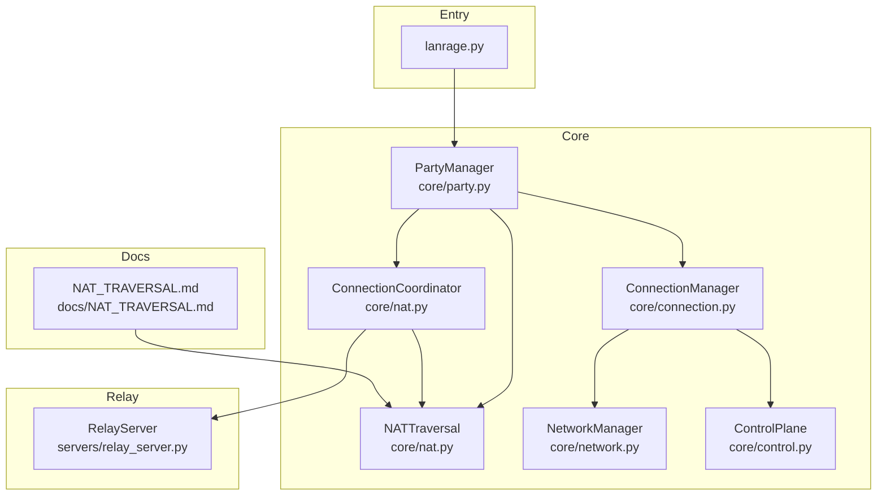
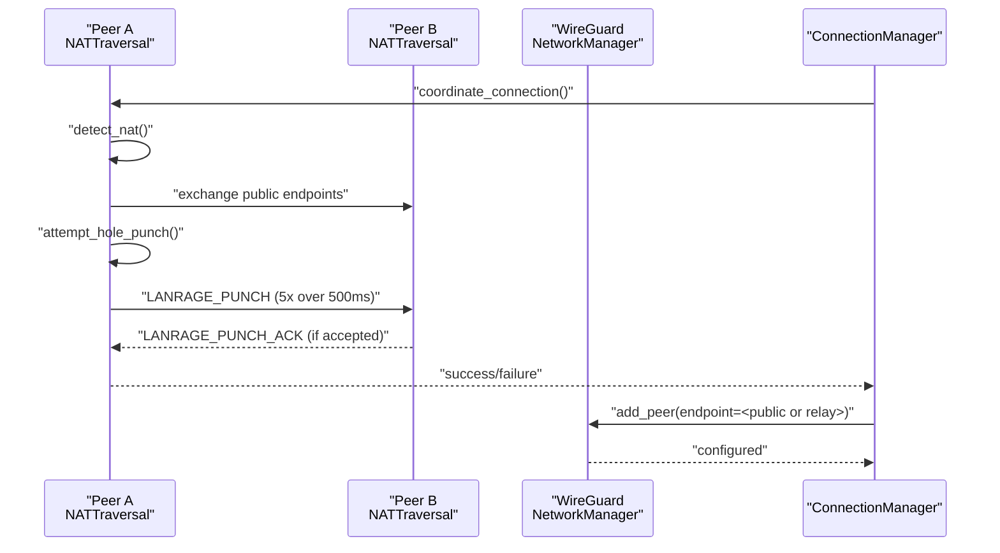
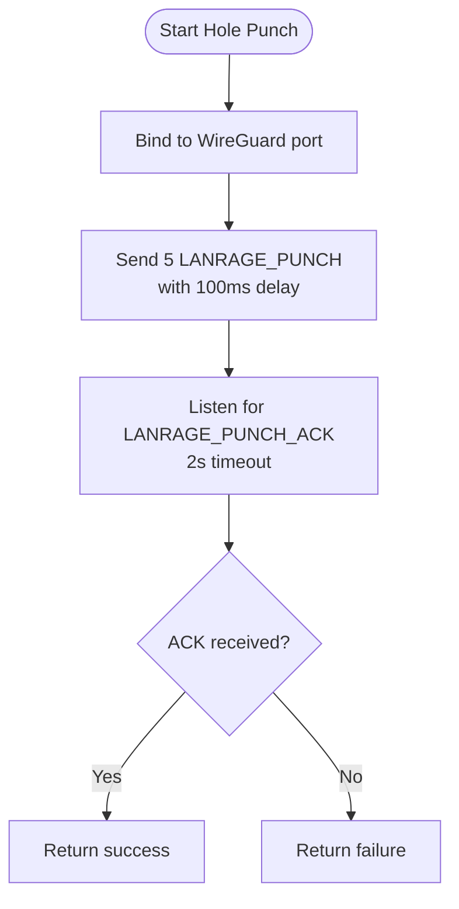
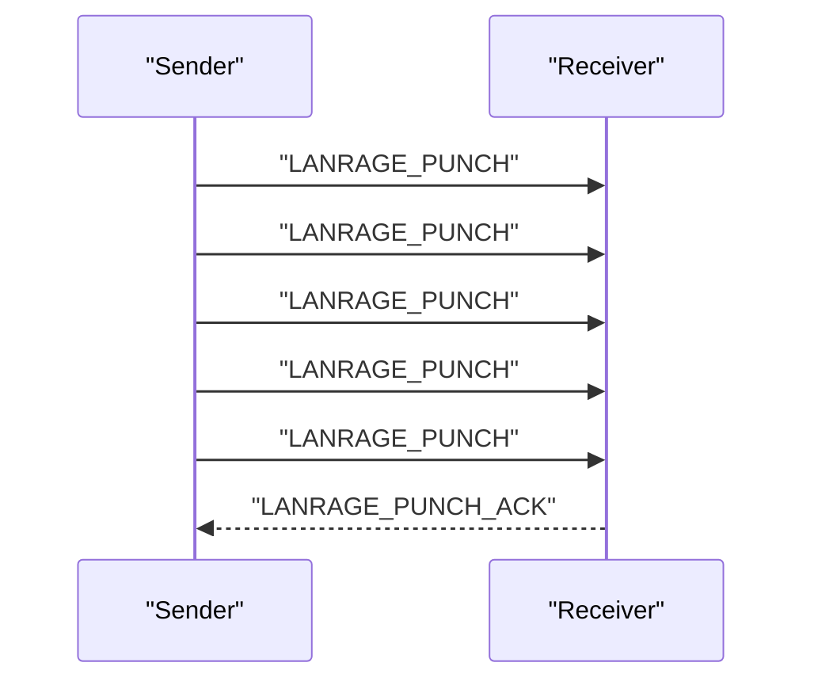
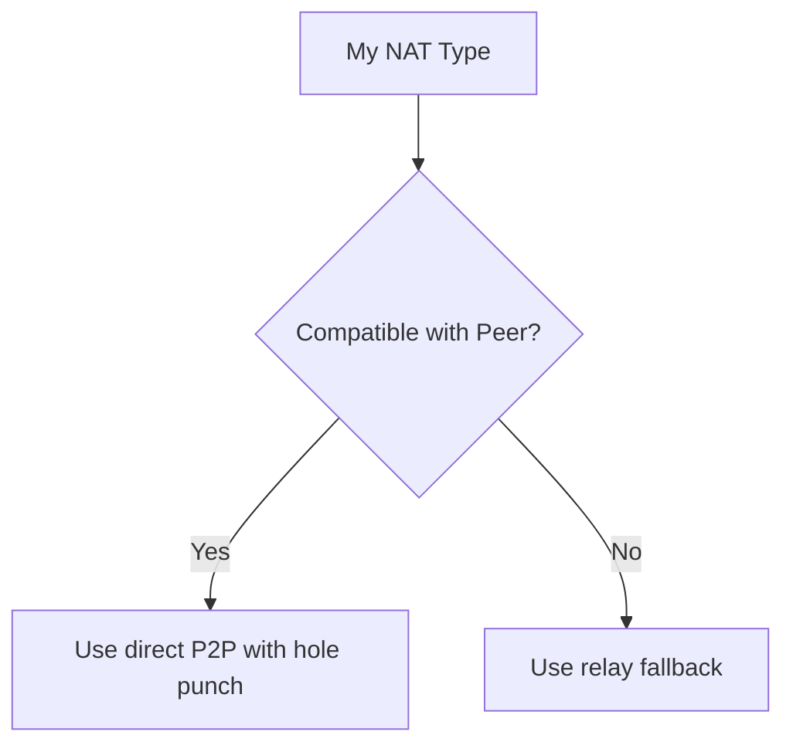
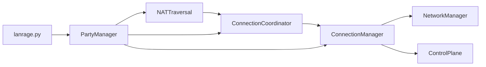

# UDP Hole Punching

<cite>
**Referenced Files in This Document**
- [core/nat.py](file://core/nat.py)
- [core/network.py](file://core/network.py)
- [core/connection.py](file://core/connection.py)
- [core/party.py](file://core/party.py)
- [core/control.py](file://core/control.py)
- [lanrage.py](file://lanrage.py)
- [docs/NAT_TRAVERSAL.md](file://docs/NAT_TRAVERSAL.md)
- [tests/test_nat.py](file://tests/test_nat.py)
- [servers/relay_server.py](file://servers/relay_server.py)
</cite>

## Table of Contents
1. [Introduction](#introduction)
2. [Project Structure](#project-structure)
3. [Core Components](#core-components)
4. [Architecture Overview](#architecture-overview)
5. [Detailed Component Analysis](#detailed-component-analysis)
6. [Dependency Analysis](#dependency-analysis)
7. [Performance Considerations](#performance-considerations)
8. [Troubleshooting Guide](#troubleshooting-guide)
9. [Conclusion](#conclusion)

## Introduction
This document explains the UDP hole punching implementation and direct P2P connection establishment in the project. It covers the hole punching algorithm, message formats, timing strategies, socket configuration, timeout management, error handling, and the role of WireGuard port binding. It also details the LANRAGE_PUNCH and LANRAGE_PUNCH_ACK protocol, conditions for success or failure, NAT compatibility, and troubleshooting guidance for common issues such as firewall restrictions, asymmetric routing, and timing problems. Finally, it describes the relationship between hole punching and broader NAT traversal strategies.

## Project Structure
The hole punching capability is implemented primarily in the NAT traversal module and integrated with the connection manager and network layer. The control plane provides peer discovery and relay discovery, while the main entry initializes networking and NAT detection.

**Diagram sources**
- [core/nat.py](file://core/nat.py#L41-L328)
- [core/connection.py](file://core/connection.py#L18-L125)
- [core/party.py](file://core/party.py#L102-L158)
- [core/network.py](file://core/network.py#L25-L120)
- [core/control.py](file://core/control.py#L187-L200)
- [lanrage.py](file://lanrage.py#L108-L126)
- [docs/NAT_TRAVERSAL.md](file://docs/NAT_TRAVERSAL.md#L380-L441)
- [servers/relay_server.py](file://servers/relay_server.py#L51-L124)

**Section sources**
- [core/nat.py](file://core/nat.py#L41-L328)
- [core/connection.py](file://core/connection.py#L18-L125)
- [core/party.py](file://core/party.py#L102-L158)
- [core/network.py](file://core/network.py#L25-L120)
- [core/control.py](file://core/control.py#L187-L200)
- [lanrage.py](file://lanrage.py#L108-L126)
- [docs/NAT_TRAVERSAL.md](file://docs/NAT_TRAVERSAL.md#L380-L441)
- [servers/relay_server.py](file://servers/relay_server.py#L51-L124)

## Core Components
- NATTraversal: Implements STUN-based NAT detection and UDP hole punching. It binds to the WireGuard port, sends LANRAGE_PUNCH messages, and listens for LANRAGE_PUNCH_ACK with a timeout.
- ConnectionCoordinator: Determines whether to use direct P2P or relay based on NAT compatibility and coordinates the strategy.
- ConnectionManager: Orchestrates peer connection setup, including adding WireGuard peers with the chosen endpoint and monitoring connectivity.
- NetworkManager: Manages WireGuard interface creation, key handling, and peer configuration, including persistent keepalive for NAT traversal.
- ControlPlane: Provides peer discovery and relay discovery for fallback scenarios.
- PartyManager: Initializes NAT detection and integrates control plane and connection management.

**Section sources**
- [core/nat.py](file://core/nat.py#L41-L328)
- [core/connection.py](file://core/connection.py#L18-L125)
- [core/network.py](file://core/network.py#L25-L120)
- [core/control.py](file://core/control.py#L187-L200)
- [core/party.py](file://core/party.py#L102-L158)

## Architecture Overview
The hole punching workflow is part of a layered NAT traversal strategy:
- NAT detection via STUN determines compatibility.
- For compatible pairs, direct P2P is attempted using coordinated hole punching.
- If direct connection fails or is incompatible, relay fallback is used.

**Diagram sources**
- [core/nat.py](file://core/nat.py#L244-L294)
- [core/connection.py](file://core/connection.py#L38-L125)
- [core/network.py](file://core/network.py#L392-L420)

## Detailed Component Analysis

### UDP Hole Punching Algorithm and Protocol
- Message formats:
  - LANRAGE_PUNCH: A short byte string sent as the punch message.
  - LANRAGE_PUNCH_ACK: A short byte string sent in response to confirm acceptance.
- Packet transmission timing:
  - Sends 5 punch packets with 100 ms intervals over 500 ms to improve the chance of successful crossing.
- Socket configuration:
  - Binds to the WireGuard listen port (default 51820) to align with the active WireGuard interface.
  - Sets a 2-second receive timeout to avoid indefinite blocking.
- Receiver-side acknowledgment processing:
  - Receives a single LANRAGE_PUNCH_ACK; any other data or timeout is treated as failure.
- Error handling:
  - Catches OS-level socket errors and unexpected exceptions, returning failure and logging details.

**Diagram sources**
- [core/nat.py](file://core/nat.py#L244-L294)

**Section sources**
- [core/nat.py](file://core/nat.py#L244-L294)
- [docs/NAT_TRAVERSAL.md](file://docs/NAT_TRAVERSAL.md#L380-L416)

### LANRAGE_PUNCH and LANRAGE_PUNCH_ACK Protocol
- Sender behavior:
  - Binds to the WireGuard port and sends LANRAGE_PUNCH to the peer’s public endpoint.
  - Sends 5 packets with 100 ms spacing.
- Receiver behavior:
  - Accepts LANRAGE_PUNCH from the expected peer and responds with LANRAGE_PUNCH_ACK.
  - The receiver must be prepared to accept inbound packets from the peer’s public endpoint (via the NAT mapping created by the sender’s outbound packets).
- Conditions for success:
  - Both peers must be able to send to each other’s public endpoints.
  - The receiver must accept and respond to the punch message.
  - The sender must receive the ACK within the timeout window.

**Diagram sources**
- [core/nat.py](file://core/nat.py#L261-L276)
- [docs/NAT_TRAVERSAL.md](file://docs/NAT_TRAVERSAL.md#L396-L416)

**Section sources**
- [core/nat.py](file://core/nat.py#L261-L276)
- [docs/NAT_TRAVERSAL.md](file://docs/NAT_TRAVERSAL.md#L396-L416)

### Timing Strategies and Optimal Hole Creation
- Inter-packet delays:
  - 5 packets over 500 ms (100 ms apart) increase the probability that at least one packet crosses and triggers the NAT mapping for the return path.
- Timeout management:
  - 2-second timeout for ACK reception balances responsiveness with reliability.
- Role of WireGuard port binding:
  - Binding to the WireGuard port ensures the socket is aligned with the active interface and allows the NAT to create appropriate mappings for inbound traffic.

**Section sources**
- [core/nat.py](file://core/nat.py#L254-L294)
- [docs/NAT_TRAVERSAL.md](file://docs/NAT_TRAVERSAL.md#L410-L416)

### Socket Configuration and Error Handling
- Socket configuration:
  - UDP socket bound to the WireGuard port.
  - Timeout set to 2 seconds for ACK reception.
- Error handling:
  - Catches OS-level errors (e.g., network unreachable, permission denied) and logs them.
  - Catches unexpected exceptions and logs them, returning failure.

**Section sources**
- [core/nat.py](file://core/nat.py#L254-L294)

### NAT Compatibility and Direct P2P Feasibility
- Compatibility matrix:
  - Open NAT can connect to any type.
  - Full cone NAT can connect to each other.
  - Restricted and port-restricted cone NATs can connect with coordinated hole punching.
  - Symmetric NAT typically requires relay.
- Strategy selection:
  - ConnectionCoordinator evaluates peer NAT type and selects direct or relay accordingly.

**Diagram sources**
- [core/nat.py](file://core/nat.py#L295-L321)
- [core/party.py](file://core/party.py#L18-L41)

**Section sources**
- [core/nat.py](file://core/nat.py#L295-L321)
- [core/party.py](file://core/party.py#L18-L41)

### Relationship Between Hole Punching and NAT Traversal Strategies
- STUN-based NAT detection informs compatibility.
- Direct P2P with hole punching is preferred for compatible NATs.
- Relay is used for symmetric NATs or when hole punching fails.
- Persistent keepalive is enabled in WireGuard to maintain NAT mappings.

**Section sources**
- [core/nat.py](file://core/nat.py#L41-L106)
- [core/network.py](file://core/network.py#L392-L420)
- [docs/NAT_TRAVERSAL.md](file://docs/NAT_TRAVERSAL.md#L417-L441)

## Dependency Analysis
The hole punching flow depends on:
- NATTraversal for detection and punching.
- ConnectionCoordinator for strategy selection.
- ConnectionManager for configuring WireGuard peers.
- NetworkManager for WireGuard interface and peer management.
- ControlPlane for peer discovery and relay discovery.

**Diagram sources**
- [core/nat.py](file://core/nat.py#L41-L328)
- [core/connection.py](file://core/connection.py#L18-L125)
- [core/network.py](file://core/network.py#L25-L120)
- [core/control.py](file://core/control.py#L187-L200)
- [core/party.py](file://core/party.py#L102-L158)
- [lanrage.py](file://lanrage.py#L108-L126)

**Section sources**
- [core/nat.py](file://core/nat.py#L41-L328)
- [core/connection.py](file://core/connection.py#L18-L125)
- [core/network.py](file://core/network.py#L25-L120)
- [core/control.py](file://core/control.py#L187-L200)
- [core/party.py](file://core/party.py#L102-L158)
- [lanrage.py](file://lanrage.py#L108-L126)

## Performance Considerations
- Direct P2P with hole punching adds minimal latency overhead.
- Relay introduces additional latency depending on geographic proximity.
- Persistent keepalive in WireGuard helps maintain NAT mappings and improves connectivity stability.

**Section sources**
- [docs/NAT_TRAVERSAL.md](file://docs/NAT_TRAVERSAL.md#L443-L462)
- [core/network.py](file://core/network.py#L411-L413)

## Troubleshooting Guide
Common causes and solutions:
- NAT detection failures:
  - Causes: firewall blocking UDP, STUN servers unreachable, network issues.
  - Solutions: check firewall settings, test STUN manually, try a different network.
- Hole punching failures:
  - Causes: symmetric NAT, strict firewall, timing issues.
  - Solutions: rely on automatic relay fallback, try a different network, review router settings.
- Relay performance issues:
  - Causes: geographic distance, relay overload, network congestion.
  - Solutions: use a closer relay, deploy more relays, check network quality.

**Section sources**
- [docs/NAT_TRAVERSAL.md](file://docs/NAT_TRAVERSAL.md#L486-L523)
- [tests/test_nat.py](file://tests/test_nat.py#L48-L96)

## Conclusion
The project implements a robust NAT traversal strategy centered on STUN-based detection and UDP hole punching for compatible NAT types. The hole punching algorithm uses carefully tuned timing and WireGuard port binding to maximize success rates. For incompatible NATs or failures, the system automatically falls back to relay-based forwarding. Persistent keepalive and monitoring further enhance reliability. The provided troubleshooting guidance and documentation help diagnose and resolve common issues.