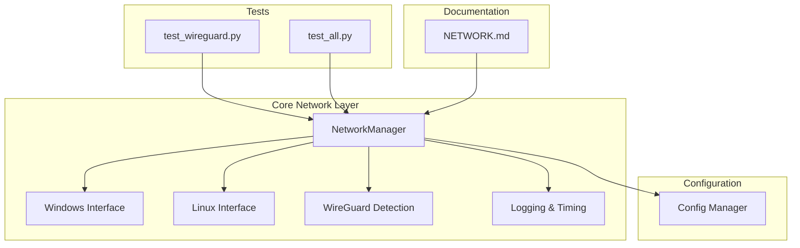
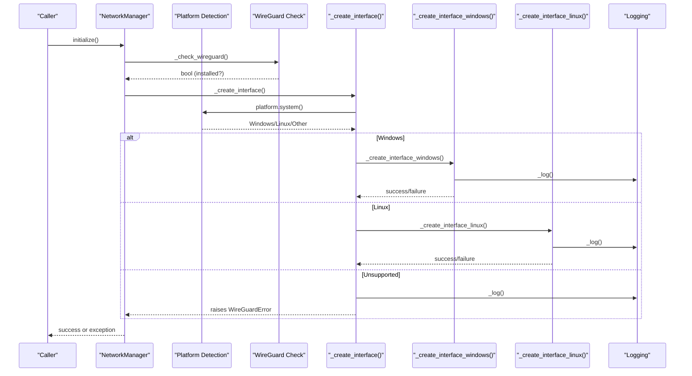
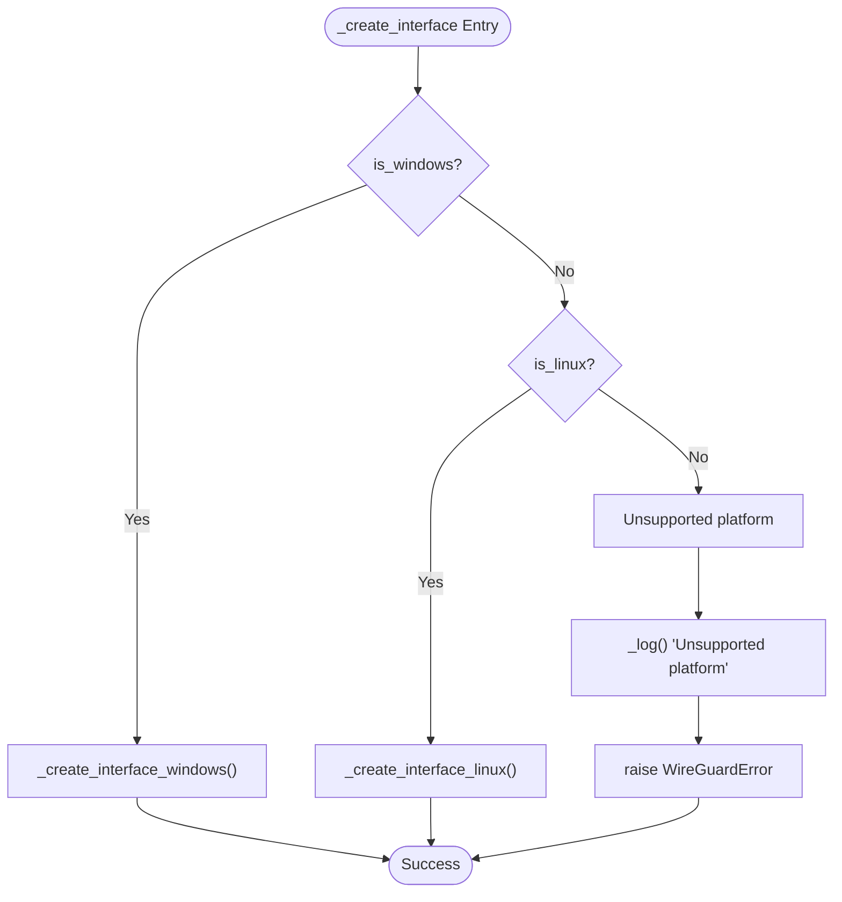
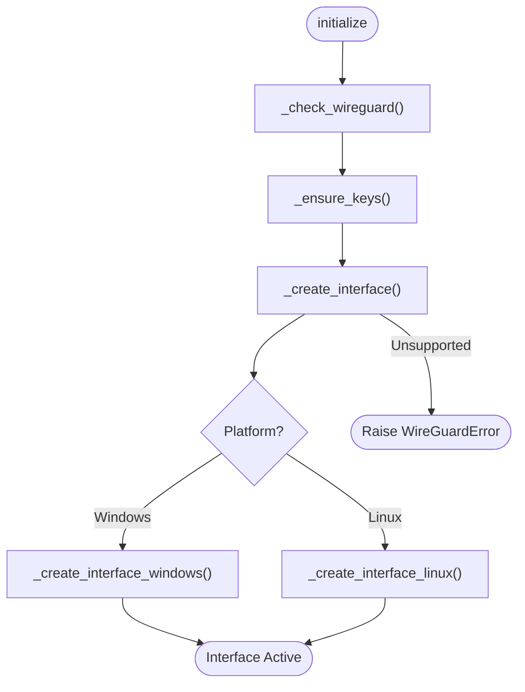

# Cross-Platform Detection Logic

<cite>
**Referenced Files in This Document**
- [network.py](file://core/network.py)
- [logging_config.py](file://core/logging_config.py)
- [config.py](file://core/config.py)
- [test_wireguard.py](file://tests/test_wireguard.py)
- [test_all.py](file://tests/test_all.py)
- [NETWORK.md](file://docs/NETWORK.md)
</cite>

## Table of Contents
1. [Introduction](#introduction)
2. [Project Structure](#project-structure)
3. [Core Components](#core-components)
4. [Architecture Overview](#architecture-overview)
5. [Detailed Component Analysis](#detailed-component-analysis)
6. [Dependency Analysis](#dependency-analysis)
7. [Performance Considerations](#performance-considerations)
8. [Troubleshooting Guide](#troubleshooting-guide)
9. [Conclusion](#conclusion)

## Introduction
This document provides comprehensive technical documentation for the cross-platform detection and conditional execution logic implemented in the NetworkManager class. It focuses on:
- Platform detection mechanism using platform.system() comparisons for Windows and Linux
- Conditional execution paths in the _create_interface() method
- Platform-specific method dispatch
- Differences in the _check_wireguard() method between Windows wireguard.exe command detection and Linux wg command verification
- Error handling strategies for unsupported platforms, platform-specific exception raising with descriptive error messages
- Logging patterns for platform detection failures
- Timing_decorator usage for performance monitoring across platforms
- Unified interface creation workflow that abstracts platform differences
- Fallback mechanisms and graceful degradation strategies for platform detection failures

## Project Structure
The cross-platform logic is primarily implemented in the core network module, with supporting infrastructure in logging configuration and configuration management.



**Diagram sources**
- [network.py](file://core/network.py#L25-L515)
- [logging_config.py](file://core/logging_config.py#L1-L277)
- [config.py](file://core/config.py#L17-L114)

**Section sources**
- [network.py](file://core/network.py#L1-L515)
- [logging_config.py](file://core/logging_config.py#L1-L277)
- [config.py](file://core/config.py#L1-L114)

## Core Components
The NetworkManager class serves as the central orchestrator for cross-platform WireGuard interface management. It implements platform detection, conditional execution, and unified interface creation workflows.

Key platform detection attributes:
- `is_windows`: Boolean flag derived from `platform.system() == "Windows"`
- `is_linux`: Boolean flag derived from `platform.system() == "Linux"`

Platform-specific method dispatch occurs through the `_create_interface()` method, which routes to either `_create_interface_windows()` or `_create_interface_linux()` based on the detected platform.

**Section sources**
- [network.py](file://core/network.py#L25-L41)

## Architecture Overview
The NetworkManager implements a clean separation between platform detection, conditional execution, and platform-specific implementations while maintaining a unified interface for callers.



**Diagram sources**
- [network.py](file://core/network.py#L70-L94)
- [network.py](file://core/network.py#L161-L171)
- [network.py](file://core/network.py#L172-L235)
- [network.py](file://core/network.py#L236-L310)

## Detailed Component Analysis

### Platform Detection Mechanism
The platform detection mechanism relies on `platform.system()` comparisons to determine the operating system and set boolean flags for conditional execution.

Implementation details:
- Windows detection: `platform.system() == "Windows"` sets `is_windows = True`
- Linux detection: `platform.system() == "Linux"` sets `is_linux = True`
- Both flags are mutually exclusive and collectively exhaustive for the supported platforms

The detection occurs during object initialization and remains constant throughout the object lifecycle.

**Section sources**
- [network.py](file://core/network.py#L35-L36)
- [network.py](file://core/network.py#L28-L41)

### Conditional Execution in _create_interface()
The `_create_interface()` method implements a clean conditional execution pattern that routes to platform-specific implementations.



**Diagram sources**
- [network.py](file://core/network.py#L161-L171)

**Section sources**
- [network.py](file://core/network.py#L161-L171)

### Platform-Specific Method Dispatch
The dispatch mechanism ensures that platform-specific implementations are isolated and maintainable.

Windows-specific implementation characteristics:
- Uses configuration file-based approach with `.conf` files
- Leverages Windows service management via `wireguard.exe`
- Handles service existence checks and reinstallation scenarios

Linux-specific implementation characteristics:
- Uses direct kernel interface creation via `ip link`
- Implements sudo-based privilege escalation
- Provides cleanup mechanisms for error recovery

**Section sources**
- [network.py](file://core/network.py#L172-L235)
- [network.py](file://core/network.py#L236-L310)

### WireGuard Detection Differences
The `_check_wireguard()` method implements platform-specific detection strategies:

Windows detection strategy:
- Executes `["wireguard", "/help"]` with `check=False` to detect installation
- Returns `True` for any successful execution (including non-zero exit codes)
- Uses timeout of 5.0 seconds for reliability

Linux detection strategy:
- Executes `["which", "wg"]` to locate the wg command in PATH
- Returns `True` only when the command exits with code 0
- Uses timeout of 5.0 seconds for reliability

Both implementations include comprehensive error handling for timeouts, command not found, and unexpected errors, with detailed logging for each failure scenario.

**Section sources**
- [network.py](file://core/network.py#L95-L122)

### Error Handling Strategies
The NetworkManager implements robust error handling with descriptive messages and graceful degradation:

Unsupported platform handling:
- Logs the detected platform name
- Raises `WireGuardError` with descriptive message
- Prevents partial execution on unsupported systems

Windows interface creation error handling:
- Comprehensive timeout handling with specific timeout messages
- Detailed error extraction from subprocess results (stdout/stderr)
- Graceful error propagation with context information

Linux interface creation error handling:
- Automatic cleanup on failure via `_cleanup_interface_linux()`
- Preserves original exception context while adding platform-specific details

**Section sources**
- [network.py](file://core/network.py#L168-L170)
- [network.py](file://core/network.py#L214-L234)
- [network.py](file://core/network.py#L306-L310)

### Logging Patterns for Platform Detection Failures
The logging system implements a dual-path approach for resilience:

Primary file-based logging:
- Asynchronous file writing using aiofiles
- Automatic directory creation for log files
- Timestamped entries for traceability

Fallback stderr logging:
- Automatic fallback to stderr when file operations fail
- Disk full, permission, or other OS-level failures trigger fallback
- Consistent warning messages across both logging paths

The `_log()` method implements comprehensive error handling to prevent logging failures from impacting core functionality.

**Section sources**
- [network.py](file://core/network.py#L42-L69)

### Timing Decorator Usage for Performance Monitoring
The timing_decorator provides cross-platform performance monitoring capabilities:

Decorator functionality:
- Measures execution time using `time.perf_counter()` for precision
- Supports both synchronous and asynchronous functions
- Automatically logs completion messages with duration in milliseconds
- Integrates with structured logging for consistent formatting

Application in NetworkManager:
- Applied to `initialize()` method for end-to-end timing
- Applied to `add_peer()` and `remove_peer()` for peer management timing
- Provides granular performance insights across platforms

**Section sources**
- [logging_config.py](file://core/logging_config.py#L169-L231)
- [network.py](file://core/network.py#L70-L71)
- [network.py](file://core/network.py#L392-L420)

### Unified Interface Creation Workflow
The unified interface creation workflow abstracts platform differences through a consistent API:



**Diagram sources**
- [network.py](file://core/network.py#L70-L94)
- [network.py](file://core/network.py#L161-L171)

**Section sources**
- [network.py](file://core/network.py#L70-L94)
- [network.py](file://core/network.py#L161-L171)

### Fallback Mechanisms and Graceful Degradation
The system implements several fallback mechanisms for robust operation:

Command execution fallback:
- Timeout handling with process termination on timeout
- Graceful degradation when commands fail
- Comprehensive error extraction and logging

Privilege escalation fallback:
- Root/sudo detection via `_check_root()` method
- Clear error messages for permission requirements
- Platform-appropriate privilege escalation guidance

Interface cleanup fallback:
- Automatic cleanup on Linux interface creation failure
- Non-critical cleanup operations on Windows
- Error suppression for cleanup failures to preserve primary error context

**Section sources**
- [network.py](file://core/network.py#L483-L515)
- [network.py](file://core/network.py#L311-L339)

## Dependency Analysis
The NetworkManager class has well-defined dependencies that support cross-platform functionality:

```mermaid
graph TB
NM[NetworkManager] --> PL[platform.system()]
NM --> SP[subprocess]
NM --> AF[aiofiles]
NM --> AS[asyncio]
NM --> CF[Config]
NM --> LC[logging_config]
NM --> WG[WireGuard Commands]
LC --> TD[timing_decorator]
LC --> SF[StructuredFormatter]
CF --> PD[pathlib.Path]
CF --> DB[settings database]
WG --> WW[wireguard.exe]
WG --> WL[wg command]
WG --> IP[ip command]
```

**Diagram sources**
- [network.py](file://core/network.py#L3-L14)
- [logging_config.py](file://core/logging_config.py#L1-L277)
- [config.py](file://core/config.py#L1-L114)

**Section sources**
- [network.py](file://core/network.py#L3-L14)
- [logging_config.py](file://core/logging_config.py#L1-L277)
- [config.py](file://core/config.py#L1-L114)

## Performance Considerations
The cross-platform implementation includes several performance optimization strategies:

- Asynchronous command execution prevents blocking operations
- Timeout-based command execution prevents hanging processes
- Structured logging minimizes overhead while providing detailed metrics
- Timing_decorator enables precise performance measurement across platforms
- Efficient platform detection avoids repeated system calls

## Troubleshooting Guide
Common platform detection and execution issues:

**Unsupported Platform Errors**
- Verify platform detection by checking `sys.platform` value
- Ensure the system is running Windows or Linux
- Review error messages for specific platform identification

**WireGuard Detection Failures**
- Windows: Verify wireguard.exe is in PATH and accessible
- Linux: Confirm wg command is installed and executable
- Check PATH environment variable configuration

**Interface Creation Issues**
- Windows: Ensure administrative privileges for service management
- Linux: Verify sudo access and root privileges
- Check for conflicting interfaces or services

**Logging and Monitoring**
- Review network.log file for detailed error traces
- Monitor structured logs for timing metrics and context information
- Use timing_decorator output for performance analysis

**Section sources**
- [test_wireguard.py](file://tests/test_wireguard.py#L21-L87)
- [test_all.py](file://tests/test_all.py#L104-L169)
- [NETWORK.md](file://docs/NETWORK.md#L375-L393)

## Conclusion
The NetworkManager class demonstrates robust cross-platform implementation through:
- Clean platform detection using `platform.system()` comparisons
- Well-structured conditional execution with clear fallback mechanisms
- Platform-specific method dispatch that maintains unified interfaces
- Comprehensive error handling with descriptive messages
- Performance monitoring through timing_decorator integration
- Resilient logging patterns with automatic fallback capabilities

The implementation successfully abstracts platform differences while providing detailed diagnostics and graceful degradation strategies for reliable operation across Windows and Linux environments.