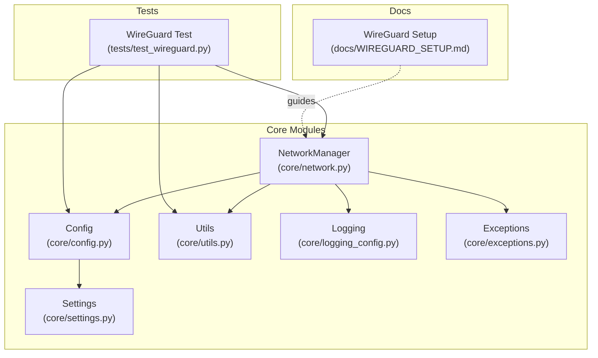
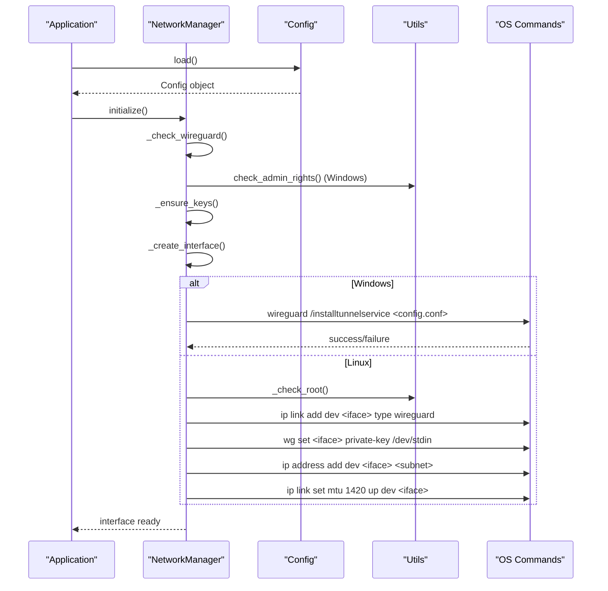
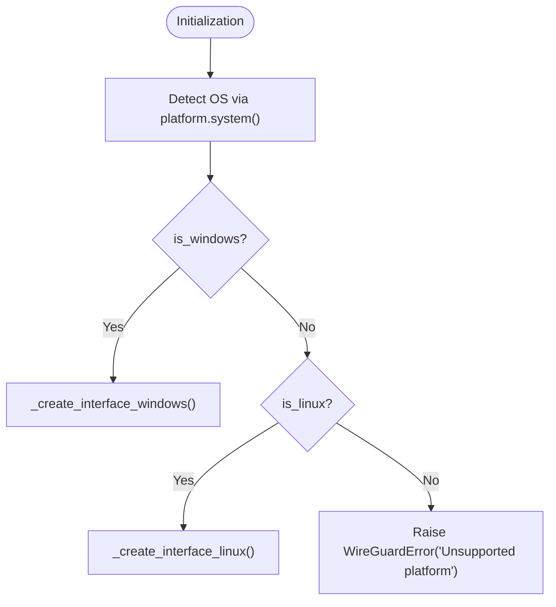
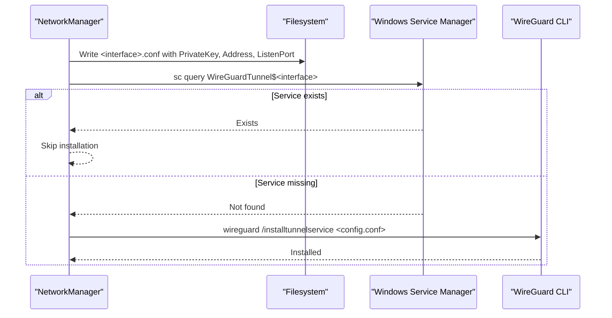
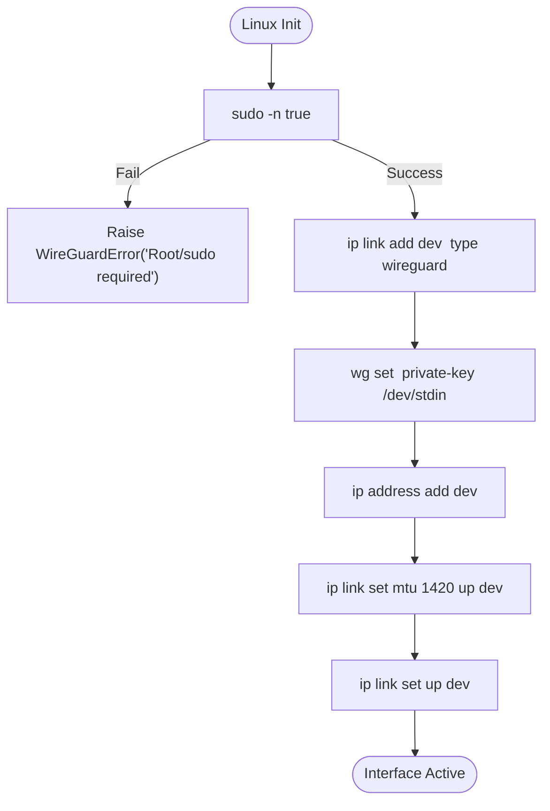
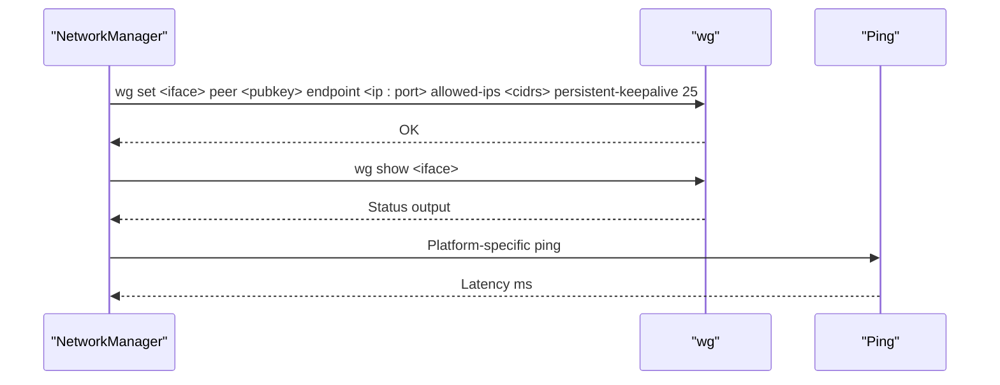
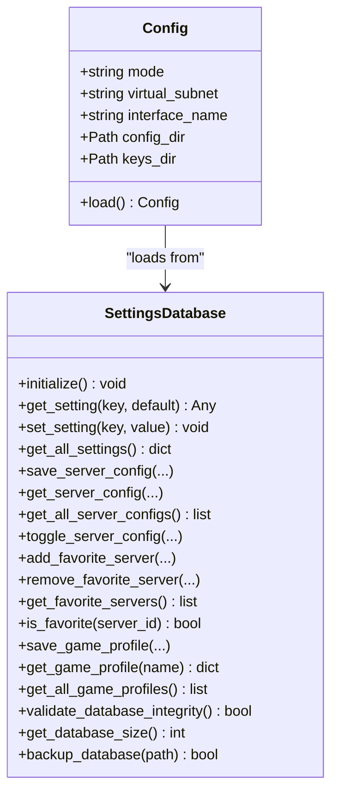
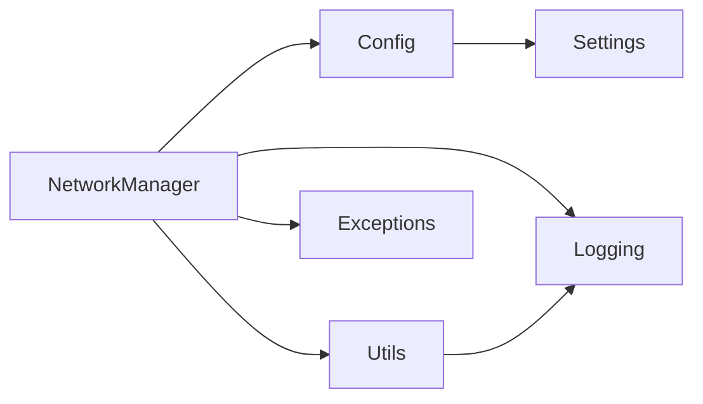

# Cross-Platform Implementation

<cite>
**Referenced Files in This Document**
- [network.py](file://core/network.py)
- [utils.py](file://core/utils.py)
- [config.py](file://core/config.py)
- [exceptions.py](file://core/exceptions.py)
- [logging_config.py](file://core/logging_config.py)
- [settings.py](file://core/settings.py)
- [WIREGUARD_SETUP.md](file://docs/WIREGUARD_SETUP.md)
- [test_wireguard.py](file://tests/test_wireguard.py)
</cite>

## Table of Contents
1. [Introduction](#introduction)
2. [Project Structure](#project-structure)
3. [Core Components](#core-components)
4. [Architecture Overview](#architecture-overview)
5. [Detailed Component Analysis](#detailed-component-analysis)
6. [Dependency Analysis](#dependency-analysis)
7. [Performance Considerations](#performance-considerations)
8. [Troubleshooting Guide](#troubleshooting-guide)
9. [Conclusion](#conclusion)

## Introduction
This document explains the cross-platform implementation of WireGuard interface creation in the LANrage project. It focuses on platform-specific strategies for Windows and Linux, including:
- Windows: Tunnel service management via WireGuard CLI, configuration file generation, and service lifecycle operations
- Linux: Kernel-level interface creation using ip link and wg commands, with sudo requirements
It also covers platform detection, conditional execution paths, error handling, security considerations, and troubleshooting steps.

## Project Structure
The cross-platform WireGuard implementation is centered around the NetworkManager class, which encapsulates platform-specific logic and integrates with configuration, logging, and error handling modules.

**Diagram sources**
- [network.py](file://core/network.py#L25-L515)
- [config.py](file://core/config.py#L17-L114)
- [utils.py](file://core/utils.py#L12-L76)
- [logging_config.py](file://core/logging_config.py#L118-L154)
- [exceptions.py](file://core/exceptions.py#L68-L71)
- [settings.py](file://core/settings.py#L466-L473)
- [WIREGUARD_SETUP.md](file://docs/WIREGUARD_SETUP.md#L1-L279)
- [test_wireguard.py](file://tests/test_wireguard.py#L21-L106)

**Section sources**
- [network.py](file://core/network.py#L25-L515)
- [config.py](file://core/config.py#L17-L114)
- [utils.py](file://core/utils.py#L12-L76)
- [logging_config.py](file://core/logging_config.py#L118-L154)
- [exceptions.py](file://core/exceptions.py#L68-L71)
- [settings.py](file://core/settings.py#L466-L473)
- [WIREGUARD_SETUP.md](file://docs/WIREGUARD_SETUP.md#L1-L279)
- [test_wireguard.py](file://tests/test_wireguard.py#L21-L106)

## Core Components
- NetworkManager: Orchestrates WireGuard initialization, platform detection, interface creation, peer management, latency measurement, and cleanup.
- Config: Provides runtime configuration (including interface name, subnet, and paths) sourced from the settings database.
- Utils: Handles privilege checks and elevated command execution.
- Logging: Structured logging with context variables and timing decorators.
- Exceptions: Specialized exception type for WireGuard-related failures.
- Settings: Database-first configuration provider backing Config.

Key responsibilities:
- Platform detection via platform.system() and assignment of is_windows/is_linux flags
- Conditional execution paths for Windows vs Linux
- Error handling with WireGuardError and graceful fallbacks
- Security-aware operations (permissions, sudo, service management)

**Section sources**
- [network.py](file://core/network.py#L25-L515)
- [config.py](file://core/config.py#L17-L114)
- [utils.py](file://core/utils.py#L12-L76)
- [logging_config.py](file://core/logging_config.py#L169-L230)
- [exceptions.py](file://core/exceptions.py#L68-L71)
- [settings.py](file://core/settings.py#L466-L473)

## Architecture Overview
The system separates concerns across modules:
- Initialization loads configuration from the settings database and validates prerequisites
- Platform detection selects the appropriate interface creation strategy
- Windows path generates a .conf file and installs/uninstalls the WireGuard tunnel service
- Linux path creates the interface via ip link and wg, requiring root/sudo
- Peer management and latency measurement operate consistently across platforms
- Logging and timing decorators provide observability

**Diagram sources**
- [network.py](file://core/network.py#L71-L93)
- [network.py](file://core/network.py#L95-L121)
- [network.py](file://core/network.py#L161-L170)
- [network.py](file://core/network.py#L172-L234)
- [network.py](file://core/network.py#L236-L310)
- [utils.py](file://core/utils.py#L12-L39)

## Detailed Component Analysis

### Platform Detection and Conditional Execution
- Detection: Uses platform.system() to set is_windows and is_linux flags during initialization
- Conditional paths: _create_interface() routes to _create_interface_windows() or _create_interface_linux()

**Diagram sources**
- [network.py](file://core/network.py#L35-L37)
- [network.py](file://core/network.py#L161-L170)

**Section sources**
- [network.py](file://core/network.py#L35-L37)
- [network.py](file://core/network.py#L161-L170)

### Windows Implementation: Tunnel Service Management
- Configuration file generation: Creates a .conf file under the config directory with interface parameters
- Service installation: Uses wireguard /installtunnelservice with the generated config path
- Service existence check: Queries the Windows service control manager for the tunnel service
- Uninstallation: Supports cleanup via wireguard /uninstalltunnelservice

**Diagram sources**
- [network.py](file://core/network.py#L172-L234)

Security and permissions:
- Requires administrative privileges to install and manage the service
- The test harness verifies admin/root status before attempting interface creation

**Section sources**
- [network.py](file://core/network.py#L172-L234)
- [test_wireguard.py](file://tests/test_wireguard.py#L27-L34)

### Linux Implementation: Kernel-Level Interface Creation
- Root/sudo requirement: Validates with _check_root() using sudo -n true
- Interface creation: Executes ip link add dev <iface> type wireguard
- Private key injection: Uses wg set <iface> private-key /dev/stdin with stdin pipe
- Address assignment: ip address add dev <iface> <subnet>
- MTU and bring-up: ip link set mtu 1420 up dev <iface>
- Cleanup: Deletes the interface on failure or during cleanup

**Diagram sources**
- [network.py](file://core/network.py#L236-L310)

Security and permissions:
- Private key file permissions are set to 600 on Unix systems during key generation
- All operations require root/sudo; the implementation raises explicit errors if not available

**Section sources**
- [network.py](file://core/network.py#L236-L310)
- [network.py](file://core/network.py#L153-L156)

### Peer Management and Latency Measurement
- Peer management: Adds peers via wg set with endpoint, allowed-ips, and persistent-keepalive
- Status retrieval: Uses wg show to get interface status
- Latency measurement: Platform-specific ping invocation with parsing of response time

**Diagram sources**
- [network.py](file://core/network.py#L392-L443)
- [network.py](file://core/network.py#L445-L462)
- [network.py](file://core/network.py#L340-L390)

**Section sources**
- [network.py](file://core/network.py#L392-L443)
- [network.py](file://core/network.py#L445-L462)
- [network.py](file://core/network.py#L340-L390)

### Configuration and Database Integration
- Config model defines interface_name, virtual_subnet, and paths
- Config.load() retrieves settings from the settings database and ensures directories exist
- Settings database provides async SQLite persistence with initialization and default values

**Diagram sources**
- [config.py](file://core/config.py#L17-L114)
- [settings.py](file://core/settings.py#L20-L473)

**Section sources**
- [config.py](file://core/config.py#L17-L114)
- [settings.py](file://core/settings.py#L466-L473)

## Dependency Analysis
- NetworkManager depends on Config for runtime settings, on Utils for privilege checks, on logging for observability, and on exceptions for error propagation
- Config depends on Settings for database-backed configuration
- Utilities depend on platform and subprocess for privilege and command execution
- Logging provides structured logging and timing decorators used across modules

**Diagram sources**
- [network.py](file://core/network.py#L13-L16)
- [config.py](file://core/config.py#L9-L12)
- [utils.py](file://core/utils.py#L7-L8)
- [logging_config.py](file://core/logging_config.py#L118-L154)

**Section sources**
- [network.py](file://core/network.py#L13-L16)
- [config.py](file://core/config.py#L9-L12)
- [utils.py](file://core/utils.py#L7-L8)
- [logging_config.py](file://core/logging_config.py#L118-L154)

## Performance Considerations
- Command execution timeouts: _run_command() enforces timeouts and kills hanging processes
- Asynchronous subprocess execution: Uses asyncio.create_subprocess_exec for non-blocking operations
- Minimal overhead: WireGuard’s kernel implementation provides low-latency, hardware-accelerated encryption
- Logging overhead: Structured logging with context variables adds minimal cost while enabling correlation

[No sources needed since this section provides general guidance]

## Troubleshooting Guide

Common issues and resolutions:
- WireGuard not found
  - Windows: Install WireGuard and ensure wireguard.exe is in PATH
  - Linux: Install wireguard-tools and verify wg --version
- Permission denied
  - Windows: Run as Administrator
  - Linux: Use sudo or configure NOPASSWD for wg and ip commands
- Interface already exists
  - Windows: Uninstall existing tunnel service using wireguard /uninstalltunnelservice
  - Linux: Delete the interface with ip link delete dev <iface>
- Cannot create interface
  - Windows: Verify WireGuard service is running and admin rights are granted
  - Linux: Confirm kernel module availability and permissions
- Latency measurement fails
  - Allow ICMP traffic and verify network connectivity

Security considerations:
- Private key permissions: 600 on Unix systems
- Service management on Windows requires administrative privileges
- Linux operations require root/sudo access

**Section sources**
- [WIREGUARD_SETUP.md](file://docs/WIREGUARD_SETUP.md#L166-L224)
- [network.py](file://core/network.py#L153-L156)
- [network.py](file://core/network.py#L239-L242)
- [network.py](file://core/network.py#L470-L481)

## Conclusion
The LANrage project implements a robust, cross-platform WireGuard interface creation strategy:
- Windows: Tunnel service management with configuration file generation and service lifecycle operations
- Linux: Kernel-level interface creation using ip link and wg with strict root/sudo requirements
- Unified error handling via WireGuardError and comprehensive logging
- Strong security practices including file permissions and privilege checks
This design enables reliable local networking across platforms while maintaining clear separation of concerns and strong operational visibility.