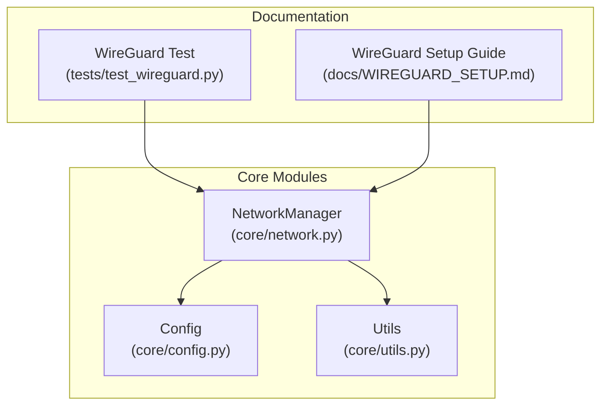
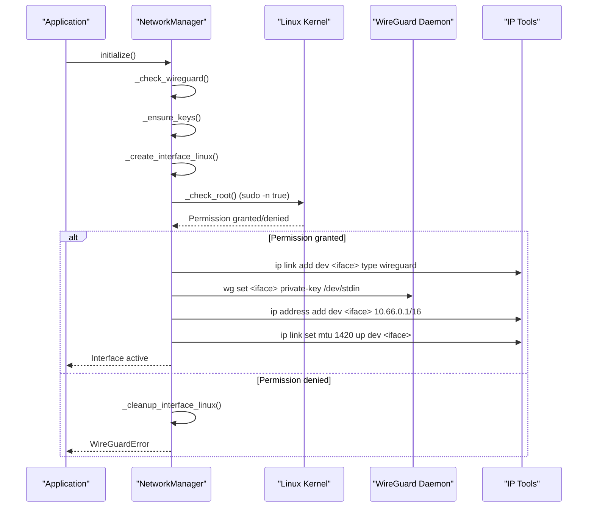
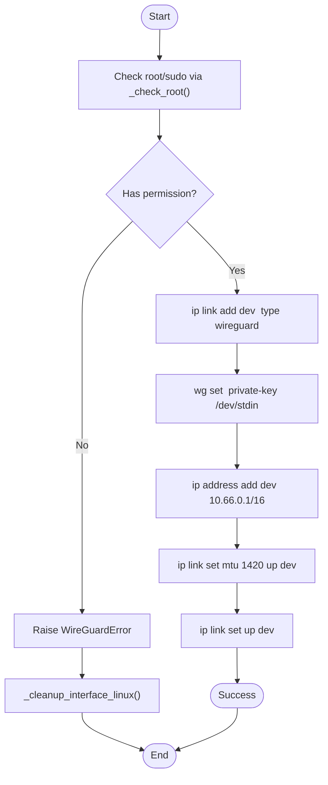
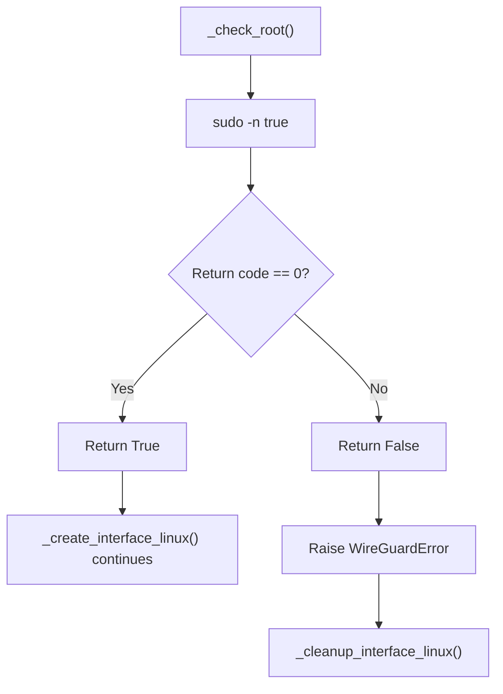
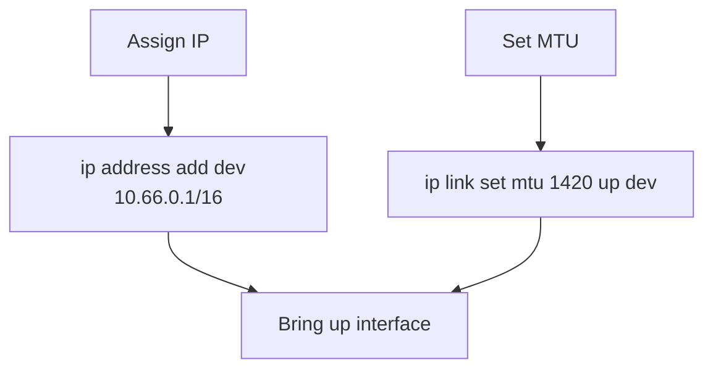
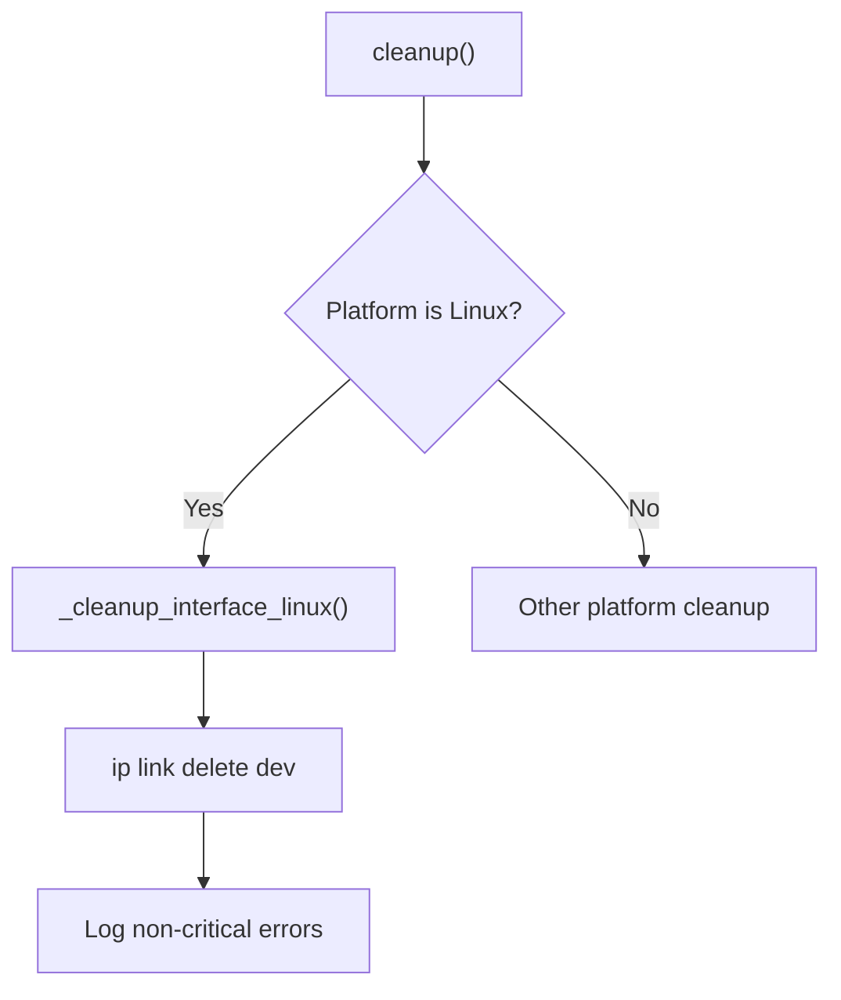
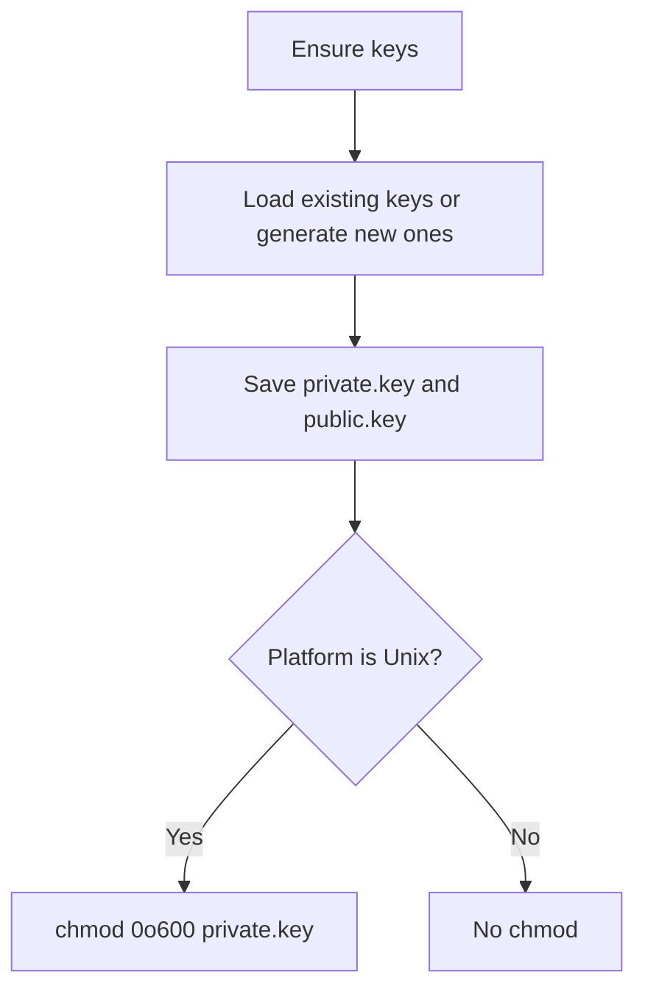
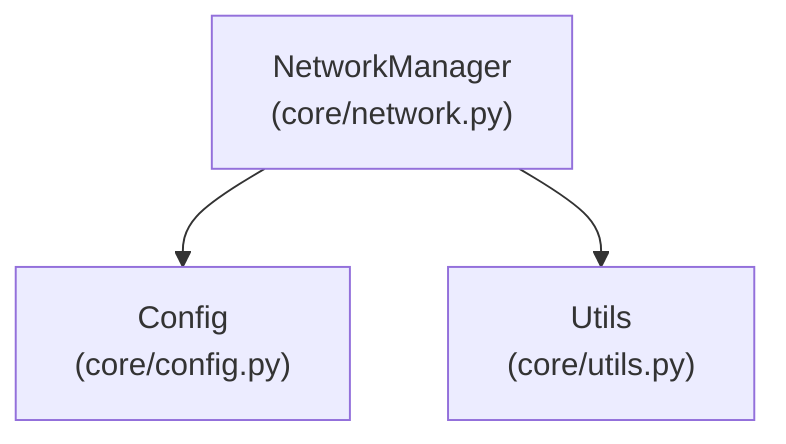
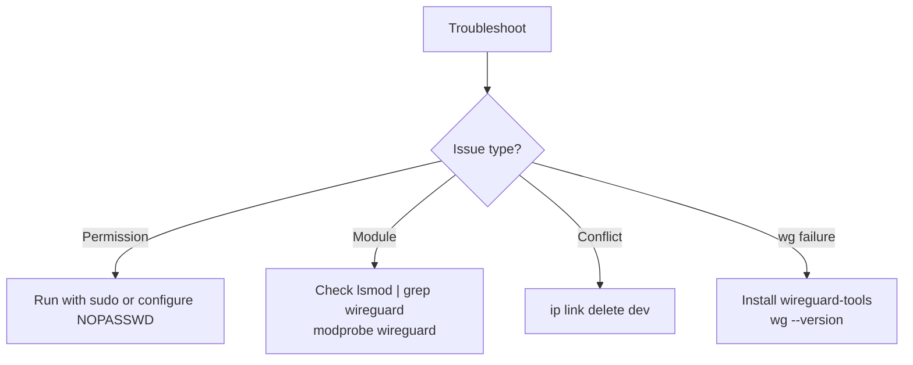

# Linux Kernel Interface Creation

<cite>
**Referenced Files in This Document**
- [network.py](file://core/network.py)
- [config.py](file://core/config.py)
- [utils.py](file://core/utils.py)
- [WIREGUARD_SETUP.md](file://docs/WIREGUARD_SETUP.md)
- [test_wireguard.py](file://tests/test_wireguard.py)
</cite>

## Table of Contents
1. [Introduction](#introduction)
2. [Project Structure](#project-structure)
3. [Core Components](#core-components)
4. [Architecture Overview](#architecture-overview)
5. [Detailed Component Analysis](#detailed-component-analysis)
6. [Dependency Analysis](#dependency-analysis)
7. [Performance Considerations](#performance-considerations)
8. [Troubleshooting Guide](#troubleshooting-guide)
9. [Conclusion](#conclusion)

## Introduction
This document provides a comprehensive guide to Linux-specific WireGuard kernel interface creation within the LANrage project. It covers the complete lifecycle from initialization and privilege verification to interface creation, configuration, activation, and cleanup. The focus is on the `_create_interface_linux()` method and its supporting functions, including root/sudo privilege checks, interface creation via `ip link add dev`, private key assignment via `wg set`, IP address assignment, MTU configuration, and interface activation. It also documents error handling, cleanup procedures, and troubleshooting steps for common Linux issues.

## Project Structure
The Linux WireGuard interface creation is implemented in the core networking module and integrated with configuration and utility modules. The key files involved are:
- Core networking logic and platform-specific interface creation
- Configuration for interface name and virtual subnet
- Utility functions for privilege checks and elevated command execution
- Documentation and tests for setup and validation

**Diagram sources**
- [network.py](file://core/network.py#L25-L94)
- [config.py](file://core/config.py#L17-L48)
- [utils.py](file://core/utils.py#L12-L76)
- [WIREGUARD_SETUP.md](file://docs/WIREGUARD_SETUP.md#L1-L279)
- [test_wireguard.py](file://tests/test_wireguard.py#L16-L86)

**Section sources**
- [network.py](file://core/network.py#L25-L94)
- [config.py](file://core/config.py#L17-L48)
- [utils.py](file://core/utils.py#L12-L76)
- [WIREGUARD_SETUP.md](file://docs/WIREGUARD_SETUP.md#L1-L279)
- [test_wireguard.py](file://tests/test_wireguard.py#L16-L86)

## Core Components
- NetworkManager: Orchestrates WireGuard interface creation, key management, and platform-specific operations.
- Config: Provides configuration values such as interface name and virtual subnet.
- Utils: Handles privilege checks and elevated command execution.
- Documentation and Tests: Provide setup guidance and validation of the interface lifecycle.

Key responsibilities:
- Privilege verification via `_check_root()`
- Linux interface creation using `ip link add dev interface_name type wireguard`
- Private key assignment via `wg set interface_name private-key /dev/stdin`
- IP address assignment (10.66.0.1/16) and MTU configuration (1420)
- Interface activation via `ip link set up dev interface_name`
- Cleanup on failure and during shutdown via `_cleanup_interface_linux()`

**Section sources**
- [network.py](file://core/network.py#L236-L310)
- [network.py](file://core/network.py#L311-L324)
- [network.py](file://core/network.py#L326-L338)
- [config.py](file://core/config.py#L24-L25)
- [config.py](file://core/config.py#L25-L25)

## Architecture Overview
The Linux interface lifecycle is managed by the NetworkManager class. The flow begins with initialization, which validates WireGuard presence, generates or loads keys, and delegates to platform-specific creation logic. On Linux, the `_create_interface_linux()` method performs the following steps:
1. Root/sudo privilege verification
2. Interface creation using ip link add dev
3. Private key assignment via wg set
4. IP address assignment (10.66.0.1/16)
5. MTU configuration (1420)
6. Interface activation
7. Error handling with cleanup on failure

**Diagram sources**
- [network.py](file://core/network.py#L71-L93)
- [network.py](file://core/network.py#L236-L310)
- [network.py](file://core/network.py#L311-L324)
- [network.py](file://core/network.py#L326-L338)

## Detailed Component Analysis

### Linux Interface Creation Lifecycle
The `_create_interface_linux()` method encapsulates the complete Linux interface lifecycle:
- Root/sudo privilege verification via `_check_root()`
- Interface creation using `ip link add dev interface_name type wireguard`
- Private key assignment via `wg set interface_name private-key /dev/stdin`
- IP address assignment (10.66.0.1/16)
- MTU configuration (1420)
- Interface activation via `ip link set up dev interface_name`
- Error handling with cleanup on failure

**Diagram sources**
- [network.py](file://core/network.py#L236-L310)
- [network.py](file://core/network.py#L311-L324)
- [network.py](file://core/network.py#L326-L338)

**Section sources**
- [network.py](file://core/network.py#L236-L310)
- [network.py](file://core/network.py#L311-L324)
- [network.py](file://core/network.py#L326-L338)

### Privilege Verification and Error Handling
- `_check_root()` verifies root/sudo access using `sudo -n true`. It handles cases where sudo is not installed or commands fail.
- On permission failure, a WireGuardError is raised, and cleanup is performed via `_cleanup_interface_linux()`.
- The `_run_command()` method executes commands asynchronously with timeouts and raises CalledProcessError for non-zero exit codes when configured to check.

**Diagram sources**
- [network.py](file://core/network.py#L311-L324)
- [network.py](file://core/network.py#L483-L514)

**Section sources**
- [network.py](file://core/network.py#L311-L324)
- [network.py](file://core/network.py#L483-L514)

### IP Address Assignment and MTU Configuration
- IP address assignment uses `ip address add dev <iface> 10.66.0.1/16`.
- MTU is configured to 1420 to accommodate WireGuard overhead (typical overhead is around 80 bytes per packet).
- These operations are executed with sudo to ensure sufficient privileges.

**Diagram sources**
- [network.py](file://core/network.py#L274-L299)

**Section sources**
- [network.py](file://core/network.py#L274-L299)

### Cleanup Procedures
- On Linux, cleanup is performed via `_cleanup_interface_linux()`, which attempts to delete the interface using `ip link delete dev <iface>`.
- Cleanup is non-fatal and logged for informational purposes if the deletion fails.
- The main cleanup path in `cleanup()` delegates to platform-specific cleanup routines.

**Diagram sources**
- [network.py](file://core/network.py#L464-L481)
- [network.py](file://core/network.py#L326-L338)

**Section sources**
- [network.py](file://core/network.py#L464-L481)
- [network.py](file://core/network.py#L326-L338)

### Key File Permissions and File System Integration
- Private key files are stored under the keys directory with secure permissions (600) on Unix-like systems.
- The keys directory is derived from configuration and created if it does not exist.
- Public key files are stored alongside private keys for reference.

**Diagram sources**
- [network.py](file://core/network.py#L123-L159)
- [config.py](file://core/config.py#L47-L47)

**Section sources**
- [network.py](file://core/network.py#L123-L159)
- [config.py](file://core/config.py#L47-L47)

## Dependency Analysis
The Linux interface creation depends on:
- Configuration values for interface name and virtual subnet
- Privilege checks for root/sudo access
- Asynchronous command execution with timeouts
- Platform detection for Linux-specific operations

**Diagram sources**
- [network.py](file://core/network.py#L28-L37)
- [config.py](file://core/config.py#L17-L48)
- [utils.py](file://core/utils.py#L12-L39)

**Section sources**
- [network.py](file://core/network.py#L28-L37)
- [config.py](file://core/config.py#L17-L48)
- [utils.py](file://core/utils.py#L12-L39)

## Performance Considerations
- Command execution uses asynchronous subprocess calls with timeouts to prevent blocking.
- MTU is set to 1420 to minimize fragmentation and overhead while accommodating WireGuard packet headers.
- Logging is performed asynchronously to reduce I/O overhead.

[No sources needed since this section provides general guidance]

## Troubleshooting Guide
Common Linux issues and resolutions:
- Missing sudo privileges: Ensure the process runs with sufficient privileges or configure passwordless sudo for required commands.
- Kernel module availability: Verify the WireGuard kernel module is loaded (`lsmod | grep wireguard`) and load it if necessary (`modprobe wireguard`).
- Interface conflicts: Delete existing interfaces before creation (`ip link delete dev <iface>`).
- wg command failures: Confirm WireGuard tools are installed and accessible (`wg --version`).

**Diagram sources**
- [WIREGUARD_SETUP.md](file://docs/WIREGUARD_SETUP.md#L166-L223)

**Section sources**
- [WIREGUARD_SETUP.md](file://docs/WIREGUARD_SETUP.md#L166-L223)

## Conclusion
The Linux WireGuard interface creation in LANrage follows a robust, privilege-aware lifecycle that ensures secure and reliable setup. The implementation includes comprehensive error handling, cleanup procedures, and adherence to secure key storage practices. By following the documented steps and troubleshooting guidance, administrators can confidently deploy and manage WireGuard interfaces on Linux systems.