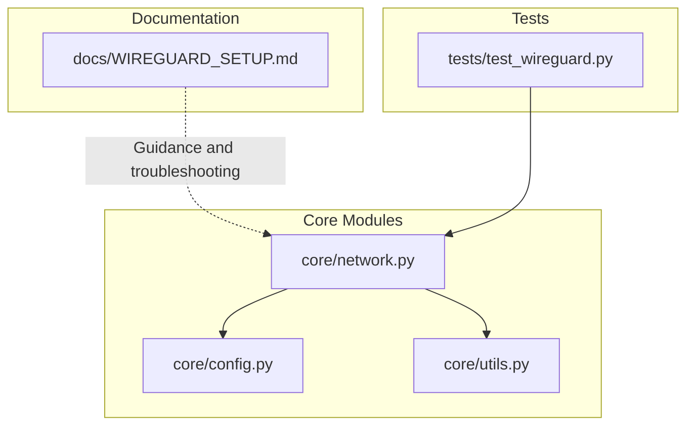
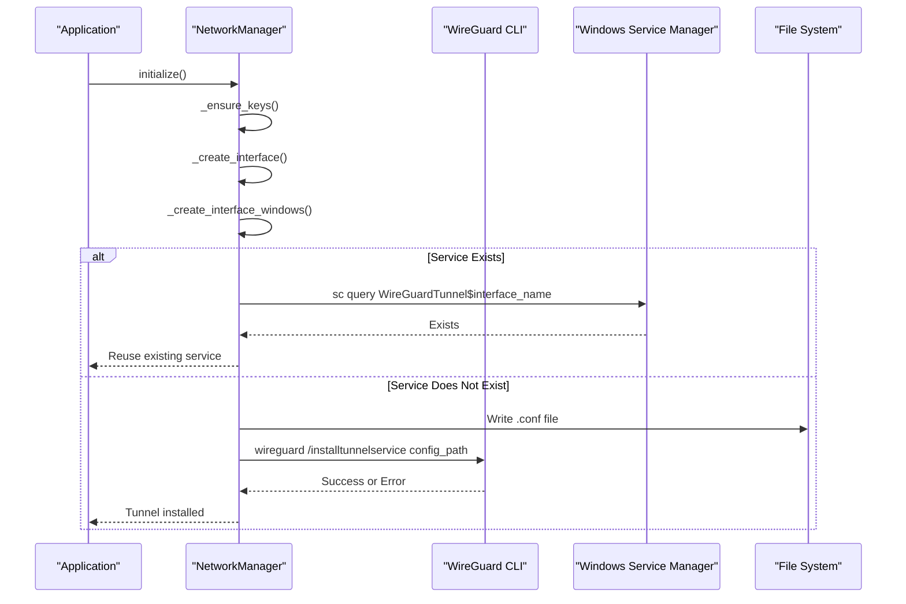
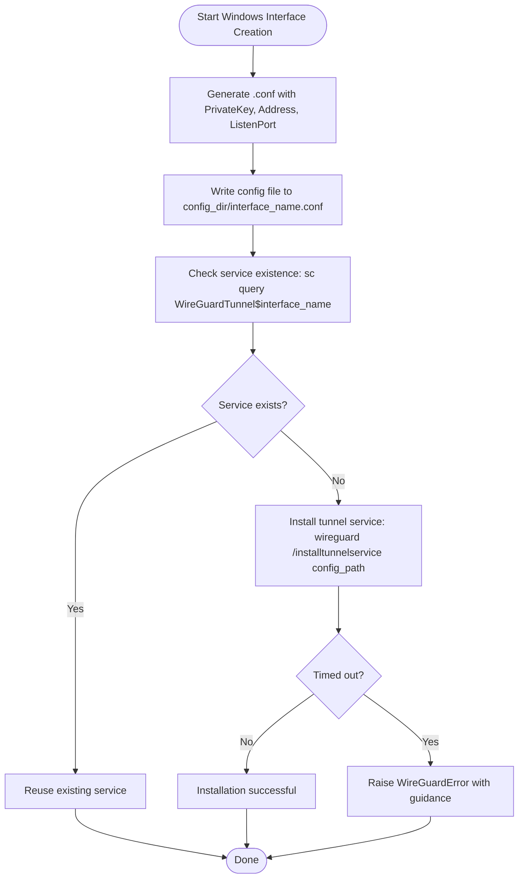
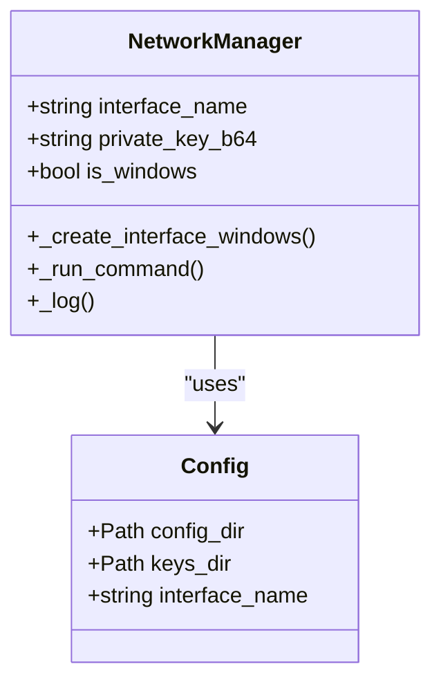
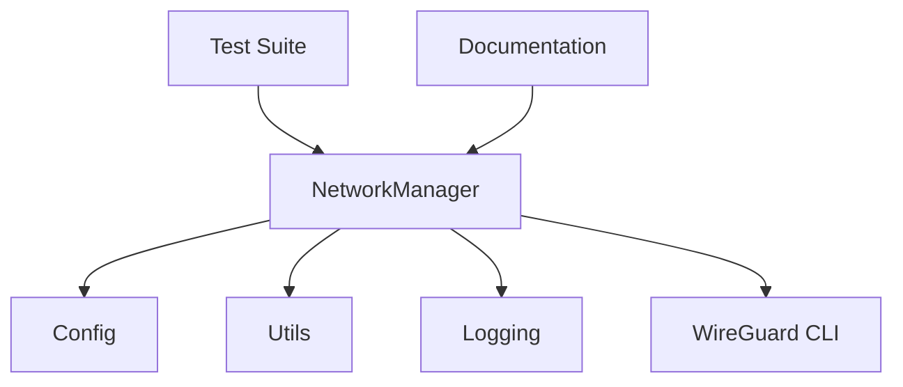

# Windows Tunnel Service Management

<cite>
**Referenced Files in This Document**
- [network.py](file://core/network.py)
- [config.py](file://core/config.py)
- [utils.py](file://core/utils.py)
- [WIREGUARD_SETUP.md](file://docs/WIREGUARD_SETUP.md)
- [test_wireguard.py](file://tests/test_wireguard.py)
</cite>

## Table of Contents
1. [Introduction](#introduction)
2. [Project Structure](#project-structure)
3. [Core Components](#core-components)
4. [Architecture Overview](#architecture-overview)
5. [Detailed Component Analysis](#detailed-component-analysis)
6. [Dependency Analysis](#dependency-analysis)
7. [Performance Considerations](#performance-considerations)
8. [Troubleshooting Guide](#troubleshooting-guide)
9. [Conclusion](#conclusion)
10. [Appendices](#appendices)

## Introduction
This document provides a comprehensive guide to Windows-specific WireGuard tunnel service management within the LANrage project. It focuses on the complete lifecycle of Windows tunnel services, including configuration file generation, service naming conventions, existence checks, installation procedures, error handling, and cleanup operations. The content is derived from the repository’s implementation and documentation.

## Project Structure
The Windows tunnel service management is implemented in the core networking module and supported by configuration, utilities, and documentation assets. The key files involved are:
- core/network.py: Implements platform-specific interface creation, including Windows tunnel service management
- core/config.py: Provides configuration defaults and paths used during tunnel setup
- core/utils.py: Offers administrative privilege checks and elevation utilities
- docs/WIREGUARD_SETUP.md: Contains setup instructions and troubleshooting guidance
- tests/test_wireguard.py: Validates WireGuard functionality end-to-end

**Diagram sources**
- [network.py](file://core/network.py#L1-L515)
- [config.py](file://core/config.py#L1-L114)
- [utils.py](file://core/utils.py#L1-L163)
- [WIREGUARD_SETUP.md](file://docs/WIREGUARD_SETUP.md#L1-L279)
- [test_wireguard.py](file://tests/test_wireguard.py#L1-L107)

**Section sources**
- [network.py](file://core/network.py#L1-L515)
- [config.py](file://core/config.py#L1-L114)
- [utils.py](file://core/utils.py#L1-L163)
- [WIREGUARD_SETUP.md](file://docs/WIREGUARD_SETUP.md#L1-L279)
- [test_wireguard.py](file://tests/test_wireguard.py#L1-L107)

## Core Components
- NetworkManager: Orchestrates WireGuard interface creation across platforms, with dedicated Windows implementation for tunnel service management
- Config: Supplies configuration defaults including interface name and paths used during tunnel setup
- Utilities: Provides administrative privilege checks and elevation helpers
- Documentation: Guides installation, testing, and troubleshooting

Key responsibilities:
- Generate WireGuard configuration files (.conf) with required parameters
- Manage Windows service naming and existence checks
- Install and uninstall tunnel services using wireguard command-line utilities
- Implement robust error handling for timeouts, permission issues, and installation failures
- Provide cleanup and status verification capabilities

**Section sources**
- [network.py](file://core/network.py#L25-L94)
- [config.py](file://core/config.py#L17-L48)
- [utils.py](file://core/utils.py#L12-L76)
- [WIREGUARD_SETUP.md](file://docs/WIREGUARD_SETUP.md#L1-L279)

## Architecture Overview
The Windows tunnel service lifecycle is encapsulated within the NetworkManager class. The flow includes:
- Initialization and key generation
- Platform detection and Windows-specific handling
- Configuration file generation
- Service existence verification
- Installation via wireguard command
- Status verification and cleanup

**Diagram sources**
- [network.py](file://core/network.py#L161-L234)

**Section sources**
- [network.py](file://core/network.py#L161-L234)

## Detailed Component Analysis

### Windows Interface Creation Workflow
The Windows-specific implementation manages the complete lifecycle of a WireGuard tunnel service:
- Configuration file generation with PrivateKey, Address, and ListenPort
- Service naming convention and existence checks
- Installation using wireguard /installtunnelservice
- Error handling for timeouts, permission issues, and installation failures
- Cleanup via wireguard /uninstalltunnelservice

**Diagram sources**
- [network.py](file://core/network.py#L172-L234)

**Section sources**
- [network.py](file://core/network.py#L172-L234)

### Configuration File Generation
The implementation generates a .conf file with the following structure:
- [Interface] section
- PrivateKey: base64-encoded private key
- Address: 10.66.0.1/16
- ListenPort: 51820

The configuration file path is derived from the configuration directory and interface name. The file is written asynchronously to ensure reliability.

Key implementation details:
- Base64 encoding of the private key for WireGuard compatibility
- Fixed IP address assignment and default port
- Asynchronous file writing to avoid blocking the event loop

**Section sources**
- [network.py](file://core/network.py#L177-L190)
- [config.py](file://core/config.py#L46-L47)

### Service Naming Convention and Existence Checking
Service naming follows the convention WireGuardTunnel$interface_name. Existence checking is performed using the Windows Service Control Manager (sc query). The implementation:
- Constructs the service name dynamically from the interface name
- Executes sc query with a short timeout to prevent hanging
- Treats any exception during the check as a potential non-existence scenario

**Diagram sources**
- [network.py](file://core/network.py#L25-L41)
- [config.py](file://core/config.py#L17-L48)

**Section sources**
- [network.py](file://core/network.py#L192-L205)

### Installation Procedures
Installation uses the wireguard command-line utility with the /installtunnelservice switch. The implementation:
- Executes the installation command with a 30-second timeout
- Handles timeout errors specifically with actionable guidance
- Captures and logs detailed error output (stdout/stderr) for diagnostics
- Raises a structured WireGuardError for higher-level handling

Common outcomes:
- Successful installation updates the service registry and creates the tunnel
- Timeout suggests the service may already exist or the system is busy
- Command errors indicate misconfiguration or permission issues

**Section sources**
- [network.py](file://core/network.py#L208-L234)

### Error Handling Strategies
The implementation provides comprehensive error handling:
- Timeout handling: Distinguishes between command timeouts and other failures
- Permission issues: Guides users to run as Administrator on Windows
- Installation failures: Logs detailed output and raises descriptive errors
- Service conflicts: Detects existing services and avoids redundant installations

Error categories and responses:
- TimeoutError: Indicates installation timeout; suggests manual verification
- CalledProcessError: Logs stderr/stdout and raises WireGuardError
- Generic exceptions: Logged and wrapped in WireGuardError for consistent handling

**Section sources**
- [network.py](file://core/network.py#L214-L234)

### Cleanup Process
Cleanup removes the tunnel service using wireguard /uninstalltunnelservice. The implementation:
- Executes the uninstall command with check=False to avoid raising on non-existent services
- Logs cleanup attempts and handles exceptions gracefully
- Integrates with the broader cleanup routine that orchestrates resource disposal

**Section sources**
- [network.py](file://core/network.py#L464-L481)

### Status Verification
Status verification is performed through the get_interface_status method, which:
- Checks if the interface has been created
- Executes wg show for Linux environments
- Returns structured status information including interface name and public key

Note: Windows status verification relies on external tools and is not implemented in the provided code.

**Section sources**
- [network.py](file://core/network.py#L445-L462)

## Dependency Analysis
The Windows tunnel service management depends on:
- Configuration module for paths and defaults
- Utilities for administrative privilege checks
- Logging infrastructure for diagnostic output
- External wireguard command-line utility for service operations

**Diagram sources**
- [network.py](file://core/network.py#L1-L515)
- [config.py](file://core/config.py#L1-L114)
- [utils.py](file://core/utils.py#L1-L163)
- [test_wireguard.py](file://tests/test_wireguard.py#L1-L107)
- [WIREGUARD_SETUP.md](file://docs/WIREGUARD_SETUP.md#L1-L279)

**Section sources**
- [network.py](file://core/network.py#L1-L515)
- [config.py](file://core/config.py#L1-L114)
- [utils.py](file://core/utils.py#L1-L163)
- [test_wireguard.py](file://tests/test_wireguard.py#L1-L107)
- [WIREGUARD_SETUP.md](file://docs/WIREGUARD_SETUP.md#L1-L279)

## Performance Considerations
- Asynchronous file I/O: Configuration files are written asynchronously to avoid blocking the event loop
- Short timeouts: Service existence checks and installations use bounded timeouts to prevent hangs
- Minimal external dependencies: Relies on wireguard CLI and Windows Service Control Manager
- Logging overhead: Structured logging is used for diagnostics without impacting runtime performance significantly

## Troubleshooting Guide
Common Windows issues and resolutions:
- Service conflicts: If installation times out, verify the service does not already exist in Windows Services and consider manual removal
- Permission issues: Ensure the application is run as Administrator on Windows
- Installation failures: Review logged stdout/stderr for detailed error messages
- Firewall conflicts: Verify Windows Firewall allows wireguard.exe and the configured ListenPort
- Service dependency problems: Confirm the WireGuard service is running and properly configured

Manual verification steps:
- Check service status: sc query WireGuardTunnel$interface_name
- Uninstall conflicting services: wireguard /uninstalltunnelservice interface_name
- Reinstall after cleanup: wireguard /installtunnelservice path/to/interface_name.conf

**Section sources**
- [network.py](file://core/network.py#L214-L234)
- [WIREGUARD_SETUP.md](file://docs/WIREGUARD_SETUP.md#L166-L224)

## Conclusion
The Windows tunnel service management implementation provides a robust, asynchronous workflow for creating and managing WireGuard tunnel services. It includes comprehensive error handling, structured logging, and clear operational guidance. The design emphasizes reliability through timeouts, explicit error reporting, and graceful fallbacks, while maintaining simplicity in configuration and service lifecycle operations.

## Appendices

### Configuration File Structure Reference
- [Interface]
  - PrivateKey: base64-encoded private key
  - Address: 10.66.0.1/16
  - ListenPort: 51820

### Service Management Commands
- Existence check: sc query WireGuardTunnel$interface_name
- Install: wireguard /installtunnelservice path/to/interface_name.conf
- Uninstall: wireguard /uninstalltunnelservice interface_name

### Testing and Validation
The test suite validates the end-to-end WireGuard setup, including privilege checks, initialization, status verification, latency measurement, and cleanup.

**Section sources**
- [test_wireguard.py](file://tests/test_wireguard.py#L21-L86)
- [WIREGUARD_SETUP.md](file://docs/WIREGUARD_SETUP.md#L56-L101)