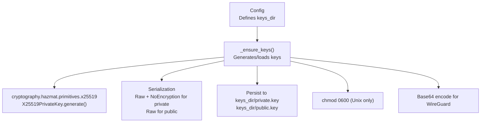
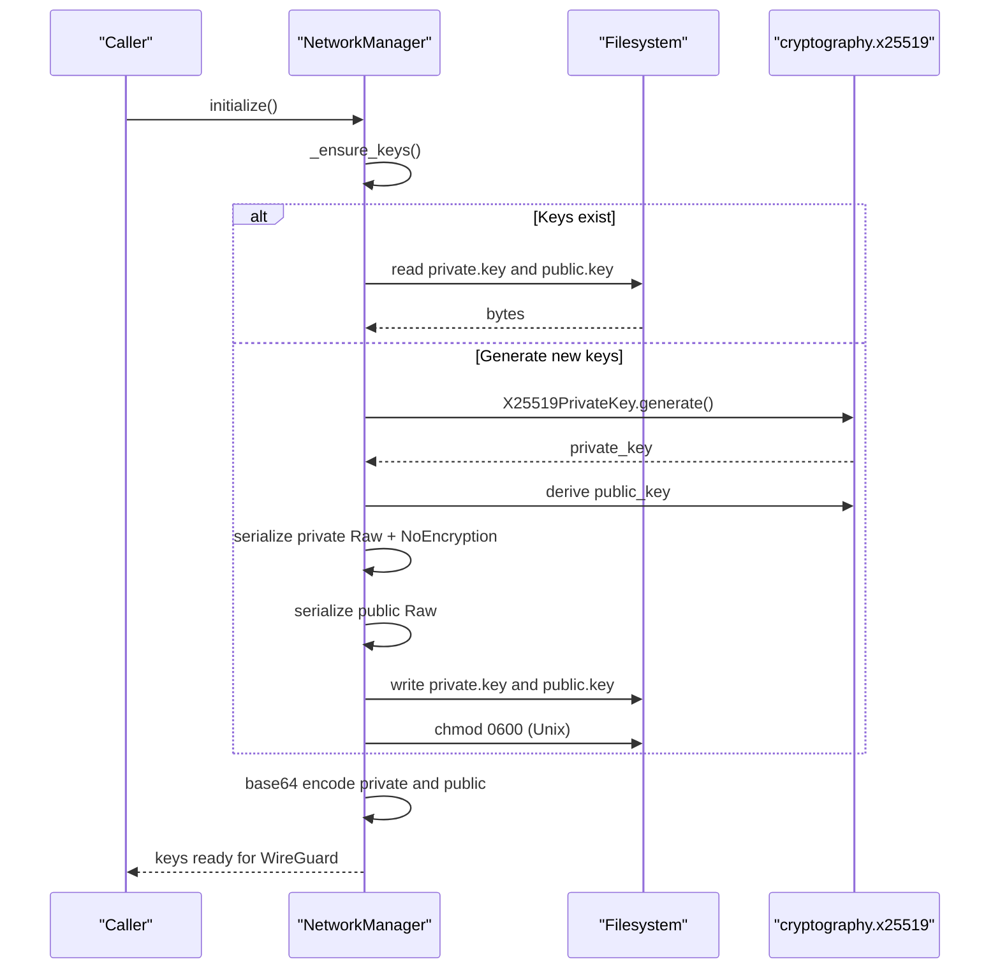
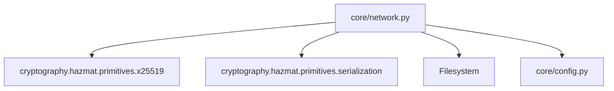
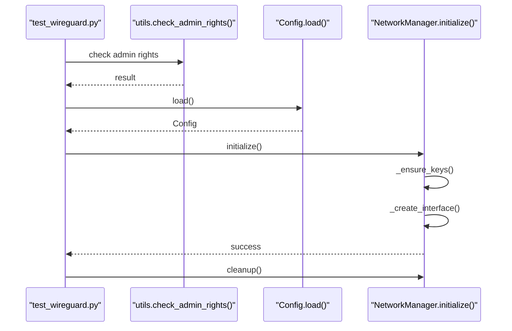

# Key Generation and Security

<cite>
**Referenced Files in This Document**
- [network.py](file://core/network.py)
- [config.py](file://core/config.py)
- [WIREGUARD_SETUP.md](file://docs/WIREGUARD_SETUP.md)
- [SECURITY.md](file://SECURITY.md)
- [test_wireguard.py](file://tests/test_wireguard.py)
- [utils.py](file://core/utils.py)
</cite>

## Table of Contents
1. [Introduction](#introduction)
2. [Project Structure](#project-structure)
3. [Core Components](#core-components)
4. [Architecture Overview](#architecture-overview)
5. [Detailed Component Analysis](#detailed-component-analysis)
6. [Dependency Analysis](#dependency-analysis)
7. [Performance Considerations](#performance-considerations)
8. [Troubleshooting Guide](#troubleshooting-guide)
9. [Conclusion](#conclusion)
10. [Appendices](#appendices)

## Introduction
This document focuses on WireGuard key generation and security implementation within the project. It explains how X25519 elliptic curve keys are generated using the cryptography library, how private/public keys are serialized and encoded for WireGuard configuration, and how keys are persisted securely. It also covers platform-specific file permission management, operational security considerations, and practical guidance for key rotation, backups, and recovery.

## Project Structure
The key generation and security logic resides primarily in the network management module and is coordinated by configuration and documentation assets. The relevant components are:
- NetworkManager: orchestrates WireGuard key generation, serialization, persistence, and base64 conversion
- Config: defines the keys directory location and ensures directories exist
- Documentation: describes key storage, permissions, and security posture
- Tests: validate end-to-end key generation and interface initialization

**Diagram sources**
- [network.py](file://core/network.py#L123-L159)
- [config.py](file://core/config.py#L45-L47)

**Section sources**
- [network.py](file://core/network.py#L123-L159)
- [config.py](file://core/config.py#L45-L47)

## Core Components
- X25519 key generation: Uses the cryptography library to generate Curve25519 private keys and derive corresponding public keys.
- Serialization: Private keys are serialized Raw with NoEncryption; public keys are serialized Raw.
- Persistence: Keys are written to the keys directory with secure permissions on Unix systems.
- Encoding: Keys are base64-encoded for compatibility with WireGuard configuration and CLI operations.
- Configuration: The keys directory defaults to ~/.lanrage/keys and is ensured to exist during configuration load.

**Section sources**
- [network.py](file://core/network.py#L123-L159)
- [config.py](file://core/config.py#L45-L47)
- [WIREGUARD_SETUP.md](file://docs/WIREGUARD_SETUP.md#L105-L121)

## Architecture Overview
The key lifecycle spans initialization, generation, serialization, persistence, and encoding. The following sequence diagram maps the actual implementation:

**Diagram sources**
- [network.py](file://core/network.py#L71-L94)
- [network.py](file://core/network.py#L123-L159)

## Detailed Component Analysis

### X25519 Key Generation and Derivation
- Private key generation uses X25519PrivateKey.generate().
- Public key is derived from the private key.
- Both keys are represented as raw bytes internally.

Implementation references:
- Private key generation and public key derivation
  - [network.py](file://core/network.py#L135-L136)
- Private key serialization Raw + NoEncryption
  - [network.py](file://core/network.py#L138-L142)
- Public key serialization Raw
  - [network.py](file://core/network.py#L144-L147)

**Section sources**
- [network.py](file://core/network.py#L135-L147)

### Key Serialization and Encoding
- Private key bytes are serialized Raw and saved without encryption.
- Public key bytes are serialized Raw.
- Both are base64-encoded for use in WireGuard configuration and CLI operations.

Implementation references:
- Private key serialization
  - [network.py](file://core/network.py#L138-L142)
- Public key serialization
  - [network.py](file://core/network.py#L144-L147)
- Base64 encoding for WireGuard
  - [network.py](file://core/network.py#L158-L159)

**Section sources**
- [network.py](file://core/network.py#L138-L159)

### Key Persistence and File Permissions
- Keys are persisted to the keys directory:
  - private.key: private key bytes
  - public.key: public key bytes
- On Unix systems, private.key is set to chmod 0600 (owner read/write only).
- The keys directory defaults to ~/.lanrage/keys and is ensured to exist during configuration load.

Implementation references:
- Keys directory definition and existence checks
  - [config.py](file://core/config.py#L45-L47)
  - [config.py](file://core/config.py#L94-L95)
- Persistence and permission enforcement
  - [network.py](file://core/network.py#L149-L155)

**Section sources**
- [config.py](file://core/config.py#L45-L47)
- [config.py](file://core/config.py#L94-L95)
- [network.py](file://core/network.py#L149-L155)

### Base64 Encoding for WireGuard Compatibility
- Both private and public key bytes are base64-encoded to ASCII strings suitable for WireGuard configuration and CLI operations.
- These base64 values are used when setting the WireGuard interface private key and when adding peers.

Implementation references:
- Base64 encoding
  - [network.py](file://core/network.py#L158-L159)

**Section sources**
- [network.py](file://core/network.py#L158-L159)

### Security Considerations and Best Practices
- Private key storage protection:
  - private.key is written with 0600 permissions on Unix systems.
  - Keys are stored in ~/.lanrage/keys by default.
- Entropy sources:
  - X25519 key generation relies on the cryptography library’s secure randomness.
- Cryptographic best practices:
  - Raw serialization without encryption for private keys is appropriate for local storage.
  - Base64 encoding is used for configuration compatibility.
- Operational security:
  - Logs are written to ~/.lanrage/network.log for monitoring suspicious activity.
  - The project emphasizes no telemetry and local-first data handling.

Implementation references:
- File permissions and key storage
  - [network.py](file://core/network.py#L154-L155)
  - [WIREGUARD_SETUP.md](file://docs/WIREGUARD_SETUP.md#L229-L232)
- Logging for security monitoring
  - [network.py](file://core/network.py#L42-L68)
  - [SECURITY.md](file://SECURITY.md#L89)

**Section sources**
- [network.py](file://core/network.py#L154-L155)
- [WIREGUARD_SETUP.md](file://docs/WIREGUARD_SETUP.md#L229-L232)
- [SECURITY.md](file://SECURITY.md#L89)

### Key Rotation Strategies
- The current implementation generates keys once and persists them to disk. There is no built-in automated key rotation mechanism.
- To rotate keys, remove or rename the persisted keys in the keys directory so that new keys are generated on next initialization.

Operational guidance:
- Remove keys directory entries to force regeneration
  - [network.py](file://core/network.py#L128-L131)

**Section sources**
- [network.py](file://core/network.py#L128-L131)

### Backup and Recovery Procedures
- Backup procedure:
  - Copy the entire keys directory (~/.lanrage/keys) to a secure offline location.
- Recovery procedure:
  - Restore the keys directory from backup.
  - On Unix systems, ensure private.key retains 0600 permissions after restoration.

References:
- Keys directory location
  - [config.py](file://core/config.py#L45-L47)
- Permissions guidance
  - [WIREGUARD_SETUP.md](file://docs/WIREGUARD_SETUP.md#L229-L232)

**Section sources**
- [config.py](file://core/config.py#L45-L47)
- [WIREGUARD_SETUP.md](file://docs/WIREGUARD_SETUP.md#L229-L232)

## Dependency Analysis
The key generation and persistence logic depends on:
- cryptography library primitives for X25519 key generation and serialization
- filesystem operations for key persistence and permission management
- configuration module for keys directory resolution

**Diagram sources**
- [network.py](file://core/network.py#L10-L11)
- [network.py](file://core/network.py#L123-L159)
- [config.py](file://core/config.py#L45-L47)

**Section sources**
- [network.py](file://core/network.py#L10-L11)
- [network.py](file://core/network.py#L123-L159)
- [config.py](file://core/config.py#L45-L47)

## Performance Considerations
- Key generation is performed once per initialization and cached in memory.
- Base64 encoding is lightweight and used only for configuration compatibility.
- Disk I/O occurs during initial key generation and persistence; subsequent runs load keys from disk.

[No sources needed since this section provides general guidance]

## Troubleshooting Guide
Common issues and resolutions related to key generation and persistence:

- WireGuard not found
  - Ensure WireGuard tools are installed and accessible on PATH.
  - References:
    - [WIREGUARD_SETUP.md](file://docs/WIREGUARD_SETUP.md#L14-L54)
- Permission denied creating interface
  - On Unix, root/sudo is required; on Windows, administrative privileges are required.
  - References:
    - [WIREGUARD_SETUP.md](file://docs/WIREGUARD_SETUP.md#L179-L191)
    - [utils.py](file://core/utils.py#L12-L39)
- Interface already exists
  - Clean up existing interface before retrying.
  - References:
    - [WIREGUARD_SETUP.md](file://docs/WIREGUARD_SETUP.md#L193-L205)
- Cannot create interface
  - Verify kernel modules and permissions; on Linux, ensure wireguard tools are present.
  - References:
    - [WIREGUARD_SETUP.md](file://docs/WIREGUARD_SETUP.md#L207-L217)
- Latency measurement fails
  - Check firewall and connectivity; adjust target IP if needed.
  - References:
    - [WIREGUARD_SETUP.md](file://docs/WIREGUARD_SETUP.md#L219-L223)
- Key storage and permissions
  - Confirm keys are stored in ~/.lanrage/keys and private.key has 0600 permissions on Unix.
  - References:
    - [WIREGUARD_SETUP.md](file://docs/WIREGUARD_SETUP.md#L229-L232)
    - [network.py](file://core/network.py#L154-L155)

**Section sources**
- [WIREGUARD_SETUP.md](file://docs/WIREGUARD_SETUP.md#L14-L54)
- [WIREGUARD_SETUP.md](file://docs/WIREGUARD_SETUP.md#L179-L232)
- [utils.py](file://core/utils.py#L12-L39)
- [network.py](file://core/network.py#L154-L155)

## Conclusion
The project implements secure, straightforward WireGuard key management using the cryptography library. X25519 keys are generated once, serialized appropriately, persisted to a controlled directory, and protected with strict file permissions on Unix systems. Base64 encoding ensures compatibility with WireGuard configuration. Operational guidance is provided for backup, recovery, and troubleshooting. For long-running deployments, consider implementing automated key rotation and secure off-machine backups as part of a broader security strategy.

[No sources needed since this section summarizes without analyzing specific files]

## Appendices

### End-to-End Initialization Flow (Tested)
The test script validates the end-to-end flow from privilege checks to interface initialization and cleanup.

**Diagram sources**
- [test_wireguard.py](file://tests/test_wireguard.py#L21-L86)
- [utils.py](file://core/utils.py#L12-L39)
- [config.py](file://core/config.py#L49-L113)
- [network.py](file://core/network.py#L71-L94)

**Section sources**
- [test_wireguard.py](file://tests/test_wireguard.py#L21-L86)
- [utils.py](file://core/utils.py#L12-L39)
- [config.py](file://core/config.py#L49-L113)
- [network.py](file://core/network.py#L71-L94)