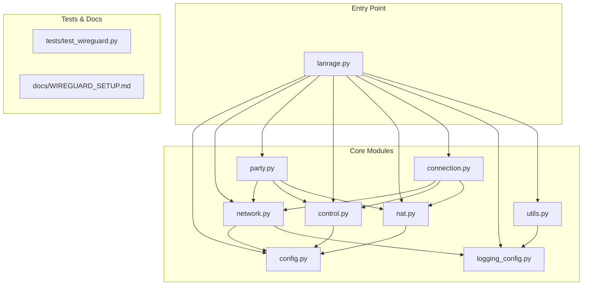
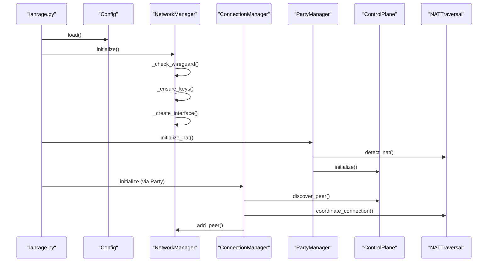
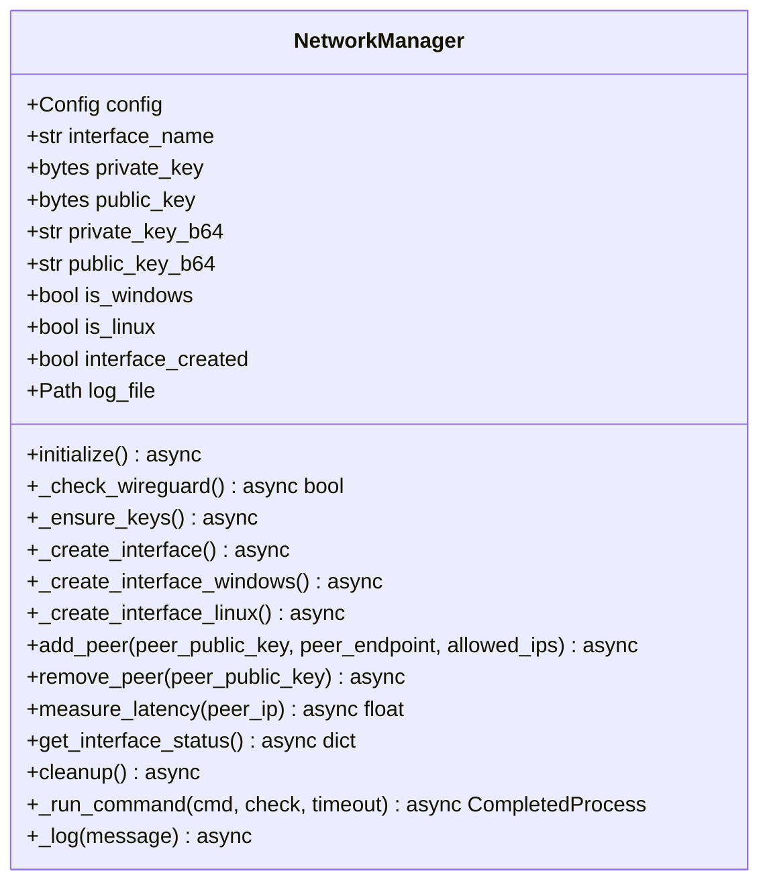
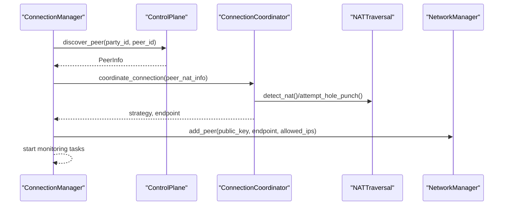
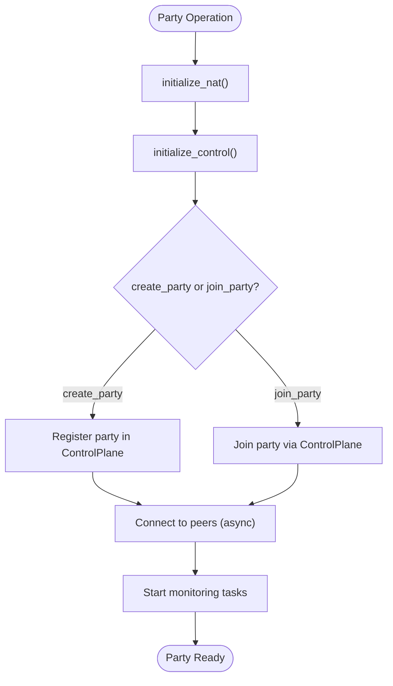
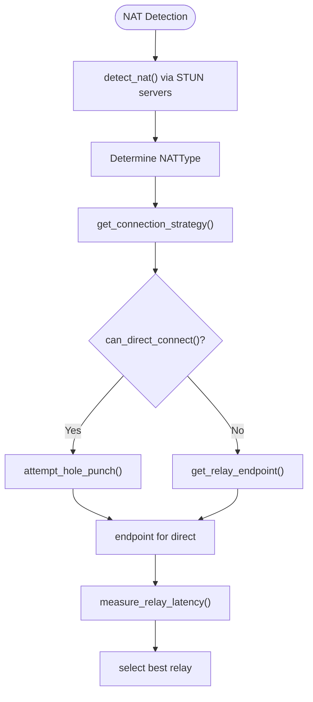
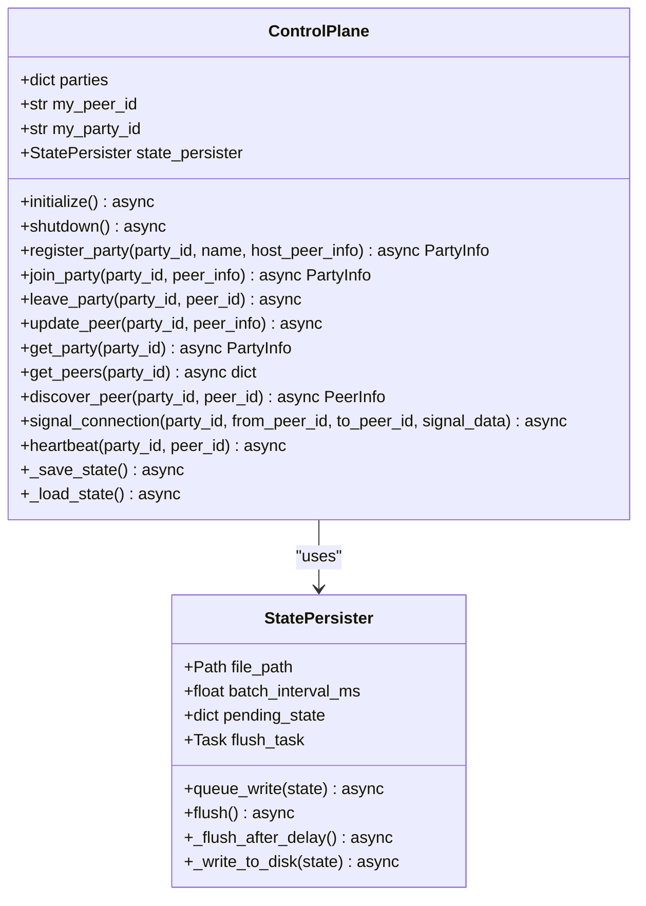
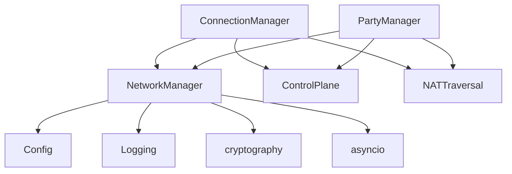

# Network Management

<cite>
**Referenced Files in This Document**
- [network.py](file://core/network.py)
- [connection.py](file://core/connection.py)
- [party.py](file://core/party.py)
- [nat.py](file://core/nat.py)
- [control.py](file://core/control.py)
- [config.py](file://core/config.py)
- [logging_config.py](file://core/logging_config.py)
- [utils.py](file://core/utils.py)
- [lanrage.py](file://lanrage.py)
- [test_wireguard.py](file://tests/test_wireguard.py)
- [WIREGUARD_SETUP.md](file://docs/WIREGUARD_SETUP.md)
</cite>

## Table of Contents
1. [Introduction](#introduction)
2. [Project Structure](#project-structure)
3. [Core Components](#core-components)
4. [Architecture Overview](#architecture-overview)
5. [Detailed Component Analysis](#detailed-component-analysis)
6. [Dependency Analysis](#dependency-analysis)
7. [Performance Considerations](#performance-considerations)
8. [Troubleshooting Guide](#troubleshooting-guide)
9. [Conclusion](#conclusion)

## Introduction
This document describes LANrage’s network management system with a focus on WireGuard interface creation, cross-platform implementation, and platform-specific handling. It covers the NetworkManager class architecture, including WireGuard key generation, interface creation on Windows and Linux platforms, peer management operations, asynchronous command execution, error handling, logging mechanisms, configuration file generation, key persistence, cleanup procedures, peer addition/removal operations, latency measurement capabilities, and interface status monitoring. It also documents the _run_command method with timeout handling, the _ensure_keys method for key generation, and cross-platform interface creation strategies, along with common issues such as missing WireGuard installations, permission requirements, and platform-specific error scenarios.

## Project Structure
The network management system is centered around the core network module and integrates with NAT traversal, control plane, and connection orchestration components. The main entry point initializes the system and coordinates network setup, NAT detection, control plane initialization, and API server startup.

**Diagram sources**
- [lanrage.py](file://lanrage.py#L40-L230)
- [network.py](file://core/network.py#L25-L515)
- [connection.py](file://core/connection.py#L18-L493)
- [party.py](file://core/party.py#L102-L304)
- [nat.py](file://core/nat.py#L41-L525)
- [control.py](file://core/control.py#L187-L880)
- [config.py](file://core/config.py#L17-L114)
- [logging_config.py](file://core/logging_config.py#L118-L277)
- [utils.py](file://core/utils.py#L12-L163)
- [test_wireguard.py](file://tests/test_wireguard.py#L21-L107)
- [WIREGUARD_SETUP.md](file://docs/WIREGUARD_SETUP.md#L1-L279)

**Section sources**
- [lanrage.py](file://lanrage.py#L40-L230)
- [network.py](file://core/network.py#L25-L515)
- [connection.py](file://core/connection.py#L18-L493)
- [party.py](file://core/party.py#L102-L304)
- [nat.py](file://core/nat.py#L41-L525)
- [control.py](file://core/control.py#L187-L880)
- [config.py](file://core/config.py#L17-L114)
- [logging_config.py](file://core/logging_config.py#L118-L277)
- [utils.py](file://core/utils.py#L12-L163)
- [test_wireguard.py](file://tests/test_wireguard.py#L21-L107)
- [WIREGUARD_SETUP.md](file://docs/WIREGUARD_SETUP.md#L1-L279)

## Core Components
- NetworkManager: Asynchronous network controller responsible for WireGuard key generation, interface creation, peer management, latency measurement, and cleanup. Implements platform-specific logic for Windows and Linux.
- ConnectionManager: Orchestrates peer connections, NAT traversal coordination, and connection monitoring with automatic reconnection and relay switching.
- PartyManager: Manages party lifecycle, peer discovery, and NAT compatibility checks.
- NATTraversal and ConnectionCoordinator: Handles NAT detection, hole punching, and relay selection strategies.
- ControlPlane: Provides peer discovery and signaling infrastructure (local and remote variants).
- Config: Centralized configuration management with database-backed settings.
- Logging and Utilities: Structured logging with context variables, performance timing, and administrative privilege checks.

**Section sources**
- [network.py](file://core/network.py#L25-L515)
- [connection.py](file://core/connection.py#L18-L493)
- [party.py](file://core/party.py#L102-L304)
- [nat.py](file://core/nat.py#L41-L525)
- [control.py](file://core/control.py#L187-L880)
- [config.py](file://core/config.py#L17-L114)
- [logging_config.py](file://core/logging_config.py#L118-L277)
- [utils.py](file://core/utils.py#L12-L163)

## Architecture Overview
The system follows a layered architecture:
- Entry point initializes configuration, network, NAT, control plane, and API server.
- NetworkManager handles WireGuard lifecycle and peer operations.
- ConnectionManager coordinates NAT traversal and peer connections.
- PartyManager manages party state and peer compatibility.
- ControlPlane provides peer discovery and signaling.
- Logging and utilities support structured logging, context propagation, and administrative checks.

**Diagram sources**
- [lanrage.py](file://lanrage.py#L75-L125)
- [network.py](file://core/network.py#L70-L94)
- [connection.py](file://core/connection.py#L38-L125)
- [party.py](file://core/party.py#L121-L158)
- [nat.py](file://core/nat.py#L64-L106)
- [control.py](file://core/control.py#L209-L227)

## Detailed Component Analysis

### NetworkManager
NetworkManager encapsulates WireGuard lifecycle management with cross-platform support:
- Initialization: Validates WireGuard presence, generates or loads keys, creates the interface, and logs outcomes.
- Key generation: Generates Curve25519 keys using cryptography primitives, persists them securely, and converts to base64 for WireGuard.
- Platform-specific interface creation:
  - Windows: Creates a WireGuard config file and installs/uninstalls the tunnel service using wireguard.exe.
  - Linux: Requires root/sudo; creates a wireguard interface, sets private key via stdin, assigns IP, sets MTU, and brings the interface up.
- Peer management: Adds and removes peers with endpoint configuration and persistent keepalive.
- Latency measurement: Uses platform-specific ping commands to measure latency to peers.
- Status monitoring: Retrieves WireGuard interface status via wg show.
- Cleanup: Removes tunnel service on Windows or deletes interface on Linux.

**Diagram sources**
- [network.py](file://core/network.py#L25-L515)

Key implementation details:
- Asynchronous command execution: _run_command uses asyncio.create_subprocess_exec with timeout handling and raises TimeoutExpired on timeout. It decodes stdout/stderr and raises CalledProcessError when return code is non-zero.
- Cross-platform interface creation: _create_interface delegates to platform-specific methods; _create_interface_windows generates a .conf file and uses wireguard.exe to manage the tunnel service; _create_interface_linux uses ip link and wg commands with sudo.
- Key persistence: Keys are stored under config.keys_dir with secure permissions on Unix (600).
- Logging: _log writes timestamped entries to a network.log file asynchronously, falling back to stderr on failures.

**Section sources**
- [network.py](file://core/network.py#L70-L94)
- [network.py](file://core/network.py#L95-L122)
- [network.py](file://core/network.py#L123-L160)
- [network.py](file://core/network.py#L161-L171)
- [network.py](file://core/network.py#L172-L235)
- [network.py](file://core/network.py#L236-L310)
- [network.py](file://core/network.py#L311-L339)
- [network.py](file://core/network.py#L340-L391)
- [network.py](file://core/network.py#L392-L444)
- [network.py](file://core/network.py#L445-L463)
- [network.py](file://core/network.py#L464-L482)
- [network.py](file://core/network.py#L483-L515)

### ConnectionManager
ConnectionManager orchestrates peer connections:
- connect_to_peer: Discovers peer via control plane, determines connection strategy (direct or relay), performs NAT traversal coordination, configures WireGuard peer, allocates virtual IP, and starts monitoring tasks.
- disconnect_from_peer: Removes WireGuard peer, releases virtual IP, and cleans up connection records.
- Monitoring: Periodically measures latency, triggers reconnection attempts, and switches relays when latency degrades.
- Status reporting: Aggregates peer status, latency, and strategy.

**Diagram sources**
- [connection.py](file://core/connection.py#L38-L125)
- [connection.py](file://core/connection.py#L126-L151)
- [connection.py](file://core/connection.py#L152-L179)
- [connection.py](file://core/connection.py#L213-L305)
- [connection.py](file://core/connection.py#L306-L333)
- [connection.py](file://core/connection.py#L334-L437)
- [nat.py](file://core/nat.py#L337-L369)
- [nat.py](file://core/nat.py#L371-L377)
- [nat.py](file://core/nat.py#L379-L398)
- [nat.py](file://core/nat.py#L457-L479)
- [nat.py](file://core/nat.py#L481-L525)

**Section sources**
- [connection.py](file://core/connection.py#L18-L493)
- [nat.py](file://core/nat.py#L330-L525)

### PartyManager
PartyManager manages party lifecycle and peer compatibility:
- initialize_nat: Initializes NAT traversal and connection coordinator.
- initialize_control: Initializes control plane and connection manager.
- create_party: Registers a new party and adds the host peer.
- join_party: Joins an existing party, converts to local format, and connects to peers.
- leave_party: Disconnects from peers and leaves the party.
- get_party_status: Measures latencies for peers and returns party status with NAT info.

**Diagram sources**
- [party.py](file://core/party.py#L121-L158)
- [party.py](file://core/party.py#L159-L197)
- [party.py](file://core/party.py#L198-L247)
- [party.py](file://core/party.py#L249-L261)
- [party.py](file://core/party.py#L279-L304)

**Section sources**
- [party.py](file://core/party.py#L102-L304)

### NATTraversal and ConnectionCoordinator
NATTraversal detects NAT type using STUN, attempts UDP hole punching, and determines connection strategies. ConnectionCoordinator coordinates connection decisions based on NAT compatibility and selects relay endpoints with latency measurement.

**Diagram sources**
- [nat.py](file://core/nat.py#L64-L106)
- [nat.py](file://core/nat.py#L107-L180)
- [nat.py](file://core/nat.py#L228-L243)
- [nat.py](file://core/nat.py#L244-L294)
- [nat.py](file://core/nat.py#L323-L328)
- [nat.py](file://core/nat.py#L337-L369)
- [nat.py](file://core/nat.py#L379-L398)
- [nat.py](file://core/nat.py#L457-L479)
- [nat.py](file://core/nat.py#L481-L525)

**Section sources**
- [nat.py](file://core/nat.py#L41-L525)

### ControlPlane
ControlPlane provides peer discovery and signaling. It supports local-only mode for testing and remote mode with WebSocket connectivity. It batches state writes to reduce disk I/O and maintains peer lists with heartbeats and cleanup tasks.

**Diagram sources**
- [control.py](file://core/control.py#L187-L880)

**Section sources**
- [control.py](file://core/control.py#L187-L880)

### Configuration and Logging
- Config: Loads settings from a database-first configuration source, ensuring directories exist and validating database integrity.
- Logging: Structured logging with context variables (peer_id, party_id, session_id, correlation_id), performance timing decorators, and configurable output formats.

**Section sources**
- [config.py](file://core/config.py#L17-L114)
- [logging_config.py](file://core/logging_config.py#L118-L277)

### Asynchronous Command Execution and Error Handling
- _run_command: Executes commands asynchronously with timeout, kills processes on timeout, decodes output, and raises CalledProcessError when return code is non-zero.
- Error handling: Comprehensive try/catch blocks with logging for file operations, process execution, and platform-specific checks.
- Permissions: _check_root verifies sudo access on Linux; Windows requires admin privileges.

**Section sources**
- [network.py](file://core/network.py#L483-L515)
- [network.py](file://core/network.py#L311-L339)
- [utils.py](file://core/utils.py#L12-L77)

### Platform-Specific Implementations
- Windows:
  - Tunnel service management via wireguard.exe install/uninstall commands.
  - Config file generation with [Interface] section containing private key, address, and listen port.
  - Service existence checked via sc query.
- Linux:
  - Root/sudo required for interface creation.
  - Uses ip link add dev <iface> type wireguard, wg set <iface> private-key /dev/stdin, ip address add dev <iface> <addr>, ip link set mtu 1420 up dev <iface>.
  - Cleanup deletes the interface on failure or shutdown.

**Section sources**
- [network.py](file://core/network.py#L172-L235)
- [network.py](file://core/network.py#L236-L310)
- [WIREGUARD_SETUP.md](file://docs/WIREGUARD_SETUP.md#L125-L136)

### Peer Management Operations
- Add peer: Constructs wg set command with peer public key, optional endpoint, allowed IPs, and persistent-keepalive.
- Remove peer: Executes wg set with peer remove.
- Monitoring: Periodic latency measurement and reconnection attempts with automatic cleanup.

**Section sources**
- [network.py](file://core/network.py#L392-L444)
- [connection.py](file://core/connection.py#L213-L305)
- [connection.py](file://core/connection.py#L306-L333)

### Latency Measurement and Interface Status Monitoring
- Latency measurement: Platform-specific ping commands with output parsing for time values.
- Status monitoring: wg show output retrieval and structured status reporting.

**Section sources**
- [network.py](file://core/network.py#L340-L391)
- [network.py](file://core/network.py#L445-L463)
- [connection.py](file://core/connection.py#L152-L179)

### Configuration File Generation and Key Persistence
- Keys: Stored in config.keys_dir with private key permissions secured on Unix.
- Windows config: Generated .conf file under config.config_dir/<interface>.conf with [Interface] section.
- Cleanup: Keys and config files are preserved for reuse across sessions.

**Section sources**
- [network.py](file://core/network.py#L123-L160)
- [network.py](file://core/network.py#L172-L190)
- [config.py](file://core/config.py#L45-L48)

## Dependency Analysis
NetworkManager depends on:
- Config for interface name, subnet, and key paths.
- Logging for structured logging and context propagation.
- cryptography for key generation.
- asyncio for asynchronous command execution and task management.

ConnectionManager depends on:
- NetworkManager for peer operations.
- ControlPlane for peer discovery.
- NATTraversal for connection strategy.

PartyManager depends on:
- NetworkManager for keys and interface status.
- ControlPlane for peer discovery.
- NATTraversal for NAT detection.

**Diagram sources**
- [network.py](file://core/network.py#L25-L515)
- [connection.py](file://core/connection.py#L18-L493)
- [party.py](file://core/party.py#L102-L304)
- [config.py](file://core/config.py#L17-L114)
- [logging_config.py](file://core/logging_config.py#L118-L277)

**Section sources**
- [network.py](file://core/network.py#L25-L515)
- [connection.py](file://core/connection.py#L18-L493)
- [party.py](file://core/party.py#L102-L304)

## Performance Considerations
- Asynchronous command execution prevents blocking the event loop.
- Batched state persistence reduces disk I/O overhead.
- Persistent keepalive improves NAT traversal reliability.
- MTU tuning (1420) balances overhead and throughput.

[No sources needed since this section provides general guidance]

## Troubleshooting Guide
Common issues and resolutions:
- WireGuard not found: Install WireGuard per platform prerequisites and verify installation.
- Permission denied: Run with admin rights on Windows or sudo on Linux.
- Interface already exists: Uninstall tunnel service on Windows or delete interface on Linux.
- Cannot create interface: Ensure kernel modules are loaded on Linux and service is running on Windows.
- Latency measurement fails: Allow ICMP, verify firewall rules, and try different targets.

**Section sources**
- [WIREGUARD_SETUP.md](file://docs/WIREGUARD_SETUP.md#L166-L224)
- [network.py](file://core/network.py#L95-L122)
- [network.py](file://core/network.py#L236-L310)
- [network.py](file://core/network.py#L172-L235)

## Conclusion
LANrage’s network management system provides a robust, cross-platform WireGuard implementation with comprehensive peer management, NAT traversal, and monitoring. The modular design separates concerns across NetworkManager, ConnectionManager, PartyManager, NATTraversal, and ControlPlane, enabling scalable and maintainable networking for LAN gaming scenarios. The asynchronous command execution, structured logging, and platform-specific handling ensure reliable operation across Windows and Linux environments.