# Network Operations and Monitoring

<cite>
**Referenced Files in This Document**
- [core/network.py](file://core/network.py)
- [core/logging_config.py](file://core/logging_config.py)
- [core/config.py](file://core/config.py)
- [core/metrics.py](file://core/metrics.py)
- [tests/test_wireguard.py](file://tests/test_wireguard.py)
- [docs/WIREGUARD_SETUP.md](file://docs/WIREGUARD_SETUP.md)
- [docs/TROUBLESHOOTING.md](file://docs/TROUBLESHOOTING.md)
- [docs/METRICS.md](file://docs/METRICS.md)
</cite>

## Table of Contents
1. [Introduction](#introduction)
2. [Project Structure](#project-structure)
3. [Core Components](#core-components)
4. [Architecture Overview](#architecture-overview)
5. [Detailed Component Analysis](#detailed-component-analysis)
6. [Dependency Analysis](#dependency-analysis)
7. [Performance Considerations](#performance-considerations)
8. [Troubleshooting Guide](#troubleshooting-guide)
9. [Conclusion](#conclusion)

## Introduction
This document explains the network operations and monitoring capabilities implemented in the project, focusing on:
- Interface status tracking via WireGuard commands
- Peer connectivity assessment and management
- Latency measurement using platform-specific ping implementations
- Asynchronous logging for network operations
- Error handling and timeout management for network operations
- Monitoring strategies, performance optimization tips, and troubleshooting approaches

## Project Structure
The network subsystem centers around a dedicated NetworkManager class that encapsulates WireGuard lifecycle, peer management, and diagnostics. Supporting modules provide structured logging, configuration, metrics collection, and documentation.

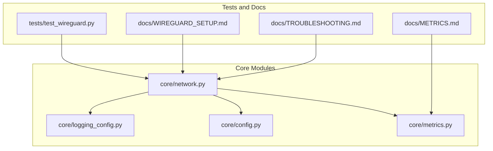

**Diagram sources**
- [core/network.py](file://core/network.py#L25-L515)
- [core/logging_config.py](file://core/logging_config.py#L1-L277)
- [core/config.py](file://core/config.py#L17-L114)
- [core/metrics.py](file://core/metrics.py#L193-L705)
- [tests/test_wireguard.py](file://tests/test_wireguard.py#L21-L107)
- [docs/WIREGUARD_SETUP.md](file://docs/WIREGUARD_SETUP.md#L1-L279)
- [docs/TROUBLESHOOTING.md](file://docs/TROUBLESHOOTING.md#L1-L904)
- [docs/METRICS.md](file://docs/METRICS.md#L1-L593)

**Section sources**
- [core/network.py](file://core/network.py#L1-L515)
- [core/logging_config.py](file://core/logging_config.py#L1-L277)
- [core/config.py](file://core/config.py#L1-L114)
- [core/metrics.py](file://core/metrics.py#L1-L705)
- [tests/test_wireguard.py](file://tests/test_wireguard.py#L1-L107)
- [docs/WIREGUARD_SETUP.md](file://docs/WIREGUARD_SETUP.md#L1-L279)
- [docs/TROUBLESHOOTING.md](file://docs/TROUBLESHOOTING.md#L1-L904)
- [docs/METRICS.md](file://docs/METRICS.md#L1-L593)

## Core Components
- NetworkManager: Orchestrates WireGuard interface creation, peer management, latency measurement, and status reporting. Implements robust error handling and timeouts for all external commands.
- Logging configuration: Provides structured logging with context variables and timing decorators for performance insights.
- Metrics collector: Tracks peer and system metrics for monitoring and quality scoring.
- Configuration: Supplies runtime settings including WireGuard keepalive and interface parameters.

Key responsibilities:
- Interface lifecycle: initialization, creation, cleanup
- Peer management: add/remove peers with endpoint and persistent keepalive
- Connectivity diagnostics: latency measurement and status retrieval
- Logging: asynchronous file logging for network operations
- Monitoring: peer/system metrics and quality scoring

**Section sources**
- [core/network.py](file://core/network.py#L25-L515)
- [core/logging_config.py](file://core/logging_config.py#L169-L231)
- [core/metrics.py](file://core/metrics.py#L193-L705)
- [core/config.py](file://core/config.py#L17-L114)

## Architecture Overview
The network subsystem integrates with configuration and logging to provide a cohesive monitoring and control plane for WireGuard-based networking.

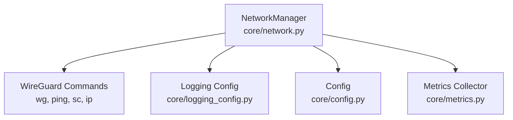

**Diagram sources**
- [core/network.py](file://core/network.py#L25-L515)
- [core/logging_config.py](file://core/logging_config.py#L1-L277)
- [core/config.py](file://core/config.py#L17-L114)
- [core/metrics.py](file://core/metrics.py#L193-L705)

## Detailed Component Analysis

### NetworkManager: WireGuard Lifecycle and Diagnostics
NetworkManager encapsulates:
- Interface creation (Windows and Linux)
- Peer management (add/remove)
- Latency measurement
- Interface status retrieval
- Asynchronous logging and error handling

Key methods and behaviors:
- Initialization and key management
- Platform-specific interface creation
- Peer management with persistent keepalive
- Latency measurement via platform-specific ping
- Status retrieval via wg show
- Asynchronous logging to network.log
- Timeout management for all external commands

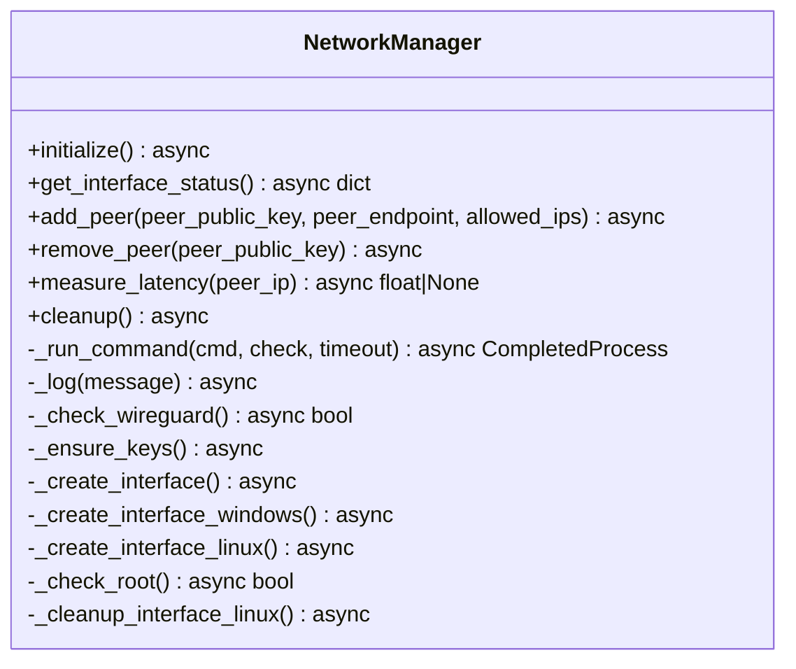

**Diagram sources**
- [core/network.py](file://core/network.py#L25-L515)

**Section sources**
- [core/network.py](file://core/network.py#L25-L515)

#### get_interface_status(): Retrieving WireGuard Interface Information
Purpose:
- Retrieve current WireGuard interface status using wg show
- Return structured status including interface name, public key, and raw output

Behavior:
- Validates interface existence
- Executes wg show with sudo
- Returns status dictionary with error handling

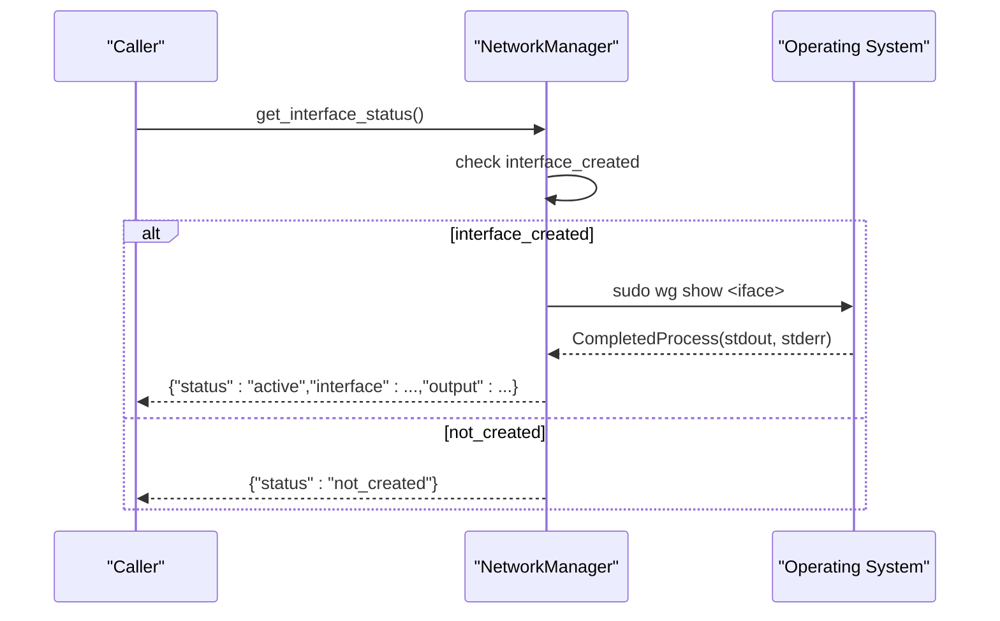

**Diagram sources**
- [core/network.py](file://core/network.py#L445-L462)

**Section sources**
- [core/network.py](file://core/network.py#L445-L462)

#### Latency Measurement: Platform-Specific Ping
Purpose:
- Measure round-trip latency to a peer/IP
- Parse platform-specific ping output to extract time

Behavior:
- Windows: ping -n 1 -w 1000 <ip>, parse time=
- Linux: ping -c 1 -W 1 <ip>, parse time=
- Returns latency in milliseconds or None on failure

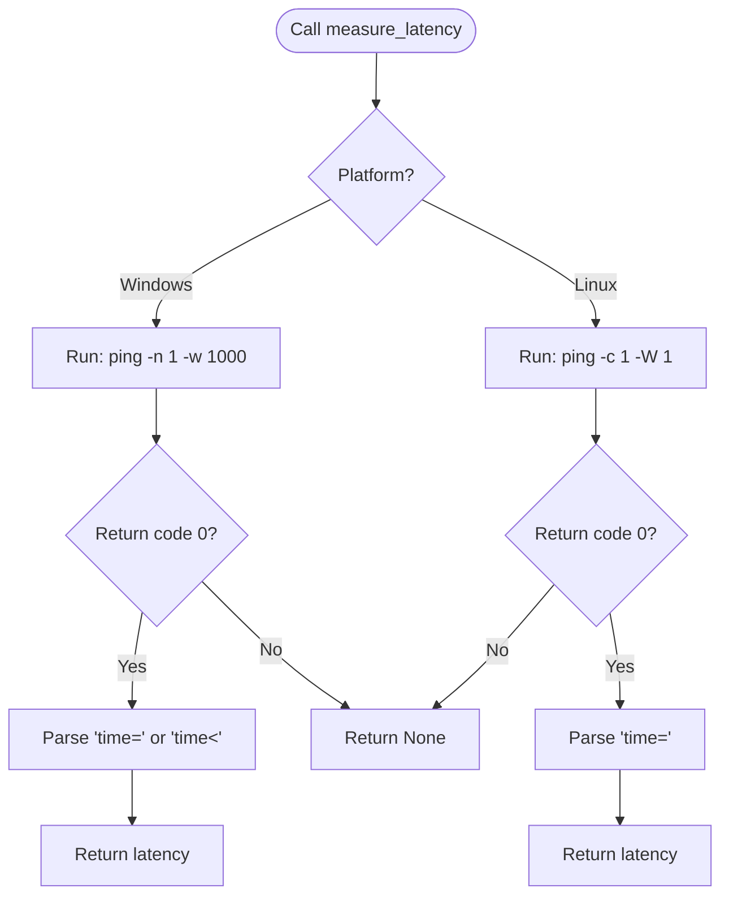

**Diagram sources**
- [core/network.py](file://core/network.py#L340-L390)

**Section sources**
- [core/network.py](file://core/network.py#L340-L390)

#### Peer Management: add_peer() and remove_peer()
Purpose:
- Add peers with endpoint configuration and persistent keepalive
- Remove peers cleanly

Behavior:
- add_peer: constructs wg set command with peer, endpoint, allowed-ips, persistent-keepalive
- remove_peer: executes wg set peer remove
- Both validate interface existence and handle errors

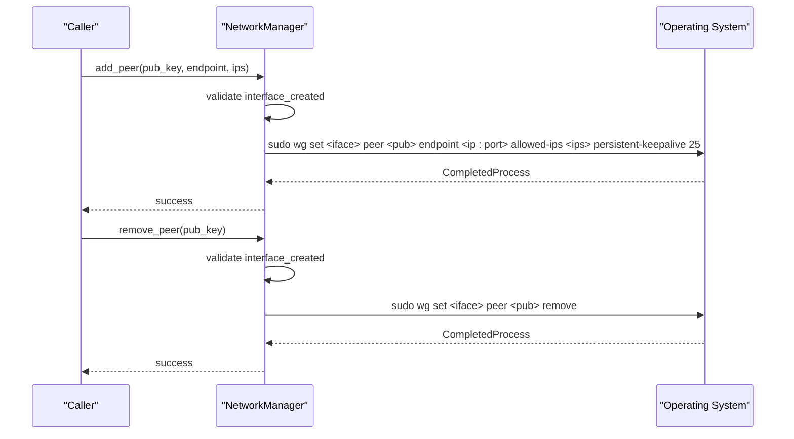

**Diagram sources**
- [core/network.py](file://core/network.py#L392-L443)

**Section sources**
- [core/network.py](file://core/network.py#L392-L443)

#### Asynchronous Logging System for network.log
Purpose:
- Persist network operations to a file asynchronously
- Fallback to stderr if file logging fails

Behavior:
- Ensures log directory exists
- Writes entries with timestamps
- Catches and logs filesystem errors without crashing

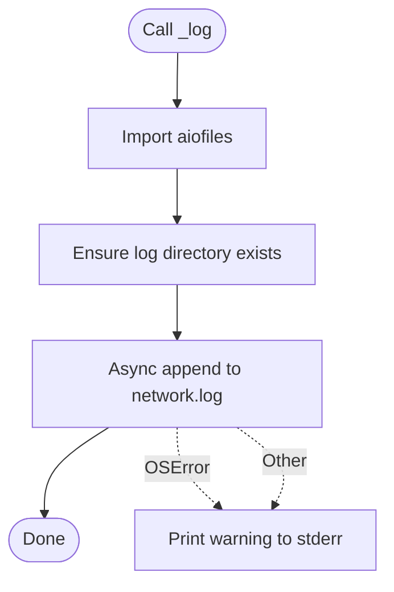

**Diagram sources**
- [core/network.py](file://core/network.py#L42-L69)

**Section sources**
- [core/network.py](file://core/network.py#L42-L69)

#### Error Handling and Timeout Management
Purpose:
- Robust error handling for command failures
- Controlled timeouts for all external operations

Behavior:
- _run_command: async subprocess execution with timeout
- Kills process on timeout and raises TimeoutExpired
- Raises CalledProcessError when return code != 0 (when check=True)
- Comprehensive try/catch blocks for all operations

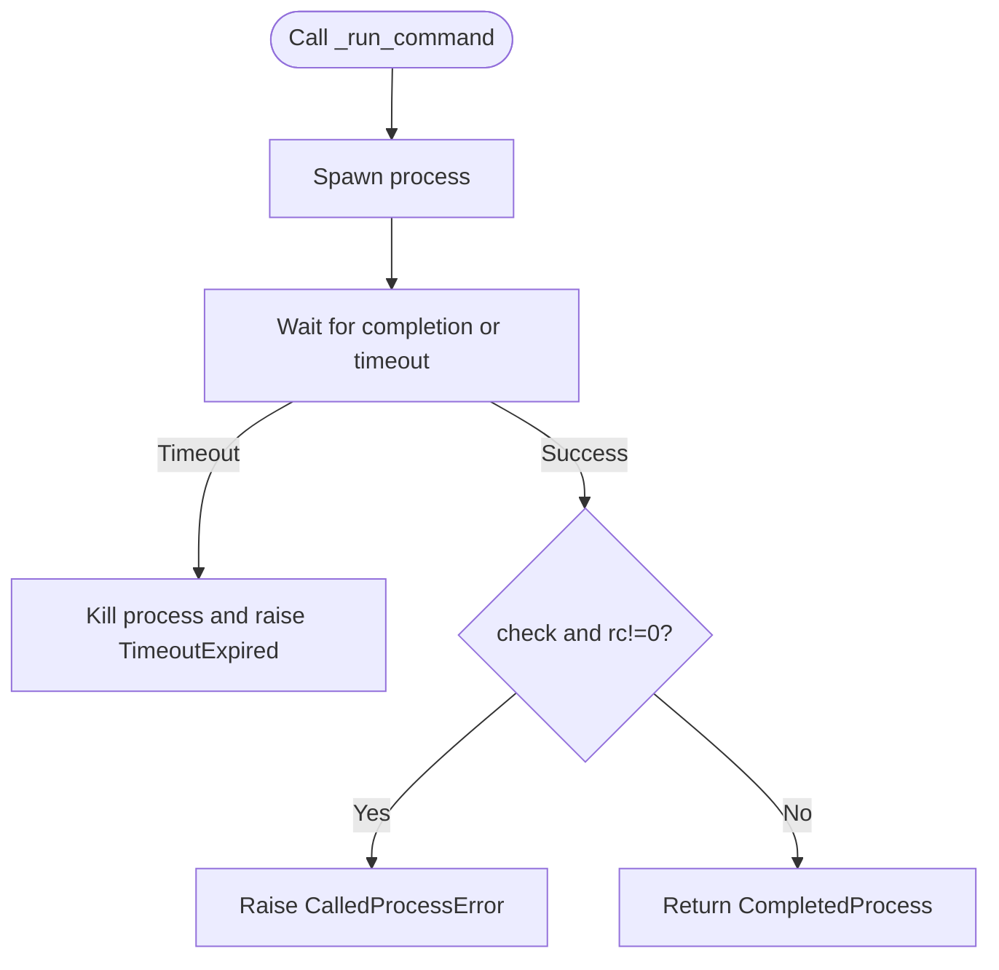

**Diagram sources**
- [core/network.py](file://core/network.py#L483-L514)

**Section sources**
- [core/network.py](file://core/network.py#L483-L514)

### Logging Configuration and Context Variables
Purpose:
- Provide structured logging with context variables
- Decorate functions to capture timing metrics

Highlights:
- StructuredFormatter outputs JSON logs with context
- PlainFormatter adds human-readable context
- timing_decorator measures execution time for async/sync functions
- set_context and get_context manage correlation/tracing

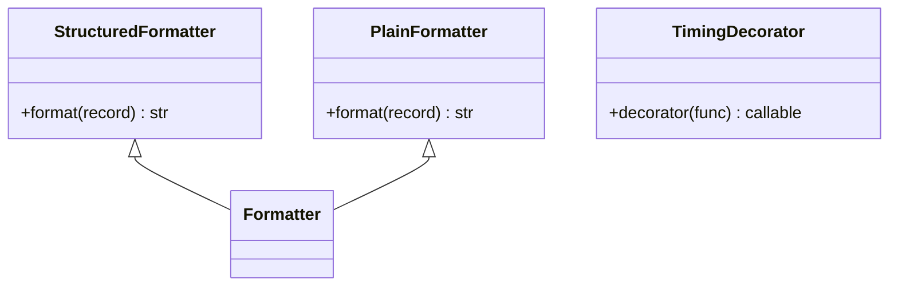

**Diagram sources**
- [core/logging_config.py](file://core/logging_config.py#L26-L116)
- [core/logging_config.py](file://core/logging_config.py#L169-L231)

**Section sources**
- [core/logging_config.py](file://core/logging_config.py#L1-L277)

### Metrics Collection for Monitoring
Purpose:
- Track peer/system metrics for monitoring and quality scoring
- Provide summaries and histories for analysis

Highlights:
- PeerMetrics: latency, bandwidth, packet counts, status, quality
- SystemMetrics: CPU, memory, network rates
- MetricsCollector: aggregation, quality scoring, session tracking

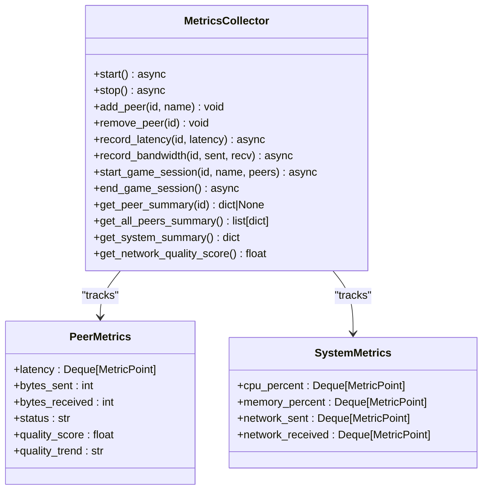

**Diagram sources**
- [core/metrics.py](file://core/metrics.py#L193-L705)

**Section sources**
- [core/metrics.py](file://core/metrics.py#L1-L705)
- [docs/METRICS.md](file://docs/METRICS.md#L1-L593)

## Dependency Analysis
NetworkManager depends on:
- Configuration for interface settings and keepalive
- Logging configuration for structured logs and timing
- Metrics for peer/system monitoring
- Platform-specific commands (wg, ping, sc, ip)

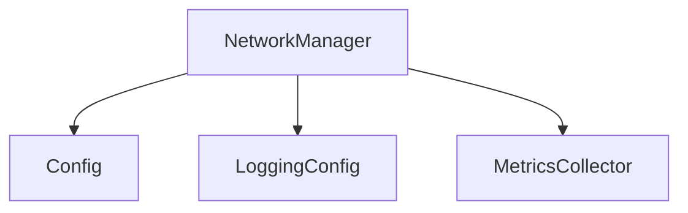

**Diagram sources**
- [core/network.py](file://core/network.py#L13-L16)
- [core/config.py](file://core/config.py#L17-L114)
- [core/logging_config.py](file://core/logging_config.py#L1-L277)
- [core/metrics.py](file://core/metrics.py#L193-L705)

**Section sources**
- [core/network.py](file://core/network.py#L13-L16)
- [core/config.py](file://core/config.py#L17-L114)
- [core/logging_config.py](file://core/logging_config.py#L1-L277)
- [core/metrics.py](file://core/metrics.py#L193-L705)

## Performance Considerations
- Latency measurement: Single-packet ping minimizes overhead; platform-specific flags reduce wait time.
- Persistent keepalive: 25 seconds balance NAT traversal and overhead.
- Asynchronous I/O: aiofiles prevents blocking during logging.
- Metrics sampling: 10-second intervals for system metrics; configurable retention.
- Command timeouts: 30 seconds default; Windows tunnel install 30 seconds; WireGuard check 5 seconds.

[No sources needed since this section provides general guidance]

## Troubleshooting Guide
Common issues and resolutions:
- WireGuard not found: Install per platform-specific instructions; verify wg or wireguard availability.
- Permission denied: Run with admin/root; configure sudoers or elevation.
- Interface already exists: Uninstall/recreate; ensure port 51820 availability.
- Latency measurement fails: Check firewall (ICMP), connectivity, and target reachability.
- High latency: Optimize network (wired connection), reduce congestion, verify connection type (direct vs relayed).
- Peer unreachable: Verify endpoint correctness, firewall rules, NAT traversal status.

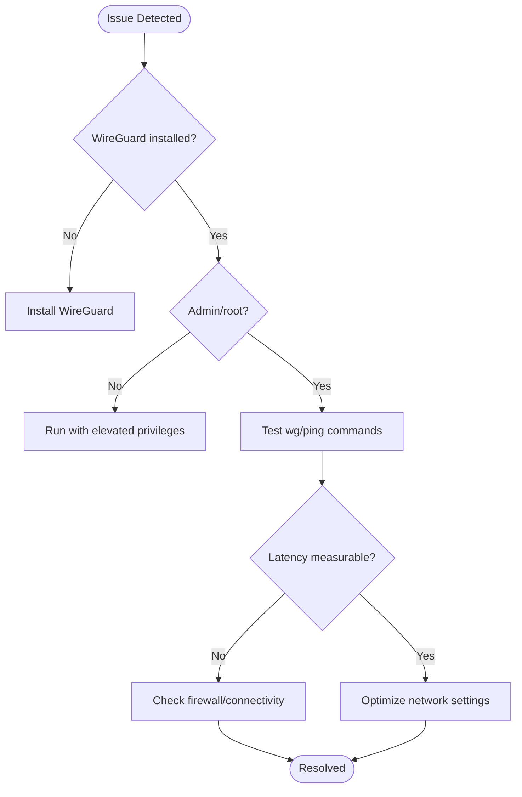

**Diagram sources**
- [docs/TROUBLESHOOTING.md](file://docs/TROUBLESHOOTING.md#L171-L226)

**Section sources**
- [docs/TROUBLESHOOTING.md](file://docs/TROUBLESHOOTING.md#L1-L904)
- [docs/WIREGUARD_SETUP.md](file://docs/WIREGUARD_SETUP.md#L166-L224)

## Conclusion
The network operations and monitoring subsystem provides a robust, asynchronous foundation for WireGuard-based networking with:
- Reliable interface lifecycle management
- Peer connectivity assessment and management
- Accurate latency measurement across platforms
- Structured logging and performance timing
- Comprehensive error handling and timeout management
- Integrated metrics collection for ongoing monitoring and quality scoring

These capabilities enable effective monitoring, diagnostics, and troubleshooting of network connectivity in diverse environments.