# WireGuard Interface Management

<cite>
**Referenced Files in This Document**
- [network.py](file://core/network.py)
- [config.py](file://core/config.py)
- [utils.py](file://core/utils.py)
- [logging_config.py](file://core/logging_config.py)
- [exceptions.py](file://core/exceptions.py)
- [test_wireguard.py](file://tests/test_wireguard.py)
- [WIREGUARD_SETUP.md](file://docs/WIREGUARD_SETUP.md)
- [NETWORK.md](file://docs/NETWORK.md)
- [TROUBLESHOOTING.md](file://docs/TROUBLESHOOTING.md)
</cite>

## Table of Contents
1. [Introduction](#introduction)
2. [Project Structure](#project-structure)
3. [Core Components](#core-components)
4. [Architecture Overview](#architecture-overview)
5. [Detailed Component Analysis](#detailed-component-analysis)
6. [Dependency Analysis](#dependency-analysis)
7. [Performance Considerations](#performance-considerations)
8. [Troubleshooting Guide](#troubleshooting-guide)
9. [Conclusion](#conclusion)

## Introduction
This document provides comprehensive technical documentation for the WireGuard interface management system implemented in the LANrage project. It focuses on the NetworkManager class, covering interface creation, cryptographic key generation, asynchronous command execution, peer management, and operational monitoring. The content is designed for both developers and operators who need to understand, deploy, and troubleshoot the virtual networking infrastructure.

## Project Structure
The WireGuard management functionality is primarily implemented in the core network module, with supporting configuration, utilities, logging, and testing components. The system integrates with the broader LANrage architecture to provide secure, encrypted peer-to-peer communication over virtual networks.

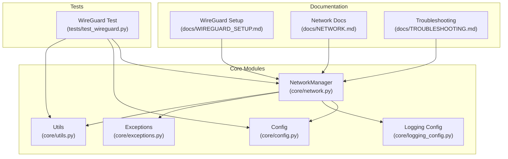

**Diagram sources**
- [network.py](file://core/network.py#L25-L41)
- [config.py](file://core/config.py#L17-L48)
- [utils.py](file://core/utils.py#L12-L39)
- [logging_config.py](file://core/logging_config.py#L157-L166)
- [exceptions.py](file://core/exceptions.py#L68-L71)
- [test_wireguard.py](file://tests/test_wireguard.py#L16-L18)
- [WIREGUARD_SETUP.md](file://docs/WIREGUARD_SETUP.md#L1-L279)
- [NETWORK.md](file://docs/NETWORK.md#L1-L453)
- [TROUBLESHOOTING.md](file://docs/TROUBLESHOOTING.md#L1-L904)

**Section sources**
- [network.py](file://core/network.py#L1-L515)
- [config.py](file://core/config.py#L1-L114)
- [utils.py](file://core/utils.py#L1-L163)
- [logging_config.py](file://core/logging_config.py#L1-L277)
- [exceptions.py](file://core/exceptions.py#L1-L96)
- [test_wireguard.py](file://tests/test_wireguard.py#L1-L107)
- [WIREGUARD_SETUP.md](file://docs/WIREGUARD_SETUP.md#L1-L279)
- [NETWORK.md](file://docs/NETWORK.md#L1-L453)
- [TROUBLESHOOTING.md](file://docs/TROUBLESHOOTING.md#L1-L904)

## Core Components
The WireGuard interface management system centers around the NetworkManager class, which orchestrates key generation, interface creation, peer management, and operational monitoring. Supporting components handle configuration, administrative privilege checks, structured logging, and error handling.

Key responsibilities:
- Initialize WireGuard interface with platform-specific implementations
- Generate and persist Curve25519 keys using X25519 elliptic curve cryptography
- Manage peer lifecycle (add/remove) with persistent keepalive
- Measure latency using platform-appropriate ping utilities
- Monitor interface status via wg show commands
- Provide robust error handling and logging

**Section sources**
- [network.py](file://core/network.py#L25-L41)
- [config.py](file://core/config.py#L17-L48)
- [utils.py](file://core/utils.py#L12-L39)
- [logging_config.py](file://core/logging_config.py#L169-L230)
- [exceptions.py](file://core/exceptions.py#L68-L71)

## Architecture Overview
The system follows a layered architecture with clear separation of concerns:
- Configuration layer: Provides runtime settings and filesystem paths
- Network management layer: Implements WireGuard operations and platform abstractions
- Utility layer: Handles administrative checks and command execution
- Logging layer: Provides structured logging with performance timing
- Exception layer: Defines domain-specific error types

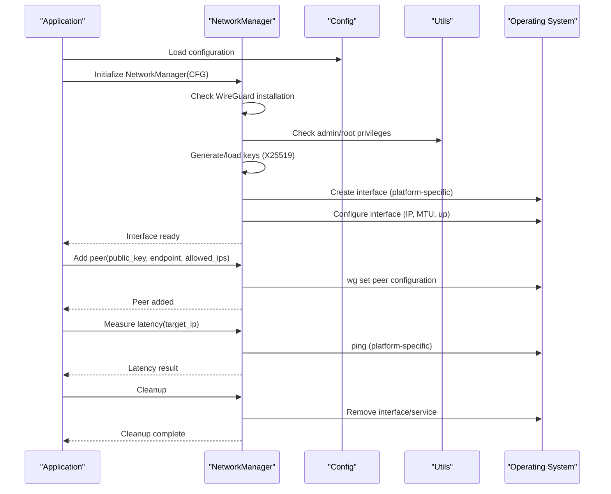

**Diagram sources**
- [network.py](file://core/network.py#L71-L94)
- [network.py](file://core/network.py#L393-L420)
- [network.py](file://core/network.py#L340-L391)
- [network.py](file://core/network.py#L464-L482)
- [utils.py](file://core/utils.py#L12-L39)

**Section sources**
- [network.py](file://core/network.py#L71-L94)
- [network.py](file://core/network.py#L393-L420)
- [network.py](file://core/network.py#L340-L391)
- [network.py](file://core/network.py#L464-L482)
- [utils.py](file://core/utils.py#L12-L39)

## Detailed Component Analysis

### NetworkManager Class
The NetworkManager class serves as the central orchestrator for all WireGuard operations. It encapsulates interface lifecycle management, cryptographic key handling, peer administration, and operational monitoring.

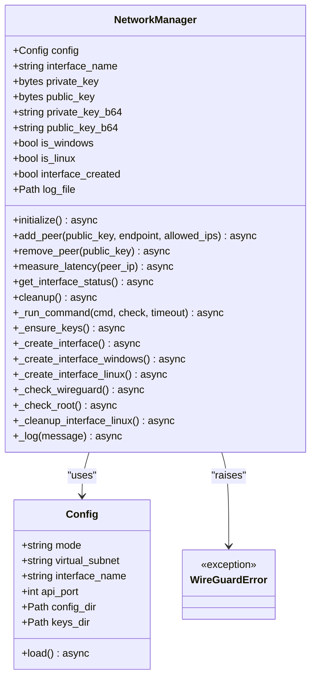

**Diagram sources**
- [network.py](file://core/network.py#L25-L41)
- [network.py](file://core/network.py#L71-L94)
- [network.py](file://core/network.py#L123-L160)
- [network.py](file://core/network.py#L161-L171)
- [network.py](file://core/network.py#L172-L235)
- [network.py](file://core/network.py#L236-L310)
- [network.py](file://core/network.py#L340-L391)
- [network.py](file://core/network.py#L393-L444)
- [network.py](file://core/network.py#L445-L463)
- [network.py](file://core/network.py#L464-L482)
- [network.py](file://core/network.py#L483-L515)
- [config.py](file://core/config.py#L17-L48)
- [exceptions.py](file://core/exceptions.py#L68-L71)

#### Initialize Method Workflow
The initialize() method coordinates the complete interface setup process:

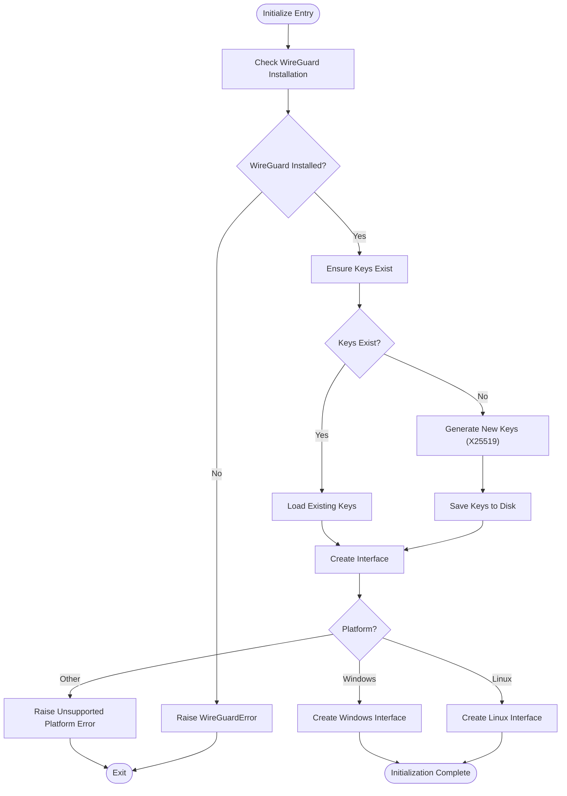

**Diagram sources**
- [network.py](file://core/network.py#L71-L94)
- [network.py](file://core/network.py#L95-L122)
- [network.py](file://core/network.py#L123-L160)
- [network.py](file://core/network.py#L161-L171)
- [network.py](file://core/network.py#L172-L235)
- [network.py](file://core/network.py#L236-L310)

Key implementation details:
- WireGuard installation verification using platform-specific detection
- X25519 key generation with cryptography.hazmat primitives
- Base64 encoding for WireGuard configuration compatibility
- Platform-specific interface creation with appropriate commands

**Section sources**
- [network.py](file://core/network.py#L71-L94)
- [network.py](file://core/network.py#L95-L122)
- [network.py](file://core/network.py#L123-L160)
- [network.py](file://core/network.py#L161-L171)
- [network.py](file://core/network.py#L172-L235)
- [network.py](file://core/network.py#L236-L310)

#### Asynchronous Command Execution System
The _run_command() method provides a robust asynchronous command execution framework with comprehensive timeout handling, error propagation, and logging:

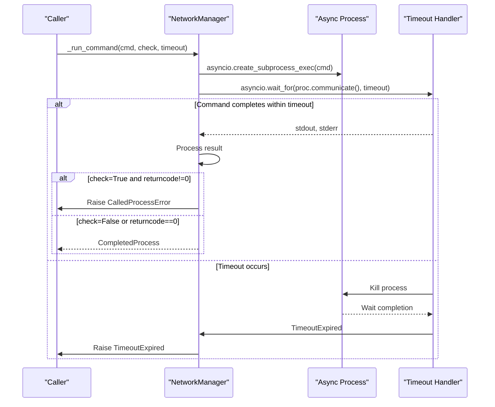

**Diagram sources**
- [network.py](file://core/network.py#L483-L515)

Implementation characteristics:
- Asynchronous subprocess execution with configurable timeouts
- Graceful process termination on timeout with kill() and wait()
- Comprehensive error handling with detailed stderr/stdout capture
- Optional command validation (check parameter) for immediate error propagation

**Section sources**
- [network.py](file://core/network.py#L483-L515)

#### Peer Management Operations
The add_peer() and remove_peer() methods provide atomic peer lifecycle management with persistent keepalive configuration:

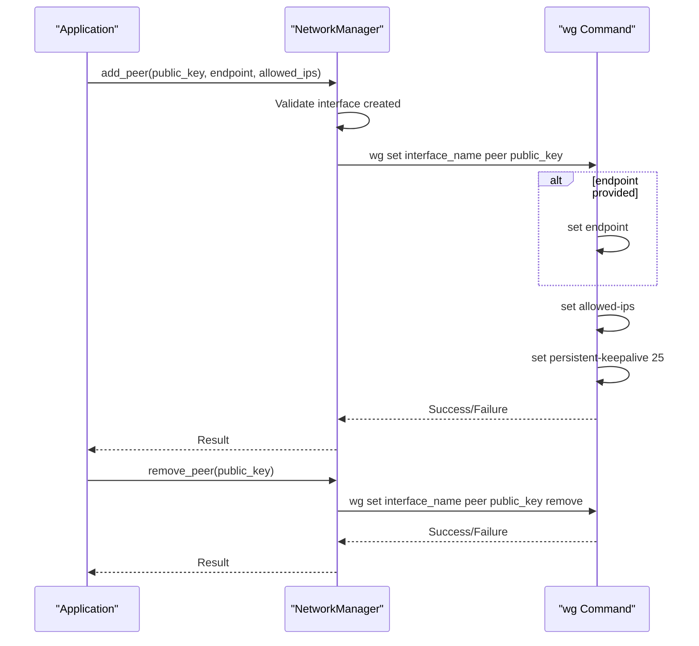

**Diagram sources**
- [network.py](file://core/network.py#L393-L420)
- [network.py](file://core/network.py#L421-L444)

Operational details:
- Persistent keepalive (25 seconds) for NAT traversal
- Endpoint configuration for remote peers
- Allowed IP ranges for fine-grained routing
- Atomic peer removal with dedicated command

**Section sources**
- [network.py](file://core/network.py#L393-L420)
- [network.py](file://core/network.py#L421-L444)

#### Interface Status Monitoring
The get_interface_status() method provides comprehensive interface health assessment:

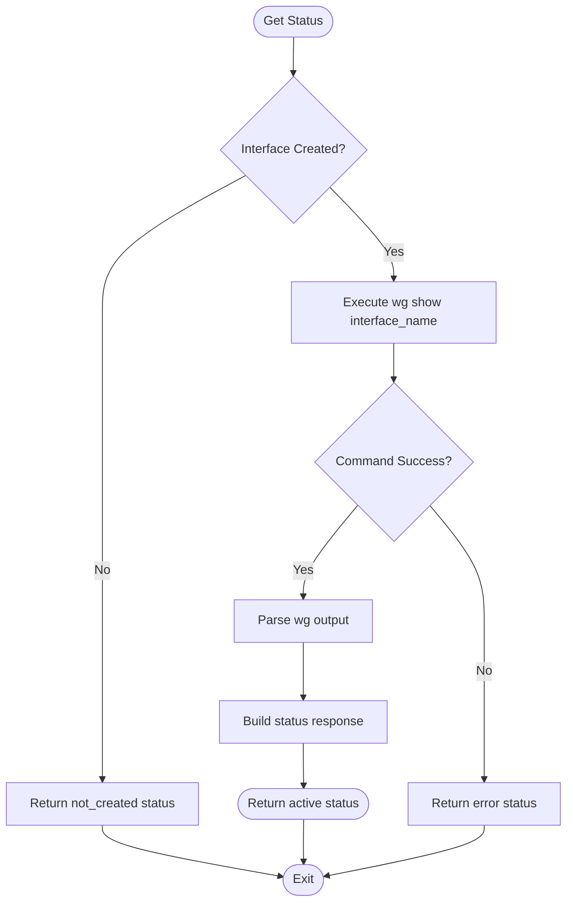

**Diagram sources**
- [network.py](file://core/network.py#L445-L463)

**Section sources**
- [network.py](file://core/network.py#L445-L463)

#### Latency Measurement Capabilities
The measure_latency() method implements platform-aware ping-based latency measurement:

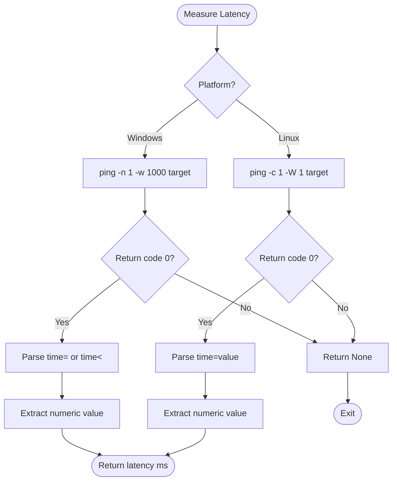

**Diagram sources**
- [network.py](file://core/network.py#L340-L391)

**Section sources**
- [network.py](file://core/network.py#L340-L391)

### Configuration File Generation
The system generates platform-specific configuration files during Windows interface creation:

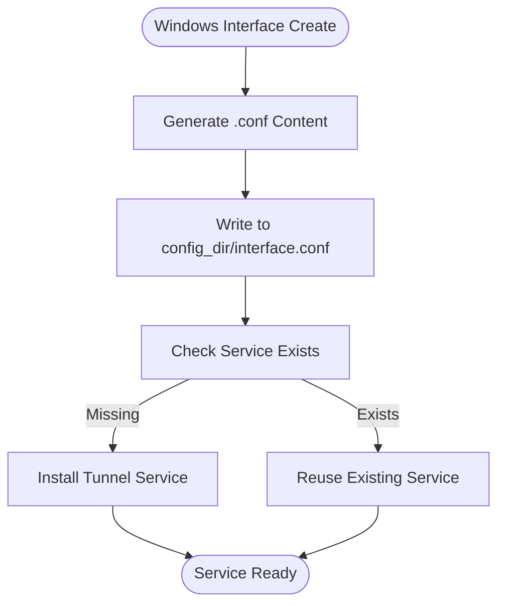

**Diagram sources**
- [network.py](file://core/network.py#L172-L235)

Configuration characteristics:
- Private key injection for authentication
- Static IP assignment (10.66.0.1/16)
- Default listening port (51820)
- Automatic service management

**Section sources**
- [network.py](file://core/network.py#L172-L235)

### Key Persistence Strategies
The system implements secure key storage with platform-specific permissions:

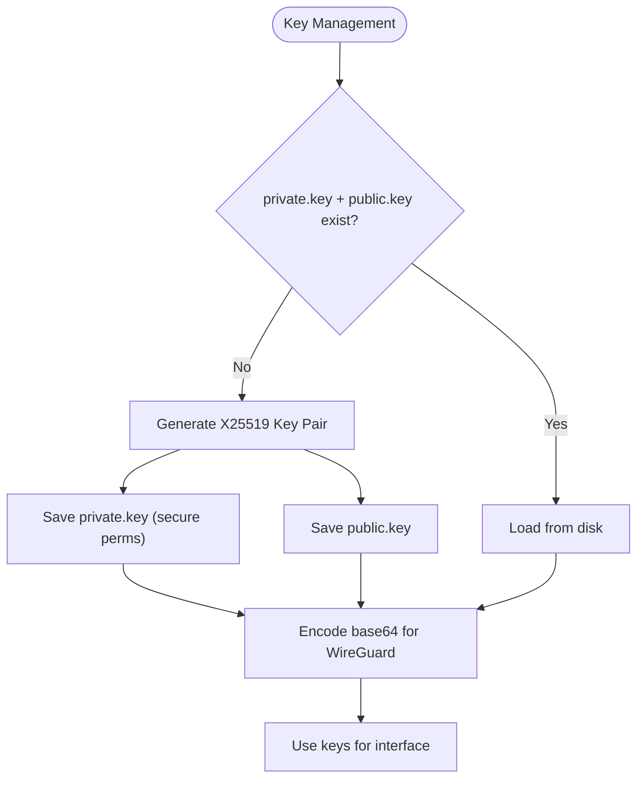

**Diagram sources**
- [network.py](file://core/network.py#L123-L160)

Security measures:
- Private key file permissions restricted to owner-only (Unix)
- Base64 encoding for WireGuard configuration compatibility
- Separate directories for configuration and keys

**Section sources**
- [network.py](file://core/network.py#L123-L160)

### Cleanup Procedures
The cleanup() method ensures complete resource de-allocation:

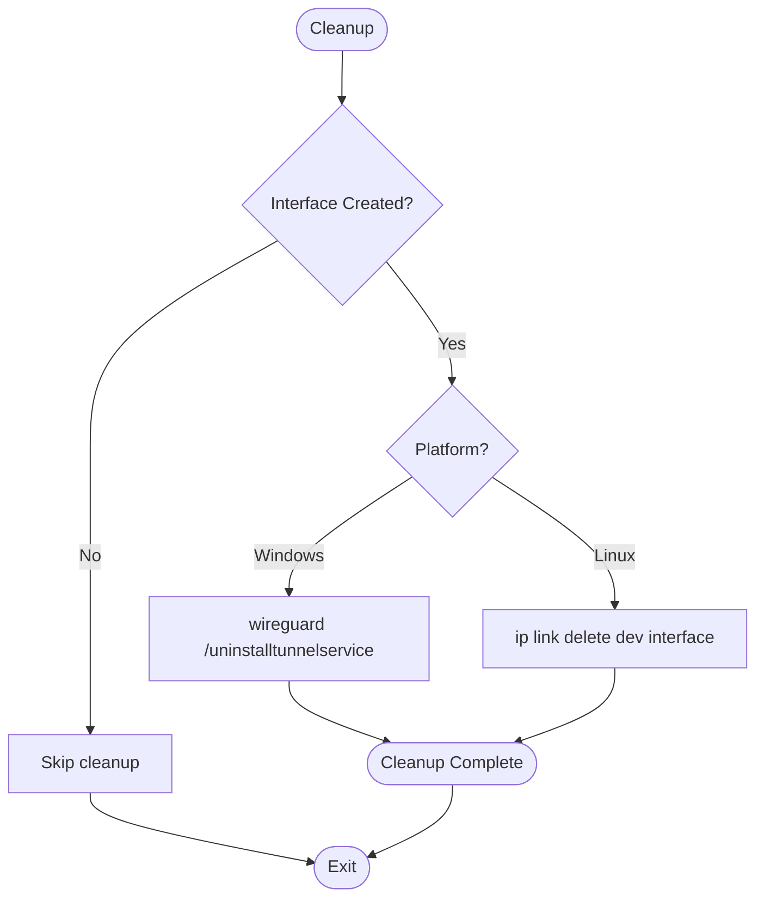

**Diagram sources**
- [network.py](file://core/network.py#L464-L482)

**Section sources**
- [network.py](file://core/network.py#L464-L482)

## Dependency Analysis
The NetworkManager class exhibits strong cohesion around WireGuard operations while maintaining loose coupling with external dependencies:

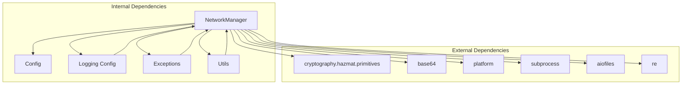

**Diagram sources**
- [network.py](file://core/network.py#L3-L16)
- [network.py](file://core/network.py#L25-L41)
- [logging_config.py](file://core/logging_config.py#L157-L166)
- [exceptions.py](file://core/exceptions.py#L68-L71)
- [utils.py](file://core/utils.py#L12-L39)

Key dependency characteristics:
- Cryptography library for X25519 key generation
- Async file operations for logging and configuration
- Platform detection for cross-platform compatibility
- Regular expressions for output parsing

**Section sources**
- [network.py](file://core/network.py#L3-L16)
- [network.py](file://core/network.py#L25-L41)
- [logging_config.py](file://core/logging_config.py#L157-L166)
- [exceptions.py](file://core/exceptions.py#L68-L71)
- [utils.py](file://core/utils.py#L12-L39)

## Performance Considerations
The implementation incorporates several performance optimization strategies:

- Asynchronous command execution prevents blocking operations
- Timing decorators provide performance metrics for critical operations
- Structured logging enables efficient monitoring and debugging
- Efficient key encoding reduces configuration overhead
- Platform-specific optimizations minimize system calls

Performance characteristics:
- Non-blocking interface creation and peer management
- Minimal CPU overhead through optimized subprocess handling
- Efficient logging with asynchronous file I/O
- Predictable timeout behavior for reliable operation

## Troubleshooting Guide

### Common Installation Issues
**WireGuard Not Found**
- Verify platform-specific installation requirements
- Check PATH configuration for command availability
- Confirm proper installation completion

**Permission Denied**
- Ensure administrator/root privileges for interface creation
- Verify sudo configuration for Linux systems
- Check Windows UAC settings and elevation requirements

**Interface Already Exists**
- Clean up existing interfaces before recreation
- Windows: Use uninstall tunnel service command
- Linux: Delete conflicting network interfaces

### Command Execution Failures
**Timeout Errors**
- Increase timeout values for slow systems
- Check system resource availability
- Verify command syntax and arguments

**Command Validation Failures**
- Review return codes and error output
- Validate command availability and permissions
- Check for conflicting processes

### Peer Connectivity Issues
**Latency Measurement Failures**
- Verify network connectivity to target
- Check firewall configurations for ICMP
- Test with alternative target addresses

**Peer Unreachable**
- Validate endpoint configuration
- Check NAT traversal settings
- Verify port accessibility (UDP 51820)

### Operational Diagnostics
**Enable Debug Logging**
- Set environment variable for increased verbosity
- Monitor network.log for detailed operation traces
- Use structured logging for correlation analysis

**WireGuard Status Verification**
- Use wg show commands for interface inspection
- Check peer connection states and statistics
- Validate configuration correctness

**Section sources**
- [WIREGUARD_SETUP.md](file://docs/WIREGUARD_SETUP.md#L166-L224)
- [TROUBLESHOOTING.md](file://docs/TROUBLESHOOTING.md#L171-L226)
- [TROUBLESHOOTING.md](file://docs/TROUBLESHOOTING.md#L251-L281)
- [TROUBLESHOOTING.md](file://docs/TROUBLESHOOTING.md#L284-L310)
- [TROUBLESHOOTING.md](file://docs/TROUBLESHOOTING.md#L758-L769)

## Conclusion
The WireGuard interface management system provides a robust, cross-platform solution for virtual networking in LANrage. The NetworkManager class delivers comprehensive functionality through carefully designed abstractions, secure cryptographic operations, and resilient error handling. The implementation demonstrates strong architectural principles with clear separation of concerns, comprehensive logging, and extensive platform support. The system is production-ready with thorough testing, documentation, and troubleshooting resources to support reliable deployment and operation.