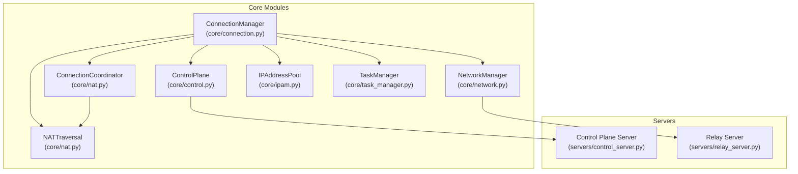
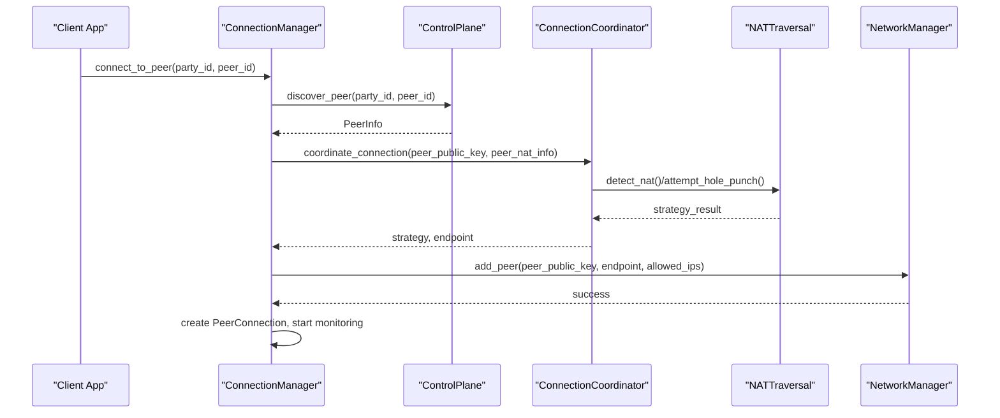
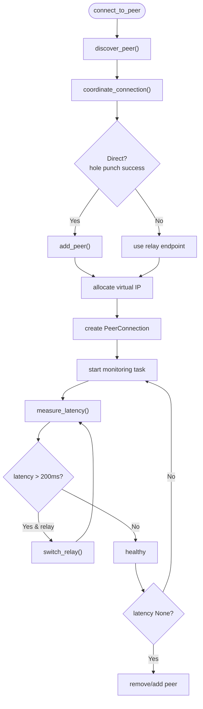
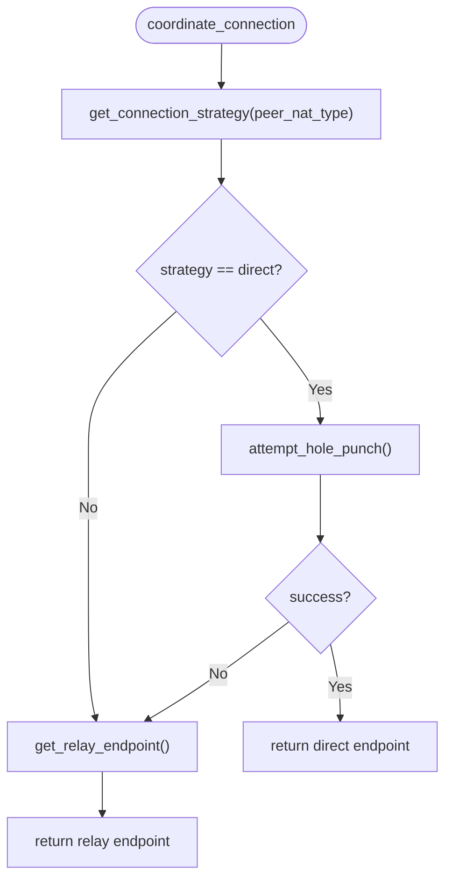
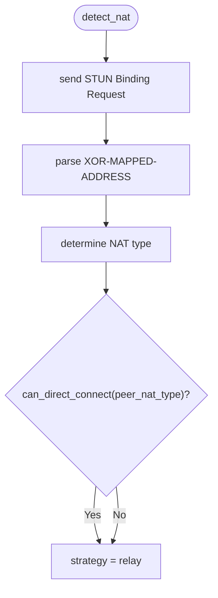
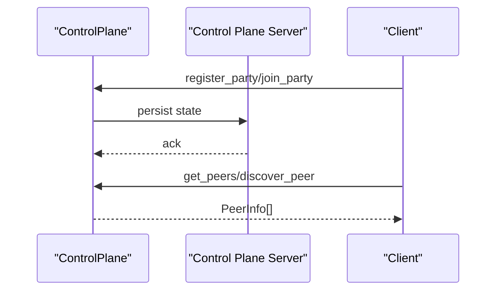
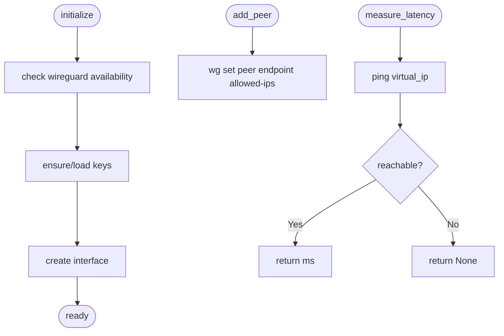
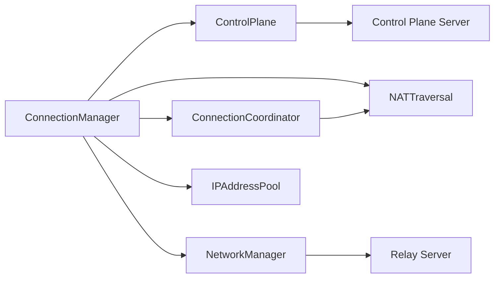
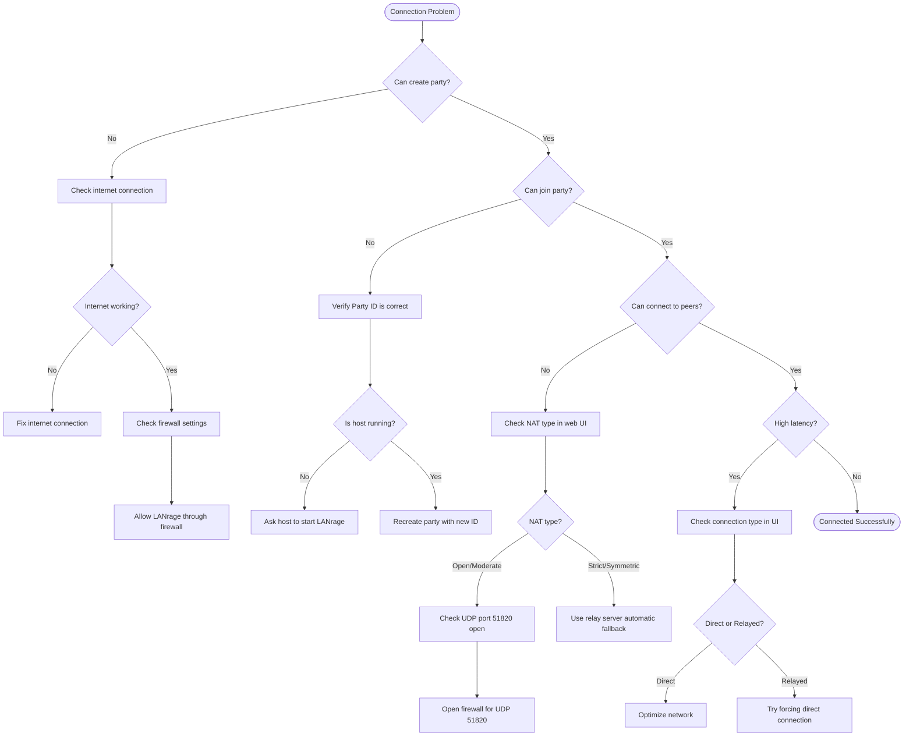

# Mesh Networking Orchestration

<cite>
**Referenced Files in This Document**
- [connection.py](file://core/connection.py)
- [nat.py](file://core/nat.py)
- [control.py](file://core/control.py)
- [network.py](file://core/network.py)
- [ipam.py](file://core/ipam.py)
- [task_manager.py](file://core/task_manager.py)
- [control_server.py](file://servers/control_server.py)
- [relay_server.py](file://servers/relay_server.py)
- [NAT_TRAVERSAL.md](file://docs/NAT_TRAVERSAL.md)
- [CONNECTION.md](file://docs/CONNECTION.md)
- [CONTROL_PLANE.md](file://docs/CONTROL_PLANE.md)
- [TROUBLESHOOTING.md](file://docs/TROUBLESHOOTING.md)
- [test_nat.py](file://tests/test_nat.py)
- [test_connection.py](file://tests/test_connection.py)
</cite>

## Table of Contents
1. [Introduction](#introduction)
2. [Project Structure](#project-structure)
3. [Core Components](#core-components)
4. [Architecture Overview](#architecture-overview)
5. [Detailed Component Analysis](#detailed-component-analysis)
6. [Dependency Analysis](#dependency-analysis)
7. [Performance Considerations](#performance-considerations)
8. [Troubleshooting Guide](#troubleshooting-guide)
9. [Conclusion](#conclusion)
10. [Appendices](#appendices)

## Introduction
This document explains the mesh networking orchestration system that establishes and manages peer-to-peer connections across NAT boundaries. It covers NAT compatibility, direct connection strategies, the ConnectionCoordinator role, peer discovery via the control plane, connection quality monitoring, adaptive switching, fallback to relay connections, state management, reconnection strategies, and topology optimization. Practical examples and troubleshooting guidance are included to help diagnose and resolve common issues.

## Project Structure
The mesh orchestration spans several modules:
- Connection orchestration and monitoring
- NAT traversal and strategy selection
- Control plane for peer discovery and signaling
- WireGuard network management and latency measurement
- IP address management for virtual networks
- Background task management
- Control plane server and relay server implementations

**Diagram sources**
- [connection.py](file://core/connection.py#L18-L125)
- [nat.py](file://core/nat.py#L330-L378)
- [control.py](file://core/control.py#L187-L346)
- [network.py](file://core/network.py#L25-L94)
- [ipam.py](file://core/ipam.py#L10-L32)
- [task_manager.py](file://core/task_manager.py#L11-L58)
- [control_server.py](file://servers/control_server.py#L36-L98)
- [relay_server.py](file://servers/relay_server.py#L30-L80)

**Section sources**
- [connection.py](file://core/connection.py#L18-L125)
- [nat.py](file://core/nat.py#L330-L378)
- [control.py](file://core/control.py#L187-L346)
- [network.py](file://core/network.py#L25-L94)
- [ipam.py](file://core/ipam.py#L10-L32)
- [task_manager.py](file://core/task_manager.py#L11-L58)
- [control_server.py](file://servers/control_server.py#L36-L98)
- [relay_server.py](file://servers/relay_server.py#L30-L80)

## Core Components
- ConnectionManager: Orchestrates peer connection lifecycle, strategy selection, WireGuard configuration, and monitoring.
- ConnectionCoordinator: Determines optimal connection strategy (direct vs relay) and coordinates NAT traversal.
- NATTraversal: Detects NAT type, performs STUN queries, and attempts UDP hole punching.
- ControlPlane: Provides peer discovery, party management, and signaling.
- NetworkManager: Manages WireGuard interface, peer configuration, and latency measurement.
- IPAddressPool: Allocates deterministic virtual IPs for peers.
- TaskManager: Tracks and manages background tasks for monitoring and cleanup.
- Control Plane Server and Relay Server: Centralized discovery and relay forwarding services.

**Section sources**
- [connection.py](file://core/connection.py#L18-L125)
- [nat.py](file://core/nat.py#L330-L378)
- [control.py](file://core/control.py#L187-L346)
- [network.py](file://core/network.py#L25-L94)
- [ipam.py](file://core/ipam.py#L10-L32)
- [task_manager.py](file://core/task_manager.py#L11-L58)
- [control_server.py](file://servers/control_server.py#L36-L98)
- [relay_server.py](file://servers/relay_server.py#L30-L80)

## Architecture Overview
The orchestration integrates discovery, strategy selection, and connectivity management:

**Diagram sources**
- [connection.py](file://core/connection.py#L39-L125)
- [nat.py](file://core/nat.py#L337-L378)
- [control.py](file://core/control.py#L331-L345)
- [network.py](file://core/network.py#L392-L420)

**Section sources**
- [connection.py](file://core/connection.py#L39-L125)
- [nat.py](file://core/nat.py#L337-L378)
- [control.py](file://core/control.py#L331-L345)
- [network.py](file://core/network.py#L392-L420)

## Detailed Component Analysis

### ConnectionManager: Orchestration and Monitoring
- Discovers peers via ControlPlane, selects strategy via ConnectionCoordinator, configures WireGuard, assigns virtual IPs, and starts monitoring tasks.
- Monitors latency, attempts reconnection, and switches relays when latency exceeds thresholds.
- Implements cleanup for failed connections after a timeout.

**Diagram sources**
- [connection.py](file://core/connection.py#L39-L125)
- [connection.py](file://core/connection.py#L213-L305)
- [connection.py](file://core/connection.py#L334-L437)

**Section sources**
- [connection.py](file://core/connection.py#L39-L125)
- [connection.py](file://core/connection.py#L213-L305)
- [connection.py](file://core/connection.py#L334-L437)
- [CONNECTION.md](file://docs/CONNECTION.md#L156-L210)

### ConnectionCoordinator: Strategy Selection and Relay Coordination
- Determines whether to use direct P2P or relay based on NAT compatibility.
- Attempts UDP hole punching for direct connections; falls back to relay if needed.
- Discovers and measures relay latency to select the best relay endpoint.

**Diagram sources**
- [nat.py](file://core/nat.py#L337-L378)
- [nat.py](file://core/nat.py#L371-L378)
- [nat.py](file://core/nat.py#L379-L398)

**Section sources**
- [nat.py](file://core/nat.py#L337-L378)
- [nat.py](file://core/nat.py#L371-L378)
- [nat.py](file://core/nat.py#L379-L398)
- [NAT_TRAVERSAL.md](file://docs/NAT_TRAVERSAL.md#L219-L276)

### NATTraversal: NAT Detection and Hole Punching
- Detects NAT type using STUN against multiple public servers.
- Determines compatibility for direct P2P and selects connection strategy.
- Performs UDP hole punching with synchronized packet bursts.

**Diagram sources**
- [nat.py](file://core/nat.py#L64-L106)
- [nat.py](file://core/nat.py#L107-L179)
- [nat.py](file://core/nat.py#L295-L322)

**Section sources**
- [nat.py](file://core/nat.py#L64-L106)
- [nat.py](file://core/nat.py#L107-L179)
- [nat.py](file://core/nat.py#L295-L322)
- [NAT_TRAVERSAL.md](file://docs/NAT_TRAVERSAL.md#L53-L145)

### ControlPlane: Peer Discovery and Signaling
- Manages parties and peers, persists state, and supports local and remote modes.
- Provides discovery APIs and heartbeat maintenance for liveness.

**Diagram sources**
- [control.py](file://core/control.py#L228-L268)
- [control.py](file://core/control.py#L311-L345)
- [control_server.py](file://servers/control_server.py#L292-L398)

**Section sources**
- [control.py](file://core/control.py#L228-L268)
- [control.py](file://core/control.py#L311-L345)
- [control_server.py](file://servers/control_server.py#L292-L398)
- [CONTROL_PLANE.md](file://docs/CONTROL_PLANE.md#L107-L243)

### NetworkManager: WireGuard and Latency Measurement
- Initializes WireGuard interface, manages peers, and measures latency via ICMP ping.
- Adds persistent keepalive for NAT traversal robustness.

**Diagram sources**
- [network.py](file://core/network.py#L70-L94)
- [network.py](file://core/network.py#L123-L160)
- [network.py](file://core/network.py#L392-L420)
- [network.py](file://core/network.py#L340-L391)

**Section sources**
- [network.py](file://core/network.py#L70-L94)
- [network.py](file://core/network.py#L123-L160)
- [network.py](file://core/network.py#L392-L420)
- [network.py](file://core/network.py#L340-L391)

### IPAddressPool: Deterministic Virtual IP Allocation
- Allocates unique virtual IPs per peer from a managed subnet, avoiding reserved addresses and expanding subnets as needed.

**Section sources**
- [ipam.py](file://core/ipam.py#L55-L98)
- [ipam.py](file://core/ipam.py#L99-L118)

### TaskManager: Background Task Lifecycle
- Tracks tasks, registers completion callbacks, cancels gracefully, and ensures cleanup on shutdown.

**Section sources**
- [task_manager.py](file://core/task_manager.py#L37-L79)
- [task_manager.py](file://core/task_manager.py#L80-L109)

### Relay Server: Stateless Packet Forwarding
- Stateless UDP relay that forwards encrypted WireGuard packets between peers who cannot connect directly.
- Tracks clients, cleans up stale entries, and prints periodic stats.

**Section sources**
- [relay_server.py](file://servers/relay_server.py#L48-L80)
- [relay_server.py](file://servers/relay_server.py#L85-L138)
- [relay_server.py](file://servers/relay_server.py#L189-L222)

## Dependency Analysis
Key dependencies and interactions:
- ConnectionManager depends on ControlPlane for peer discovery, ConnectionCoordinator for strategy, NATTraversal for compatibility, NetworkManager for WireGuard operations, and IPAM for virtual IP allocation.
- ConnectionCoordinator depends on NATTraversal for strategy decisions and on ControlPlane client for relay discovery.
- NetworkManager depends on OS commands for WireGuard operations and uses ICMP for latency measurement.
- ControlPlane persists state and coordinates with Control Plane Server for centralized discovery.
- Relay Server provides forwarding for relayed connections.

**Diagram sources**
- [connection.py](file://core/connection.py#L21-L33)
- [nat.py](file://core/nat.py#L333-L336)
- [control.py](file://core/control.py#L196-L207)
- [network.py](file://core/network.py#L28-L37)
- [control_server.py](file://servers/control_server.py#L36-L38)
- [relay_server.py](file://servers/relay_server.py#L38-L42)

**Section sources**
- [connection.py](file://core/connection.py#L21-L33)
- [nat.py](file://core/nat.py#L333-L336)
- [control.py](file://core/control.py#L196-L207)
- [network.py](file://core/network.py#L28-L37)
- [control_server.py](file://servers/control_server.py#L36-L38)
- [relay_server.py](file://servers/relay_server.py#L38-L42)

## Performance Considerations
- Connection establishment: Direct (~1–2s), relay (~2–3s), with hole punch adding ~1–2s overhead.
- Monitoring: 30s intervals, minimal CPU and network overhead per peer.
- Reconnection: Up to 3 attempts with 5s delays between attempts.
- Latency thresholds: <200ms considered healthy; triggers relay switching when exceeded on relay connections.
- Keepalive: Persistent keepalive set to 25s to maintain NAT mappings.

**Section sources**
- [CONNECTION.md](file://docs/CONNECTION.md#L375-L393)
- [network.py](file://core/network.py#L411-L413)
- [connection.py](file://core/connection.py#L213-L305)

## Troubleshooting Guide
Common issues and resolutions:
- NAT detection failures: Check firewall, test STUN servers, and retry on different networks.
- Hole punching failures: Automatic relay fallback; try different networks or NAT configurations.
- Relay slowness: Use closer relays, deploy more relays, or switch to direct when feasible.
- WireGuard interface problems: Install WireGuard, run with elevated privileges, and verify configuration.
- Connection timeouts: Verify firewall rules allow UDP 51820 and check NAT type.

**Diagram sources**
- [TROUBLESHOOTING.md](file://docs/TROUBLESHOOTING.md#L11-L50)

**Section sources**
- [TROUBLESHOOTING.md](file://docs/TROUBLESHOOTING.md#L11-L50)
- [TROUBLESHOOTING.md](file://docs/TROUBLESHOOTING.md#L372-L462)
- [NAT_TRAVERSAL.md](file://docs/NAT_TRAVERSAL.md#L486-L523)

## Conclusion
The mesh networking orchestration integrates discovery, NAT-aware strategy selection, and adaptive connection management to deliver reliable peer-to-peer connectivity. Through deterministic virtual IP allocation, continuous monitoring, and automatic reconnection and relay switching, the system maintains low-latency, resilient connections across diverse NAT environments. The modular design enables scalable deployment via centralized control and relay infrastructure.

## Appendices

### NAT Compatibility Matrix and Direct Connection Strategies
- Open NAT: Direct P2P to any peer.
- Full Cone: Direct P2P to compatible peers.
- Restricted/Port-Restricted Cone: Direct P2P with coordinated hole punching.
- Symmetric: Direct P2P not possible; requires relay.

**Section sources**
- [NAT_TRAVERSAL.md](file://docs/NAT_TRAVERSAL.md#L112-L122)
- [nat.py](file://core/nat.py#L295-L322)

### Example Scenarios
- Direct P2P establishment: ControlPlane discovery → ConnectionCoordinator strategy "direct" → NATTraversal hole punch → NetworkManager add_peer → monitoring begins.
- Relay fallback: ControlPlane discovery → ConnectionCoordinator strategy "relay" → best relay selected → NetworkManager add_peer → monitoring and adaptive switching.

**Section sources**
- [connection.py](file://core/connection.py#L39-L125)
- [nat.py](file://core/nat.py#L337-L378)
- [CONNECTION.md](file://docs/CONNECTION.md#L250-L297)

### Testing References
- NAT traversal tests validate STUN and strategy decisions.
- Connection tests validate orchestration and network integration.

**Section sources**
- [test_nat.py](file://tests/test_nat.py#L20-L100)
- [test_connection.py](file://tests/test_connection.py#L59-L121)