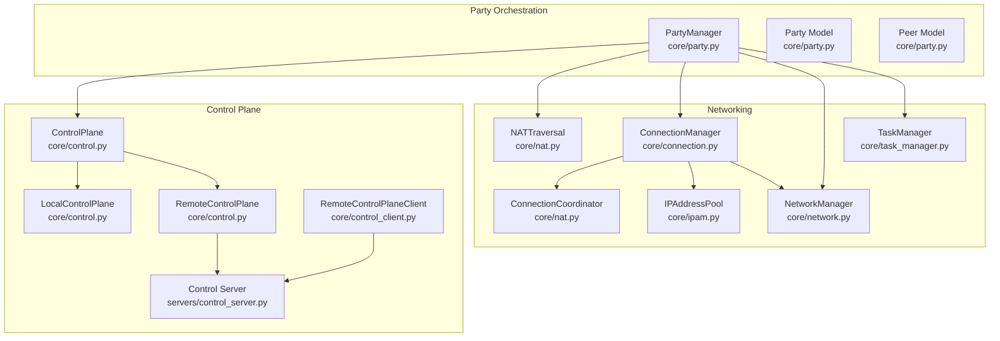
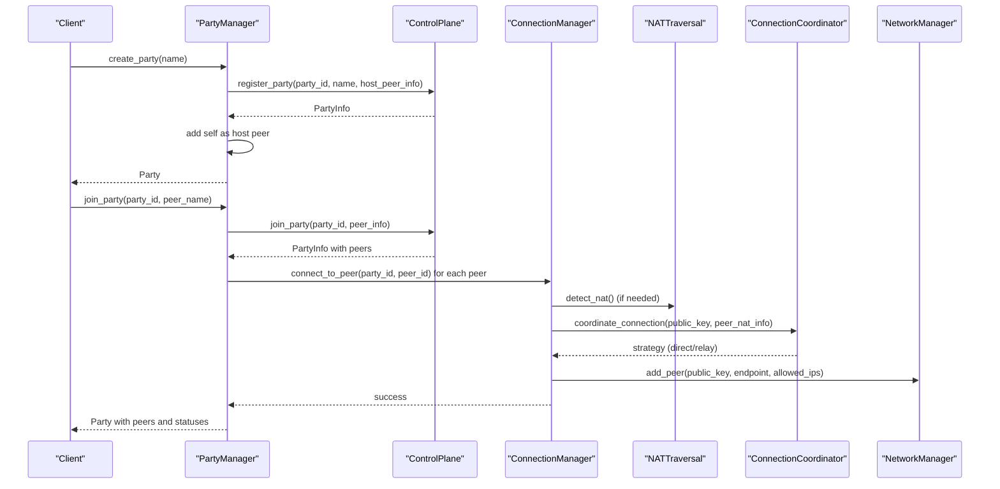
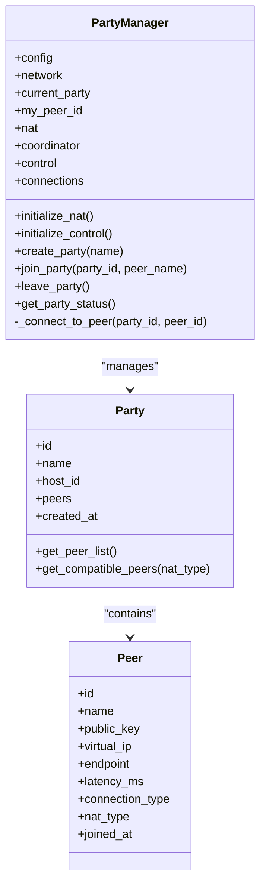
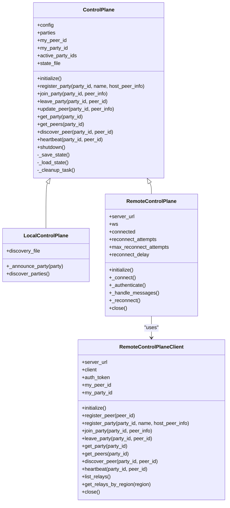
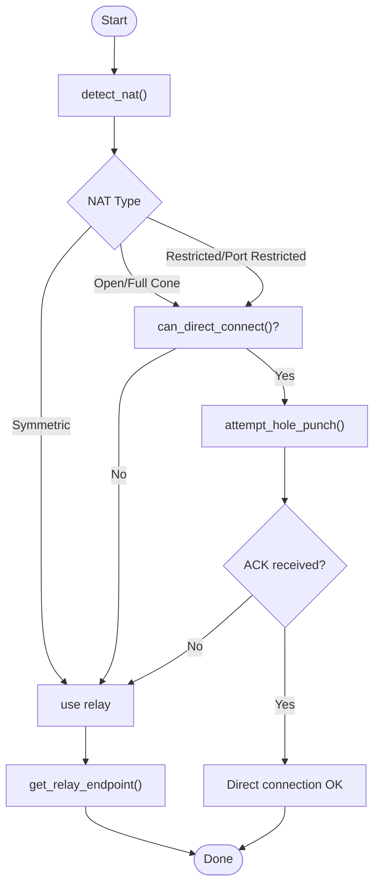
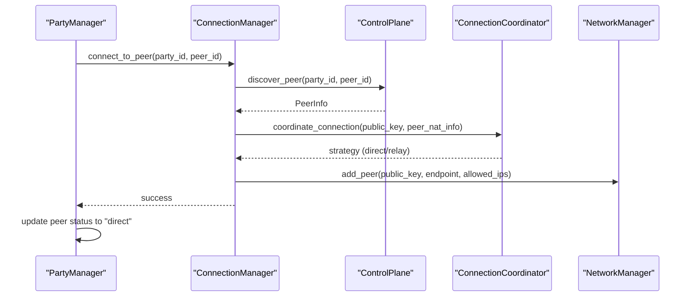
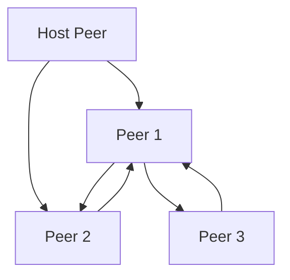
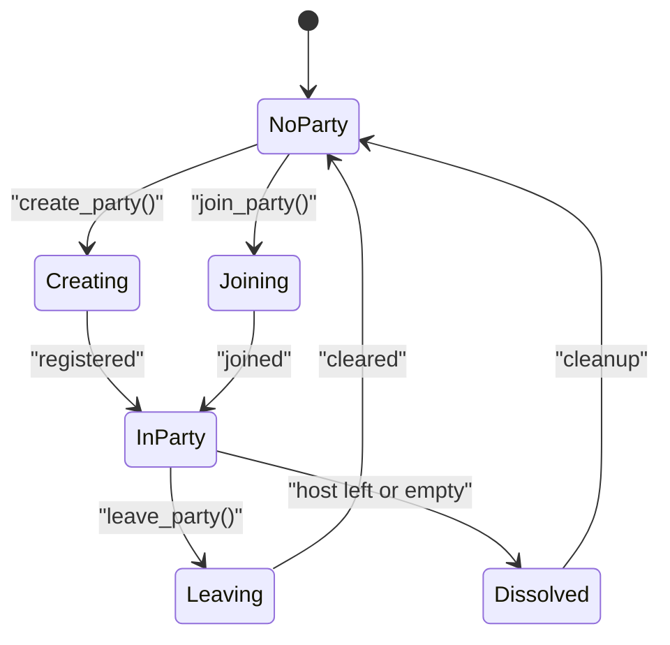
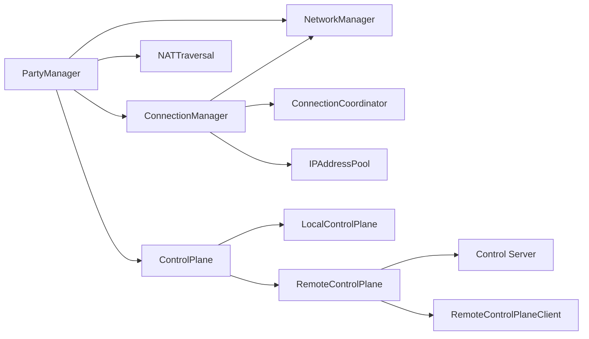

# Party Coordination

<cite>
**Referenced Files in This Document**
- [party.py](file://core/party.py)
- [control.py](file://core/control.py)
- [control_client.py](file://core/control_client.py)
- [nat.py](file://core/nat.py)
- [network.py](file://core/network.py)
- [connection.py](file://core/connection.py)
- [ipam.py](file://core/ipam.py)
- [task_manager.py](file://core/task_manager.py)
- [control_server.py](file://servers/control_server.py)
- [test_party.py](file://tests/test_party.py)
- [PARTY.md](file://docs/PARTY.md)
- [CONTROL_PLANE.md](file://docs/CONTROL_PLANE.md)
</cite>

## Table of Contents
1. [Introduction](#introduction)
2. [Project Structure](#project-structure)
3. [Core Components](#core-components)
4. [Architecture Overview](#architecture-overview)
5. [Detailed Component Analysis](#detailed-component-analysis)
6. [Dependency Analysis](#dependency-analysis)
7. [Performance Considerations](#performance-considerations)
8. [Troubleshooting Guide](#troubleshooting-guide)
9. [Conclusion](#conclusion)
10. [Appendices](#appendices)

## Introduction
This document describes LANrage’s party coordination system with a focus on mesh networking orchestration, peer discovery, and session persistence. It explains how PartyManager creates and manages parties, coordinates peer connections, and integrates with the control plane for discovery and NAT traversal. It also covers mesh topology, direct P2P connection establishment, session state management, lifecycle events (creation, joining, leaving, dissolution), and resilience strategies for NAT compatibility, network partitions, and peer connectivity issues.

## Project Structure
The party coordination system spans several modules:
- Party management and orchestration
- Control plane for peer discovery and signaling
- NAT traversal and connection coordination
- WireGuard network management and latency measurement
- Connection orchestration and monitoring
- IP address management for virtual LANs
- Background task management
- Control plane server implementation

**Diagram sources**
- [party.py](file://core/party.py#L102-L304)
- [control.py](file://core/control.py#L187-L456)
- [control_client.py](file://core/control_client.py#L23-L438)
- [nat.py](file://core/nat.py#L41-L525)
- [connection.py](file://core/connection.py#L18-L493)
- [network.py](file://core/network.py#L25-L515)
- [ipam.py](file://core/ipam.py#L10-L183)
- [task_manager.py](file://core/task_manager.py#L11-L167)
- [control_server.py](file://servers/control_server.py#L1-L729)

**Section sources**
- [party.py](file://core/party.py#L1-L304)
- [control.py](file://core/control.py#L1-L880)
- [nat.py](file://core/nat.py#L1-L525)
- [connection.py](file://core/connection.py#L1-L493)
- [network.py](file://core/network.py#L1-L515)
- [ipam.py](file://core/ipam.py#L1-L183)
- [task_manager.py](file://core/task_manager.py#L1-L167)
- [control_client.py](file://core/control_client.py#L1-L438)
- [control_server.py](file://servers/control_server.py#L1-L729)

## Core Components
- PartyManager: Creates, joins, and leaves parties; initializes NAT and control; orchestrates peer connections; measures latency; exposes status.
- Party and Peer models: Typed data structures for party metadata and peer identity, NAT type, and connection state.
- ControlPlane: Local and remote implementations for peer discovery, party registry, heartbeat, and persistence.
- NATTraversal and ConnectionCoordinator: NAT detection, compatibility checks, and connection strategy selection (direct vs relay).
- ConnectionManager: Orchestrates peer connection setup, monitoring, reconnection, and cleanup; integrates with IPAM and NetworkManager.
- NetworkManager: WireGuard interface lifecycle, key management, peer addition/removal, latency measurement.
- IPAddressPool: Deterministic virtual IP allocation across a virtual LAN subnet.
- TaskManager: Background task lifecycle management for monitoring and cleanup.

**Section sources**
- [party.py](file://core/party.py#L102-L304)
- [control.py](file://core/control.py#L187-L456)
- [nat.py](file://core/nat.py#L41-L525)
- [connection.py](file://core/connection.py#L18-L493)
- [network.py](file://core/network.py#L25-L515)
- [ipam.py](file://core/ipam.py#L10-L183)
- [task_manager.py](file://core/task_manager.py#L11-L167)

## Architecture Overview
The system follows a layered architecture:
- Presentation and orchestration: PartyManager coordinates lifecycle and status.
- Control plane: Provides peer discovery, party registry, and persistence.
- Networking: WireGuard virtual LAN with NAT traversal and connection coordination.
- Infrastructure: Background tasks for monitoring and cleanup.

**Diagram sources**
- [party.py](file://core/party.py#L159-L247)
- [control.py](file://core/control.py#L228-L294)
- [connection.py](file://core/connection.py#L38-L125)
- [nat.py](file://core/nat.py#L64-L328)
- [network.py](file://core/network.py#L392-L420)

## Detailed Component Analysis

### PartyManager
PartyManager is the central orchestrator for party lifecycle and peer coordination:
- Initialization: Initializes NAT traversal and control plane, then sets up ConnectionManager.
- Party creation: Generates a unique party ID, registers with control plane, adds host as first peer, and sets current party.
- Joining: Retrieves party info from control plane, converts to local format, connects to existing peers, and updates current party.
- Leaving: Disconnects from peers, leaves via control plane, clears current party.
- Status: Measures latency for peers, collects NAT info, and returns structured status.

**Diagram sources**
- [party.py](file://core/party.py#L102-L304)

**Section sources**
- [party.py](file://core/party.py#L102-L304)
- [PARTY.md](file://docs/PARTY.md#L89-L256)

### Control Plane
The control plane provides peer discovery and party registry:
- Local mode: File-based persistence and discovery for same-LAN testing.
- Remote mode: WebSocket client to a centralized server with heartbeat and reconnection.
- Data models: PeerInfo and PartyInfo with serialization/deserialization helpers.
- Persistence: Batched writes to reduce disk I/O; periodic cleanup of stale peers and parties.

**Diagram sources**
- [control.py](file://core/control.py#L187-L456)
- [control_client.py](file://core/control_client.py#L23-L438)
- [control_server.py](file://servers/control_server.py#L1-L729)

**Section sources**
- [control.py](file://core/control.py#L187-L456)
- [control_client.py](file://core/control_client.py#L23-L438)
- [control_server.py](file://servers/control_server.py#L1-L729)
- [CONTROL_PLANE.md](file://docs/CONTROL_PLANE.md#L81-L429)

### NAT Traversal and Connection Coordination
NATTraversal detects NAT type and performs UDP hole punching. ConnectionCoordinator selects the best strategy (direct or relay) based on NAT compatibility and availability of relays.

**Diagram sources**
- [nat.py](file://core/nat.py#L64-L328)

**Section sources**
- [nat.py](file://core/nat.py#L41-L525)
- [PARTY.md](file://docs/PARTY.md#L294-L313)

### Connection Orchestration
ConnectionManager coordinates peer connection setup, monitors health, and performs automatic reconnection and relay switching.

**Diagram sources**
- [connection.py](file://core/connection.py#L38-L125)
- [nat.py](file://core/nat.py#L330-L398)
- [network.py](file://core/network.py#L392-L420)

**Section sources**
- [connection.py](file://core/connection.py#L18-L493)
- [PARTY.md](file://docs/PARTY.md#L294-L313)

### Mesh Topology and Peer-to-Peer Establishment
- Mesh: Each peer connects to others; PartyManager initiates connections to all existing peers upon joining.
- Compatibility: Party.get_compatible_peers filters peers based on NAT compatibility matrix.
- Endpoint negotiation: ConnectionCoordinator determines endpoint (direct or relay) and ConnectionManager applies it to WireGuard.

**Diagram sources**
- [party.py](file://core/party.py#L69-L99)
- [party.py](file://core/party.py#L198-L247)

**Section sources**
- [party.py](file://core/party.py#L69-L99)
- [party.py](file://core/party.py#L198-L247)

### Session State Management and Persistence
- Control plane persistence: LocalControlPlane batches writes to a JSON file; RemoteControlPlane persists state via HTTP endpoints.
- Cleanup: Periodic cleanup removes stale peers and empty parties.
- Reliability: Heartbeat keeps peers alive; automatic reconnection and relay switching improve resilience.

**Section sources**
- [control.py](file://core/control.py#L19-L113)
- [control.py](file://core/control.py#L378-L410)
- [control_server.py](file://servers/control_server.py#L180-L213)

### Party Lifecycle
- Creation: PartyManager generates party ID, registers with control plane, adds host peer, and sets current party.
- Joining: PartyManager retrieves party info, converts to local format, connects to existing peers, and updates current party.
- Leaving: PartyManager disconnects from peers, leaves via control plane, and clears current party.
- Dissolution: Control plane deletes party when host leaves or no peers remain.

**Diagram sources**
- [party.py](file://core/party.py#L159-L261)
- [control.py](file://core/control.py#L269-L294)

**Section sources**
- [party.py](file://core/party.py#L159-L261)
- [control.py](file://core/control.py#L269-L294)

### Party Synchronization, Conflict Resolution, and Graceful Degradation
- Synchronization: Control plane maintains consistent party membership; RemoteControlPlaneClient heartbeats keep peers alive.
- Conflict resolution: On NAT incompatibility, strategy falls back to relay; on latency spikes, relay switching occurs.
- Graceful degradation: If NAT detection fails, system continues in relay-only mode; failed connections auto-clean after timeout.

**Section sources**
- [nat.py](file://core/nat.py#L121-L143)
- [connection.py](file://core/connection.py#L213-L333)
- [connection.py](file://core/connection.py#L334-L437)

### Common Scenarios
- Leader changes: Host leaves party; control plane deletes party if empty or host left; new host emerges from next join.
- Network partitioning: Heartbeat-driven cleanup removes stale peers; ConnectionManager monitors and reconnects.
- Peer connectivity issues: Automatic reconnection attempts; relay switching improves latency; failed connections auto-clean.

**Section sources**
- [control.py](file://core/control.py#L378-L410)
- [connection.py](file://core/connection.py#L213-L333)
- [connection.py](file://core/connection.py#L334-L437)

## Dependency Analysis
Key dependencies and relationships:
- PartyManager depends on ControlPlane, NATTraversal, ConnectionCoordinator, ConnectionManager, and NetworkManager.
- ConnectionManager depends on NATTraversal, ConnectionCoordinator, NetworkManager, and IPAddressPool.
- ControlPlane variants depend on persistence mechanisms and optional WebSocket client/server.

**Diagram sources**
- [party.py](file://core/party.py#L105-L120)
- [connection.py](file://core/connection.py#L21-L36)
- [control.py](file://core/control.py#L187-L208)
- [control_client.py](file://core/control_client.py#L23-L438)
- [control_server.py](file://servers/control_server.py#L1-L729)

**Section sources**
- [party.py](file://core/party.py#L105-L120)
- [connection.py](file://core/connection.py#L21-L36)
- [control.py](file://core/control.py#L187-L208)
- [control_client.py](file://core/control_client.py#L23-L438)
- [control_server.py](file://servers/control_server.py#L1-L729)

## Performance Considerations
- NAT detection and hole punching are asynchronous and bounded by timeouts.
- ConnectionManager monitors peers periodically and performs reconnection with exponential backoff.
- Batched state persistence reduces disk I/O; cleanup runs at fixed intervals.
- Latency measurement is on-demand to minimize overhead.

[No sources needed since this section provides general guidance]

## Troubleshooting Guide
- NAT detection failures: PartyManager logs warnings and continues in relay-only mode.
- Control plane unavailability: RemoteControlPlane falls back to local mode; RemoteControlPlaneClient retries with exponential backoff.
- Connection failures: ConnectionManager marks peers as failed and attempts reconnection; auto-cleans after timeout.
- Cleanup behavior: Stale peers and empty parties are removed by cleanup tasks.

**Section sources**
- [party.py](file://core/party.py#L134-L143)
- [control.py](file://core/control.py#L558-L622)
- [connection.py](file://core/connection.py#L213-L333)
- [control.py](file://core/control.py#L378-L410)

## Conclusion
LANrage’s party coordination system integrates a control plane for peer discovery and persistence, NAT traversal for connection strategy selection, and WireGuard for secure mesh networking. PartyManager orchestrates lifecycle events, while ConnectionManager and ConnectionCoordinator handle resilience and performance. The system supports graceful degradation, automatic cleanup, and scalable operation across local and remote environments.

[No sources needed since this section summarizes without analyzing specific files]

## Appendices

### API and Data Model References
- Party and Peer models: [Party](file://core/party.py#L58-L100), [Peer](file://core/party.py#L44-L56)
- Control plane models: [PeerInfo](file://core/control.py#L115-L152), [PartyInfo](file://core/control.py#L154-L180)
- NAT types and compatibility: [NATType](file://core/nat.py#L19-L28), [NAT compatibility matrix](file://core/party.py#L19-L41)

**Section sources**
- [party.py](file://core/party.py#L44-L100)
- [control.py](file://core/control.py#L115-L180)
- [nat.py](file://core/nat.py#L19-L41)

### Test Coverage
- Party compatibility filtering and NAT type handling: [test_party.py](file://tests/test_party.py#L43-L149)
- Party creation and NAT type inclusion: [test_party.py](file://tests/test_party.py#L160-L196)

**Section sources**
- [test_party.py](file://tests/test_party.py#L43-L196)