# Party Lifecycle Management

<cite>
**Referenced Files in This Document**
- [party.py](file://core/party.py)
- [control.py](file://core/control.py)
- [control_client.py](file://core/control_client.py)
- [connection.py](file://core/connection.py)
- [nat.py](file://core/nat.py)
- [network.py](file://core/network.py)
- [ipam.py](file://core/ipam.py)
- [exceptions.py](file://core/exceptions.py)
- [config.py](file://core/config.py)
- [PARTY.md](file://docs/PARTY.md)
- [TROUBLESHOOTING.md](file://docs/TROUBLESHOOTING.md)
- [test_party.py](file://tests/test_party.py)
</cite>

## Table of Contents
1. [Introduction](#introduction)
2. [Project Structure](#project-structure)
3. [Core Components](#core-components)
4. [Architecture Overview](#architecture-overview)
5. [Detailed Component Analysis](#detailed-component-analysis)
6. [Dependency Analysis](#dependency-analysis)
7. [Performance Considerations](#performance-considerations)
8. [Troubleshooting Guide](#troubleshooting-guide)
9. [Conclusion](#conclusion)
10. [Appendices](#appendices)

## Introduction
This document provides a comprehensive guide to party lifecycle management in LANrage, focusing on the end-to-end processes for creating, joining, leaving, and dissolving parties. It documents the PartyManager.create_party() method, the join_party() workflow, the leave_party() process, and the underlying mechanisms for state persistence, session timeout handling, and automatic cleanup. It also covers error handling for network failures, control plane unavailability, and peer disconnections, and includes practical examples and troubleshooting guidance.

## Project Structure
The party lifecycle is orchestrated by several core modules:
- Party management and orchestration: core/party.py
- Control plane (peer discovery/signaling): core/control.py and core/control_client.py
- Connection orchestration and NAT traversal: core/connection.py and core/nat.py
- Network/WireGuard integration: core/network.py
- IP address management: core/ipam.py
- Configuration and exceptions: core/config.py and core/exceptions.py

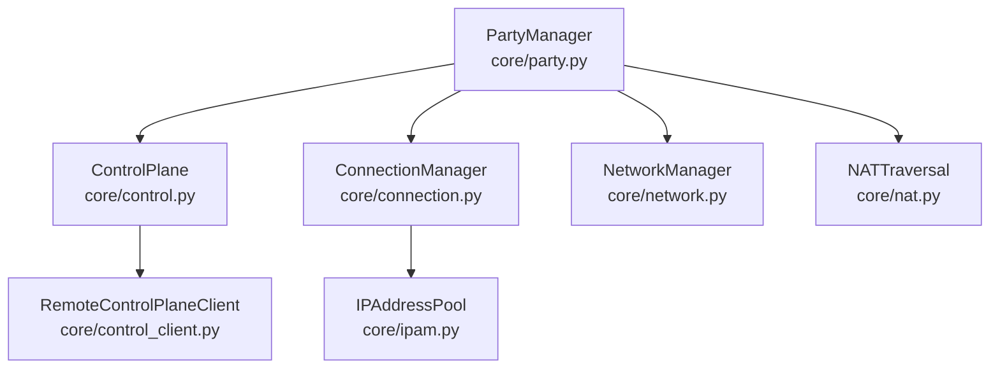

**Diagram sources**
- [party.py](file://core/party.py#L102-L304)
- [control.py](file://core/control.py#L187-L456)
- [connection.py](file://core/connection.py#L18-L493)
- [nat.py](file://core/nat.py#L41-L525)
- [network.py](file://core/network.py#L25-L515)
- [ipam.py](file://core/ipam.py#L10-L183)
- [control_client.py](file://core/control_client.py#L23-L438)

**Section sources**
- [party.py](file://core/party.py#L1-L304)
- [control.py](file://core/control.py#L1-L880)
- [connection.py](file://core/connection.py#L1-L493)
- [nat.py](file://core/nat.py#L1-L525)
- [network.py](file://core/network.py#L1-L515)
- [ipam.py](file://core/ipam.py#L1-L183)
- [control_client.py](file://core/control_client.py#L1-L438)

## Core Components
- PartyManager: Central orchestrator for party lifecycle, NAT initialization, control plane initialization, and peer connection management.
- ControlPlane: Local or remote control plane for peer discovery, signaling, and state persistence.
- ConnectionManager: Coordinates NAT traversal strategies, establishes WireGuard peers, monitors connections, and handles reconnection and cleanup.
- NATTraversal and ConnectionCoordinator: Determine connectivity strategies (direct vs relay), perform STUN-based NAT detection, and manage relay selection.
- NetworkManager: Manages WireGuard interface creation, key management, and latency measurement.
- IPAddressPool: Allocates and releases virtual IPs deterministically within a subnet.
- RemoteControlPlaneClient: HTTP client for centralized control plane server with heartbeat and retry logic.

**Section sources**
- [party.py](file://core/party.py#L102-L304)
- [control.py](file://core/control.py#L187-L456)
- [connection.py](file://core/connection.py#L18-L493)
- [nat.py](file://core/nat.py#L41-L525)
- [network.py](file://core/network.py#L25-L515)
- [ipam.py](file://core/ipam.py#L10-L183)
- [control_client.py](file://core/control_client.py#L23-L438)

## Architecture Overview
The party lifecycle integrates control plane registration, NAT traversal, and WireGuard peer configuration. The following sequence diagrams illustrate the key workflows.

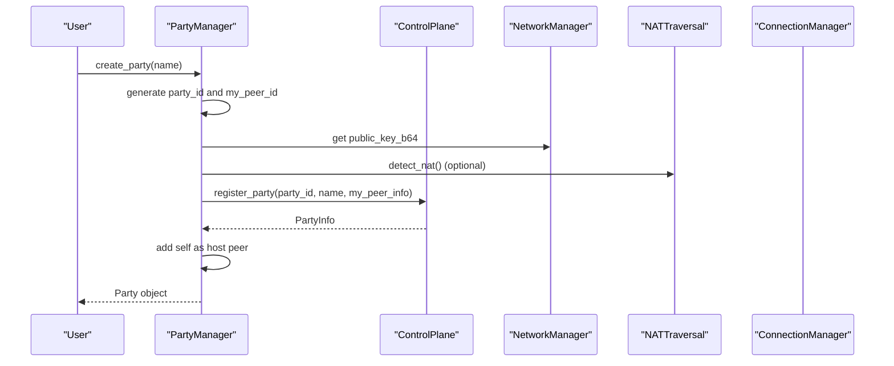

**Diagram sources**
- [party.py](file://core/party.py#L159-L196)
- [control.py](file://core/control.py#L228-L249)
- [network.py](file://core/network.py#L158-L160)
- [nat.py](file://core/nat.py#L64-L105)

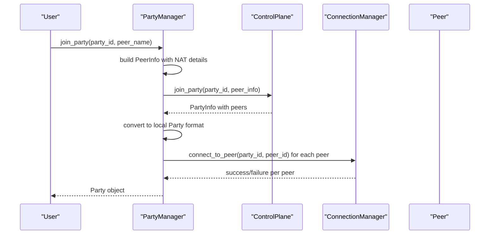

**Diagram sources**
- [party.py](file://core/party.py#L198-L247)
- [control.py](file://core/control.py#L251-L267)
- [connection.py](file://core/connection.py#L38-L124)

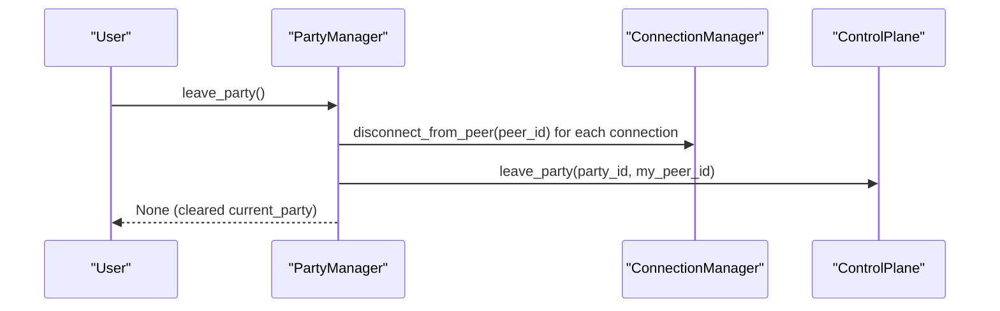

**Diagram sources**
- [party.py](file://core/party.py#L249-L261)
- [connection.py](file://core/connection.py#L126-L150)
- [control.py](file://core/control.py#L269-L293)

## Detailed Component Analysis

### PartyManager.create_party()
Party creation involves:
- Generating a unique party ID and a local peer ID.
- Building a PeerInfo object with NAT details (public/private IPs, ports, NAT type).
- Registering the party with the control plane.
- Adding the host as the first peer and setting current_party.

Key behaviors:
- Party ID generation uses a secure random token.
- NAT type is captured from NATTraversal if available.
- Control plane registration persists the party and host information.
- The host peer is assigned a fixed virtual IP (10.66.0.1).

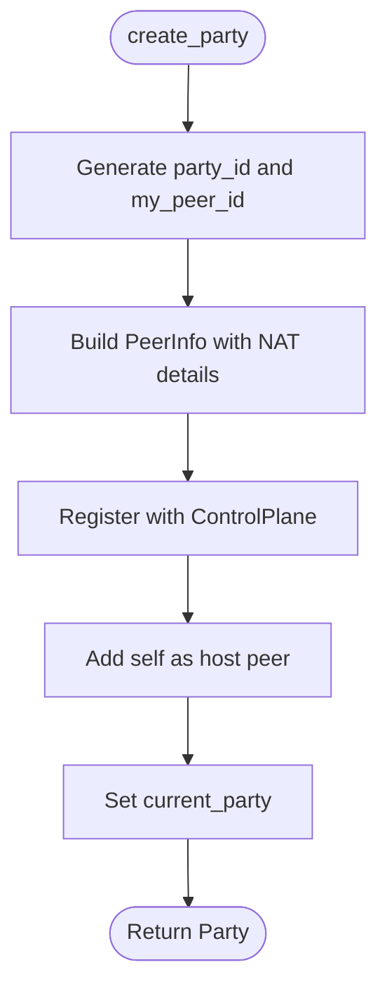

**Diagram sources**
- [party.py](file://core/party.py#L159-L196)

**Section sources**
- [party.py](file://core/party.py#L159-L196)
- [control.py](file://core/control.py#L228-L249)
- [nat.py](file://core/nat.py#L64-L105)

### join_party() Workflow
Joining a party includes:
- Validating control plane and NAT availability.
- Constructing PeerInfo with NAT details.
- Joining via control plane and receiving the updated PartyInfo.
- Converting to local Party format and adding peers.
- Initiating asynchronous connections to existing peers.
- Updating peer connection_type upon success or failure.

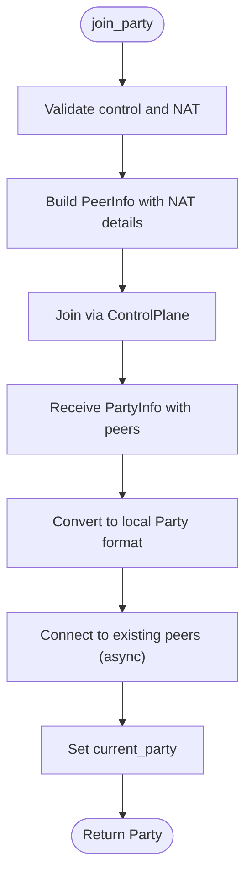

**Diagram sources**
- [party.py](file://core/party.py#L198-L247)
- [control.py](file://core/control.py#L251-L267)
- [connection.py](file://core/connection.py#L38-L124)

**Section sources**
- [party.py](file://core/party.py#L198-L247)
- [control.py](file://core/control.py#L251-L267)
- [connection.py](file://core/connection.py#L38-L124)

### leave_party() Process
Graceful departure includes:
- Iterating over active connections and removing WireGuard peers.
- Releasing virtual IPs back to the pool.
- Notifying the control plane to remove the peer from the party.
- Clearing the current party reference.

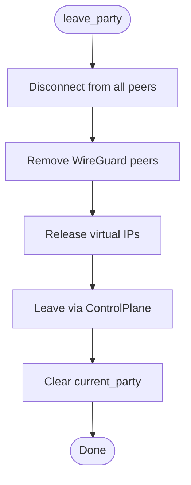

**Diagram sources**
- [party.py](file://core/party.py#L249-L261)
- [connection.py](file://core/connection.py#L126-L150)

**Section sources**
- [party.py](file://core/party.py#L249-L261)
- [connection.py](file://core/connection.py#L126-L150)

### NAT Type Propagation and Compatibility
NAT type is propagated to the control plane and used to determine compatibility for direct P2P connections. The compatibility matrix defines which NAT types can connect directly without relay.

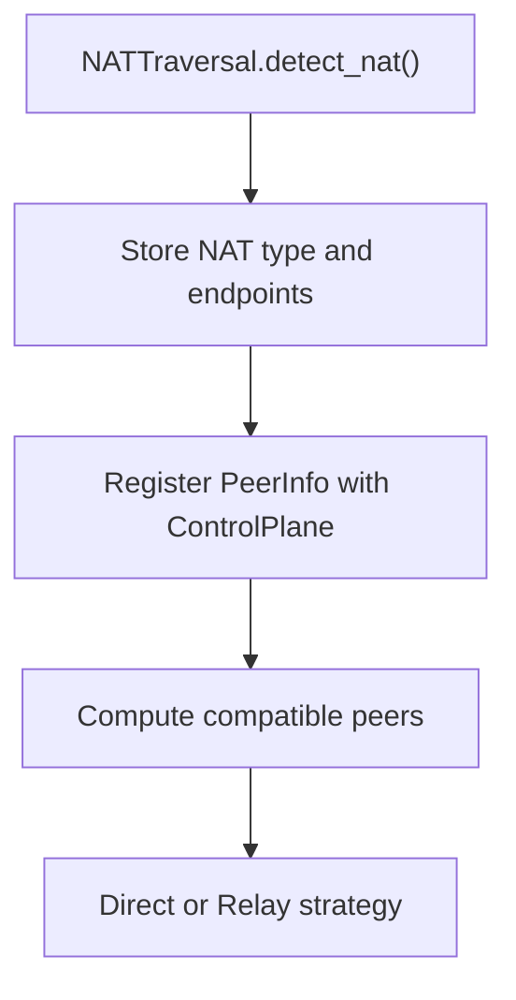

**Diagram sources**
- [nat.py](file://core/nat.py#L64-L105)
- [party.py](file://core/party.py#L182-L194)
- [party.py](file://core/party.py#L73-L99)

**Section sources**
- [nat.py](file://core/nat.py#L64-L105)
- [party.py](file://core/party.py#L182-L194)
- [party.py](file://core/party.py#L73-L99)

### Automatic Peer Connection Establishment
On join, PartyManager schedules asynchronous connection tasks to existing peers. ConnectionManager coordinates NAT traversal, selects endpoints, adds WireGuard peers, and starts monitoring tasks.

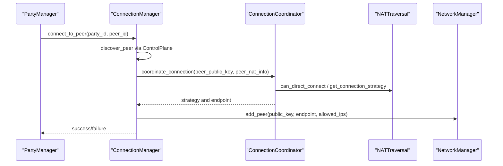

**Diagram sources**
- [party.py](file://core/party.py#L262-L278)
- [connection.py](file://core/connection.py#L38-L124)
- [nat.py](file://core/nat.py#L330-L369)

**Section sources**
- [party.py](file://core/party.py#L262-L278)
- [connection.py](file://core/connection.py#L38-L124)
- [nat.py](file://core/nat.py#L330-L369)

### Party State Persistence and Cleanup
The control plane maintains state in a file-backed store with batched writes to reduce I/O. A periodic cleanup task removes stale peers and empty parties based on last_seen timestamps.

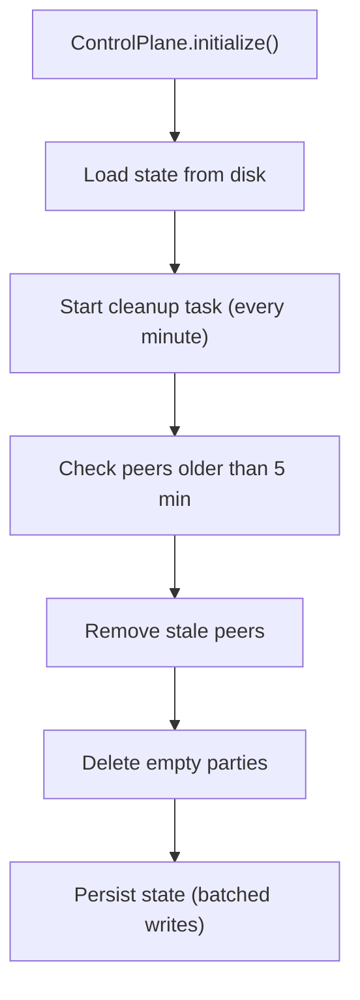

**Diagram sources**
- [control.py](file://core/control.py#L209-L217)
- [control.py](file://core/control.py#L378-L410)
- [control.py](file://core/control.py#L411-L424)

**Section sources**
- [control.py](file://core/control.py#L209-L217)
- [control.py](file://core/control.py#L378-L410)
- [control.py](file://core/control.py#L411-L424)

### Session Timeout Handling and Automatic Cleanup
- Control plane: Cleanup task removes peers older than 5 minutes and deletes empty parties.
- ConnectionManager: Monitors connection health, attempts reconnection, and auto-cleans failed connections after a timeout.
- RemoteControlPlaneClient: Maintains heartbeat to keep sessions alive.

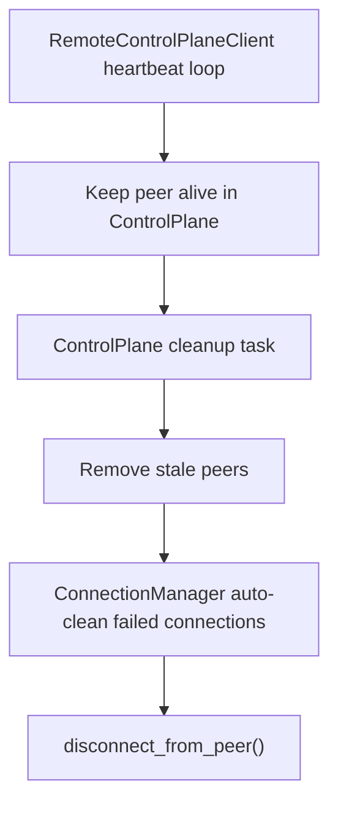

**Diagram sources**
- [control_client.py](file://core/control_client.py#L404-L425)
- [control.py](file://core/control.py#L378-L410)
- [connection.py](file://core/connection.py#L306-L333)

**Section sources**
- [control_client.py](file://core/control_client.py#L404-L425)
- [control.py](file://core/control.py#L378-L410)
- [connection.py](file://core/connection.py#L306-L333)

### Error Handling
- Network failures: NAT detection and STUN requests handle timeouts and OS errors; ConnectionManager retries and switches relays.
- Control plane unavailability: RemoteControlPlaneClient falls back to local mode; PartyManager continues with NAT initialization and manual control plane usage.
- Peer disconnections: ConnectionManager monitors latency, attempts reconnection, and cleans up failed connections after timeout.
- Exceptions: Custom exceptions (NATError, STUNError, HolePunchError, PeerConnectionError, ConfigError, PartyError) categorize and propagate issues.

**Section sources**
- [nat.py](file://core/nat.py#L64-L105)
- [connection.py](file://core/connection.py#L213-L333)
- [control_client.py](file://core/control_client.py#L506-L524)
- [exceptions.py](file://core/exceptions.py#L10-L96)

## Dependency Analysis
Party lifecycle components depend on each other as follows:

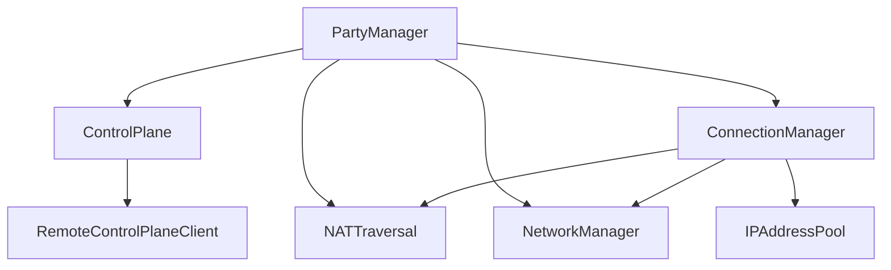

**Diagram sources**
- [party.py](file://core/party.py#L102-L120)
- [connection.py](file://core/connection.py#L18-L36)
- [control.py](file://core/control.py#L187-L207)
- [control_client.py](file://core/control_client.py#L23-L438)

**Section sources**
- [party.py](file://core/party.py#L102-L120)
- [connection.py](file://core/connection.py#L18-L36)
- [control.py](file://core/control.py#L187-L207)
- [control_client.py](file://core/control_client.py#L23-L438)

## Performance Considerations
- Party creation: minimal network requests and CPU overhead.
- Joining: proportional to peer count; NAT traversal and WireGuard setup dominate cost.
- Status updates: latency measurements are on-demand and lightweight.
- Cleanup: periodic tasks avoid continuous scanning; batched state writes reduce disk I/O.

[No sources needed since this section provides general guidance]

## Troubleshooting Guide
Common issues and resolutions:
- Cannot create party: Check internet/firewall; use local mode temporarily.
- Cannot join party: Verify party ID, host status, and recreate party if needed.
- Peer connection failed: Check NAT type, firewall (allow UDP 51820), and try different networks.
- High latency: Distinguish between base latency and LANrage overhead; optimize network or switch relay.

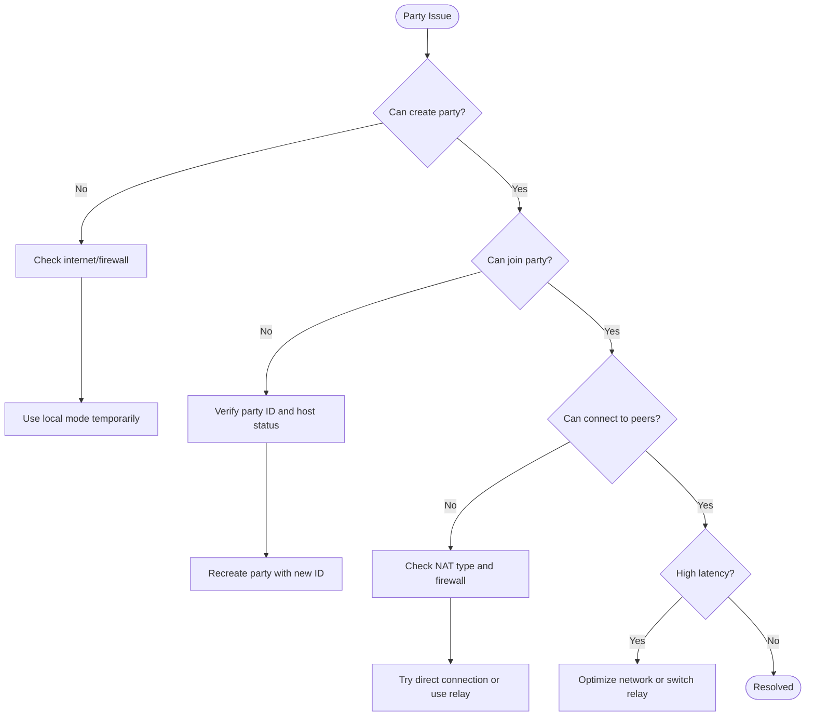

**Diagram sources**
- [TROUBLESHOOTING.md](file://docs/TROUBLESHOOTING.md#L11-L50)

**Section sources**
- [TROUBLESHOOTING.md](file://docs/TROUBLESHOOTING.md#L372-L503)

## Conclusion
Party lifecycle management in LANrage is designed for reliability and adaptability. The PartyManager orchestrates control plane registration, NAT traversal, and connection establishment, while the control plane ensures persistence and cleanup. Robust error handling and automatic cleanup procedures help maintain a smooth gaming experience even under adverse network conditions.

[No sources needed since this section summarizes without analyzing specific files]

## Appendices

### Practical Examples
- Creating a party: Use PartyManager.create_party() to generate a party ID, register with the control plane, and add the host as the first peer.
- Joining a party: Use PartyManager.join_party() to obtain party information, convert to local format, and connect to existing peers.
- Leaving a party: Use PartyManager.leave_party() to gracefully disconnect peers, notify the control plane, and clear the current party.

**Section sources**
- [PARTY.md](file://docs/PARTY.md#L153-L214)
- [test_party.py](file://tests/test_party.py#L160-L196)

### NAT Compatibility Matrix
- Open NAT can connect to anyone.
- Full cone NAT can connect to others of compatible types.
- Restricted cone can connect with hole punching.
- Symmetric NAT requires relay.

**Section sources**
- [party.py](file://core/party.py#L19-L41)
- [nat.py](file://core/nat.py#L295-L322)