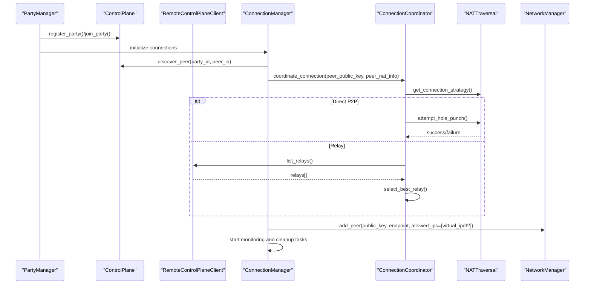
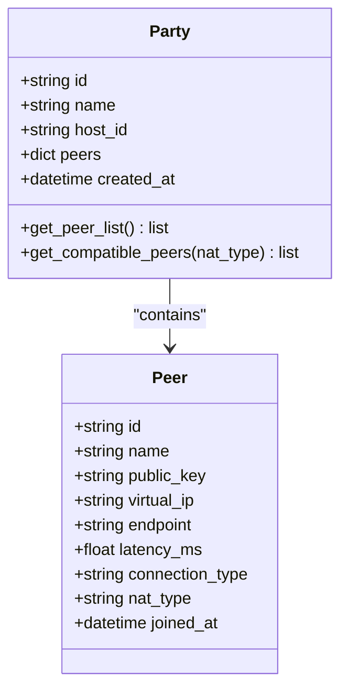
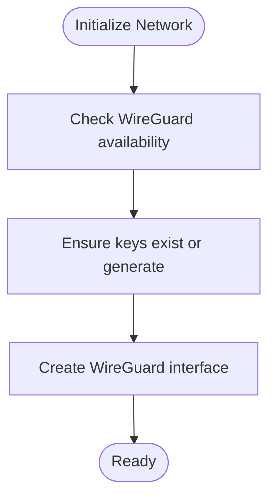
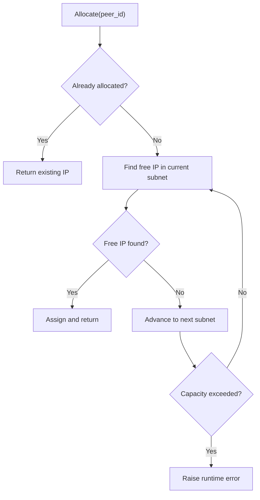
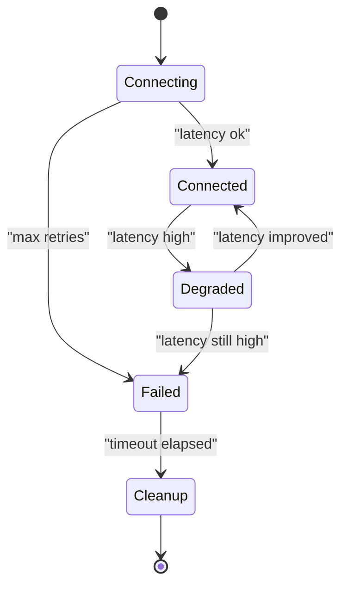
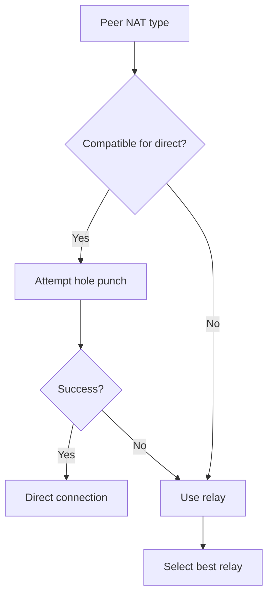
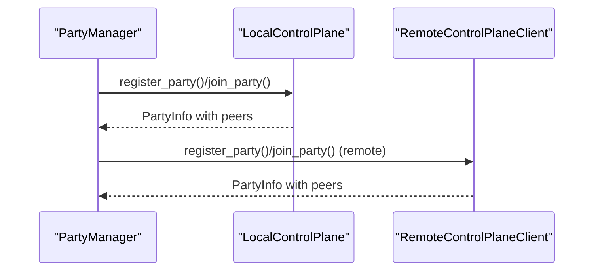
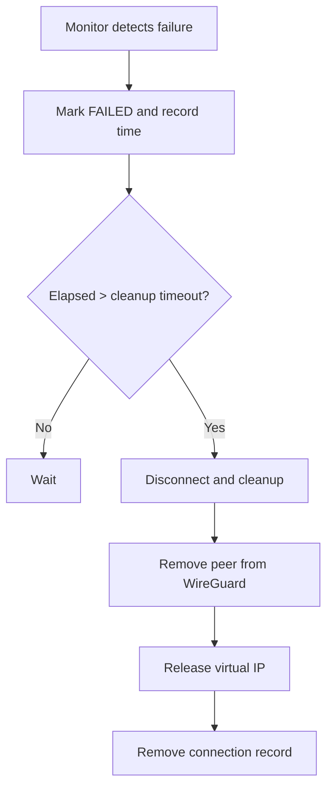
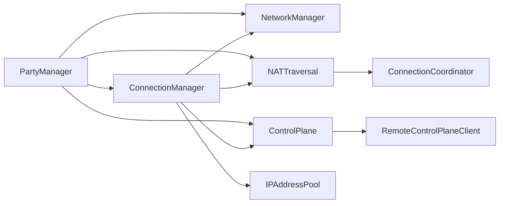

# Peer Management & Coordination

<cite>
**Referenced Files in This Document**
- [party.py](file://core/party.py)
- [connection.py](file://core/connection.py)
- [network.py](file://core/network.py)
- [control.py](file://core/control.py)
- [control_client.py](file://core/control_client.py)
- [nat.py](file://core/nat.py)
- [ipam.py](file://core/ipam.py)
- [config.py](file://core/config.py)
- [exceptions.py](file://core/exceptions.py)
- [test_multi_peer.py](file://tests/test_multi_peer.py)
- [test_party.py](file://tests/test_party.py)
</cite>

## Table of Contents
1. [Introduction](#introduction)
2. [Project Structure](#project-structure)
3. [Core Components](#core-components)
4. [Architecture Overview](#architecture-overview)
5. [Detailed Component Analysis](#detailed-component-analysis)
6. [Dependency Analysis](#dependency-analysis)
7. [Performance Considerations](#performance-considerations)
8. [Troubleshooting Guide](#troubleshooting-guide)
9. [Conclusion](#conclusion)
10. [Appendices](#appendices)

## Introduction
This document explains the peer management and coordination subsystems that enable multiplayer connectivity within parties. It covers the Peer data model, WireGuard key management, virtual IP allocation, peer state tracking, connection type classification, NAT type compatibility assessment, discovery and synchronization via the control plane, peer removal and automatic cleanup, peer count limitations, ranking and priority mechanisms, load balancing considerations, health monitoring, latency tracking, and performance-based optimization. It also includes practical examples and guidance for handling peer-related network issues.

## Project Structure
The peer management system spans several modules:
- Party orchestration and discovery: core/party.py
- Connection orchestration and lifecycle: core/connection.py
- WireGuard interface and latency measurement: core/network.py
- Control plane (local and remote): core/control.py and core/control_client.py
- NAT traversal and relay selection: core/nat.py
- Virtual IP allocation: core/ipam.py
- Configuration and error types: core/config.py and core/exceptions.py
- Tests validating multi-peer scenarios and compatibility: tests/test_multi_peer.py and tests/test_party.py

```mermaid
graph TB
subgraph "Party Layer"
PM["PartyManager<br/>core/party.py"]
Party["Party<br/>core/party.py"]
Peer["Peer<br/>core/party.py"]
end
subgraph "Connection Layer"
CM["ConnectionManager<br/>core/connection.py"]
PC["PeerConnection<br/>core/connection.py"]
end
subgraph "Networking"
NM["NetworkManager<br/>core/network.py"]
WG["WireGuard<br/>core/network.py"]
LAT["Latency Measurement<br/>core/network.py"]
end
subgraph "Control Plane"
CP["LocalControlPlane<br/>core/control.py"]
RPC["RemoteControlPlaneClient<br/>core/control_client.py"]
PI["PartyInfo/PeerInfo<br/>core/control.py"]
end
subgraph "NAT & Relays"
NAT["NATTraversal<br/>core/nat.py"]
CC["ConnectionCoordinator<br/>core/nat.py"]
end
subgraph "IPAM"
IPAM["IPAddressPool<br/>core/ipam.py"]
end
PM --> Party
PM --> CM
PM --> CP
PM --> NAT
CM --> PC
CM --> NM
CM --> IPAM
CM --> CC
CC --> NAT
NM --> WG
NM --> LAT
CP --> PI
RPC --> CP
```

**Diagram sources**
- [party.py](file://core/party.py#L102-L304)
- [connection.py](file://core/connection.py#L18-L493)
- [network.py](file://core/network.py#L25-L515)
- [control.py](file://core/control.py#L187-L880)
- [control_client.py](file://core/control_client.py#L23-L438)
- [nat.py](file://core/nat.py#L41-L525)
- [ipam.py](file://core/ipam.py#L10-L183)

**Section sources**
- [party.py](file://core/party.py#L1-L304)
- [connection.py](file://core/connection.py#L1-L493)
- [network.py](file://core/network.py#L1-L515)
- [control.py](file://core/control.py#L1-L880)
- [control_client.py](file://core/control_client.py#L1-L438)
- [nat.py](file://core/nat.py#L1-L525)
- [ipam.py](file://core/ipam.py#L1-L183)

## Core Components
- Peer data model: identity, WireGuard public key, virtual IP, endpoint, latency, connection type, NAT type, and join time.
- Party model: maintains a dictionary of peers and exposes compatibility filtering by NAT type.
- ConnectionManager: orchestrates peer discovery, strategy selection (direct vs relay), WireGuard peer configuration, monitoring, and cleanup.
- NetworkManager: manages WireGuard interface, key generation, latency measurement, and peer addition/removal.
- ControlPlane: local file-backed registry for peers and parties; persists state and cleans stale entries.
- RemoteControlPlaneClient: HTTP client for centralized control plane server with heartbeats and relay discovery.
- NATTraversal and ConnectionCoordinator: NAT detection, compatibility checks, hole-punching, and relay selection.
- IPAddressPool: deterministic, distributed virtual IP allocation across subnets.

**Section sources**
- [party.py](file://core/party.py#L44-L100)
- [party.py](file://core/party.py#L58-L100)
- [connection.py](file://core/connection.py#L18-L125)
- [network.py](file://core/network.py#L25-L160)
- [control.py](file://core/control.py#L187-L456)
- [control_client.py](file://core/control_client.py#L23-L160)
- [nat.py](file://core/nat.py#L41-L328)
- [ipam.py](file://core/ipam.py#L10-L129)

## Architecture Overview
The system integrates discovery, NAT traversal, and transport to establish connections. Parties are registered and synchronized via the control plane. Peers exchange NAT and endpoint information to decide direct or relayed connections. WireGuard peers are dynamically added/removed with per-peer virtual IPs. Health monitoring periodically measures latency and triggers reconnection or relay switching.



**Diagram sources**
- [party.py](file://core/party.py#L144-L247)
- [connection.py](file://core/connection.py#L38-L125)
- [nat.py](file://core/nat.py#L337-L398)
- [control.py](file://core/control.py#L331-L346)
- [control_client.py](file://core/control_client.py#L373-L403)
- [network.py](file://core/network.py#L392-L420)

## Detailed Component Analysis

### Peer Data Model
- Identity: unique peer ID, display name.
- WireGuard: public key stored as base64 string.
- Networking: virtual IP (per-peer), optional endpoint, latency tracking, connection type, NAT type, and join timestamp.
- Compatibility: NAT type is used to filter peers eligible for direct P2P connections.



**Diagram sources**
- [party.py](file://core/party.py#L44-L100)

**Section sources**
- [party.py](file://core/party.py#L44-L100)

### WireGuard Key Management
- Keys are generated using cryptographic primitives and saved securely.
- Keys are converted to base64 for WireGuard configuration.
- Platform-specific interface creation and teardown are supported.



**Diagram sources**
- [network.py](file://core/network.py#L70-L94)
- [network.py](file://core/network.py#L123-L160)
- [network.py](file://core/network.py#L161-L310)

**Section sources**
- [network.py](file://core/network.py#L19-L160)

### Virtual IP Allocation
- Deterministic allocation across subnets derived from a base network.
- Each peer receives a unique /32 virtual IP; reserved addresses are avoided.
- Pool expands across subnets when capacity is exhausted.



**Diagram sources**
- [ipam.py](file://core/ipam.py#L55-L98)

**Section sources**
- [ipam.py](file://core/ipam.py#L10-L183)

### Peer State Tracking and Lifecycle
- ConnectionManager tracks active connections and transitions peer state.
- States include connecting, connected, degraded, failed, and cleanup.
- Latency measurements drive state transitions and reconnection attempts.



**Diagram sources**
- [connection.py](file://core/connection.py#L439-L493)

**Section sources**
- [connection.py](file://core/connection.py#L439-L493)

### Connection Type Classification and NAT Compatibility
- Direct vs relay classification is determined by NAT compatibility and hole-punch feasibility.
- NAT compatibility matrix defines which peer NAT types can connect directly.
- ConnectionCoordinator selects strategy and falls back to relay when needed.



**Diagram sources**
- [party.py](file://core/party.py#L73-L99)
- [nat.py](file://core/nat.py#L323-L328)
- [nat.py](file://core/nat.py#L337-L398)

**Section sources**
- [party.py](file://core/party.py#L18-L41)
- [party.py](file://core/party.py#L73-L99)
- [nat.py](file://core/nat.py#L323-L398)

### Peer Discovery and Synchronization via Control Plane
- LocalControlPlane stores and serves party/peer metadata, persists state, and cleans stale entries.
- RemoteControlPlaneClient communicates with a central server, handles heartbeats, and discovers relays.
- PartyManager registers/joins parties and updates peer lists accordingly.



**Diagram sources**
- [control.py](file://core/control.py#L228-L294)
- [control.py](file://core/control.py#L311-L346)
- [control_client.py](file://core/control_client.py#L191-L269)

**Section sources**
- [control.py](file://core/control.py#L187-L456)
- [control_client.py](file://core/control_client.py#L23-L160)

### Peer Removal and Automatic Cleanup
- Manual disconnection removes WireGuard peers and releases virtual IPs.
- Automatic cleanup transitions failed connections to cleanup after a timeout.
- Control plane periodically removes stale peers and empty parties.



**Diagram sources**
- [connection.py](file://core/connection.py#L213-L333)
- [connection.py](file://core/connection.py#L486-L493)
- [control.py](file://core/control.py#L378-L410)

**Section sources**
- [connection.py](file://core/connection.py#L126-L151)
- [connection.py](file://core/connection.py#L306-L333)
- [control.py](file://core/control.py#L378-L410)

### Peer Count Limitations
- Relay mode includes a configurable maximum client limit.
- IPAM pool enforces capacity across subnets; attempting allocation beyond capacity raises runtime errors.

**Section sources**
- [config.py](file://core/config.py#L40-L44)
- [ipam.py](file://core/ipam.py#L90-L98)

### Peer Ranking, Priority, and Load Balancing
- Ranking is implicit via latency thresholds and relay selection:
  - Direct P2P preferred when compatible.
  - Relay selection chooses the lowest-latency relay endpoint.
  - High-latency connections trigger relay switching attempts.
- No explicit per-peer priority weighting is implemented; decisions are latency-driven.

**Section sources**
- [nat.py](file://core/nat.py#L379-L479)
- [connection.py](file://core/connection.py#L284-L301)
- [connection.py](file://core/connection.py#L334-L437)

### Health Monitoring, Latency Tracking, and Optimization
- Periodic latency measurement drives connection health checks.
- Reconnection attempts are performed up to a fixed threshold.
- Relay switching compares measured latencies and switches if beneficial.

**Section sources**
- [network.py](file://core/network.py#L340-L391)
- [connection.py](file://core/connection.py#L213-L305)
- [connection.py](file://core/connection.py#L334-L437)

### Examples of Peer Management Operations
- Creating a party and adding self as host with initial NAT and virtual IP.
- Joining a party, discovering peers, and initiating connections to existing peers.
- Measuring latency and retrieving party status including NAT info.

**Section sources**
- [party.py](file://core/party.py#L159-L196)
- [party.py](file://core/party.py#L198-L247)
- [party.py](file://core/party.py#L279-L304)
- [test_multi_peer.py](file://tests/test_multi_peer.py#L73-L106)

### Handling Peer-Related Network Issues
- NAT detection failures: fallback to relay-only mode.
- STUN/relay discovery failures: fallback to configured or default relay.
- Connection failures: automatic reconnection attempts; mark failed after retries; cleanup after timeout.
- Control plane unavailability: local mode continues with persisted state; remote client reconnects with backoff.

**Section sources**
- [party.py](file://core/party.py#L121-L143)
- [nat.py](file://core/nat.py#L379-L455)
- [connection.py](file://core/connection.py#L237-L283)
- [control_client.py](file://core/control_client.py#L676-L698)

## Dependency Analysis
Key dependencies and coupling:
- PartyManager depends on NetworkManager, NATTraversal, ControlPlane, and ConnectionManager.
- ConnectionManager depends on NetworkManager, NATTraversal, ControlPlane, and IPAddressPool.
- NATTraversal and ConnectionCoordinator depend on configuration and optional control client.
- ControlPlane and RemoteControlPlaneClient manage persistence and server communication.
- Exceptions provide typed error handling across modules.



**Diagram sources**
- [party.py](file://core/party.py#L102-L158)
- [connection.py](file://core/connection.py#L18-L36)
- [nat.py](file://core/nat.py#L330-L336)
- [control.py](file://core/control.py#L187-L208)
- [control_client.py](file://core/control_client.py#L23-L46)

**Section sources**
- [party.py](file://core/party.py#L102-L158)
- [connection.py](file://core/connection.py#L18-L36)
- [nat.py](file://core/nat.py#L330-L336)
- [control.py](file://core/control.py#L187-L208)
- [control_client.py](file://core/control_client.py#L23-L46)

## Performance Considerations
- Latency measurement intervals: monitoring runs every 30 seconds; consider tuning for higher or lower sensitivity.
- Keepalive configuration: persistent keepalive is set for NAT traversal; adjust based on network conditions.
- Relay selection: latency-based selection reduces overhead; ensure reliable ping targets.
- IPAM scalability: subnets expand deterministically; monitor utilization to anticipate exhaustion.

[No sources needed since this section provides general guidance]

## Troubleshooting Guide
Common issues and resolutions:
- WireGuard not installed or interface creation fails: verify platform support and permissions; check logs for detailed errors.
- NAT detection failures: fallback to relay-only mode; confirm firewall and router settings.
- Peer discovery timeouts: ensure control plane is reachable; verify authentication and heartbeat.
- Connection keeps failing: check latency thresholds and reconnection attempts; consider switching to relay.
- Stale peers accumulating: rely on control plane cleanup; verify last_seen timestamps.

**Section sources**
- [network.py](file://core/network.py#L75-L94)
- [party.py](file://core/party.py#L121-L143)
- [control.py](file://core/control.py#L378-L410)
- [connection.py](file://core/connection.py#L237-L283)
- [control_client.py](file://core/control_client.py#L404-L425)

## Conclusion
The peer management and coordination system integrates discovery, NAT traversal, and transport to deliver robust multiplayer connectivity. It emphasizes reliability through NAT-aware strategies, latency-driven optimization, and automatic cleanup. While explicit peer ranking and priority weights are not implemented, the system’s latency-centric design naturally prioritizes low-latency paths and optimizes relay usage.

## Appendices

### API and Operation References
- Party creation and joining: [party.py](file://core/party.py#L159-L247)
- Connection orchestration: [connection.py](file://core/connection.py#L38-L125)
- WireGuard operations: [network.py](file://core/network.py#L392-L444)
- Control plane operations: [control.py](file://core/control.py#L228-L346), [control_client.py](file://core/control_client.py#L191-L332)
- NAT traversal and relay selection: [nat.py](file://core/nat.py#L337-L479)
- IPAM allocation: [ipam.py](file://core/ipam.py#L55-L129)