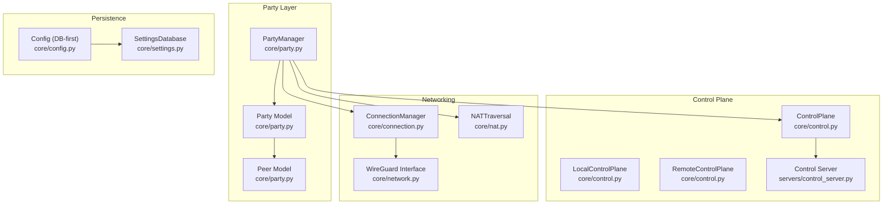
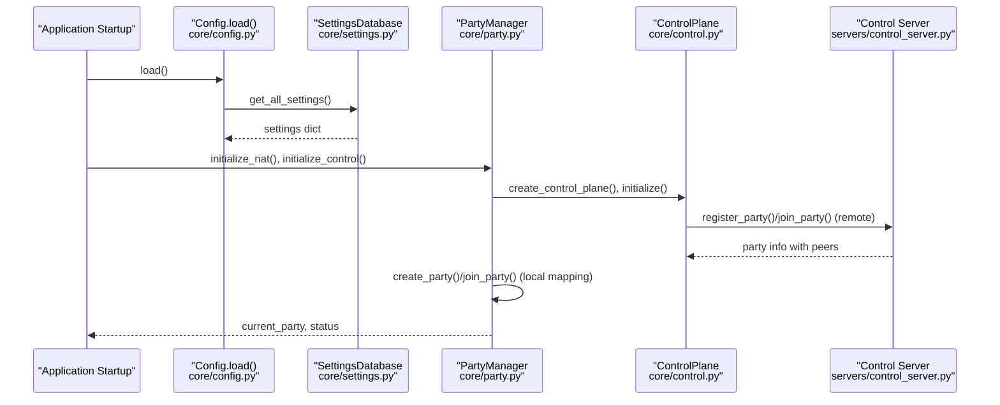
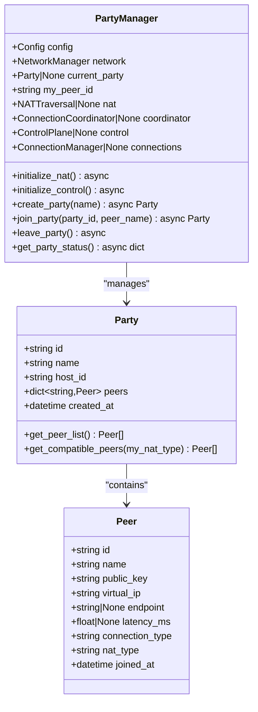
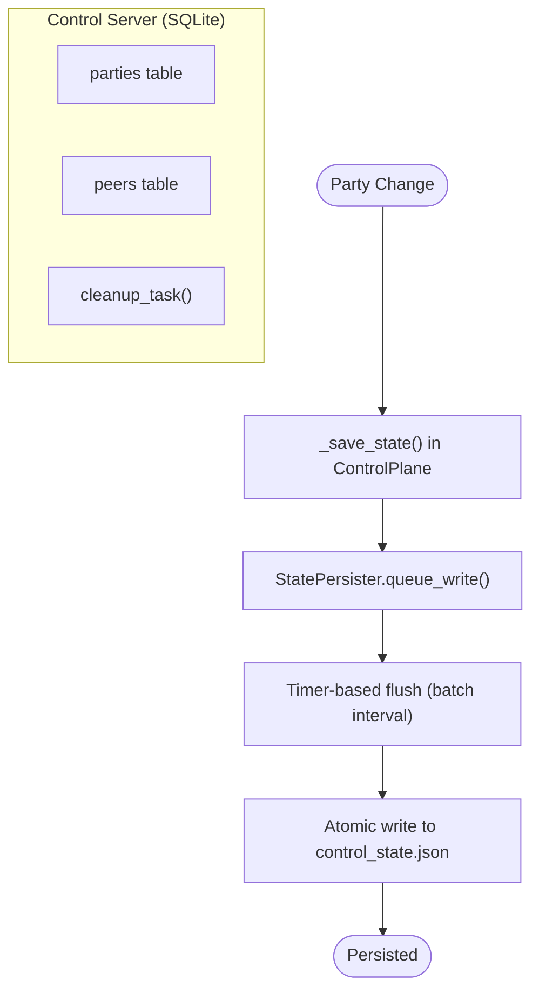
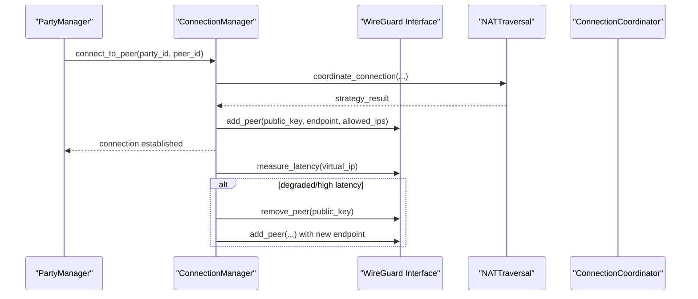
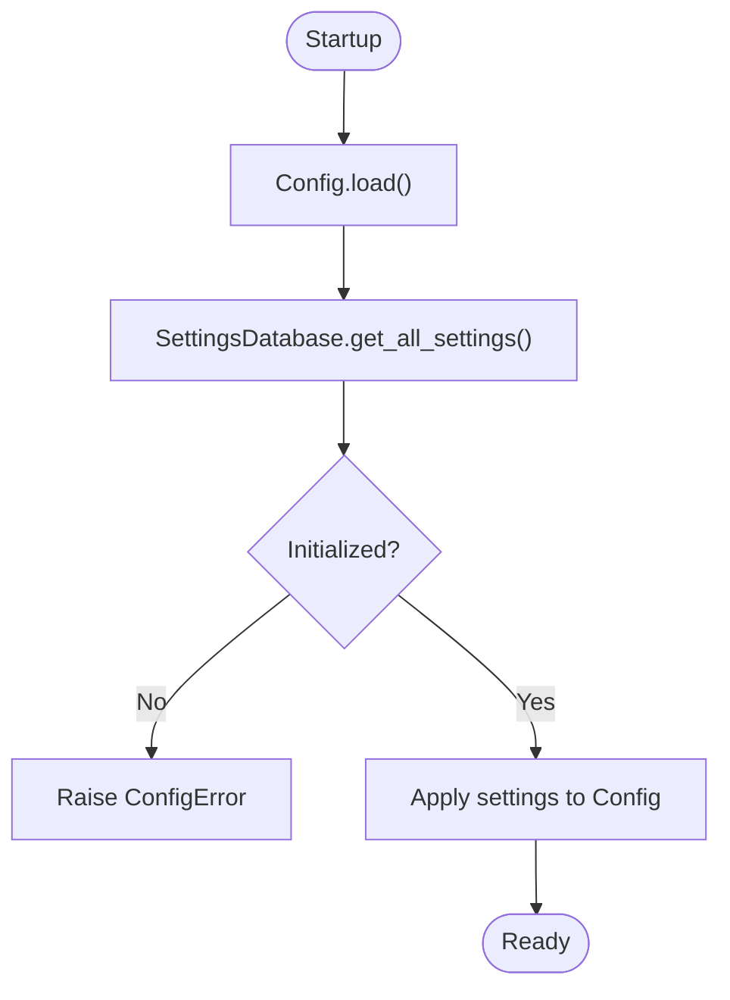
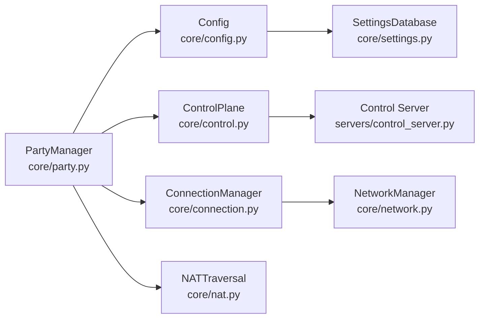

# Session Persistence & State Management

<cite>
**Referenced Files in This Document**
- [party.py](file://core/party.py)
- [config.py](file://core/config.py)
- [settings.py](file://core/settings.py)
- [connection.py](file://core/connection.py)
- [control.py](file://core/control.py)
- [control_server.py](file://servers/control_server.py)
- [nat.py](file://core/nat.py)
- [network.py](file://core/network.py)
- [test_party.py](file://tests/test_party.py)
- [PARTY.md](file://docs/PARTY.md)
- [CONTROL_PLANE_SERVER.md](file://docs/CONTROL_PLANE_SERVER.md)
</cite>

## Table of Contents
1. [Introduction](#introduction)
2. [Project Structure](#project-structure)
3. [Core Components](#core-components)
4. [Architecture Overview](#architecture-overview)
5. [Detailed Component Analysis](#detailed-component-analysis)
6. [Dependency Analysis](#dependency-analysis)
7. [Performance Considerations](#performance-considerations)
8. [Troubleshooting Guide](#troubleshooting-guide)
9. [Conclusion](#conclusion)
10. [Appendices](#appendices)

## Introduction
This document explains session persistence and state management for party coordination in LANrage. It covers how party metadata, peer lists, and connection state are modeled and stored, how the system integrates with the database-first configuration system, and how sessions are recovered across restarts. It also documents session recovery mechanisms, automatic party restoration, state synchronization across instances, validation and recovery from corruption, and the relationship between party state and network configuration persistence. Backup and restore procedures, state migration strategies, and compatibility with configuration changes are included, along with practical examples of state management operations and recovery scenarios.

## Project Structure
The party coordination subsystem centers around:
- Party data models and orchestration
- Control plane for peer discovery and persistence
- Connection management with NAT traversal and WireGuard
- Database-first configuration and persistent settings
- Tests validating party models and NAT compatibility

**Diagram sources**
- [party.py](file://core/party.py#L102-L304)
- [control.py](file://core/control.py#L187-L230)
- [connection.py](file://core/connection.py#L18-L120)
- [nat.py](file://core/nat.py#L41-L106)
- [network.py](file://core/network.py#L25-L95)
- [config.py](file://core/config.py#L49-L114)
- [settings.py](file://core/settings.py#L20-L96)
- [control_server.py](file://servers/control_server.py#L37-L99)

**Section sources**
- [party.py](file://core/party.py#L1-L304)
- [control.py](file://core/control.py#L187-L230)
- [connection.py](file://core/connection.py#L1-L120)
- [nat.py](file://core/nat.py#L1-L106)
- [network.py](file://core/network.py#L1-L95)
- [config.py](file://core/config.py#L1-L114)
- [settings.py](file://core/settings.py#L1-L96)
- [control_server.py](file://servers/control_server.py#L1-L99)

## Core Components
- Party and Peer models define the in-memory representation of parties and peers, including metadata, NAT types, and connection state.
- PartyManager orchestrates NAT detection, control plane initialization, party creation/joining, and status reporting.
- ControlPlane persists party state locally and coordinates with the control server for peer discovery and relay registration.
- ConnectionManager manages per-peer connections, monitors health, and handles reconnection and relay switching.
- Config loads application settings from a SQLite-backed settings database, enforcing a database-first configuration approach.
- SettingsDatabase provides async SQLite persistence for configuration, server configs, favorites, and game profiles, with integrity checks and backup support.

Key responsibilities:
- Party metadata persistence: stored in the control server’s peers table and mirrored locally by ControlPlane.
- Peer lists and connection state: tracked in-memory by PartyManager and ConnectionManager, with periodic persistence via ControlPlane’s state persister.
- NAT and endpoint information: captured during NAT detection and propagated to peers for compatibility and connectivity decisions.
- Configuration persistence: all runtime settings are loaded from and saved to the settings database.

**Section sources**
- [party.py](file://core/party.py#L44-L100)
- [party.py](file://core/party.py#L102-L304)
- [control.py](file://core/control.py#L187-L230)
- [connection.py](file://core/connection.py#L18-L120)
- [config.py](file://core/config.py#L49-L114)
- [settings.py](file://core/settings.py#L20-L96)

## Architecture Overview
The system integrates three layers:
- Database-first configuration: Config.load() reads all settings from the settings database.
- Control plane: Centralized peer discovery and party registry; persists party metadata and peer lists.
- Party orchestration: PartyManager coordinates NAT, control plane, and connections; maintains in-memory party state and exposes status.

**Diagram sources**
- [config.py](file://core/config.py#L49-L114)
- [settings.py](file://core/settings.py#L132-L142)
- [party.py](file://core/party.py#L121-L158)
- [control.py](file://core/control.py#L558-L589)
- [control_server.py](file://servers/control_server.py#L40-L99)

## Detailed Component Analysis

### Party Data Model and State
- Peer: Encapsulates identity, keys, virtual IP, endpoint, latency, connection type, NAT type, and join timestamp.
- Party: Encapsulates party identity, name, host, peers dictionary, and creation timestamp. Includes helper methods to enumerate peers and filter compatible peers by NAT type.
- PartyManager: Initializes NAT and control plane, creates/joins parties, and reports status including latency and NAT info.

**Diagram sources**
- [party.py](file://core/party.py#L44-L100)
- [party.py](file://core/party.py#L102-L304)

**Section sources**
- [party.py](file://core/party.py#L44-L100)
- [party.py](file://core/party.py#L102-L304)
- [test_party.py](file://tests/test_party.py#L14-L41)
- [test_party.py](file://tests/test_party.py#L43-L149)

### Control Plane and Party Persistence
- ControlPlane maintains an in-memory registry of parties and peers, with periodic persistence to disk via a batched state persister.
- LocalControlPlane persists to a JSON file for local testing; RemoteControlPlane connects to the centralized control server.
- The control server stores parties and peers in SQLite, with indexes for efficient lookups and a cleanup task to remove stale entries.

**Diagram sources**
- [control.py](file://core/control.py#L411-L425)
- [control.py](file://core/control.py#L426-L456)
- [control.py](file://core/control.py#L541-L589)
- [control_server.py](file://servers/control_server.py#L37-L99)
- [control_server.py](file://servers/control_server.py#L181-L213)

**Section sources**
- [control.py](file://core/control.py#L411-L456)
- [control.py](file://core/control.py#L541-L589)
- [control_server.py](file://servers/control_server.py#L37-L99)
- [control_server.py](file://servers/control_server.py#L181-L213)

### Connection Management and Health Monitoring
- ConnectionManager coordinates peer discovery, NAT-aware connection strategy selection, WireGuard peer configuration, and latency measurement.
- Monitors connection health, attempts reconnection on failure, and supports relay switching for degraded connections.
- Automatically releases virtual IPs and cleans up failed connections after a timeout.

**Diagram sources**
- [connection.py](file://core/connection.py#L38-L120)
- [connection.py](file://core/connection.py#L213-L305)
- [connection.py](file://core/connection.py#L334-L437)
- [nat.py](file://core/nat.py#L41-L106)
- [network.py](file://core/network.py#L25-L95)

**Section sources**
- [connection.py](file://core/connection.py#L18-L120)
- [connection.py](file://core/connection.py#L213-L305)
- [connection.py](file://core/connection.py#L334-L437)
- [nat.py](file://core/nat.py#L41-L106)
- [network.py](file://core/network.py#L25-L95)

### Database-First Configuration Integration
- Config.load() reads all settings from the settings database, ensuring the app starts with a validated configuration.
- SettingsDatabase provides async SQLite operations, integrity checks, and backup/restore capabilities.
- The configuration drives network settings, API endpoints, and control plane URLs used by PartyManager and ControlPlane.

**Diagram sources**
- [config.py](file://core/config.py#L49-L114)
- [settings.py](file://core/settings.py#L132-L142)
- [settings.py](file://core/settings.py#L373-L431)

**Section sources**
- [config.py](file://core/config.py#L49-L114)
- [settings.py](file://core/settings.py#L20-L96)
- [settings.py](file://core/settings.py#L373-L431)

## Dependency Analysis
- PartyManager depends on Config, NetworkManager, NATTraversal, ControlPlane, and ConnectionManager.
- ControlPlane depends on StatePersister for batched writes and on the control server for remote operations.
- ConnectionManager depends on NetworkManager, NATTraversal, and ControlPlane for peer discovery and endpoint information.
- Config depends on SettingsDatabase for all runtime configuration.

**Diagram sources**
- [party.py](file://core/party.py#L102-L158)
- [control.py](file://core/control.py#L187-L230)
- [connection.py](file://core/connection.py#L18-L36)
- [config.py](file://core/config.py#L49-L114)
- [settings.py](file://core/settings.py#L20-L96)
- [control_server.py](file://servers/control_server.py#L37-L99)

**Section sources**
- [party.py](file://core/party.py#L102-L158)
- [control.py](file://core/control.py#L187-L230)
- [connection.py](file://core/connection.py#L18-L36)
- [config.py](file://core/config.py#L49-L114)
- [settings.py](file://core/settings.py#L20-L96)
- [control_server.py](file://servers/control_server.py#L37-L99)

## Performance Considerations
- Batched persistence: ControlPlane uses a state persister to queue and flush state changes in batches, reducing disk I/O frequency.
- Connection monitoring intervals: ConnectionManager checks latency every 30 seconds and performs reconnection attempts with bounded retries.
- NAT detection fallback: If STUN probing fails, the system continues in relay-only mode to maintain availability.
- Virtual IP allocation: IPAM ensures deterministic, collision-free assignment and release of virtual IPs.

[No sources needed since this section provides general guidance]

## Troubleshooting Guide
Common issues and recovery steps:
- Corrupted party state file: ControlPlane logs warnings and starts fresh if the state file is missing or malformed.
- Stale peers and empty parties: Control server cleanup removes peers older than a threshold and prunes empty parties.
- Database integrity: SettingsDatabase provides integrity checks and backups; use backup_database() to create a copy before applying changes.
- NAT detection failures: PartyManager logs warnings and falls back to relay-only mode; retry detection or adjust firewall/NAT settings.
- Connection failures: ConnectionManager attempts reconnection and switches relays when latency exceeds thresholds; inspect network.log for details.

**Section sources**
- [control.py](file://core/control.py#L442-L456)
- [control_server.py](file://servers/control_server.py#L181-L213)
- [settings.py](file://core/settings.py#L373-L431)
- [party.py](file://core/party.py#L134-L143)
- [connection.py](file://core/connection.py#L213-L305)

## Conclusion
LANrage’s party coordination combines a database-first configuration system with a control plane for peer discovery and persistence, and a connection manager for NAT-aware connectivity. Party metadata and peer lists are persisted in the control server’s database and mirrored locally by ControlPlane. Session recovery leverages persisted state and configuration, with automatic cleanup and integrity checks. The system provides robustness against NAT variability, connection failures, and partial corruption, while offering backup and restore capabilities for configuration and party state.

[No sources needed since this section summarizes without analyzing specific files]

## Appendices

### Session Recovery Mechanisms
- Automatic party restoration: On startup, Config.load() initializes settings, then PartyManager initializes NAT and control plane, restoring prior state from the control server and local state file.
- Graceful degradation: If NAT detection fails, the system continues with relay-only mode; if control server is unreachable, RemoteControlPlane falls back to local mode.
- Cleanup and pruning: Control server periodically removes stale peers and empty parties; ConnectionManager auto-cleans failed connections after a timeout.

**Section sources**
- [config.py](file://core/config.py#L49-L114)
- [party.py](file://core/party.py#L121-L158)
- [control.py](file://core/control.py#L558-L589)
- [control_server.py](file://servers/control_server.py#L181-L213)
- [connection.py](file://core/connection.py#L306-L333)

### State Synchronization Across Instances
- Centralized registry: Control server maintains authoritative party and peer state; clients synchronize via control plane APIs.
- Local caching: ControlPlane caches state locally and persists changes in batches; clients reload state on startup.
- Indexing and cleanup: Peers table indexing accelerates lookups; cleanup tasks prune stale entries.

**Section sources**
- [control_server.py](file://servers/control_server.py#L37-L99)
- [control.py](file://core/control.py#L411-L425)

### Party State Validation, Corruption Detection, and Recovery
- ControlPlane logs warnings and ignores corrupted state files, starting fresh to avoid propagating errors.
- SettingsDatabase integrity checks and backups enable safe recovery and migration.
- ConnectionManager validates connection states and transitions, preventing invalid state propagation.

**Section sources**
- [control.py](file://core/control.py#L442-L456)
- [settings.py](file://core/settings.py#L373-L431)
- [connection.py](file://core/connection.py#L471-L484)

### Relationship Between Party State and Network Configuration Persistence
- Config.load() ensures all runtime settings (including network, API, and control plane) originate from the settings database.
- PartyManager uses these settings to initialize NAT traversal, control plane, and networking components.
- Changes to network configuration require restarting the application so that Config.load() picks up updated settings.

**Section sources**
- [config.py](file://core/config.py#L49-L114)
- [party.py](file://core/party.py#L121-L158)

### Backup and Restore Procedures
- SettingsDatabase backup: Use backup_database(backup_path) to create a snapshot of the settings database before major changes.
- Integrity verification: validate_database_integrity() checks database validity; get_database_size() helps monitor growth.
- Control state backup: Local ControlPlane state file can be backed up manually; restored by placing the file under the configured config directory.

**Section sources**
- [settings.py](file://core/settings.py#L408-L431)
- [settings.py](file://core/settings.py#L373-L407)
- [control.py](file://core/control.py#L426-L456)

### State Migration Strategies and Compatibility
- Controlled upgrades: Use SettingsDatabase to migrate keys and values; avoid breaking changes to required keys.
- Backward compatibility: Maintain default values for optional keys; handle missing keys gracefully during Config.load().
- Versioned schemas: Introduce new tables or columns in the control server schema with appropriate migrations; keep backward-compatible reads.

**Section sources**
- [settings.py](file://core/settings.py#L476-L525)
- [control_server.py](file://servers/control_server.py#L37-L99)

### Examples of State Management Operations and Recovery Scenarios
- Creating a party: PartyManager.initialize_control() followed by create_party(); the control server registers the party and peers.
- Joining a party: PartyManager.join_party() fetches party info from the control server and initiates peer connections.
- Recovering from corruption: If the local control state file is corrupted, ControlPlane logs a warning and starts fresh; rejoin parties to rebuild state.
- Handling NAT changes: If NAT type changes, ConnectionManager adapts by selecting new endpoints and updating peer configurations.

**Section sources**
- [PARTY.md](file://docs/PARTY.md#L274-L292)
- [control.py](file://core/control.py#L411-L456)
- [party.py](file://core/party.py#L159-L196)
- [party.py](file://core/party.py#L198-L247)
- [connection.py](file://core/connection.py#L38-L120)