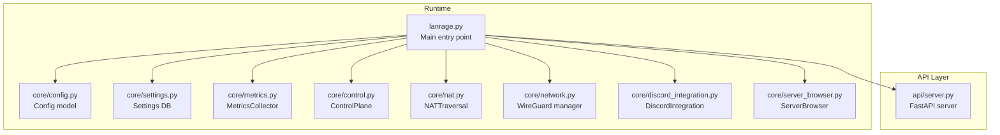
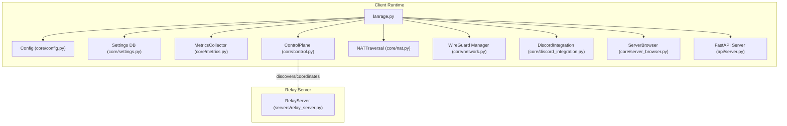
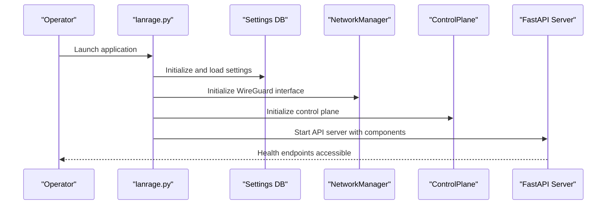
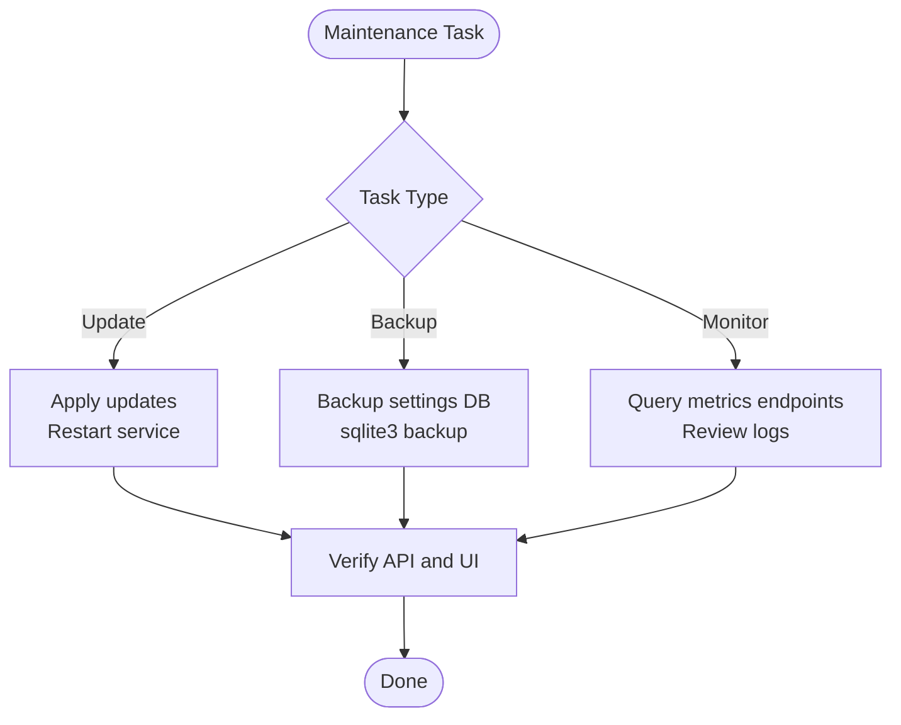
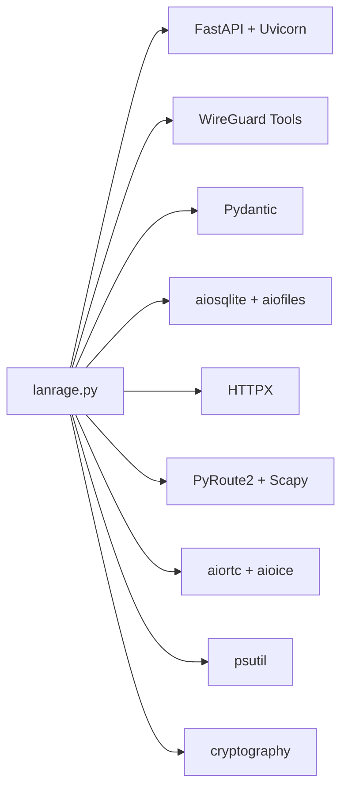
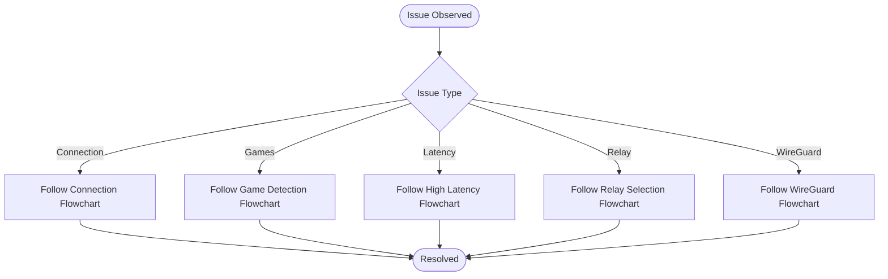

# Deployment & Operations

<cite>
**Referenced Files in This Document**
- [README.md](file://README.md)
- [PRODUCTION_READY.md](file://docs/PRODUCTION_READY.md)
- [STARTUP_VALIDATION.md](file://docs/STARTUP_VALIDATION.md)
- [TROUBLESHOOTING.md](file://docs/TROUBLESHOOTING.md)
- [SECURITY.md](file://SECURITY.md)
- [requirements.txt](file://requirements.txt)
- [setup.py](file://setup.py)
- [lanrage.py](file://lanrage.py)
- [core/config.py](file://core/config.py)
- [core/settings.py](file://core/settings.py)
- [docs/RELAY_SERVER.md](file://docs/RELAY_SERVER.md)
- [docs/CONTROL_PLANE.md](file://docs/CONTROL_PLANE.md)
- [docs/METRICS.md](file://docs/METRICS.md)
- [docs/NAT_TRAVERSAL.md](file://docs/NAT_TRAVERSAL.md)
- [docs/WIREGUARD_SETUP.md](file://docs/WIREGUARD_SETUP.md)
- [docs/DISCORD_SETUP_GUIDE.md](file://docs/DISCORD_SETUP_GUIDE.md)
</cite>

## Table of Contents
1. [Introduction](#introduction)
2. [Project Structure](#project-structure)
3. [Core Components](#core-components)
4. [Architecture Overview](#architecture-overview)
5. [Detailed Component Analysis](#detailed-component-analysis)
6. [Dependency Analysis](#dependency-analysis)
7. [Performance Considerations](#performance-considerations)
8. [Troubleshooting Guide](#troubleshooting-guide)
9. [Conclusion](#conclusion)
10. [Appendices](#appendices)

## Introduction
This document provides LANrage’s production deployment and operations playbook. It covers production readiness, environment setup, security hardening, startup validation, maintenance procedures, monitoring, troubleshooting, and operational best practices across home, cloud, and enterprise environments. It synthesizes the repository’s authoritative documentation and code to deliver a practical, step-by-step guide for operators.

## Project Structure
LANrage is organized around a modular runtime with a main entry point, configuration-driven settings, a metrics collector, a control plane for peer discovery, NAT traversal, and optional integrations (Discord). The system initializes components in a defined order and exposes a FastAPI-based REST interface for management and monitoring.

**Diagram sources**
- [lanrage.py](file://lanrage.py#L40-L230)
- [core/config.py](file://core/config.py#L17-L114)
- [core/settings.py](file://core/settings.py#L20-L525)
- [docs/METRICS.md](file://docs/METRICS.md#L75-L131)
- [docs/CONTROL_PLANE.md](file://docs/CONTROL_PLANE.md#L81-L194)
- [docs/NAT_TRAVERSAL.md](file://docs/NAT_TRAVERSAL.md#L28-L145)
- [docs/WIREGUARD_SETUP.md](file://docs/WIREGUARD_SETUP.md#L103-L165)
- [docs/DISCORD_SETUP_GUIDE.md](file://docs/DISCORD_SETUP_GUIDE.md#L1-L182)

**Section sources**
- [README.md](file://README.md#L57-L92)
- [lanrage.py](file://lanrage.py#L40-L230)
- [core/config.py](file://core/config.py#L17-L114)
- [core/settings.py](file://core/settings.py#L20-L525)

## Core Components
- Main entry point orchestrates settings initialization, network setup, NAT detection, control plane, and API server startup.
- Configuration is database-first and loaded from a SQLite-backed settings store.
- MetricsCollector provides real-time performance and peer statistics.
- ControlPlane manages peer discovery and party lifecycle.
- NATTraversal detects NAT type and coordinates direct or relayed connections.
- WireGuard manager provisions and maintains the virtual interface.
- Optional integrations include Discord webhook and Rich Presence.

**Section sources**
- [lanrage.py](file://lanrage.py#L40-L230)
- [core/config.py](file://core/config.py#L17-L114)
- [core/settings.py](file://core/settings.py#L466-L525)
- [docs/METRICS.md](file://docs/METRICS.md#L75-L131)
- [docs/CONTROL_PLANE.md](file://docs/CONTROL_PLANE.md#L81-L194)
- [docs/NAT_TRAVERSAL.md](file://docs/NAT_TRAVERSAL.md#L28-L145)
- [docs/WIREGUARD_SETUP.md](file://docs/WIREGUARD_SETUP.md#L103-L165)
- [docs/DISCORD_SETUP_GUIDE.md](file://docs/DISCORD_SETUP_GUIDE.md#L1-L182)

## Architecture Overview
LANrage’s runtime architecture centers on a client-mode default with optional relay mode. The control plane coordinates peer discovery and party management, while NAT traversal selects direct or relayed paths. The API server exposes management and monitoring endpoints backed by the metrics collector.

**Diagram sources**
- [lanrage.py](file://lanrage.py#L40-L230)
- [docs/RELAY_SERVER.md](file://docs/RELAY_SERVER.md#L1-L120)
- [docs/CONTROL_PLANE.md](file://docs/CONTROL_PLANE.md#L81-L194)

## Detailed Component Analysis

### Production Deployment Checklist
- Environment prerequisites verified (Python 3.12+, WireGuard, admin/root privileges, internet access, disk space).
- Setup completed via the automated setup script, which creates a virtual environment, installs dependencies, and initializes the settings database.
- Post-install verification includes API health checks and UI accessibility.

**Section sources**
- [PRODUCTION_READY.md](file://docs/PRODUCTION_READY.md#L238-L245)
- [setup.py](file://setup.py#L46-L100)
- [README.md](file://README.md#L57-L92)

### System Requirements and Environment Setup
- Python 3.12+ and WireGuard are mandatory.
- The setup script automates virtual environment creation, dependency installation, and settings database initialization.
- Configuration is stored in a SQLite database under the user’s home directory and accessed via a database-first Config model.

**Section sources**
- [PRODUCTION_READY.md](file://docs/PRODUCTION_READY.md#L238-L245)
- [setup.py](file://setup.py#L46-L100)
- [core/config.py](file://core/config.py#L17-L114)
- [core/settings.py](file://core/settings.py#L466-L525)

### Security Hardening
- Transport encryption via WireGuard ChaCha20-Poly1305 with perfect forward secrecy.
- Local-first storage with SQLite; no telemetry by default.
- Minimal attack surface: localhost-only API by default, optional integrations (Discord) controlled by settings.
- Recommendations include keeping LANrage updated, restricting firewall rules to necessary ports, and monitoring logs for anomalies.

**Section sources**
- [SECURITY.md](file://SECURITY.md#L12-L34)
- [SECURITY.md](file://SECURITY.md#L80-L111)
- [SECURITY.md](file://SECURITY.md#L112-L137)
- [docs/WIREGUARD_SETUP.md](file://docs/WIREGUARD_SETUP.md#L225-L247)

### Startup Validation Procedures
- The main entry point initializes the settings database, loads configuration, sets up the network, detects NAT, initializes the control plane, and starts the API server with metrics, Discord, and server browser components.
- Validation includes confirming the WireGuard interface creation, NAT type detection, and that API endpoints return success responses rather than 500 errors.

**Diagram sources**
- [lanrage.py](file://lanrage.py#L40-L230)
- [core/settings.py](file://core/settings.py#L466-L525)
- [docs/STARTUP_VALIDATION.md](file://docs/STARTUP_VALIDATION.md#L31-L78)

**Section sources**
- [docs/STARTUP_VALIDATION.md](file://docs/STARTUP_VALIDATION.md#L1-L172)
- [lanrage.py](file://lanrage.py#L40-L230)

### Maintenance Procedures
- Updates: Apply updates and restart the service; confirm API endpoints and UI remain responsive.
- Backups: Use the settings database backup utility to create backups of the SQLite settings database.
- Monitoring: Utilize the metrics collector and REST endpoints to observe system and peer performance.

**Diagram sources**
- [core/settings.py](file://core/settings.py#L408-L432)
- [docs/METRICS.md](file://docs/METRICS.md#L565-L580)

**Section sources**
- [core/settings.py](file://core/settings.py#L408-L432)
- [docs/METRICS.md](file://docs/METRICS.md#L565-L580)

### Relay Server Deployment
- Stateless packet forwarding with automatic cleanup and statistics.
- Recommended VPS specs and firewall configuration are provided, along with systemd service and Docker deployment guidance.
- Operational characteristics include low CPU usage, linear scaling with cores, and minimal memory footprint.

**Section sources**
- [docs/RELAY_SERVER.md](file://docs/RELAY_SERVER.md#L1-L120)
- [docs/RELAY_SERVER.md](file://docs/RELAY_SERVER.md#L236-L302)
- [docs/RELAY_SERVER.md](file://docs/RELAY_SERVER.md#L334-L361)

### Control Plane Management
- Local and remote control planes manage peer discovery and party lifecycle.
- Local mode uses a shared discovery file; remote mode uses WebSocket messaging with a control server.
- State persistence and cleanup policies are defined to maintain reliability.

**Section sources**
- [docs/CONTROL_PLANE.md](file://docs/CONTROL_PLANE.md#L81-L194)
- [docs/CONTROL_PLANE.md](file://docs/CONTROL_PLANE.md#L296-L336)
- [docs/CONTROL_PLANE.md](file://docs/CONTROL_PLANE.md#L430-L489)

### Scaling Considerations
- NAT traversal strategies select direct or relayed paths based on NAT types; relays provide fallback for symmetric NATs.
- Relay servers scale horizontally with linear throughput per core and minimal CPU overhead.
- Multi-region relay selection improves latency for geographically distributed peers.

**Section sources**
- [docs/NAT_TRAVERSAL.md](file://docs/NAT_TRAVERSAL.md#L131-L276)
- [docs/RELAY_SERVER.md](file://docs/RELAY_SERVER.md#L334-L361)

### Monitoring Setup
- MetricsCollector provides peer and system metrics with configurable retention and summary endpoints.
- REST endpoints expose metrics for integration with external monitoring systems.

**Section sources**
- [docs/METRICS.md](file://docs/METRICS.md#L75-L131)
- [docs/METRICS.md](file://docs/METRICS.md#L565-L580)

### Operational Best Practices
- Home networks: Ensure UDP 51820 is allowed through routers/firewalls; leverage local mode for LAN-only parties.
- Cloud infrastructure: Use managed VPS providers, configure firewall rules, and deploy relays close to users.
- Enterprise environments: Disable optional integrations, audit logs, and operate relays under organizational control.

**Section sources**
- [docs/RELAY_SERVER.md](file://docs/RELAY_SERVER.md#L423-L476)
- [SECURITY.md](file://SECURITY.md#L148-L157)

## Dependency Analysis
LANrage depends on a curated set of libraries for networking, WebRTC-style NAT traversal, web framework, HTTP client, cryptography, configuration validation, and SQLite persistence. The setup script ensures these are installed in a virtual environment.

**Diagram sources**
- [requirements.txt](file://requirements.txt#L15-L56)
- [setup.py](file://setup.py#L70-L74)

**Section sources**
- [requirements.txt](file://requirements.txt#L15-L56)
- [setup.py](file://setup.py#L70-L74)

## Performance Considerations
- Latency targets: Direct P2P under 5ms and relayed under 15ms; connection time under 2s.
- Resource usage: Baseline CPU idle below 5%, memory under 100MB; sustained operations validated.
- Throughput: WireGuard-native performance with minimal overhead; relay scaling linear with CPU cores.

**Section sources**
- [PRODUCTION_READY.md](file://docs/PRODUCTION_READY.md#L286-L302)
- [docs/METRICS.md](file://docs/METRICS.md#L542-L562)

## Troubleshooting Guide
- Connection issues: Use the troubleshooting flowcharts to diagnose NAT type, firewall rules, and relay usage.
- Game detection: Validate supported profiles, process names, and create custom profiles when needed.
- High latency: Determine whether the issue is base latency or LANrage overhead and optimize accordingly.
- Relay selection: Auto-select or manually choose relays, test connectivity, and monitor quality.
- WireGuard interface issues: Verify installation, permissions, and configuration; handle interface conflicts and port usage.
- Quick diagnostics: Use API status endpoints, check WireGuard interface status, and inspect logs.

**Diagram sources**
- [docs/TROUBLESHOOTING.md](file://docs/TROUBLESHOOTING.md#L9-L51)
- [docs/TROUBLESHOOTING.md](file://docs/TROUBLESHOOTING.md#L52-L85)
- [docs/TROUBLESHOOTING.md](file://docs/TROUBLESHOOTING.md#L87-L132)
- [docs/TROUBLESHOOTING.md](file://docs/TROUBLESHOOTING.md#L134-L169)
- [docs/TROUBLESHOOTING.md](file://docs/TROUBLESHOOTING.md#L171-L227)

**Section sources**
- [docs/TROUBLESHOOTING.md](file://docs/TROUBLESHOOTING.md#L1-L904)

## Conclusion
LANrage is production-ready with comprehensive testing, robust error handling, and documented operational procedures. By following the deployment checklist, validating startup, maintaining the system with backups and monitoring, and applying the troubleshooting and security practices outlined here, operators can confidently deploy LANrage across home, cloud, and enterprise environments.

## Appendices

### A. Production Readiness Summary
- All core features implemented and validated.
- Performance targets met; error handling improved; documentation complete.
- Security best practices applied; no telemetry; optional integrations controlled.

**Section sources**
- [PRODUCTION_READY.md](file://docs/PRODUCTION_READY.md#L1-L374)

### B. Security Acknowledgments and Compliance
- Security features, reporting process, and compliance guidance for enterprise use.

**Section sources**
- [SECURITY.md](file://SECURITY.md#L1-L178)

### C. Discord Integration Operations
- Webhook and Rich Presence setup, troubleshooting, and API usage.

**Section sources**
- [docs/DISCORD_SETUP_GUIDE.md](file://docs/DISCORD_SETUP_GUIDE.md#L1-L182)