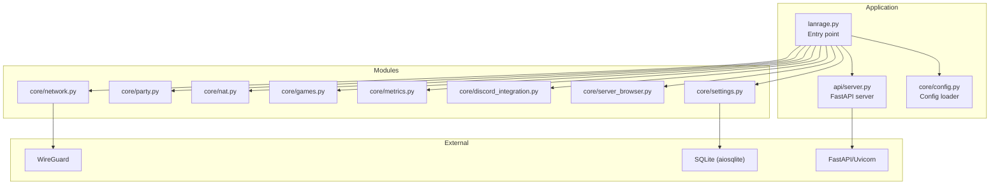
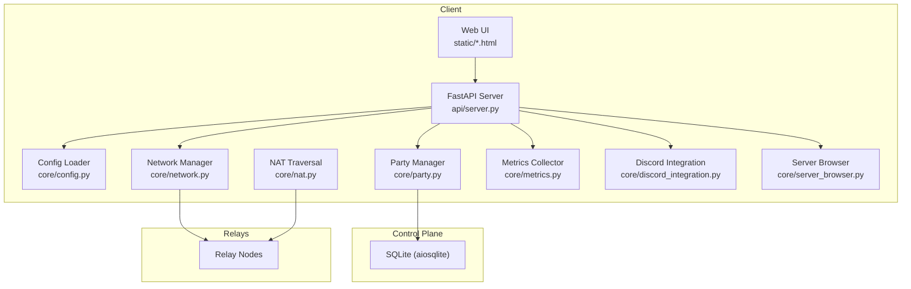
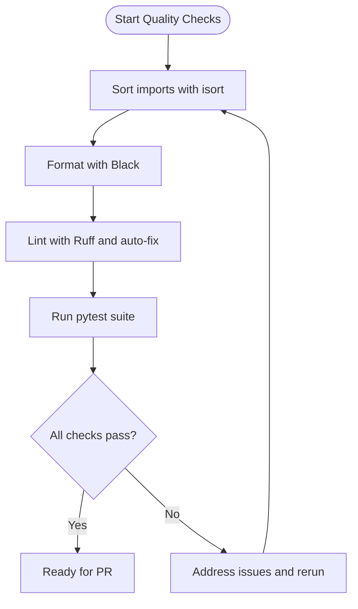
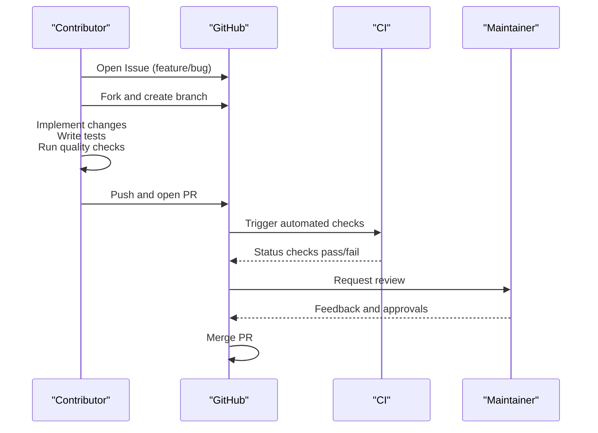
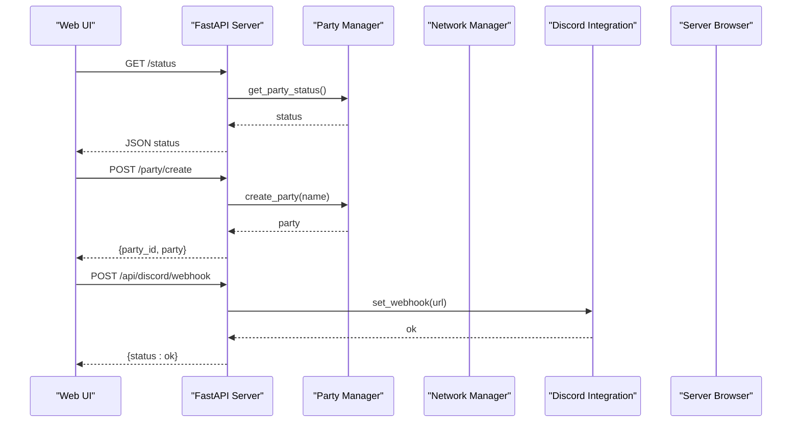
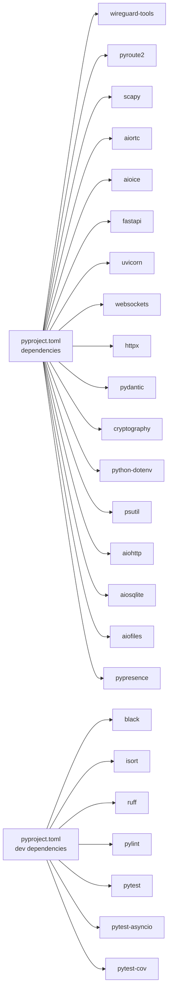

# Development Guide

<cite>
**Referenced Files in This Document**
- [README.md](file://README.md)
- [CONTRIBUTING.md](file://CONTRIBUTING.md)
- [docs/ROADMAP.md](file://docs/ROADMAP.md)
- [pyproject.toml](file://pyproject.toml)
- [requirements.txt](file://requirements.txt)
- [setup.py](file://setup.py)
- [lanrage.py](file://lanrage.py)
- [api/server.py](file://api/server.py)
- [core/config.py](file://core/config.py)
- [.github/PULL_REQUEST_TEMPLATE.md](file://.github/PULL_REQUEST_TEMPLATE.md)
- [.github/ISSUE_TEMPLATE/bug_report.md](file://.github/ISSUE_TEMPLATE/bug_report.md)
- [.github/ISSUE_TEMPLATE/feature_request.md](file://.github/ISSUE_TEMPLATE/feature_request.md)
- [docs/API.md](file://docs/API.md)
- [docs/ARCHITECTURE.md](file://docs/ARCHITECTURE.md)
- [game_profiles/README.md](file://game_profiles/README.md)
</cite>

## Table of Contents
1. [Introduction](#introduction)
2. [Project Structure](#project-structure)
3. [Core Components](#core-components)
4. [Architecture Overview](#architecture-overview)
5. [Detailed Component Analysis](#detailed-component-analysis)
6. [Dependency Analysis](#dependency-analysis)
7. [Performance Considerations](#performance-considerations)
8. [Troubleshooting Guide](#troubleshooting-guide)
9. [Conclusion](#conclusion)
10. [Appendices](#appendices)

## Introduction
This development guide provides comprehensive instructions for contributing to LANrage, a gaming-focused mesh VPN designed to make online gaming feel like a LAN party. It covers environment setup, coding standards, contribution workflows, roadmap alignment, extension development, and practical guidance for new contributors.

## Project Structure
LANrage is organized into modular components:
- api: FastAPI REST API server and endpoints
- core: Networking, control plane, party management, settings, metrics, and integrations
- servers: Control plane and relay server implementations
- static: Web UI assets
- tests: Unit and integration tests
- docs: Documentation for architecture, API, and operational topics
- game_profiles: Built-in and custom game profiles
- Tools and scripts: Setup, performance monitoring, and convenience scripts

**Diagram sources**
- [lanrage.py](file://lanrage.py#L1-L230)
- [api/server.py](file://api/server.py#L1-L701)
- [core/config.py](file://core/config.py#L1-L114)

**Section sources**
- [README.md](file://README.md#L458-L472)
- [docs/ARCHITECTURE.md](file://docs/ARCHITECTURE.md#L1-L206)

## Core Components
- Entry point and lifecycle: [lanrage.py](file://lanrage.py#L1-L230)
- API server and endpoints: [api/server.py](file://api/server.py#L1-L701)
- Configuration management: [core/config.py](file://core/config.py#L1-L114)
- Setup and environment bootstrap: [setup.py](file://setup.py#L1-L100)
- Dependency and tool configuration: [pyproject.toml](file://pyproject.toml#L1-L179), [requirements.txt](file://requirements.txt#L1-L56)

Key responsibilities:
- lanrage.py initializes settings, network, party, NAT, control plane, metrics, Discord, and starts the API server.
- api/server.py exposes REST endpoints for party management, metrics, Discord integration, server browser, and settings.
- core/config.py loads configuration from a database-first settings store.
- setup.py automates virtual environment creation, dependency installation, and initial database setup.

**Section sources**
- [lanrage.py](file://lanrage.py#L40-L230)
- [api/server.py](file://api/server.py#L1-L701)
- [core/config.py](file://core/config.py#L49-L114)
- [setup.py](file://setup.py#L46-L100)
- [pyproject.toml](file://pyproject.toml#L26-L50)

## Architecture Overview
LANrage separates concerns into a control plane (peer discovery and coordination) and a data plane (encrypted WireGuard tunnels). The system supports direct P2P connections with relay fallback for NAT traversal, broadcast/multicast emulation for legacy games, and a web UI with REST API.

**Diagram sources**
- [docs/ARCHITECTURE.md](file://docs/ARCHITECTURE.md#L1-L206)
- [api/server.py](file://api/server.py#L1-L701)
- [core/config.py](file://core/config.py#L1-L114)

**Section sources**
- [docs/ARCHITECTURE.md](file://docs/ARCHITECTURE.md#L1-L206)
- [docs/API.md](file://docs/API.md#L1-L14)

## Detailed Component Analysis

### Development Environment Setup
- Python version: 3.12+
- Dependency management: pyproject.toml (PEP 621) with optional dev dependencies for code quality and testing
- Installation method: setup.py orchestrates virtual environment creation and dependency installation via uv
- Verification: run the main entry point and access the web UI at the configured host/port

Recommended steps:
- Use the provided setup script to create a virtual environment and install dependencies
- Activate the environment and run the application
- Access the web UI to configure settings through the database-backed configuration system

**Section sources**
- [README.md](file://README.md#L58-L88)
- [setup.py](file://setup.py#L46-L100)
- [pyproject.toml](file://pyproject.toml#L10-L11)
- [requirements.txt](file://requirements.txt#L1-L56)

### Coding Standards and Tooling
LANrage enforces consistent code quality using:
- Formatting: Black (line length 88)
- Import sorting: isort (profile black)
- Linting: Ruff (modern, fast linter with selected rules)
- Type hints and docstrings: Required for public APIs
- Testing: pytest with coverage for core, api, and servers modules

Quality pipeline:
- isort → black → ruff --fix → pytest

**Diagram sources**
- [CONTRIBUTING.md](file://CONTRIBUTING.md#L53-L63)
- [pyproject.toml](file://pyproject.toml#L75-L137)

**Section sources**
- [CONTRIBUTING.md](file://CONTRIBUTING.md#L212-L264)
- [pyproject.toml](file://pyproject.toml#L75-L137)

### Contribution Workflow
- Issue-first for new features; discuss in GitHub Issues before implementation
- Fork, branch, implement, test, and submit PR
- PR template includes quality checklist, testing verification, and documentation updates
- Automated checks run on CI; maintainers review and approve

**Diagram sources**
- [CONTRIBUTING.md](file://CONTRIBUTING.md#L323-L380)
- [.github/PULL_REQUEST_TEMPLATE.md](file://.github/PULL_REQUEST_TEMPLATE.md#L1-L96)

**Section sources**
- [CONTRIBUTING.md](file://CONTRIBUTING.md#L67-L380)
- [.github/PULL_REQUEST_TEMPLATE.md](file://.github/PULL_REQUEST_TEMPLATE.md#L1-L96)

### Issue Reporting Guidelines
- Use the bug report template for reproducible issues with environment details and logs
- Use the feature request template with problem statement, proposed solution, and roadmap alignment
- Include relevant logs from the configuration directory and environment details

**Section sources**
- [.github/ISSUE_TEMPLATE/bug_report.md](file://.github/ISSUE_TEMPLATE/bug_report.md#L1-L75)
- [.github/ISSUE_TEMPLATE/feature_request.md](file://.github/ISSUE_TEMPLATE/feature_request.md#L1-L73)
- [CONTRIBUTING.md](file://CONTRIBUTING.md#L131-L210)

### API Reference and Extension Points
The REST API provides:
- Party management: create, join, leave, status
- Metrics: peer and system summaries, latency history, sessions
- Discord integration: webhook, invite, status, instructions, test notifications
- Server browser: list, register, heartbeat, player count, join, favorites, latency, stats, games
- Settings: get, update, reset, saved configs, activate, delete

**Diagram sources**
- [api/server.py](file://api/server.py#L146-L360)
- [docs/API.md](file://docs/API.md#L1-L340)

**Section sources**
- [docs/API.md](file://docs/API.md#L1-L800)
- [api/server.py](file://api/server.py#L1-L701)

### Extension Development: Game Profiles
LANrage supports custom game profiles to optimize networking behavior per game:
- Profiles are JSON-based and grouped by genre
- Custom profiles go under game_profiles/custom/
- Fields include name, executable, ports, protocol, broadcast/multicast flags, keepalive, MTU, description, latency/bandwidth priorities, and packet priority

Guidelines:
- Use genre-specific defaults for latency, bandwidth, and priority
- Enable broadcast/multicast when the game relies on LAN discovery
- Keep MTU at 1420 unless the game requires otherwise
- Restart LANrage to load new profiles

**Section sources**
- [game_profiles/README.md](file://game_profiles/README.md#L1-L174)

### Plugin Architecture and Integrations
- Plugin system is planned for v3.0+ to enable extensibility, custom protocol handlers, webhooks, REST API for automation, and CLI tools
- Current integrations include Discord (webhooks, Rich Presence, invites) and server browser for game discovery and hosting
- Roadmap outlines remote control plane, IPv6, enhanced UI, mobile apps, voice chat, screen sharing, tournament mode, and marketplace for plugins

**Section sources**
- [docs/ROADMAP.md](file://docs/ROADMAP.md#L127-L161)
- [docs/ARCHITECTURE.md](file://docs/ARCHITECTURE.md#L173-L181)

## Dependency Analysis
Primary runtime dependencies include WireGuard tools, networking libraries, FastAPI stack, HTTP client, Pydantic, cryptography, and optional Discord integration. Development dependencies cover code quality and testing.

**Diagram sources**
- [pyproject.toml](file://pyproject.toml#L26-L63)

**Section sources**
- [pyproject.toml](file://pyproject.toml#L26-L63)
- [requirements.txt](file://requirements.txt#L15-L56)

## Performance Considerations
- Latency targets: <5ms for direct P2P, <15ms for relayed connections
- Throughput: line speed with no bottlenecks
- CPU/memory: minimal overhead suitable for gaming workloads
- NAT traversal: STUN/TURN with automatic fallback to relays
- QoS: socket-level prioritization for gaming traffic

**Section sources**
- [docs/ARCHITECTURE.md](file://docs/ARCHITECTURE.md#L119-L126)

## Troubleshooting Guide
Common issues and resolutions:
- Settings database initialization failures: verify permissions and disk space in the configuration directory; use the WebUI to configure settings
- Network initialization failures: ensure WireGuard is installed, running with sufficient privileges, and no conflicting interfaces
- NAT detection failures: expect relay-only mode when NAT traversal is not possible
- Discord integration: validate webhook/invite URLs and ensure bot token is configured

Logs and diagnostics:
- Logs are written to the configuration directory; include relevant entries when filing issues
- Use the API health check endpoint to verify service status

**Section sources**
- [lanrage.py](file://lanrage.py#L67-L93)
- [api/server.py](file://api/server.py#L107-L110)
- [.github/ISSUE_TEMPLATE/bug_report.md](file://.github/ISSUE_TEMPLATE/bug_report.md#L53-L59)

## Conclusion
LANrage’s development guidelines emphasize a streamlined environment, strict code quality, and a clear contribution process aligned with the project’s roadmap. By following the setup, coding standards, and extension guidelines, contributors can efficiently add features, optimize performance, and expand the gaming ecosystem.

## Appendices

### A. Quick Start Commands
- Setup: python setup.py
- Activate environment: .venv activation script
- Run: python lanrage.py
- Tests: pytest tests/

**Section sources**
- [README.md](file://README.md#L58-L88)
- [CONTRIBUTING.md](file://CONTRIBUTING.md#L19-L51)

### B. Roadmap Alignment
- v1.0: Production ready with core features
- v1.1: Remote control plane, IPv6, enhanced UI, more game profiles, performance optimizations
- v2.0: Mobile apps, voice chat, screen sharing, tournament mode
- v3.0+: Plugin system, advanced analytics, enterprise features, API for third-party integrations

**Section sources**
- [docs/ROADMAP.md](file://docs/ROADMAP.md#L1-L251)