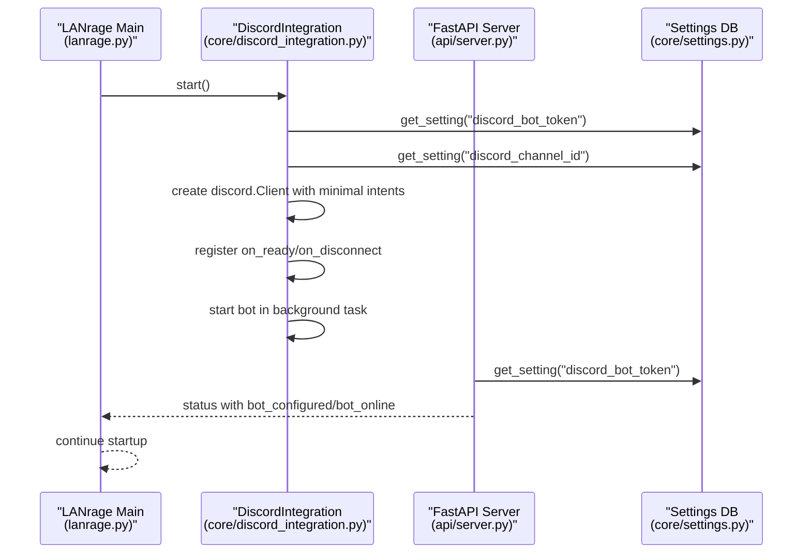
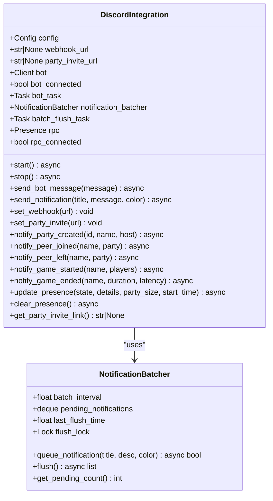
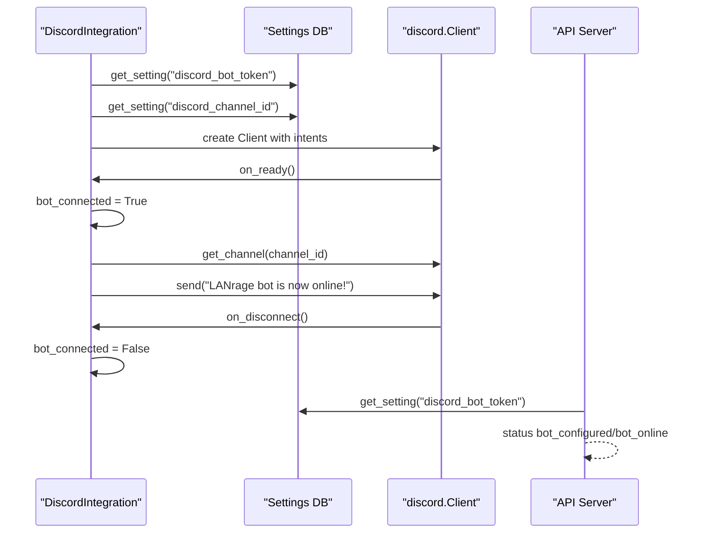
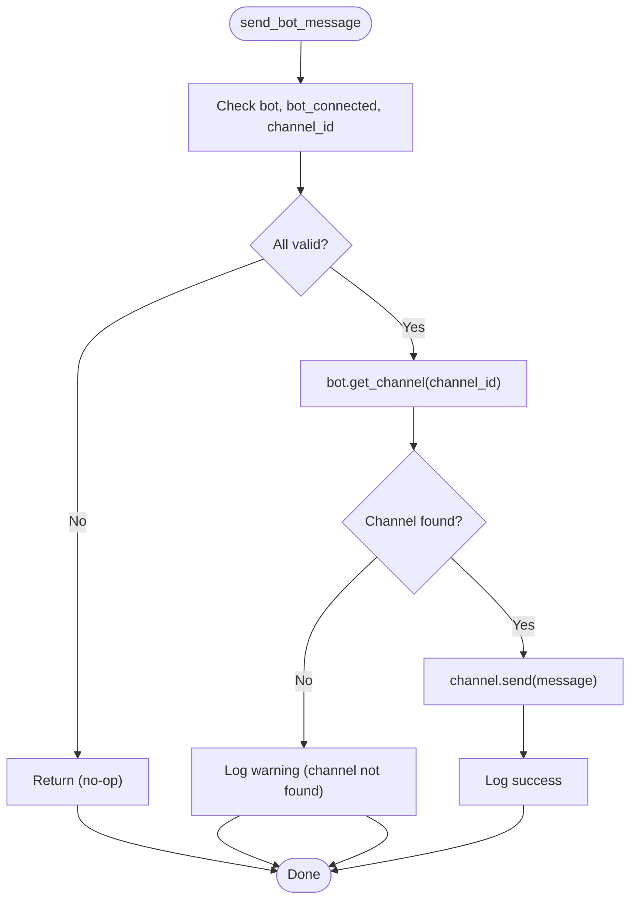
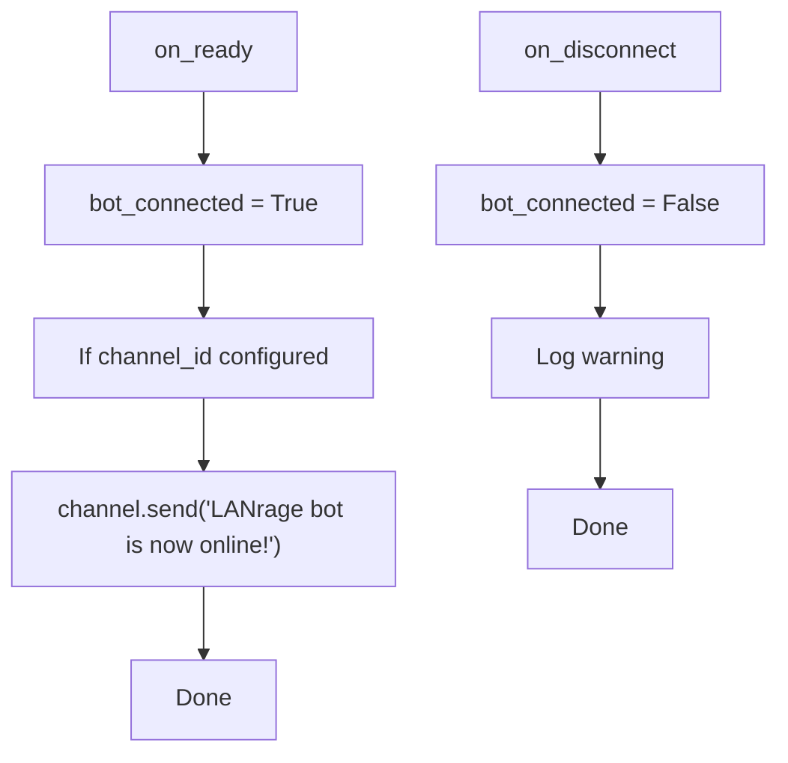
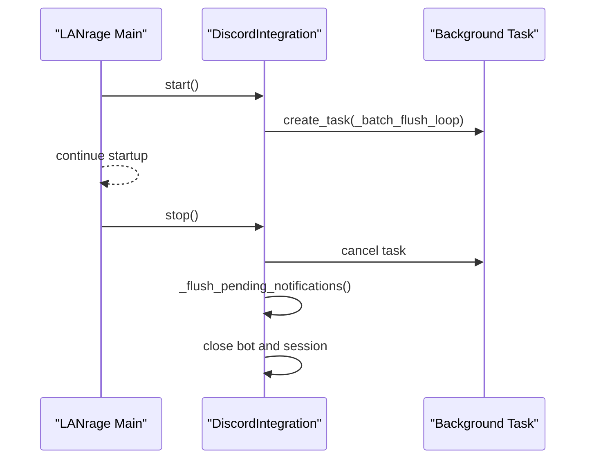
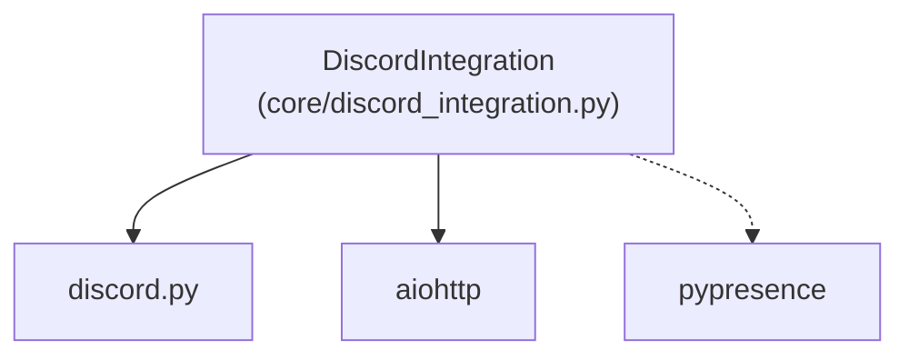
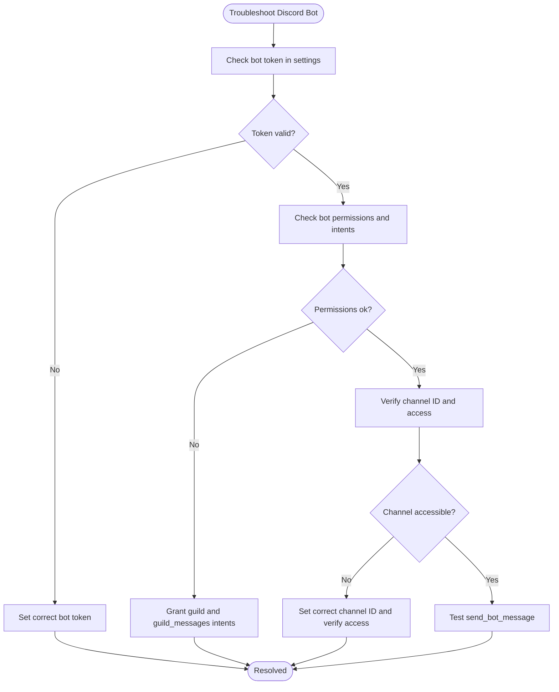

# Discord Bot

<cite>
**Referenced Files in This Document**
- [discord_integration.py](file://core/discord_integration.py)
- [DISCORD.md](file://docs/DISCORD.md)
- [DISCORD_SETUP_GUIDE.md](file://docs/DISCORD_SETUP_GUIDE.md)
- [DISCORD_APP_SETUP.md](file://docs/DISCORD_APP_SETUP.md)
- [TROUBLESHOOTING.md](file://docs/TROUBLESHOOTING.md)
- [settings.py](file://core/settings.py)
- [config.py](file://core/config.py)
- [server.py](file://api/server.py)
- [logging_config.py](file://core/logging_config.py)
- [lanrage.py](file://lanrage.py)
- [requirements.txt](file://requirements.txt)
</cite>

## Table of Contents
1. [Introduction](#introduction)
2. [Project Structure](#project-structure)
3. [Core Components](#core-components)
4. [Architecture Overview](#architecture-overview)
5. [Detailed Component Analysis](#detailed-component-analysis)
6. [Dependency Analysis](#dependency-analysis)
7. [Performance Considerations](#performance-considerations)
8. [Troubleshooting Guide](#troubleshooting-guide)
9. [Conclusion](#conclusion)
10. [Appendices](#appendices)

## Introduction
This document explains the Discord bot functionality within the LANrage project, focusing on bot configuration, message delivery, and channel management. It covers the bot connection process (including token validation, intent configuration, and error handling), the send_bot_message mechanism (channel ID configuration, message formatting, and delivery confirmation), event handling (on_ready and on_disconnect), setup instructions for creating Discord applications and tokens, minimal intent configuration, connectivity troubleshooting, and asynchronous execution with background task management.

## Project Structure
The Discord bot is implemented as part of the Discord integration module and is integrated into the main application lifecycle and API server.

```mermaid
graph TB
subgraph "Core"
DI["DiscordIntegration<br/>(core/discord_integration.py)"]
CFG["Config<br/>(core/config.py)"]
ST["Settings DB<br/>(core/settings.py)"]
LOG["Logging<br/>(core/logging_config.py)"]
end
subgraph "API"
API["FastAPI Server<br/>(api/server.py)"]
end
subgraph "App"
LNR["LANrage Main<br/>(lanrage.py)"]
end
subgraph "Docs"
DOC1["DISCORD.md"]
DOC2["DISCORD_SETUP_GUIDE.md"]
DOC3["DISCORD_APP_SETUP.md"]
DOC4["TROUBLESHOOTING.md"]
end
LNR --> DI
LNR --> API
API --> DI
DI --> ST
DI --> LOG
DI --> CFG
DOC1 -.-> DI
DOC2 -.-> DI
DOC3 -.-> DI
DOC4 -.-> DI
```

**Diagram sources**
- [discord_integration.py](file://core/discord_integration.py#L81-L132)
- [config.py](file://core/config.py#L17-L114)
- [settings.py](file://core/settings.py#L466-L525)
- [server.py](file://api/server.py#L278-L359)
- [lanrage.py](file://lanrage.py#L132-L136)
- [DISCORD.md](file://docs/DISCORD.md#L1-L606)
- [DISCORD_SETUP_GUIDE.md](file://docs/DISCORD_SETUP_GUIDE.md#L1-L182)
- [DISCORD_APP_SETUP.md](file://docs/DISCORD_APP_SETUP.md#L1-L195)
- [TROUBLESHOOTING.md](file://docs/TROUBLESHOOTING.md#L695-L740)

**Section sources**
- [discord_integration.py](file://core/discord_integration.py#L81-L132)
- [server.py](file://api/server.py#L278-L359)
- [lanrage.py](file://lanrage.py#L132-L136)

## Core Components
- DiscordIntegration: Orchestrates Discord bot and webhook integrations, manages background tasks, and exposes methods for sending notifications and messages.
- Settings database: Stores Discord bot token, channel ID, webhook URL, and invite URL.
- API endpoints: Expose configuration and testing of Discord bot and webhook.
- Logging: Provides structured logging and context variables for tracing Discord operations.

Key responsibilities:
- Bot connection with minimal intents and event handling.
- Message sending to a configured channel via send_bot_message.
- Background task management for periodic operations and graceful shutdown.
- Integration with the main application lifecycle and API server.

**Section sources**
- [discord_integration.py](file://core/discord_integration.py#L81-L132)
- [settings.py](file://core/settings.py#L476-L507)
- [server.py](file://api/server.py#L278-L359)
- [logging_config.py](file://core/logging_config.py#L157-L277)

## Architecture Overview
The Discord bot is integrated into the application startup and API server. The bot connects asynchronously, registers event handlers, and sends messages to a configured channel. Background tasks manage periodic operations and ensure clean shutdown.



**Diagram sources**
- [lanrage.py](file://lanrage.py#L132-L136)
- [discord_integration.py](file://core/discord_integration.py#L242-L295)
- [server.py](file://api/server.py#L311-L329)
- [settings.py](file://core/settings.py#L476-L507)

## Detailed Component Analysis

### DiscordIntegration Class
The DiscordIntegration class encapsulates Discord bot and webhook functionality, including:
- Bot connection with minimal intents.
- Event handling for on_ready and on_disconnect.
- Background task management for periodic operations.
- Notification batching and webhook sending.
- Utility methods for sending bot messages and updating Rich Presence.



**Diagram sources**
- [discord_integration.py](file://core/discord_integration.py#L81-L132)
- [discord_integration.py](file://core/discord_integration.py#L28-L78)

**Section sources**
- [discord_integration.py](file://core/discord_integration.py#L81-L132)
- [discord_integration.py](file://core/discord_integration.py#L28-L78)

### Bot Connection Process
- Token and channel ID are loaded from the settings database.
- Minimal intents are configured: guilds and guild_messages; message_content disabled.
- The bot is started in a background task.
- on_ready sets bot_connected and optionally sends a startup message to the configured channel.
- on_disconnect clears bot_connected and logs a warning.



**Diagram sources**
- [discord_integration.py](file://core/discord_integration.py#L242-L295)
- [discord_integration.py](file://core/discord_integration.py#L267-L295)
- [server.py](file://api/server.py#L311-L329)
- [settings.py](file://core/settings.py#L476-L507)

**Section sources**
- [discord_integration.py](file://core/discord_integration.py#L242-L295)
- [discord_integration.py](file://core/discord_integration.py#L267-L295)
- [server.py](file://api/server.py#L311-L329)

### send_bot_message Mechanism
- Validates bot availability, connection status, and channel ID.
- Retrieves the channel by ID and sends the message.
- Logs success or error with context.



**Diagram sources**
- [discord_integration.py](file://core/discord_integration.py#L347-L367)

**Section sources**
- [discord_integration.py](file://core/discord_integration.py#L347-L367)

### Event Handling: on_ready and on_disconnect
- on_ready: Sets bot_connected to True and optionally sends a startup message to the configured channel.
- on_disconnect: Sets bot_connected to False and logs a warning.



**Diagram sources**
- [discord_integration.py](file://core/discord_integration.py#L267-L295)

**Section sources**
- [discord_integration.py](file://core/discord_integration.py#L267-L295)

### Minimal Intent Configuration
- Intents include guilds and guild_messages.
- message_content is disabled to minimize permissions.
- This aligns with sending messages to a configured channel without reading message content.

**Section sources**
- [discord_integration.py](file://core/discord_integration.py#L258-L262)

### Asynchronous Execution and Background Tasks
- start initializes aiohttp session, loads settings, attempts to connect Rich Presence and bot, and starts a background task to flush notifications.
- stop cancels the batch flush task, performs a final flush, closes the bot, cancels the bot task, and closes the aiohttp session.
- The main application integrates DiscordIntegration into the startup and shutdown lifecycle.



**Diagram sources**
- [discord_integration.py](file://core/discord_integration.py#L104-L178)
- [lanrage.py](file://lanrage.py#L170-L214)

**Section sources**
- [discord_integration.py](file://core/discord_integration.py#L104-L178)
- [lanrage.py](file://lanrage.py#L170-L214)

## Dependency Analysis
External dependencies relevant to Discord bot:
- discord.py: Required for bot functionality.
- aiohttp: Used for webhook requests.
- pypresence: Optional for Rich Presence.



**Diagram sources**
- [discord_integration.py](file://core/discord_integration.py#L10-L13)
- [requirements.txt](file://requirements.txt#L42-L45)

**Section sources**
- [discord_integration.py](file://core/discord_integration.py#L10-L13)
- [requirements.txt](file://requirements.txt#L42-L45)

## Performance Considerations
- Notification batching reduces API calls by grouping similar events within a short time window.
- Background tasks run independently and are cancelled gracefully on shutdown.
- Webhook requests use an aiohttp session to reuse connections efficiently.

[No sources needed since this section provides general guidance]

## Troubleshooting Guide
Common Discord bot issues and resolutions:
- Invalid token: Ensure the token is set in settings and matches the configured bot token.
- Insufficient permissions: Confirm the bot has access to the target guild and channel; verify intents are configured correctly.
- Channel access problems: Verify the channel ID is correct and the bot can access the channel.
- Connection timeouts: Check network connectivity and firewall settings; ensure the bot remains connected.
- Message delivery failures: Review logs for errors and confirm webhook/channel configuration.



**Diagram sources**
- [TROUBLESHOOTING.md](file://docs/TROUBLESHOOTING.md#L695-L740)

**Section sources**
- [TROUBLESHOOTING.md](file://docs/TROUBLESHOOTING.md#L695-L740)

## Conclusion
The Discord bot integration in LANrage provides a minimal, efficient, and resilient way to deliver messages to a configured channel and coordinate with Discord’s ecosystem. By using minimal intents, background tasks, and structured logging, the integration maintains reliability and ease of operation. Proper setup of tokens, channel IDs, and permissions ensures smooth operation, while the provided troubleshooting guidance helps resolve common issues quickly.

[No sources needed since this section summarizes without analyzing specific files]

## Appendices

### Setup Instructions
- Create a Discord application and bot:
  - Follow the steps in the Discord App Setup Guide to register an application and obtain a bot token.
- Configure channel permissions:
  - Ensure the bot has access to the target guild and channel.
- Configure settings:
  - Store the bot token and channel ID in the settings database.
- Start the application:
  - The bot will connect automatically and send a startup message upon on_ready.

**Section sources**
- [DISCORD_APP_SETUP.md](file://docs/DISCORD_APP_SETUP.md#L1-L195)
- [DISCORD_SETUP_GUIDE.md](file://docs/DISCORD_SETUP_GUIDE.md#L1-L182)
- [settings.py](file://core/settings.py#L476-L507)

### API Endpoints for Discord Bot
- POST /api/discord/webhook: Set webhook URL.
- POST /api/discord/invite: Set invite URL.
- GET /api/discord/status: Get integration status (bot configured/online).
- GET /api/discord/instructions: Get setup instructions.
- POST /api/discord/test: Send test notification.

**Section sources**
- [server.py](file://api/server.py#L281-L359)
- [DISCORD.md](file://docs/DISCORD.md#L534-L547)