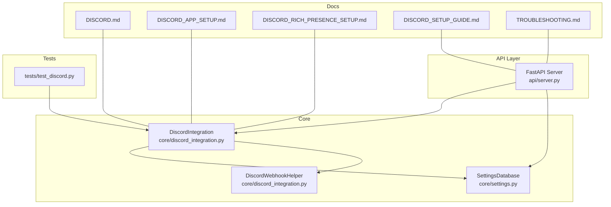
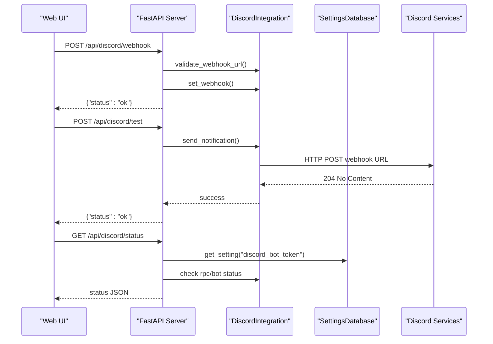
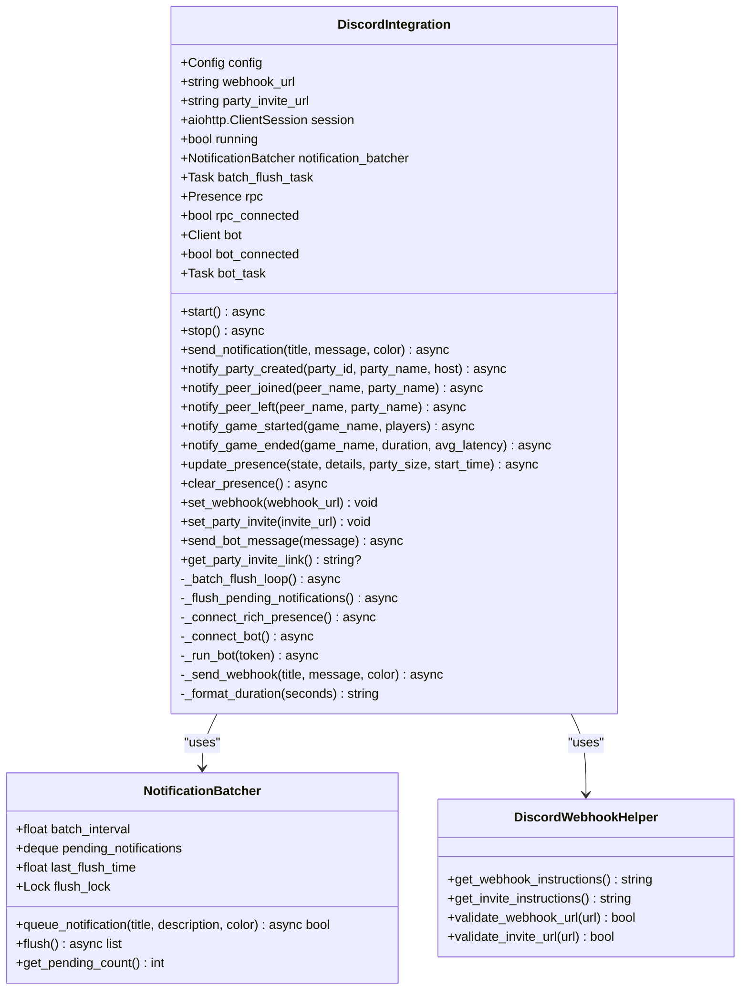
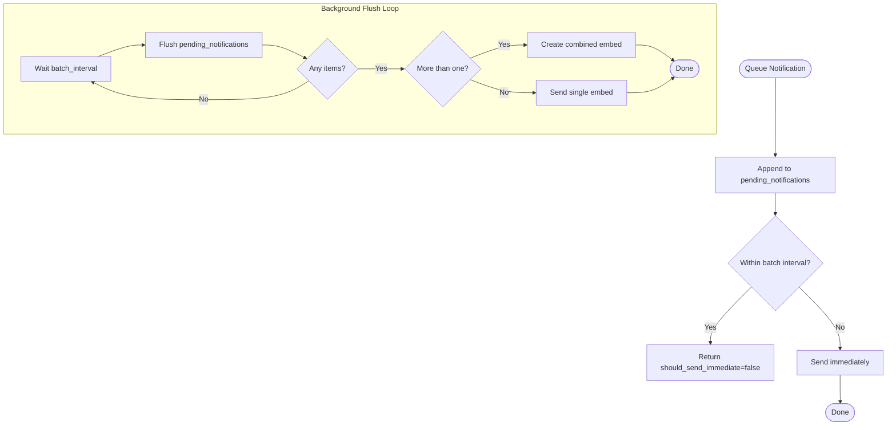
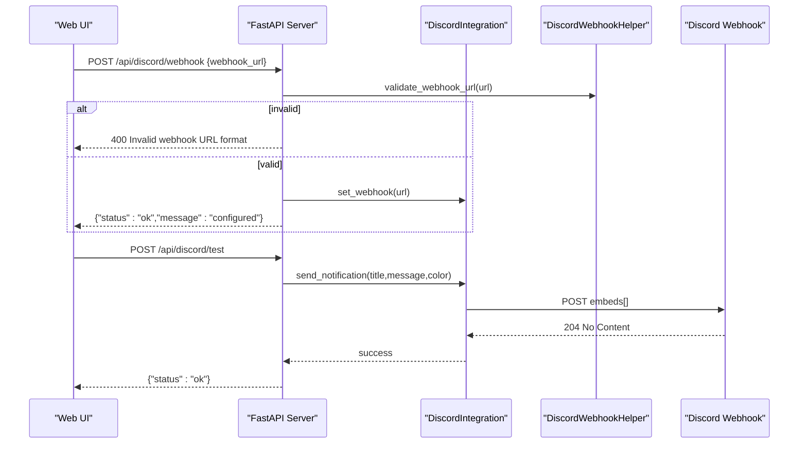
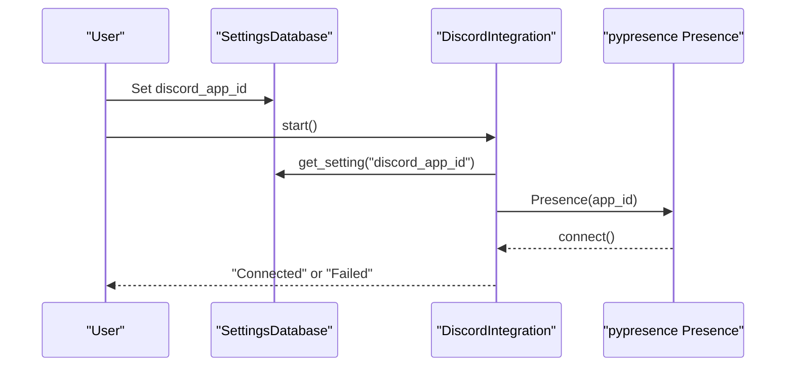
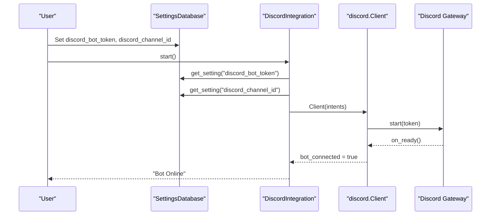
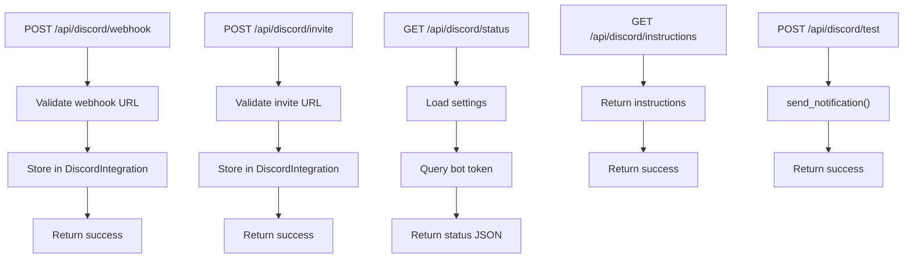
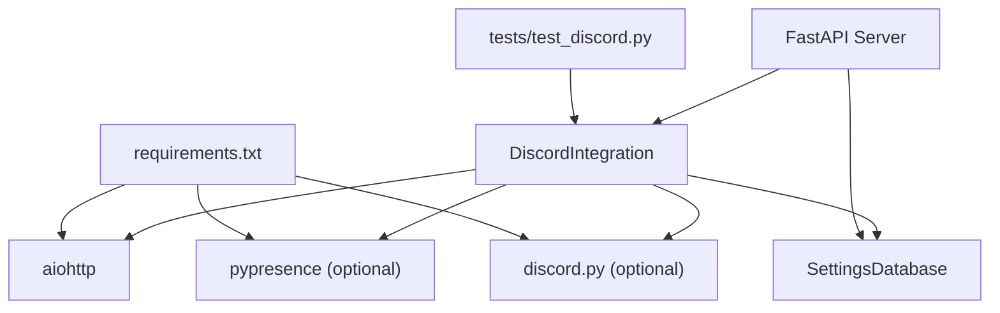

# Discord Integration

<cite>
**Referenced Files in This Document**
- [core/discord_integration.py](file://core/discord_integration.py)
- [api/server.py](file://api/server.py)
- [core/settings.py](file://core/settings.py)
- [docs/DISCORD.md](file://docs/DISCORD.md)
- [docs/DISCORD_APP_SETUP.md](file://docs/DISCORD_APP_SETUP.md)
- [docs/DISCORD_RICH_PRESENCE_SETUP.md](file://docs/DISCORD_RICH_PRESENCE_SETUP.md)
- [docs/DISCORD_SETUP_GUIDE.md](file://docs/DISCORD_SETUP_GUIDE.md)
- [docs/TROUBLESHOOTING.md](file://docs/TROUBLESHOOTING.md)
- [tests/test_discord.py](file://tests/test_discord.py)
- [requirements.txt](file://requirements.txt)
- [setup.py](file://setup.py)
</cite>

## Table of Contents
1. [Introduction](#introduction)
2. [Project Structure](#project-structure)
3. [Core Components](#core-components)
4. [Architecture Overview](#architecture-overview)
5. [Detailed Component Analysis](#detailed-component-analysis)
6. [Dependency Analysis](#dependency-analysis)
7. [Performance Considerations](#performance-considerations)
8. [Troubleshooting Guide](#troubleshooting-guide)
9. [Conclusion](#conclusion)
10. [Appendices](#appendices)

## Introduction
This document provides comprehensive documentation for LANrage’s Discord integration system. It covers webhook notifications, Discord Rich Presence, and Discord bot functionality. The documentation explains the DiscordIntegration class architecture, webhook configuration and validation, notification batching, real-time presence updates, and bot setup. It also includes setup guides for Discord app creation, webhook permissions, and bot configuration, along with troubleshooting guidance for common integration issues, API rate limits, and connection failures. Security considerations for webhook URLs and bot tokens are addressed.

## Project Structure
The Discord integration spans several modules:
- Core integration logic resides in the Discord integration module.
- The API server exposes endpoints for configuring and testing Discord integration.
- Settings persistence stores Discord-related configuration.
- Documentation provides setup and troubleshooting guides.
- Tests validate core functionality.

**Diagram sources**
- [core/discord_integration.py](file://core/discord_integration.py#L81-L632)
- [api/server.py](file://api/server.py#L281-L358)
- [core/settings.py](file://core/settings.py#L466-L525)
- [docs/DISCORD.md](file://docs/DISCORD.md#L1-L606)
- [docs/DISCORD_APP_SETUP.md](file://docs/DISCORD_APP_SETUP.md#L1-L195)
- [docs/DISCORD_RICH_PRESENCE_SETUP.md](file://docs/DISCORD_RICH_PRESENCE_SETUP.md#L1-L190)
- [docs/DISCORD_SETUP_GUIDE.md](file://docs/DISCORD_SETUP_GUIDE.md#L1-L182)
- [docs/TROUBLESHOOTING.md](file://docs/TROUBLESHOOTING.md#L695-L740)
- [tests/test_discord.py](file://tests/test_discord.py#L1-L126)

**Section sources**
- [core/discord_integration.py](file://core/discord_integration.py#L1-L633)
- [api/server.py](file://api/server.py#L1-L701)
- [core/settings.py](file://core/settings.py#L1-L525)
- [docs/DISCORD.md](file://docs/DISCORD.md#L1-L606)
- [docs/DISCORD_APP_SETUP.md](file://docs/DISCORD_APP_SETUP.md#L1-L195)
- [docs/DISCORD_RICH_PRESENCE_SETUP.md](file://docs/DISCORD_RICH_PRESENCE_SETUP.md#L1-L190)
- [docs/DISCORD_SETUP_GUIDE.md](file://docs/DISCORD_SETUP_GUIDE.md#L1-L182)
- [docs/TROUBLESHOOTING.md](file://docs/TROUBLESHOOTING.md#L695-L740)
- [tests/test_discord.py](file://tests/test_discord.py#L1-L126)

## Core Components
- DiscordIntegration: Main integration class managing webhook notifications, Rich Presence, and optional Discord bot.
- NotificationBatcher: Batches notifications to reduce API calls.
- DiscordWebhookHelper: Provides helpers for webhook and invite setup, validation, and instructions.
- API endpoints: Expose configuration and testing for Discord integration.
- Settings persistence: Stores Discord configuration in a database.

Key capabilities:
- Webhook notifications with embed formatting and batching.
- Rich Presence updates with configurable app ID and assets.
- Optional Discord bot for online presence and channel messaging.
- URL validation and setup instructions.
- Graceful error handling and cleanup.

**Section sources**
- [core/discord_integration.py](file://core/discord_integration.py#L81-L632)
- [api/server.py](file://api/server.py#L281-L358)
- [core/settings.py](file://core/settings.py#L476-L500)
- [docs/DISCORD.md](file://docs/DISCORD.md#L1-L606)

## Architecture Overview
The Discord integration architecture consists of:
- Core integration module orchestrating webhook, Rich Presence, and bot.
- API layer exposing endpoints for configuration and testing.
- Settings database storing Discord configuration.
- Documentation and tests validating behavior.

**Diagram sources**
- [api/server.py](file://api/server.py#L281-L358)
- [core/discord_integration.py](file://core/discord_integration.py#L306-L401)
- [core/settings.py](file://core/settings.py#L494-L498)

## Detailed Component Analysis

### DiscordIntegration Class
Responsibilities:
- Manage webhook URL and party invite URL.
- Batch notifications to reduce API calls.
- Send webhook notifications with embed formatting.
- Update and clear Discord Rich Presence.
- Optionally manage a Discord bot for online presence and channel messaging.
- Lifecycle management (start/stop) with graceful cleanup.

Key methods:
- start(): Initializes aiohttp session, loads settings, connects to Rich Presence and bot, starts batch flush loop.
- stop(): Cancels tasks, flushes pending notifications, closes sessions, disconnects RPC and bot.
- send_notification(): Queues notifications and sends immediately if interval exceeded.
- notify_*(): Convenience methods for party and game session events.
- update_presence()/clear_presence(): Rich Presence management.
- set_webhook()/set_party_invite(): Configuration setters.
- send_bot_message(): Sends a message via the Discord bot to a configured channel.

**Diagram sources**
- [core/discord_integration.py](file://core/discord_integration.py#L81-L632)

**Section sources**
- [core/discord_integration.py](file://core/discord_integration.py#L81-L632)

### Notification Batching System
The batching system reduces API calls by grouping similar notifications within a fixed time window:
- Time window: 500 ms by default.
- Pending notifications are queued in a deque.
- A background task periodically flushes the queue.
- If multiple notifications are flushed, they are combined into a single embed with a summary.

**Diagram sources**
- [core/discord_integration.py](file://core/discord_integration.py#L28-L78)
- [core/discord_integration.py](file://core/discord_integration.py#L179-L204)

**Section sources**
- [core/discord_integration.py](file://core/discord_integration.py#L28-L78)
- [core/discord_integration.py](file://core/discord_integration.py#L179-L204)

### Webhook Setup and Validation
Webhook configuration:
- URL validation ensures the URL starts with the correct Discord webhook prefix.
- Embed formatting includes title, description, color, timestamp, and footer.
- The integration uses an aiohttp ClientSession to POST to the webhook URL.
- Validation is enforced both in the API layer and via helper utilities.

**Diagram sources**
- [api/server.py](file://api/server.py#L281-L358)
- [core/discord_integration.py](file://core/discord_integration.py#L306-L401)
- [core/discord_integration.py](file://core/discord_integration.py#L596-L607)

**Section sources**
- [api/server.py](file://api/server.py#L281-L358)
- [core/discord_integration.py](file://core/discord_integration.py#L306-L401)
- [core/discord_integration.py](file://core/discord_integration.py#L596-L607)
- [docs/DISCORD.md](file://docs/DISCORD.md#L378-L415)

### Discord Rich Presence Integration
Rich Presence configuration:
- Requires pypresence and a registered Discord application.
- The application ID is stored in settings and loaded at runtime.
- Presence updates include state, details, party size, and start time.
- Assets must be uploaded to the Discord Developer Portal under Rich Presence Art Assets.
- The integration runs RPC operations in a thread pool to avoid blocking the event loop.

Setup steps:
- Create a Discord application and upload the required assets.
- Store the application ID in settings.
- Ensure pypresence is installed.
- Restart LANrage to connect.

**Diagram sources**
- [core/discord_integration.py](file://core/discord_integration.py#L206-L241)
- [core/settings.py](file://core/settings.py#L494-L494)
- [docs/DISCORD_APP_SETUP.md](file://docs/DISCORD_APP_SETUP.md#L46-L61)

**Section sources**
- [core/discord_integration.py](file://core/discord_integration.py#L206-L241)
- [core/settings.py](file://core/settings.py#L494-L494)
- [docs/DISCORD_APP_SETUP.md](file://docs/DISCORD_APP_SETUP.md#L46-L61)
- [docs/DISCORD_RICH_PRESENCE_SETUP.md](file://docs/DISCORD_RICH_PRESENCE_SETUP.md#L19-L78)

### Discord Bot Implementation
Bot configuration:
- Requires discord.py and a bot token.
- The bot uses minimal intents (guilds, guild_messages) and does not require message content.
- The bot can send messages to a configured channel and report online status.
- The integration manages bot lifecycle and handles disconnections gracefully.

**Diagram sources**
- [core/discord_integration.py](file://core/discord_integration.py#L242-L295)
- [core/settings.py](file://core/settings.py#L497-L498)
- [api/server.py](file://api/server.py#L582-L611)

**Section sources**
- [core/discord_integration.py](file://core/discord_integration.py#L242-L295)
- [core/settings.py](file://core/settings.py#L497-L498)
- [api/server.py](file://api/server.py#L582-L611)

### API Endpoints for Discord Integration
The API exposes endpoints for:
- Setting webhook URL with validation.
- Setting invite URL with validation.
- Getting integration status (webhook, invite, Rich Presence, bot).
- Getting setup instructions.
- Sending a test notification.

**Diagram sources**
- [api/server.py](file://api/server.py#L281-L358)
- [api/server.py](file://api/server.py#L311-L340)

**Section sources**
- [api/server.py](file://api/server.py#L281-L358)
- [api/server.py](file://api/server.py#L311-L340)

## Dependency Analysis
External dependencies:
- aiohttp: HTTP client for webhook requests.
- pypresence: Optional Rich Presence support.
- discord.py: Optional Discord bot support.
- aiosqlite: Asynchronous SQLite for settings persistence.

Internal dependencies:
- DiscordIntegration depends on SettingsDatabase for configuration.
- API server depends on DiscordIntegration for endpoint handlers.
- Tests depend on DiscordIntegration and helper utilities.

**Diagram sources**
- [requirements.txt](file://requirements.txt#L37-L45)
- [core/discord_integration.py](file://core/discord_integration.py#L10-L13)
- [api/server.py](file://api/server.py#L1-L16)
- [tests/test_discord.py](file://tests/test_discord.py#L6-L7)

**Section sources**
- [requirements.txt](file://requirements.txt#L37-L45)
- [core/discord_integration.py](file://core/discord_integration.py#L10-L13)
- [api/server.py](file://api/server.py#L1-L16)
- [tests/test_discord.py](file://tests/test_discord.py#L6-L7)

## Performance Considerations
- Notification batching reduces API calls by grouping events within a short time window.
- Background tasks handle periodic flushing and bot operations to avoid blocking the main event loop.
- Rich Presence and bot operations are run in thread pools/executors to prevent blocking.
- Embed formatting is lightweight and includes only essential fields.

[No sources needed since this section provides general guidance]

## Troubleshooting Guide
Common issues and resolutions:
- Rich Presence not working:
  - Ensure pypresence is installed and Discord is running.
  - Verify the application ID is correct and assets are uploaded.
  - Restart both Discord and LANrage.
- Webhook not sending:
  - Confirm webhook URL format and permissions.
  - Test webhook using curl or the API test endpoint.
  - Check logs for error details.
- Bot not connecting:
  - Verify bot token and channel ID are configured.
  - Ensure the bot has permissions to send messages in the channel.
  - Check for disconnection events and restart if needed.
- General troubleshooting:
  - Enable debug logging and review logs for detailed error information.
  - Use the built-in diagnostic steps and flowcharts in the troubleshooting guide.

**Section sources**
- [docs/TROUBLESHOOTING.md](file://docs/TROUBLESHOOTING.md#L695-L740)
- [docs/DISCORD.md](file://docs/DISCORD.md#L584-L593)

## Conclusion
LANrage’s Discord integration provides a robust, modular system for webhook notifications, Rich Presence, and optional bot functionality. The integration is designed for reliability and ease of use, with validation, batching, and graceful error handling. The API layer and documentation streamline setup and ongoing management, while tests ensure core functionality remains intact.

[No sources needed since this section summarizes without analyzing specific files]

## Appendices

### Setup Guides
- Discord App Setup: Create a Discord application, upload assets, and configure the application ID.
- Discord Rich Presence Setup: Configure the application ID and verify Rich Presence updates.
- Discord Setup Guide: Complete walkthrough for webhook and invite configuration via the Web UI.

**Section sources**
- [docs/DISCORD_APP_SETUP.md](file://docs/DISCORD_APP_SETUP.md#L1-L195)
- [docs/DISCORD_RICH_PRESENCE_SETUP.md](file://docs/DISCORD_RICH_PRESENCE_SETUP.md#L1-L190)
- [docs/DISCORD_SETUP_GUIDE.md](file://docs/DISCORD_SETUP_GUIDE.md#L1-L182)

### Security Considerations
- Keep webhook URLs private as they allow posting to your channel.
- Invite links can be public or private; configure expiration and usage limits appropriately.
- Bot tokens must be kept secret; restrict access to authorized users.
- All communication uses HTTPS; avoid exposing sensitive data in messages.

**Section sources**
- [docs/DISCORD_SETUP_GUIDE.md](file://docs/DISCORD_SETUP_GUIDE.md#L142-L148)