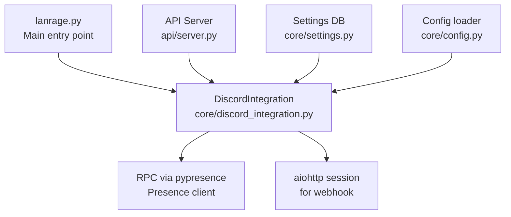
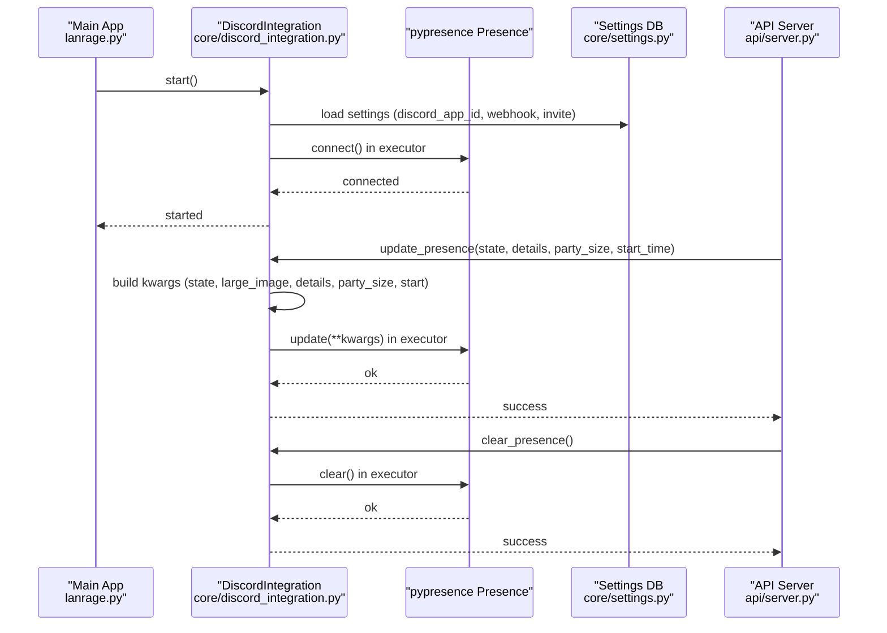
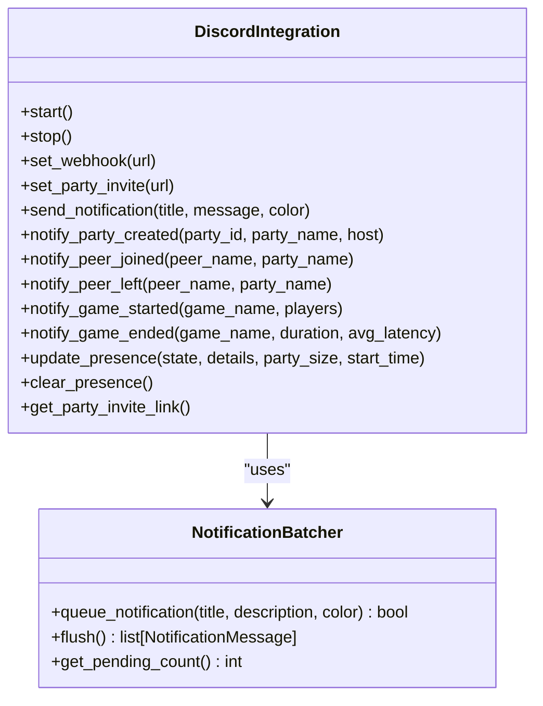
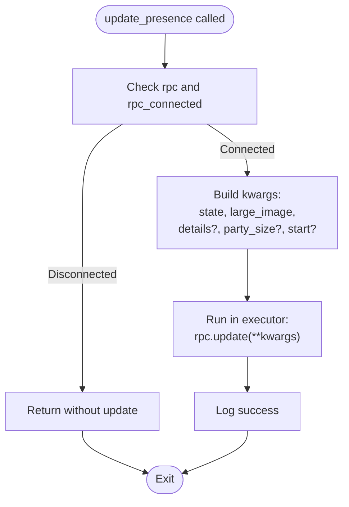
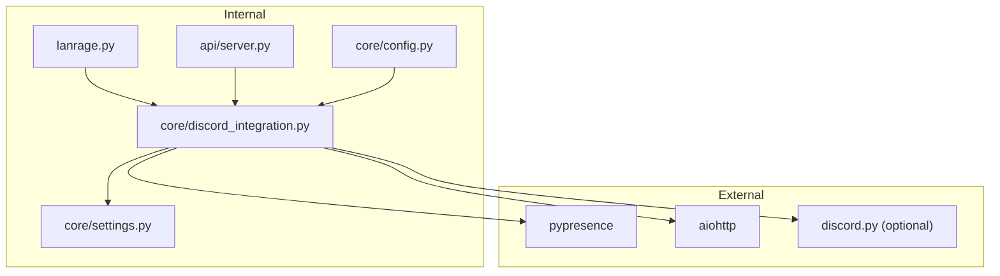

# Rich Presence

<cite>
**Referenced Files in This Document**
- [discord_integration.py](file://core/discord_integration.py)
- [DISCORD.md](file://docs/DISCORD.md)
- [DISCORD_RICH_PRESENCE_SETUP.md](file://docs/DISCORD_RICH_PRESENCE_SETUP.md)
- [DISCORD_APP_SETUP.md](file://docs/DISCORD_APP_SETUP.md)
- [requirements.txt](file://requirements.txt)
- [server.py](file://api/server.py)
- [settings.py](file://core/settings.py)
- [config.py](file://core/config.py)
- [lanrage.py](file://lanrage.py)
- [test_discord.py](file://tests/test_discord.py)
</cite>

## Table of Contents
1. [Introduction](#introduction)
2. [Project Structure](#project-structure)
3. [Core Components](#core-components)
4. [Architecture Overview](#architecture-overview)
5. [Detailed Component Analysis](#detailed-component-analysis)
6. [Dependency Analysis](#dependency-analysis)
7. [Performance Considerations](#performance-considerations)
8. [Troubleshooting Guide](#troubleshooting-guide)
9. [Conclusion](#conclusion)
10. [Appendices](#appendices)

## Introduction
This document explains the Discord Rich Presence integration in LANrage, focusing on presence state management, asset configuration, and real-time updates. It covers the connection process, update parameters, asset requirements, state management across gaming scenarios, and the threading model used to keep the event loop responsive.

## Project Structure
The Rich Presence integration lives in the core module and is wired into the main application lifecycle and API endpoints. The following diagram shows how the pieces fit together.

**Diagram sources**
- [lanrage.py](file://lanrage.py#L132-L136)
- [discord_integration.py](file://core/discord_integration.py#L81-L132)
- [server.py](file://api/server.py#L278-L358)
- [settings.py](file://core/settings.py#L494-L498)
- [config.py](file://core/config.py#L50-L100)

**Section sources**
- [lanrage.py](file://lanrage.py#L132-L136)
- [discord_integration.py](file://core/discord_integration.py#L81-L132)
- [server.py](file://api/server.py#L278-L358)
- [settings.py](file://core/settings.py#L494-L498)
- [config.py](file://core/config.py#L50-L100)

## Core Components
- DiscordIntegration: Orchestrates Rich Presence, webhooks, and bot connectivity. It loads settings from the database, connects to RPC, and exposes presence update/clear methods.
- Presence (pypresence): Used to update and clear Rich Presence. The integration runs RPC operations in a thread pool to avoid blocking the event loop.
- Settings database: Stores Discord app ID, webhook URL, invite URL, and other integration settings.
- API endpoints: Expose configuration and status checks for Rich Presence and webhooks.

Key responsibilities:
- Connection lifecycle: start/stop, error handling, graceful cleanup.
- Presence updates: state, details, party size, start timestamp.
- Presence clearing: safe removal of presence with fallbacks.
- Asset configuration: large image name and upload procedure.

**Section sources**
- [discord_integration.py](file://core/discord_integration.py#L81-L132)
- [discord_integration.py](file://core/discord_integration.py#L206-L241)
- [discord_integration.py](file://core/discord_integration.py#L467-L535)
- [settings.py](file://core/settings.py#L494-L498)
- [server.py](file://api/server.py#L278-L358)

## Architecture Overview
The Rich Presence flow is event-driven and asynchronous. The main application initializes DiscordIntegration early, then exposes endpoints to configure and inspect status. Presence updates are invoked from higher-level components (e.g., party/game state changes) and executed safely via a thread pool.

**Diagram sources**
- [lanrage.py](file://lanrage.py#L132-L136)
- [discord_integration.py](file://core/discord_integration.py#L104-L132)
- [discord_integration.py](file://core/discord_integration.py#L206-L241)
- [discord_integration.py](file://core/discord_integration.py#L467-L535)
- [server.py](file://api/server.py#L278-L358)
- [settings.py](file://core/settings.py#L494-L498)

## Detailed Component Analysis

### DiscordIntegration: Rich Presence Management
- Initialization and lifecycle:
  - Loads Discord settings from the database on start.
  - Attempts to connect Rich Presence via pypresence.
  - Starts a background task to flush webhook notifications.
- Presence update:
  - Validates connection before updating.
  - Builds kwargs for pypresence update: state, large_image, details, party_size, start.
  - Executes update in a thread pool to avoid blocking the event loop.
- Presence clear:
  - Clears presence via pypresence in a thread pool.
  - Graceful error handling for cleanup.
- Webhook and bot:
  - Webhook notifications are batched and sent asynchronously.
  - Optional Discord bot presence is supported.

**Diagram sources**
- [discord_integration.py](file://core/discord_integration.py#L81-L132)
- [discord_integration.py](file://core/discord_integration.py#L28-L78)

**Section sources**
- [discord_integration.py](file://core/discord_integration.py#L81-L132)
- [discord_integration.py](file://core/discord_integration.py#L467-L535)

### Presence Update Method: Parameters and Behavior
- Parameters:
  - state: Current status shown in Rich Presence.
  - details: Optional additional text (e.g., game name).
  - party_size: Optional tuple of (current, max) party size.
  - start_time: Optional Unix timestamp to show elapsed time.
- Execution:
  - Validates RPC connection.
  - Builds kwargs and executes update in a thread pool.
  - Logs success or error.

**Diagram sources**
- [discord_integration.py](file://core/discord_integration.py#L467-L517)

**Section sources**
- [discord_integration.py](file://core/discord_integration.py#L467-L517)

### Presence Clearing Mechanism
- Clears Rich Presence via pypresence in a thread pool.
- Handles OS-level errors and unexpected exceptions gracefully.

**Section sources**
- [discord_integration.py](file://core/discord_integration.py#L519-L535)

### Asset Configuration and Requirements
- Large image:
  - The integration sets a large_image name for the Rich Presence.
  - The asset must be uploaded to the Discord Developer Portal under the application’s Rich Presence Art Assets.
- Naming convention:
  - The asset name used by the integration is documented in the code comments.
- Upload procedure:
  - Upload the asset in the Discord Developer Portal under the application’s Rich Presence Art Assets section.
  - Ensure the asset name matches exactly what the integration expects.

**Section sources**
- [discord_integration.py](file://core/discord_integration.py#L492-L499)
- [DISCORD_APP_SETUP.md](file://docs/DISCORD_APP_SETUP.md#L33-L43)

### Presence State Management Across Scenarios
- Idle/in-menu:
  - Typical state when not in a party or game.
- In-party:
  - State reflects party membership; optional party_size tuple can be provided.
- In-game:
  - State includes game details; start_time enables elapsed time display.
- Clearing presence:
  - Presence can be cleared when leaving a party or ending a game.

**Section sources**
- [DISCORD_RICH_PRESENCE_SETUP.md](file://docs/DISCORD_RICH_PRESENCE_SETUP.md#L124-L146)
- [discord_integration.py](file://core/discord_integration.py#L467-L535)

### Connection Process and Error Handling
- Connection steps:
  - Load Discord app ID from settings database.
  - Attempt to connect via pypresence in a thread pool.
  - Log success or warnings on failure.
- Error handling:
  - Missing pypresence prints informational guidance.
  - Connection failures are logged as warnings.
  - Cleanup handles OS-level errors and unexpected exceptions.

**Section sources**
- [discord_integration.py](file://core/discord_integration.py#L206-L241)
- [discord_integration.py](file://core/discord_integration.py#L167-L177)

### Threading Model and Executor-Based Updates
- RPC operations (connect, update, clear) are executed in a thread pool to avoid blocking the event loop.
- Webhook operations use an aiohttp session and are awaited asynchronously.
- Background tasks handle notification batching and periodic flushing.

**Section sources**
- [discord_integration.py](file://core/discord_integration.py#L223-L234)
- [discord_integration.py](file://core/discord_integration.py#L510-L512)
- [discord_integration.py](file://core/discord_integration.py#L179-L186)

## Dependency Analysis
- External libraries:
  - pypresence: Required for Rich Presence.
  - aiohttp: Required for webhook notifications.
  - discord.py: Optional for bot presence.
- Internal dependencies:
  - Settings database stores configuration (app ID, webhook, invite).
  - API server exposes endpoints to configure and inspect integration.

**Diagram sources**
- [requirements.txt](file://requirements.txt#L42-L45)
- [settings.py](file://core/settings.py#L494-L498)
- [config.py](file://core/config.py#L50-L100)
- [lanrage.py](file://lanrage.py#L132-L136)
- [discord_integration.py](file://core/discord_integration.py#L81-L132)
- [server.py](file://api/server.py#L278-L358)

**Section sources**
- [requirements.txt](file://requirements.txt#L42-L45)
- [settings.py](file://core/settings.py#L494-L498)
- [server.py](file://api/server.py#L278-L358)

## Performance Considerations
- Non-blocking updates:
  - RPC operations are offloaded to a thread pool to keep the event loop responsive.
- Batched notifications:
  - Webhook notifications are batched to reduce API calls.
- Graceful degradation:
  - Missing assets or RPC failures do not crash the application; logs warnings and continues.

[No sources needed since this section provides general guidance]

## Troubleshooting Guide
Common issues and resolutions:
- Missing pypresence:
  - Install the package to enable Rich Presence.
- Missing Discord app ID:
  - Set the application ID in settings; restart the application.
- Assets not showing:
  - Ensure the asset name matches exactly and wait for CDN propagation.
- Status not updating:
  - Restart Discord and LANrage; ensure the desktop app is running.
- Connection failures:
  - Verify Discord desktop app is running; ensure correct application ID.

**Section sources**
- [DISCORD_RICH_PRESENCE_SETUP.md](file://docs/DISCORD_RICH_PRESENCE_SETUP.md#L79-L123)
- [DISCORD_APP_SETUP.md](file://docs/DISCORD_APP_SETUP.md#L81-L111)
- [discord_integration.py](file://core/discord_integration.py#L236-L241)

## Conclusion
The Rich Presence integration in LANrage provides a robust, non-blocking way to reflect party and game states in Discord. By leveraging a thread pool for RPC operations, batching webhook notifications, and offering clear configuration pathways, the system remains responsive and resilient. Proper asset configuration and careful error handling ensure a smooth user experience.

[No sources needed since this section summarizes without analyzing specific files]

## Appendices

### Setup Instructions: Discord Application and Assets
- Create a Discord application and copy the Application ID.
- Upload the required asset (named exactly as expected by the integration) to Rich Presence Art Assets.
- Configure the application ID in LANrage settings and restart.

**Section sources**
- [DISCORD_APP_SETUP.md](file://docs/DISCORD_APP_SETUP.md#L18-L61)
- [DISCORD_APP_SETUP.md](file://docs/DISCORD_APP_SETUP.md#L33-L43)

### API Endpoints for Discord Integration
- Configure webhook and invite URLs.
- Retrieve integration status and instructions.
- Send test notifications.

**Section sources**
- [server.py](file://api/server.py#L281-L358)
- [DISCORD.md](file://docs/DISCORD.md#L534-L546)

### Tests and Validation
- Unit tests cover webhook validation, invite validation, and presence clearing behavior.

**Section sources**
- [test_discord.py](file://tests/test_discord.py#L63-L99)
- [test_discord.py](file://tests/test_discord.py#L117-L122)