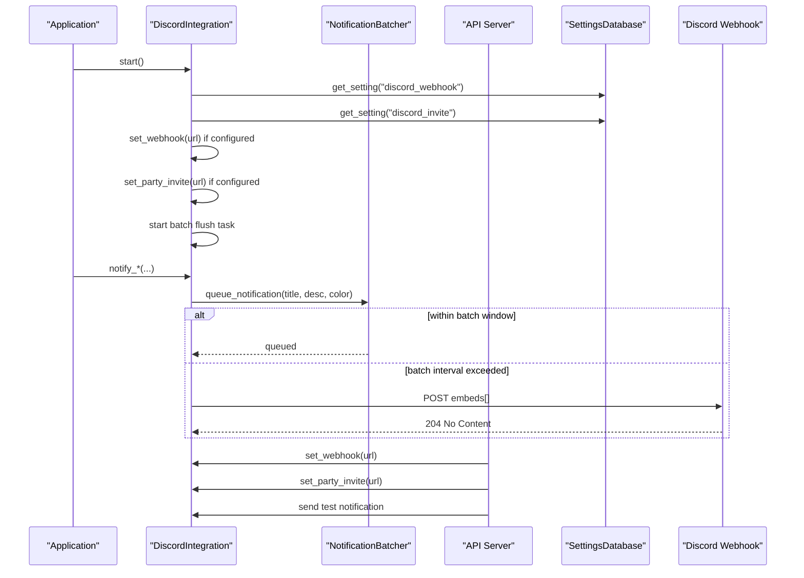
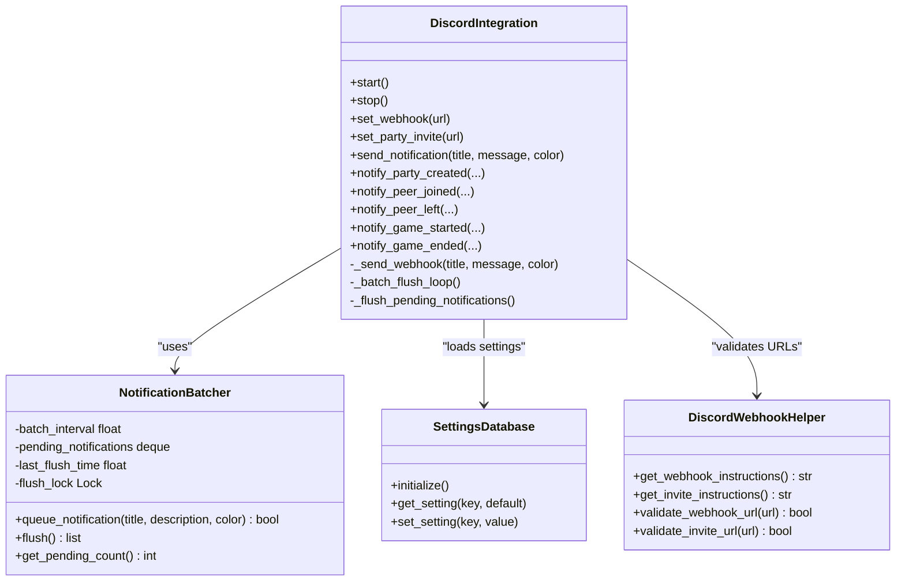

# Webhook Notifications

<cite>
**Referenced Files in This Document**
- [discord_integration.py](file://core/discord_integration.py)
- [settings.py](file://core/settings.py)
- [server.py](file://api/server.py)
- [DISCORD.md](file://docs/DISCORD.md)
- [DISCORD_SETUP_GUIDE.md](file://docs/DISCORD_SETUP_GUIDE.md)
- [test_discord.py](file://tests/test_discord.py)
- [logging_config.py](file://core/logging_config.py)
</cite>

## Table of Contents
1. [Introduction](#introduction)
2. [Project Structure](#project-structure)
3. [Core Components](#core-components)
4. [Architecture Overview](#architecture-overview)
5. [Detailed Component Analysis](#detailed-component-analysis)
6. [Dependency Analysis](#dependency-analysis)
7. [Performance Considerations](#performance-considerations)
8. [Troubleshooting Guide](#troubleshooting-guide)
9. [Conclusion](#conclusion)
10. [Appendices](#appendices)

## Introduction
This document explains the Discord webhook notifications system in LANrage. It covers webhook configuration, notification batching, message formatting, and integration with the application’s settings and API. It also documents the DiscordWebhookHelper class for URL validation and setup instructions, the NotificationBatcher architecture for reducing API calls, and the webhook notification methods for party and game lifecycle events. Guidance is included for validating webhook URLs, configuring embed styles, handling errors, and integrating with LANrage settings and the UI.

## Project Structure
The webhook notifications system spans several modules:
- Core integration and helpers: core/discord_integration.py
- Persistent settings: core/settings.py
- API endpoints: api/server.py
- Documentation: docs/DISCORD.md, docs/DISCORD_SETUP_GUIDE.md
- Tests: tests/test_discord.py
- Logging and context: core/logging_config.py

```mermaid
graph TB
subgraph "Core"
DI["DiscordIntegration<br/>core/discord_integration.py"]
NB["NotificationBatcher<br/>core/discord_integration.py"]
DWH["DiscordWebhookHelper<br/>core/discord_integration.py"]
ST["SettingsDatabase<br/>core/settings.py"]
LOG["Logging & Context<br/>core/logging_config.py"]
end
subgraph "API"
API["Discord Endpoints<br/>api/server.py"]
end
subgraph "Docs"
DOC1["DISCORD.md"]
DOC2["DISCORD_SETUP_GUIDE.md"]
end
subgraph "UI"
HTML["Discord UI<br/>static/discord.html"]
IDX["Index UI<br/>static/index.html"]
end
DI --> NB
DI --> DWH
DI --> ST
DI --> LOG
API --> DI
API --> DWH
HTML --> API
IDX --> API
DOC1 --> DI
DOC2 --> DI
```

**Diagram sources**
- [discord_integration.py](file://core/discord_integration.py#L28-L103)
- [settings.py](file://core/settings.py#L20-L150)
- [server.py](file://api/server.py#L280-L358)
- [DISCORD.md](file://docs/DISCORD.md#L1-L606)
- [DISCORD_SETUP_GUIDE.md](file://docs/DISCORD_SETUP_GUIDE.md#L1-L182)

**Section sources**
- [discord_integration.py](file://core/discord_integration.py#L1-L633)
- [settings.py](file://core/settings.py#L1-L525)
- [server.py](file://api/server.py#L280-L358)
- [DISCORD.md](file://docs/DISCORD.md#L1-L606)
- [DISCORD_SETUP_GUIDE.md](file://docs/DISCORD_SETUP_GUIDE.md#L1-L182)

## Core Components
- DiscordIntegration: Orchestrates webhook notifications, Rich Presence, and optional bot presence. It loads settings from the persistent database, manages an aiohttp session, and exposes notification methods for party and game events.
- NotificationBatcher: Collects notifications within a configurable time window and flushes them as a single message to reduce API traffic.
- DiscordWebhookHelper: Provides setup instructions and validates webhook and invite URL formats.
- SettingsDatabase: Stores and retrieves Discord-related settings (webhook URL, invite URL, bot token, channel ID) and other application settings.
- API endpoints: Expose configuration and testing of Discord integration via HTTP.

Key responsibilities:
- Webhook configuration: set_webhook, set_party_invite, and persistence via settings.
- Notification batching: queue_notification, flush, and background flush loop.
- Embed formatting: title, description, color, timestamp, footer.
- Error handling: graceful warnings and logging for webhook failures and optional components.

**Section sources**
- [discord_integration.py](file://core/discord_integration.py#L81-L103)
- [discord_integration.py](file://core/discord_integration.py#L28-L103)
- [discord_integration.py](file://core/discord_integration.py#L554-L608)
- [settings.py](file://core/settings.py#L476-L507)
- [server.py](file://api/server.py#L280-L358)

## Architecture Overview
The system integrates asynchronous Discord notifications with LANrage’s runtime. The DiscordIntegration instance is started at application boot, loads settings from the database, and begins a background task to flush batched notifications. When events occur (party created/joined/left, game started/ended), the integration formats an embed and sends it via a webhook POST. The API layer validates URLs and exposes endpoints to configure and test the integration.



**Diagram sources**
- [discord_integration.py](file://core/discord_integration.py#L104-L132)
- [discord_integration.py](file://core/discord_integration.py#L179-L186)
- [discord_integration.py](file://core/discord_integration.py#L324-L346)
- [discord_integration.py](file://core/discord_integration.py#L368-L402)
- [server.py](file://api/server.py#L280-L358)
- [settings.py](file://core/settings.py#L97-L131)

## Detailed Component Analysis

### DiscordWebhookHelper
- Purpose: Provide setup instructions and validate webhook/invite URL formats.
- Methods:
  - get_webhook_instructions(): Returns step-by-step instructions for creating a webhook.
  - get_invite_instructions(): Returns step-by-step instructions for creating an invite link.
  - validate_webhook_url(url): Validates URL prefix for Discord webhook endpoints.
  - validate_invite_url(url): Validates URL prefixes for Discord invite endpoints.

URL format requirements:
- Webhook: Must start with https://discord.com/api/webhooks/ or https://discordapp.com/api/webhooks/.
- Invite: Must start with https://discord.gg/ or https://discord.com/invite/.

Setup instructions:
- Create a webhook in Discord server settings, select a channel, copy the URL, and paste into LANrage settings.
- Create an invite link for a voice channel with “Never” expiration and “No Limit” uses.

**Section sources**
- [discord_integration.py](file://core/discord_integration.py#L554-L608)
- [DISCORD.md](file://docs/DISCORD.md#L344-L416)
- [DISCORD_SETUP_GUIDE.md](file://docs/DISCORD_SETUP_GUIDE.md#L27-L66)
- [test_discord.py](file://tests/test_discord.py#L63-L99)

### NotificationBatcher
- Purpose: Reduce Discord API calls by grouping similar notifications within a time window.
- Configuration:
  - batch_interval_ms: Default 500 ms determines the collection window.
- Pending management:
  - queue_notification(title, description, color): Adds a notification and returns whether to queue (within interval) or send immediately.
  - flush(): Returns pending notifications and clears the queue, resetting last flush time.
  - get_pending_count(): Returns current queue length.
- Background flush:
  - _batch_flush_loop(): Periodically sleeps for the batch interval and flushes pending notifications.

Embed batching behavior:
- If multiple notifications are flushed together, they are combined into a single message with a summary title and bullet list of events.

**Section sources**
- [discord_integration.py](file://core/discord_integration.py#L28-L79)
- [discord_integration.py](file://core/discord_integration.py#L179-L186)
- [discord_integration.py](file://core/discord_integration.py#L188-L205)

### DiscordIntegration
- Lifecycle:
  - start(): Loads settings from the database, initializes aiohttp session, connects optional Rich Presence and bot, and starts the batch flush task.
  - stop(): Cancels background tasks, flushes remaining notifications, closes aiohttp session, and cleans up optional components.
- Webhook configuration:
  - set_webhook(url): Stores the webhook URL for future notifications.
  - set_party_invite(url): Stores the invite URL for inclusion in notifications.
- Notification methods:
  - send_notification(title, message, color): Queues a notification for batching; if batch interval exceeded, sends immediately.
  - notify_party_created(party_id, party_name, host): Sends a green embed with host and party ID; includes voice chat link if configured.
  - notify_peer_joined(peer_name, party_name): Sends a blue embed welcoming the peer.
  - notify_peer_left(peer_name, party_name): Sends an orange embed indicating departure.
  - notify_game_started(game_name, players): Sends a purple embed with the game name and player list.
  - notify_game_ended(game_name, duration, avg_latency): Sends a gray embed with formatted duration and latency.
- Embed formatting:
  - Fields: title, description, color, timestamp, footer with “LANrage”.
  - Color defaults: LANrage purple; explicit colors for each notification type.
  - Timestamp: UTC ISO format.
- Error handling:
  - Webhook POST: Logs warning on non-204 responses; logs exception on request errors.
  - Optional components: Graceful handling for Rich Presence and bot; cleanup logs warnings without crashing.

**Section sources**
- [discord_integration.py](file://core/discord_integration.py#L81-L178)
- [discord_integration.py](file://core/discord_integration.py#L324-L402)
- [discord_integration.py](file://core/discord_integration.py#L403-L465)
- [DISCORD.md](file://docs/DISCORD.md#L174-L282)

### Settings Integration
- Default settings include:
  - enable_discord, discord_app_id, discord_webhook, discord_invite, discord_bot_token, discord_channel_id.
- Defaults are initialized if missing.
- Settings are persisted in a SQLite database with typed serialization.

**Section sources**
- [settings.py](file://core/settings.py#L476-L507)
- [settings.py](file://core/settings.py#L97-L131)

### API Integration
- Endpoints:
  - POST /api/discord/webhook: Validates webhook URL and sets it.
  - POST /api/discord/invite: Validates invite URL and sets it.
  - GET /api/discord/status: Returns configuration status (webhook, invite, Rich Presence, bot).
  - GET /api/discord/instructions: Returns setup instructions.
  - POST /api/discord/test: Sends a test notification if webhook is configured.
- Validation:
  - Frontend and backend validate URL formats before saving.

**Section sources**
- [server.py](file://api/server.py#L280-L358)
- [DISCORD.md](file://docs/DISCORD.md#L534-L547)
- [DISCORD_SETUP_GUIDE.md](file://docs/DISCORD_SETUP_GUIDE.md#L149-L169)

## Dependency Analysis
- DiscordIntegration depends on:
  - aiohttp for HTTP requests.
  - SettingsDatabase for loading/storing configuration.
  - Optional external libraries for Rich Presence and bot.
- NotificationBatcher is tightly coupled to DiscordIntegration and uses asyncio locks and time-based flushing.
- API server depends on DiscordWebhookHelper for validation and on DiscordIntegration for configuration and testing.



**Diagram sources**
- [discord_integration.py](file://core/discord_integration.py#L28-L103)
- [discord_integration.py](file://core/discord_integration.py#L324-L402)
- [discord_integration.py](file://core/discord_integration.py#L554-L608)
- [settings.py](file://core/settings.py#L20-L150)

**Section sources**
- [discord_integration.py](file://core/discord_integration.py#L28-L103)
- [discord_integration.py](file://core/discord_integration.py#L324-L402)
- [discord_integration.py](file://core/discord_integration.py#L554-L608)
- [settings.py](file://core/settings.py#L20-L150)

## Performance Considerations
- Batch interval: Default 500 ms balances responsiveness with reduced API calls. Adjusting this value affects throughput and Discord rate limits.
- Embed batching: Multiple notifications within the interval are combined into a single message, minimizing outbound requests.
- Asynchronous operations: aiohttp and asyncio ensure non-blocking I/O for webhook posts and background tasks.
- Optional components: Rich Presence and bot are optional; failures do not impact core webhook functionality.

[No sources needed since this section provides general guidance]

## Troubleshooting Guide
Common issues and resolutions:
- Invalid webhook URL:
  - Symptom: API returns 400 on save or test fails.
  - Resolution: Ensure URL starts with https://discord.com/api/webhooks/ or https://discordapp.com/api/webhooks/.
- Invalid invite URL:
  - Symptom: Invite not shown or rejected by API.
  - Resolution: Ensure URL starts with https://discord.gg/ or https://discord.com/invite/.
- Permission errors:
  - Symptom: Non-204 response from webhook; warning logged.
  - Resolution: Verify channel permissions and webhook ownership; check logs for error text.
- Rate limiting:
  - Observation: Frequent notifications may trigger rate limits.
  - Mitigation: Increase batch interval, reduce event frequency, or consolidate events.
- Rich Presence not connecting:
  - Symptom: Warning logs about connection failure.
  - Resolution: Install pypresence, restart LANrage, ensure Discord desktop app is running.
- Testing:
  - Use the API test endpoint or UI “Send Test” button to verify configuration.

Validation and tests:
- URL validation is enforced by both frontend and backend.
- Unit tests cover validation and basic functionality.

**Section sources**
- [discord_integration.py](file://core/discord_integration.py#L392-L401)
- [server.py](file://api/server.py#L289-L290)
- [DISCORD.md](file://docs/DISCORD.md#L584-L593)
- [DISCORD_SETUP_GUIDE.md](file://docs/DISCORD_SETUP_GUIDE.md#L123-L141)
- [test_discord.py](file://tests/test_discord.py#L63-L99)

## Conclusion
The Discord webhook notifications system in LANrage provides robust, configurable, and low-overhead integration with Discord. It uses a batching mechanism to minimize API usage, validates URLs at both frontend and backend, and offers rich embed formatting with contextual styling. Optional components like Rich Presence and bot presence enhance the experience without compromising stability. The system is designed for ease of setup via UI and API endpoints, with clear instructions and resilient error handling.

[No sources needed since this section summarizes without analyzing specific files]

## Appendices

### Step-by-Step Setup Instructions
- Create a Discord webhook:
  - Open server settings → Integrations → Create Webhook → Name it “LANrage” → Select channel → Copy URL.
- Configure webhook in LANrage:
  - Use the UI or API to save the webhook URL; test with the “Send Test” action.
- Create an invite link for voice chat:
  - Right-click voice channel → Invite People → Edit Invite Link → Never expire, No limit → Copy URL.
- Configure invite in LANrage:
  - Save the invite URL via UI or API; it will appear in party notifications.
- Optional: Enable Rich Presence
  - Install pypresence, restart LANrage, ensure Discord desktop app is running.

**Section sources**
- [DISCORD_SETUP_GUIDE.md](file://docs/DISCORD_SETUP_GUIDE.md#L16-L92)
- [DISCORD.md](file://docs/DISCORD.md#L101-L137)

### Embed Styling Options
- Colors:
  - Success: Green
  - Info: Blue
  - Warning: Orange
  - Game events: Purple
  - Neutral: Gray
  - Default: LANrage purple
- Fields:
  - Title, Description, Color, Timestamp (UTC), Footer (“LANrage”)

**Section sources**
- [discord_integration.py](file://core/discord_integration.py#L382-L390)
- [DISCORD.md](file://docs/DISCORD.md#L164-L171)

### API Endpoints Reference
- POST /api/discord/webhook: Set webhook URL (validated).
- POST /api/discord/invite: Set invite URL (validated).
- GET /api/discord/status: Get configuration status.
- GET /api/discord/instructions: Get setup instructions.
- POST /api/discord/test: Send test notification.

**Section sources**
- [server.py](file://api/server.py#L280-L358)
- [DISCORD.md](file://docs/DISCORD.md#L534-L547)