# External Integrations

<cite>
**Referenced Files in This Document**
- [discord_integration.py](file://core/discord_integration.py)
- [server_browser.py](file://core/server_browser.py)
- [DISCORD.md](file://docs/DISCORD.md)
- [DISCORD_APP_SETUP.md](file://docs/DISCORD_APP_SETUP.md)
- [DISCORD_RICH_PRESENCE_SETUP.md](file://docs/DISCORD_RICH_PRESENCE_SETUP.md)
- [SERVER_BROWSER.md](file://docs/SERVER_BROWSER.md)
- [DISCORD_SETUP_GUIDE.md](file://docs/DISCORD_SETUP_GUIDE.md)
- [server.py](file://api/server.py)
- [config.py](file://core/config.py)
- [party.py](file://core/party.py)
- [settings.py](file://core/settings.py)
- [discord.html](file://static/discord.html)
- [TROUBLESHOOTING.md](file://docs/TROUBLESHOOTING.md)
</cite>

## Table of Contents
1. [Introduction](#introduction)
2. [Project Structure](#project-structure)
3. [Core Components](#core-components)
4. [Architecture Overview](#architecture-overview)
5. [Detailed Component Analysis](#detailed-component-analysis)
6. [Dependency Analysis](#dependency-analysis)
7. [Performance Considerations](#performance-considerations)
8. [Troubleshooting Guide](#troubleshooting-guide)
9. [Conclusion](#conclusion)
10. [Appendices](#appendices)

## Introduction
This document describes LANrage’s external integration systems with Discord and the game server browser. It covers:
- Discord webhook notifications for party events, peer joins/leaves, and game sessions
- Discord Rich Presence for real-time gaming activity and party status
- Optional Discord bot presence and voice chat integration
- The game server discovery, hosting, and management system
- Setup guides for Discord app creation, bot permissions, webhook endpoints, and integration customization
- Common integration issues, API limitations, and troubleshooting strategies
- Security considerations and best practices for external service integration

## Project Structure
The external integrations are implemented as cohesive modules with clear separation of concerns:
- Discord integration: core Discord webhook notifications, Rich Presence, and optional bot presence
- Server browser: discovery, registration, filtering, favorites, latency measurement, and automatic cleanup
- API layer: FastAPI endpoints exposing Discord and server browser functionality
- Settings and configuration: persistent settings database and configuration loading
- Web UI: static HTML page for Discord setup and status

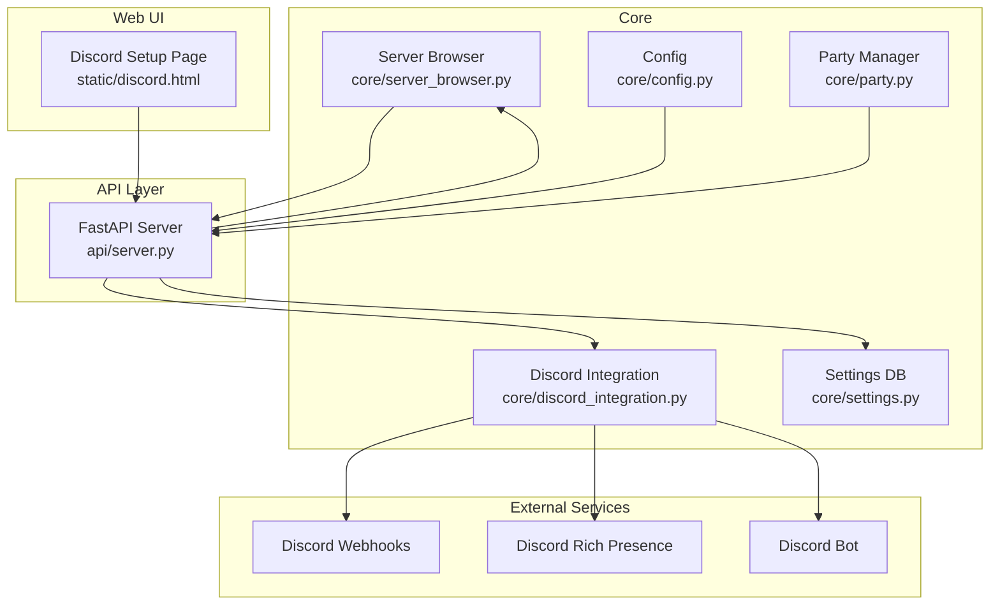

**Diagram sources**
- [discord_integration.py](file://core/discord_integration.py#L81-L536)
- [server_browser.py](file://core/server_browser.py#L75-L552)
- [server.py](file://api/server.py#L278-L606)
- [config.py](file://core/config.py#L17-L114)
- [party.py](file://core/party.py#L102-L304)
- [settings.py](file://core/settings.py#L20-L525)
- [discord.html](file://static/discord.html#L1-L473)

**Section sources**
- [discord_integration.py](file://core/discord_integration.py#L1-L633)
- [server_browser.py](file://core/server_browser.py#L1-L552)
- [server.py](file://api/server.py#L1-L701)
- [config.py](file://core/config.py#L1-L114)
- [party.py](file://core/party.py#L1-L304)
- [settings.py](file://core/settings.py#L1-L525)
- [discord.html](file://static/discord.html#L1-L473)

## Core Components
- Discord Integration
  - Webhook notifications for party events, peer actions, and game sessions
  - Rich Presence updates with state, details, party size, and start time
  - Optional Discord bot presence and messaging
  - Batched notification delivery to reduce API calls
  - Validation helpers for webhook and invite URLs
- Server Browser
  - Game server registration, discovery, filtering, favorites, and latency measurement
  - Automatic cleanup of expired servers
  - Comprehensive statistics and server metadata
- API Layer
  - REST endpoints for Discord setup, testing, and status
  - REST endpoints for server registration, heartbeat, player counts, and discovery
  - Settings persistence and dynamic reconfiguration
- Web UI
  - Dedicated Discord setup page with live status and validation
- Configuration and Settings
  - Database-first configuration with persistent settings
  - Default initialization and migration support

**Section sources**
- [discord_integration.py](file://core/discord_integration.py#L81-L536)
- [server_browser.py](file://core/server_browser.py#L75-L552)
- [server.py](file://api/server.py#L278-L606)
- [discord.html](file://static/discord.html#L226-L324)
- [settings.py](file://core/settings.py#L476-L525)

## Architecture Overview
The integration architecture centers around asynchronous components communicating via HTTP and Discord APIs. The API server exposes endpoints that delegate to core modules. The Discord integration manages webhook posting, Rich Presence updates, and optional bot presence. The server browser maintains an in-memory registry of servers with persistence for favorites and profiles.

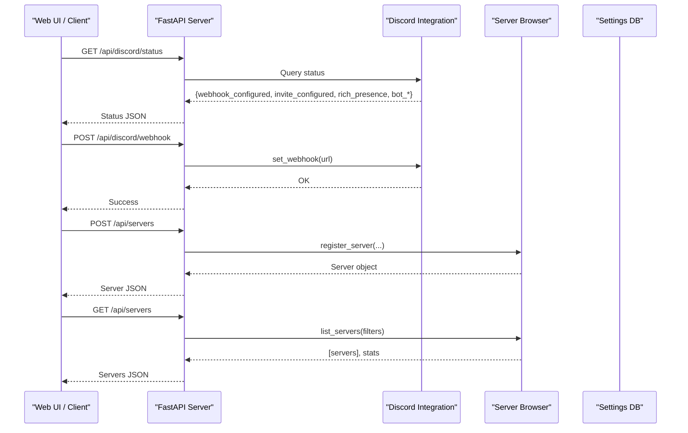

**Diagram sources**
- [server.py](file://api/server.py#L311-L358)
- [discord_integration.py](file://core/discord_integration.py#L306-L367)
- [server_browser.py](file://core/server_browser.py#L101-L167)

## Detailed Component Analysis

### Discord Integration
The Discord integration provides:
- Webhook notifications for party lifecycle and game sessions
- Rich Presence updates for real-time status visibility
- Optional Discord bot presence and messaging
- Batched notification delivery to minimize API usage
- URL validation and helper instructions

Key capabilities:
- Notification batching: collects multiple events within a short window and sends a single combined message
- Event-driven notifications: party created, peer joined/left, game started/ended
- Rich Presence: state, details, party size, start time, and assets
- Bot presence: optional online presence and message sending
- Validation: webhook and invite URL format validation

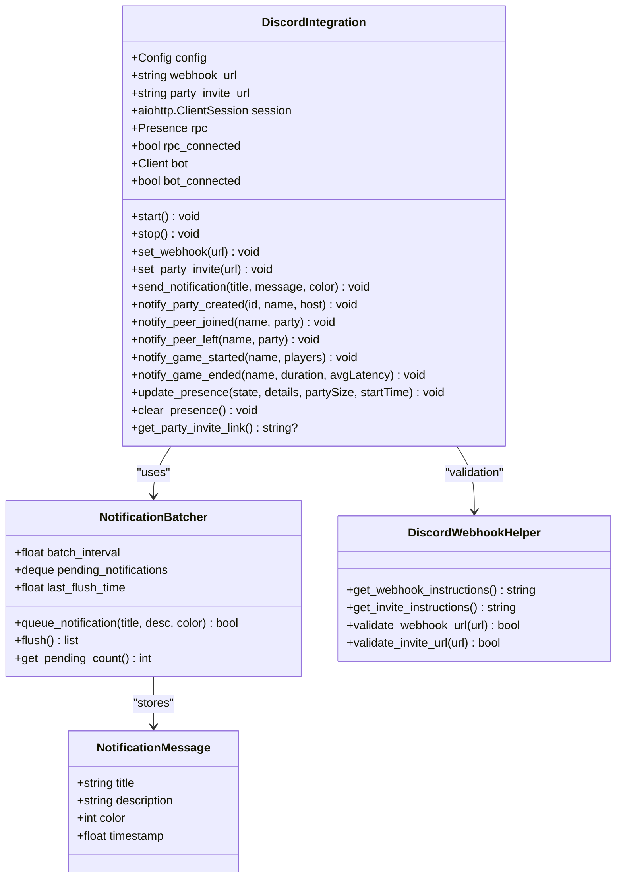

**Diagram sources**
- [discord_integration.py](file://core/discord_integration.py#L81-L536)

**Section sources**
- [discord_integration.py](file://core/discord_integration.py#L18-L536)
- [DISCORD.md](file://docs/DISCORD.md#L1-L606)
- [DISCORD_APP_SETUP.md](file://docs/DISCORD_APP_SETUP.md#L1-L195)
- [DISCORD_RICH_PRESENCE_SETUP.md](file://docs/DISCORD_RICH_PRESENCE_SETUP.md#L1-L190)
- [DISCORD_SETUP_GUIDE.md](file://docs/DISCORD_SETUP_GUIDE.md#L1-L182)
- [discord.html](file://static/discord.html#L226-L324)

#### Discord Webhook System
- Endpoint: POST /api/discord/webhook
- Validates URL format and stores in settings database
- Supports test notifications via POST /api/discord/test
- Status endpoint: GET /api/discord/status returns configuration and connectivity status
- Instructions endpoint: GET /api/discord/instructions returns setup guidance

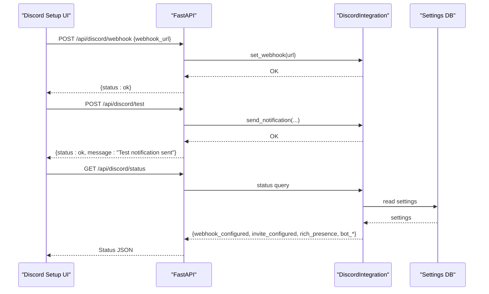

**Diagram sources**
- [server.py](file://api/server.py#L281-L358)
- [discord_integration.py](file://core/discord_integration.py#L306-L367)
- [settings.py](file://core/settings.py#L476-L525)

**Section sources**
- [server.py](file://api/server.py#L281-L358)
- [discord_integration.py](file://core/discord_integration.py#L306-L402)
- [DISCORD.md](file://docs/DISCORD.md#L534-L547)

#### Discord Rich Presence Integration
- Requires pypresence installation and Discord desktop app running
- Application ID configured via settings; assets uploaded to Discord Developer Portal
- Updates state, details, party size, and start time
- Graceful fallback if not available

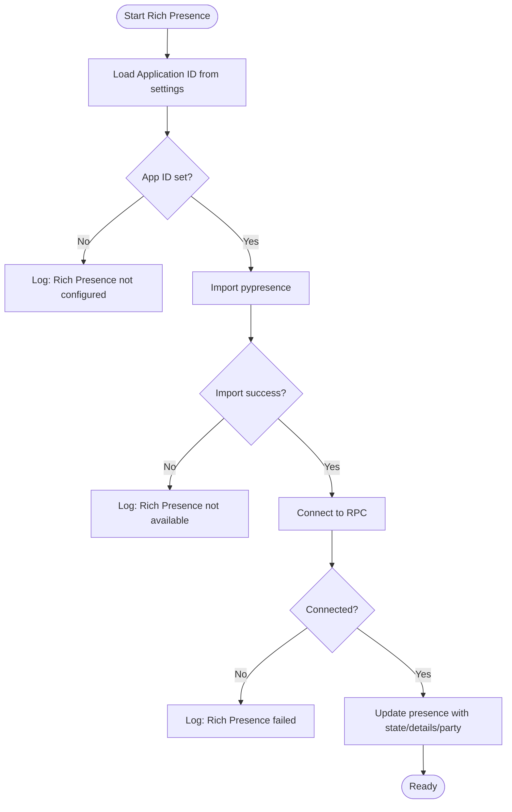

**Diagram sources**
- [discord_integration.py](file://core/discord_integration.py#L206-L241)
- [DISCORD_APP_SETUP.md](file://docs/DISCORD_APP_SETUP.md#L46-L62)

**Section sources**
- [discord_integration.py](file://core/discord_integration.py#L467-L536)
- [DISCORD_APP_SETUP.md](file://docs/DISCORD_APP_SETUP.md#L1-L195)
- [DISCORD_RICH_PRESENCE_SETUP.md](file://docs/DISCORD_RICH_PRESENCE_SETUP.md#L1-L190)

#### Discord Bot Features
- Optional bot presence and messaging
- Minimal intents: guilds and guild_messages, no message content
- Background task for bot lifecycle
- Startup message sent to configured channel

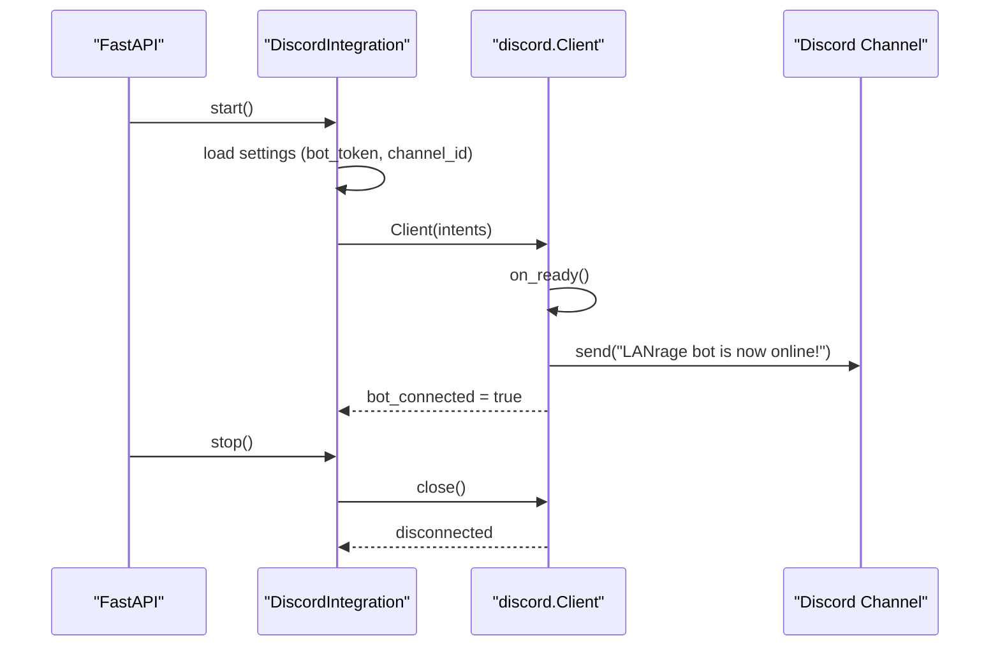

**Diagram sources**
- [discord_integration.py](file://core/discord_integration.py#L242-L305)

**Section sources**
- [discord_integration.py](file://core/discord_integration.py#L242-L305)
- [server.py](file://api/server.py#L592-L606)

### Game Server Browser
The server browser enables:
- Server registration by hosts with heartbeat maintenance
- Player count updates and server metadata
- Filtering by game, availability, password protection, tags, and search
- Favorites management and latency measurement with adaptive sampling
- Automatic cleanup of expired servers

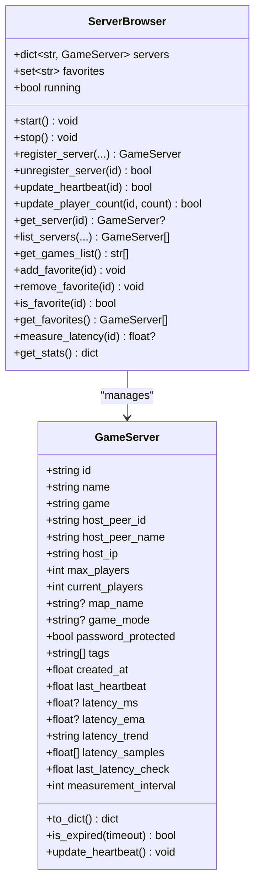

**Diagram sources**
- [server_browser.py](file://core/server_browser.py#L75-L552)

**Section sources**
- [server_browser.py](file://core/server_browser.py#L15-L552)
- [SERVER_BROWSER.md](file://docs/SERVER_BROWSER.md#L1-L620)
- [server.py](file://api/server.py#L364-L570)

#### Server Registration and Heartbeat
- Hosts register servers with metadata and host identity
- Heartbeat updates prevent expiration and maintain liveness
- Player count updates trigger UI and discovery changes

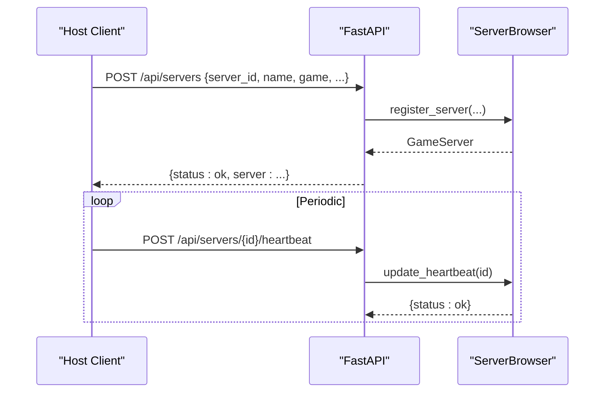

**Diagram sources**
- [server.py](file://api/server.py#L394-L464)
- [server_browser.py](file://core/server_browser.py#L101-L198)

**Section sources**
- [server.py](file://api/server.py#L394-L464)
- [server_browser.py](file://core/server_browser.py#L101-L198)

#### Server Discovery and Filtering
- List servers with optional filters: game, hide_full, hide_empty, hide_password, tags, search
- Sorting by player count descending, then by name
- Favorites management persists across sessions

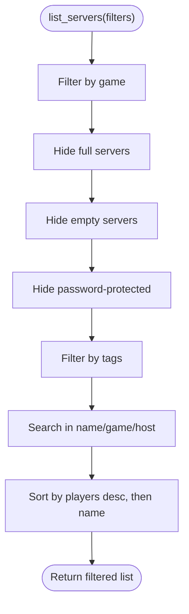

**Diagram sources**
- [server_browser.py](file://core/server_browser.py#L226-L284)

**Section sources**
- [server_browser.py](file://core/server_browser.py#L226-L284)
- [server.py](file://api/server.py#L364-L391)

#### Latency Measurement and Adaptive Sampling
- Measures latency via ICMP ping with platform-specific commands
- Uses multiple samples and median calculation for robustness
- Tracks EMA and trend detection; adapts measurement intervals based on quality

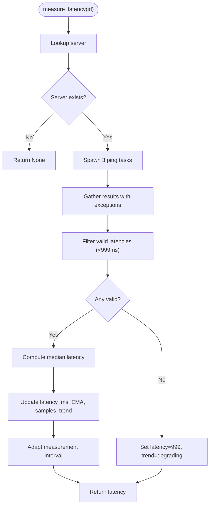

**Diagram sources**
- [server_browser.py](file://core/server_browser.py#L334-L473)

**Section sources**
- [server_browser.py](file://core/server_browser.py#L334-L473)

## Dependency Analysis
- Discord Integration depends on:
  - aiohttp for webhook HTTP requests
  - pypresence for Rich Presence (optional)
  - discord.py for bot presence (optional)
  - Settings database for persisted configuration
- Server Browser depends on:
  - asyncio for asynchronous operations
  - statistics for median calculations
  - subprocess for ICMP ping
  - Settings database for favorites persistence
- API layer depends on:
  - FastAPI for routing and validation
  - Pydantic models for request/response schemas
  - Settings database for runtime configuration updates

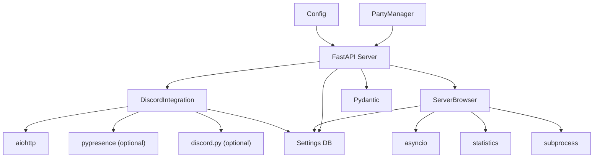

**Diagram sources**
- [discord_integration.py](file://core/discord_integration.py#L10-L15)
- [server_browser.py](file://core/server_browser.py#L3-L12)
- [server.py](file://api/server.py#L6-L16)
- [config.py](file://core/config.py#L17-L114)
- [party.py](file://core/party.py#L102-L120)

**Section sources**
- [discord_integration.py](file://core/discord_integration.py#L1-L15)
- [server_browser.py](file://core/server_browser.py#L1-L12)
- [server.py](file://api/server.py#L1-L16)
- [config.py](file://core/config.py#L1-L114)
- [party.py](file://core/party.py#L1-L120)

## Performance Considerations
- Discord notification batching reduces API calls by grouping events within a short time window
- Server browser uses lightweight in-memory storage with periodic cleanup to manage stale entries
- Latency measurement uses concurrent ping tasks and adaptive intervals to balance accuracy and overhead
- API endpoints are designed for low-latency responses suitable for web UI polling

[No sources needed since this section provides general guidance]

## Troubleshooting Guide
Common issues and resolutions:
- Discord webhook not sending
  - Verify URL format and permissions
  - Use test endpoint to validate
  - Check logs for errors
- Rich Presence not connecting
  - Ensure pypresence is installed
  - Confirm Discord desktop app is running
  - Validate application ID and asset uploads
- Server browser not showing servers
  - Confirm hosts are sending heartbeats
  - Check server registration and filters
  - Review cleanup behavior for expired servers

**Section sources**
- [TROUBLESHOOTING.md](file://docs/TROUBLESHOOTING.md#L695-L740)
- [DISCORD.md](file://docs/DISCORD.md#L584-L593)
- [SERVER_BROWSER.md](file://docs/SERVER_BROWSER.md#L579-L588)

## Conclusion
LANrage’s external integration systems provide a robust foundation for community engagement and seamless multiplayer experiences. The Discord integration offers comprehensive notifications and status visibility, while the server browser streamlines discovery and management. The API layer and web UI make configuration straightforward, and the settings database ensures persistence across sessions. Following the setup guides and troubleshooting strategies outlined here will help you deploy and operate these integrations effectively.

[No sources needed since this section summarizes without analyzing specific files]

## Appendices

### Setup Guides

#### Discord App Creation and Rich Presence
- Create a Discord application and upload assets
- Configure application ID in settings
- Install pypresence and restart LANrage

**Section sources**
- [DISCORD_APP_SETUP.md](file://docs/DISCORD_APP_SETUP.md#L1-L195)
- [DISCORD_RICH_PRESENCE_SETUP.md](file://docs/DISCORD_RICH_PRESENCE_SETUP.md#L1-L190)

#### Discord Webhook and Invite Configuration
- Create webhook and copy URL
- Paste into Discord setup UI or API endpoint
- Optionally configure voice chat invite with permanent settings

**Section sources**
- [DISCORD_SETUP_GUIDE.md](file://docs/DISCORD_SETUP_GUIDE.md#L1-L182)
- [DISCORD.md](file://docs/DISCORD.md#L534-L547)

#### Server Browser Hosting and Discovery
- Host registers servers with metadata and periodic heartbeats
- Clients discover servers via API endpoints with filtering and favorites
- Latency measurement helps select optimal servers

**Section sources**
- [SERVER_BROWSER.md](file://docs/SERVER_BROWSER.md#L556-L576)
- [server.py](file://api/server.py#L364-L570)

### API Reference

#### Discord Endpoints
- POST /api/discord/webhook: Set webhook URL
- POST /api/discord/invite: Set invite URL
- GET /api/discord/status: Get integration status
- GET /api/discord/instructions: Get setup instructions
- POST /api/discord/test: Send test notification

**Section sources**
- [server.py](file://api/server.py#L281-L358)
- [DISCORD.md](file://docs/DISCORD.md#L534-L547)

#### Server Browser Endpoints
- GET /api/servers: List servers with filtering
- POST /api/servers: Register server
- GET /api/servers/{server_id}: Get server details
- DELETE /api/servers/{server_id}: Unregister server
- POST /api/servers/{server_id}/heartbeat: Update heartbeat
- POST /api/servers/{server_id}/players: Update player count
- POST /api/servers/{server_id}/join: Join server
- POST /api/servers/{server_id}/favorite: Add to favorites
- DELETE /api/servers/{server_id}/favorite: Remove from favorites
- GET /api/servers/{server_id}/latency: Measure latency
- GET /api/servers/stats: Get browser statistics
- GET /api/games: List games

**Section sources**
- [server.py](file://api/server.py#L364-L570)
- [SERVER_BROWSER.md](file://docs/SERVER_BROWSER.md#L556-L576)

### Security Considerations
- Keep webhook URLs private; they grant posting permissions to channels
- Invite links can be public or private; configure expiration and usage limits appropriately
- No sensitive data is transmitted to Discord; only party names, peer names, and game names are shared
- All communication uses HTTPS

**Section sources**
- [DISCORD_SETUP_GUIDE.md](file://docs/DISCORD_SETUP_GUIDE.md#L142-L148)
- [DISCORD.md](file://docs/DISCORD.md#L584-L593)