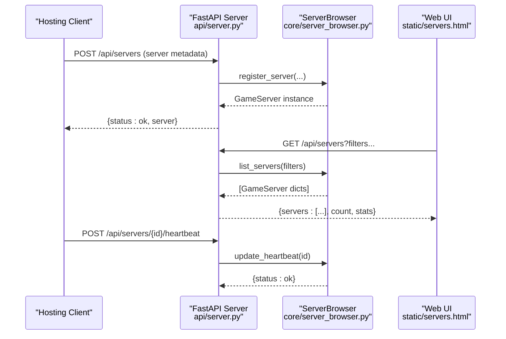
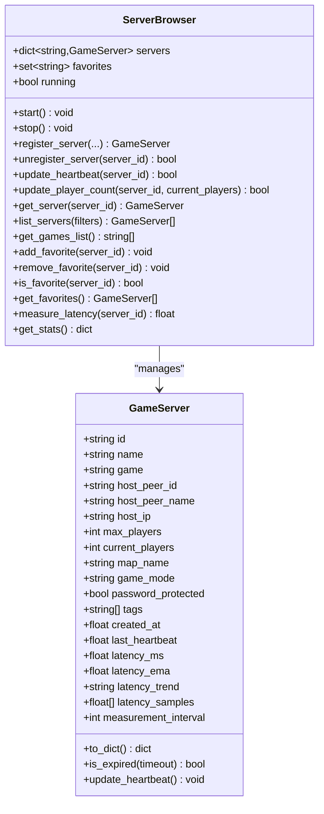
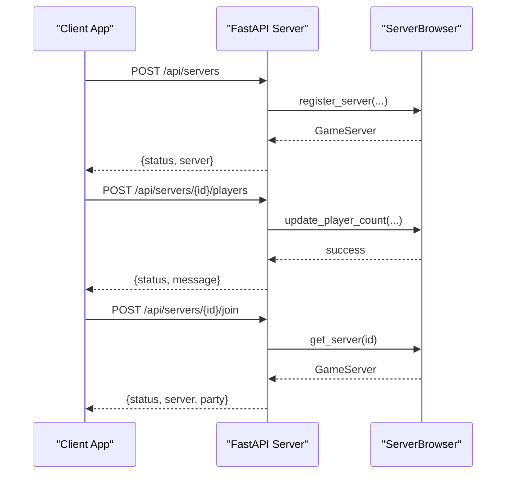
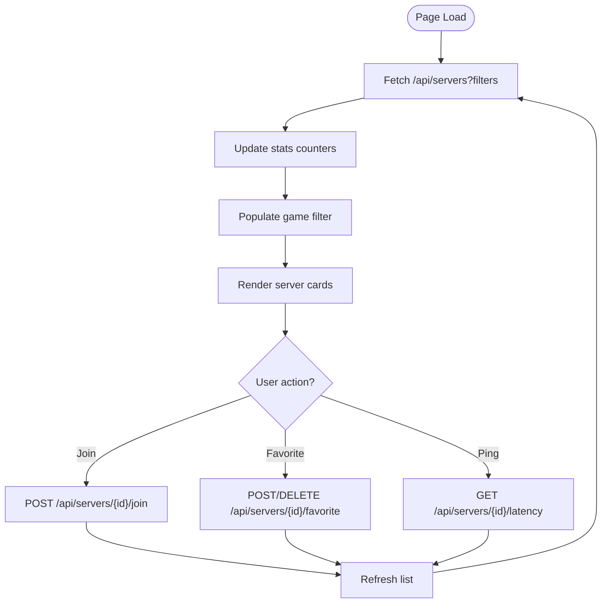
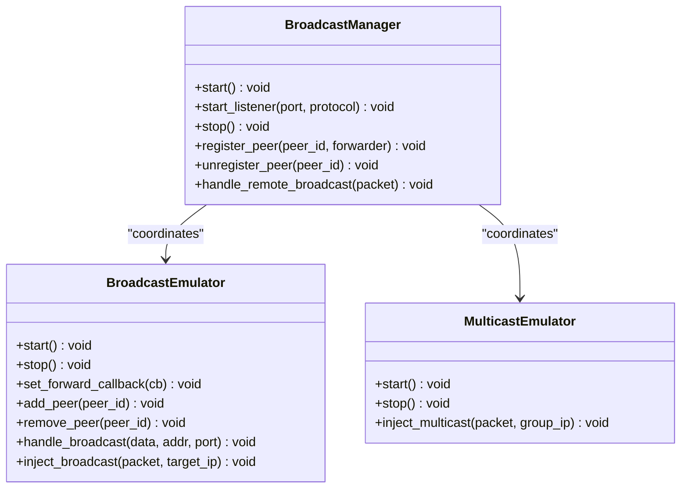
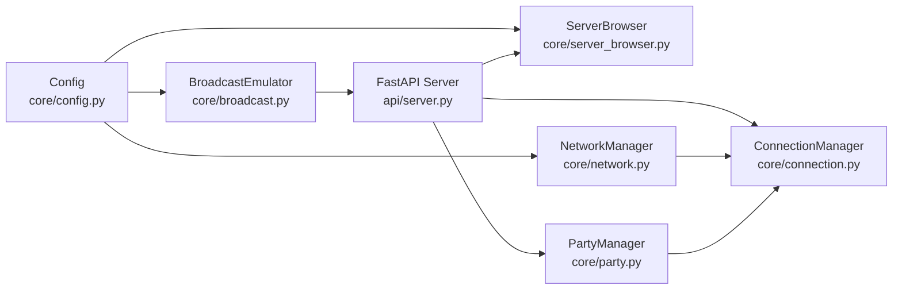
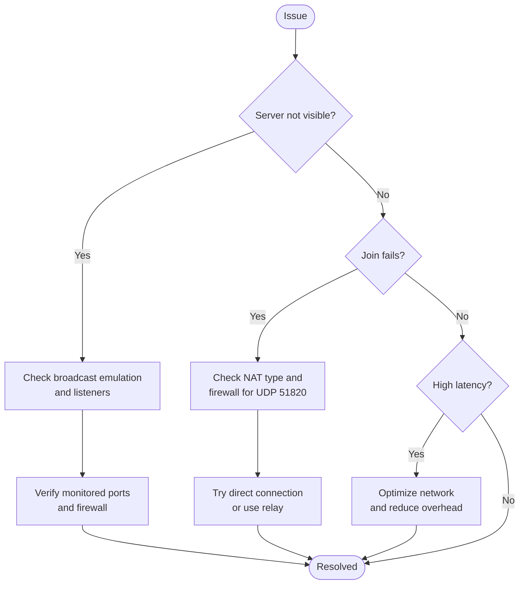

# Game Server Browser

<cite>
**Referenced Files in This Document**
- [server_browser.py](file://core/server_browser.py)
- [broadcast.py](file://core/broadcast.py)
- [server.py](file://api/server.py)
- [config.py](file://core/config.py)
- [network.py](file://core/network.py)
- [party.py](file://core/party.py)
- [connection.py](file://core/connection.py)
- [servers.html](file://static/servers.html)
- [SERVER_BROWSER.md](file://docs/SERVER_BROWSER.md)
- [BROADCAST.md](file://docs/BROADCAST.md)
- [PERFORMANCE_OPTIMIZATION.md](file://docs/PERFORMANCE_OPTIMIZATION.md)
- [TROUBLESHOOTING.md](file://docs/TROUBLESHOOTING.md)
- [test_server_browser.py](file://tests/test_server_browser.py)
</cite>

## Table of Contents
1. [Introduction](#introduction)
2. [Project Structure](#project-structure)
3. [Core Components](#core-components)
4. [Architecture Overview](#architecture-overview)
5. [Detailed Component Analysis](#detailed-component-analysis)
6. [Dependency Analysis](#dependency-analysis)
7. [Performance Considerations](#performance-considerations)
8. [Troubleshooting Guide](#troubleshooting-guide)
9. [Conclusion](#conclusion)
10. [Appendices](#appendices)

## Introduction
This document describes LANrage's game server browser system with a focus on server discovery, registration, and management. It explains how servers are advertised and browsed, how player counts and latency are tracked, and how the web interface presents filtered server lists. It also covers the underlying broadcast emulation that enables LAN games to work over the internet, and provides setup guidance for hosting public servers, configuration requirements, and troubleshooting.

## Project Structure
The server browser system spans several modules:
- Core server browser logic and data models
- API endpoints for server registration, listing, and management
- Broadcast emulation for LAN game discovery over the internet
- Web UI for server browsing and filtering
- Supporting modules for configuration, networking, and party management

```mermaid
graph TB
subgraph "Core"
SB["ServerBrowser<br/>core/server_browser.py"]
CFG["Config<br/>core/config.py"]
NET["NetworkManager<br/>core/network.py"]
BRD["BroadcastEmulator<br/>core/broadcast.py"]
PART["PartyManager<br/>core/party.py"]
CONN["ConnectionManager<br/>core/connection.py"]
end
subgraph "API"
API["FastAPI Server<br/>api/server.py"]
end
subgraph "Web UI"
UI["Server Browser UI<br/>static/servers.html"]
end
SB --> API
API --> UI
BRD --> API
PART --> API
CONN --> API
NET --> CONN
CFG --> SB
CFG --> NET
CFG --> BRD
```

**Diagram sources**
- [server_browser.py](file://core/server_browser.py#L75-L552)
- [broadcast.py](file://core/broadcast.py#L201-L646)
- [server.py](file://api/server.py#L1-L701)
- [config.py](file://core/config.py#L17-L114)
- [network.py](file://core/network.py#L25-L515)
- [party.py](file://core/party.py#L102-L304)
- [connection.py](file://core/connection.py#L18-L493)
- [servers.html](file://static/servers.html#L1-L625)

**Section sources**
- [server_browser.py](file://core/server_browser.py#L1-L552)
- [broadcast.py](file://core/broadcast.py#L1-L646)
- [server.py](file://api/server.py#L1-L701)
- [config.py](file://core/config.py#L1-L114)
- [network.py](file://core/network.py#L1-L515)
- [party.py](file://core/party.py#L1-L304)
- [connection.py](file://core/connection.py#L1-L493)
- [servers.html](file://static/servers.html#L1-L625)

## Core Components
- ServerBrowser: In-memory registry of servers with filtering, favorites, and statistics. Provides heartbeat and latency measurement.
- GameServer: Data model representing a server with metadata, player counts, and latency metrics.
- API endpoints: REST endpoints for registering servers, listing/filtering, updating player counts, measuring latency, and joining servers.
- BroadcastEmulator: Captures LAN broadcast/multicast packets and forwards them to party members, enabling LAN game discovery over the internet.
- Web UI: HTML page that fetches server lists, applies filters, and allows joining servers.

Key behaviors:
- Registration: Hosts submit server metadata via API; server browser stores and updates entries.
- Heartbeat: Hosts periodically update heartbeat timestamps to keep servers visible.
- Filtering: Clients can filter by game, hide full/empty/password servers, tags, and free-text search.
- Latency: Optional ping measurement per server; maintains adaptive sampling and trend detection.
- Cleanup: Automatic removal of expired servers based on heartbeat age.

**Section sources**
- [server_browser.py](file://core/server_browser.py#L15-L552)
- [server.py](file://api/server.py#L361-L570)
- [SERVER_BROWSER.md](file://docs/SERVER_BROWSER.md#L1-L620)
- [test_server_browser.py](file://tests/test_server_browser.py#L1-L494)

## Architecture Overview
The server browser architecture integrates API-driven server registration with a web UI for discovery and filtering. Broadcast emulation ensures LAN games remain discoverable across the internet by forwarding discovery packets to party members.



**Diagram sources**
- [server.py](file://api/server.py#L361-L570)
- [server_browser.py](file://core/server_browser.py#L101-L167)
- [servers.html](file://static/servers.html#L407-L445)

## Detailed Component Analysis

### ServerBrowser and GameServer
- Responsibilities:
  - Maintain in-memory server registry keyed by server_id
  - Register/update servers with metadata and player counts
  - Update heartbeat timestamps to keep servers alive
  - Filter servers by game, availability, password protection, tags, and search terms
  - Compute statistics (total servers, total players, unique games)
  - Measure latency to servers using ICMP ping with adaptive sampling and trend detection
  - Periodic cleanup of expired servers

- Data model:
  - GameServer holds identity, host info, game metadata, player counts, tags, timestamps, and latency metrics
  - Provides serialization to dictionary for API responses

- Filtering pipeline:
  - Apply game filter, hide-full, hide-empty, hide-password, tag intersection, and substring search
  - Sort by current player count descending, then by name

- Latency measurement:
  - Executes multiple ping samples concurrently
  - Computes median latency and updates exponential moving average
  - Tracks recent samples and detects trend (improving/stable/degrading)
  - Adapts measurement interval based on connection quality



**Diagram sources**
- [server_browser.py](file://core/server_browser.py#L15-L552)

**Section sources**
- [server_browser.py](file://core/server_browser.py#L15-L552)
- [SERVER_BROWSER.md](file://docs/SERVER_BROWSER.md#L17-L620)

### API Endpoints for Server Management
- List servers with optional filters and pagination hints
- Register a new server (requires being in a party)
- Get server details
- Unregister a server
- Update heartbeat
- Update player count
- Join a server (connects to host’s party)
- Favorite/unfavorite a server
- Measure latency to a server
- Get server statistics
- List games with active servers



**Diagram sources**
- [server.py](file://api/server.py#L361-L570)
- [server_browser.py](file://core/server_browser.py#L101-L167)

**Section sources**
- [server.py](file://api/server.py#L361-L570)

### Web Interface for Server Browsing
- Features:
  - Live stats: total servers, total players, unique games
  - Filters: search term, game dropdown, hide-full, hide-empty, hide-password
  - Server cards with player counts, host, map, game mode, latency badges
  - Actions: join, favorite, ping
  - Auto-refresh every 10 seconds

- Behavior:
  - Loads servers via GET /api/servers with query parameters
  - Updates game filter dropdown dynamically
  - Renders server cards and handles join/favorite/ping actions



**Diagram sources**
- [servers.html](file://static/servers.html#L389-L625)

**Section sources**
- [servers.html](file://static/servers.html#L1-L625)

### Broadcast Emulation for LAN Discovery
- Purpose: Capture LAN broadcast/multicast packets and forward them to party members so LAN games remain discoverable over the internet.
- Components:
  - BroadcastEmulator: listens on common game ports, deduplicates packets, forwards to peers, injects remote broadcasts locally
  - MulticastEmulator: supports mDNS and SSDP groups
  - BroadcastManager: coordinates listeners and peer forwarding
  - BroadcastDeduplicator: prevents duplicate forwarding using time-windowed packet hashing

- Supported protocols and ports:
  - UDP broadcast: Minecraft (4445), Terraria (7777), Source engine (27015/27016), Warcraft III (6112), Age of Empires II (6073)
  - Multicast: mDNS (224.0.0.251:5353), SSDP (239.255.255.250:1900)



**Diagram sources**
- [broadcast.py](file://core/broadcast.py#L201-L646)

**Section sources**
- [broadcast.py](file://core/broadcast.py#L1-L646)
- [BROADCAST.md](file://docs/BROADCAST.md#L1-L595)

### Party and Connection Context
- PartyManager: manages party lifecycle, peer discovery, and NAT traversal coordination
- ConnectionManager: orchestrates peer connections, NAT strategy selection, WireGuard peer configuration, and connection monitoring
- These components provide the party context for joining servers and the connectivity foundation for LAN discovery via broadcast emulation

**Section sources**
- [party.py](file://core/party.py#L102-L304)
- [connection.py](file://core/connection.py#L18-L493)

## Dependency Analysis
The server browser depends on configuration, network, and party management modules. The API bridges the browser and the web UI, while broadcast emulation provides the discovery layer.



**Diagram sources**
- [server_browser.py](file://core/server_browser.py#L75-L84)
- [broadcast.py](file://core/broadcast.py#L201-L228)
- [server.py](file://api/server.py#L680-L694)
- [config.py](file://core/config.py#L17-L114)
- [network.py](file://core/network.py#L25-L515)
- [party.py](file://core/party.py#L102-L304)
- [connection.py](file://core/connection.py#L18-L493)

**Section sources**
- [server_browser.py](file://core/server_browser.py#L75-L84)
- [broadcast.py](file://core/broadcast.py#L201-L228)
- [server.py](file://api/server.py#L680-L694)
- [config.py](file://core/config.py#L17-L114)
- [network.py](file://core/network.py#L25-L515)
- [party.py](file://core/party.py#L102-L304)
- [connection.py](file://core/connection.py#L18-L493)

## Performance Considerations
- Server browser performance characteristics:
  - Memory usage: ~1KB per server; typical usage <100KB
  - CPU cost: registration <0.1ms, filtering <1ms for 100 servers, cleanup <1ms per cycle
  - Latency measurement: blocking ping (~1-2s)
- Broadcast emulation overhead:
  - CPU: <2% per active port
  - Memory: ~5MB for all listeners
  - Network: minimal (only when broadcasts occur)
- Caching strategies implemented:
  - Server browser results cached for short TTL
  - Metrics statistics cached for short TTL
  - Party discovery cached for 30s
  - Game detection cached for 10s
  - Latency measurements cached

**Section sources**
- [SERVER_BROWSER.md](file://docs/SERVER_BROWSER.md#L591-L620)
- [BROADCAST.md](file://docs/BROADCAST.md#L479-L493)
- [PERFORMANCE_OPTIMIZATION.md](file://docs/PERFORMANCE_OPTIMIZATION.md#L90-L151)

## Troubleshooting Guide
Common issues and resolutions:
- Server discovery not working:
  - Verify broadcast emulation is enabled and listeners are active
  - Confirm game ports are monitored or manually added
- Server not appearing in browser:
  - Ensure heartbeat is being sent periodically
  - Check server expiration (90s timeout)
- Joining a server fails:
  - Confirm host is in a party and reachable
  - Check NAT type and firewall rules for UDP 51820
- High latency or poor connection:
  - Prefer direct connections when possible
  - Optimize network (wired connection, close bandwidth apps)
  - Use relay servers if NAT is restrictive
- Web UI slow or unresponsive:
  - Reduce polling frequency or disable auto-refresh
  - Clear browser cache and use a modern browser



**Diagram sources**
- [TROUBLESHOOTING.md](file://docs/TROUBLESHOOTING.md#L9-L132)

**Section sources**
- [TROUBLESHOOTING.md](file://docs/TROUBLESHOOTING.md#L1-L904)

## Conclusion
LANrage’s server browser provides a lightweight, efficient mechanism for discovering, registering, and managing game servers. Combined with broadcast emulation, it extends LAN game discovery to the internet. The system offers flexible filtering, latency measurement, and a responsive web UI, with built-in performance optimizations and robust troubleshooting guidance.

## Appendices

### Setup Guides

- Hosting a public server:
  - Ensure LANrage is running and the host is in a party
  - Register the server via POST /api/servers with server metadata
  - Maintain periodic heartbeat via POST /api/servers/{id}/heartbeat
  - Optionally update player counts via POST /api/servers/{id}/players

- Configuring server metadata:
  - Provide unique server_id, name, game, max_players, current_players
  - Include optional fields: map_name, game_mode, password_protected, tags
  - Host IP is derived from the host peer’s virtual IP

- Managing server availability:
  - Keep heartbeat updated every 30–60 seconds
  - Remove server via DELETE /api/servers/{id} when shutting down

- Network considerations:
  - Broadcast emulation monitors common game ports
  - For custom games, add ports to monitored list
  - Ensure firewall allows UDP 51820 for WireGuard

**Section sources**
- [server.py](file://api/server.py#L394-L477)
- [server_browser.py](file://core/server_browser.py#L101-L167)
- [broadcast.py](file://core/broadcast.py#L230-L238)
- [config.py](file://core/config.py#L17-L114)