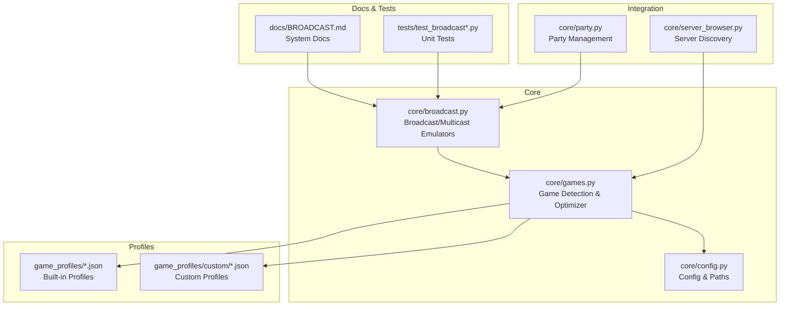
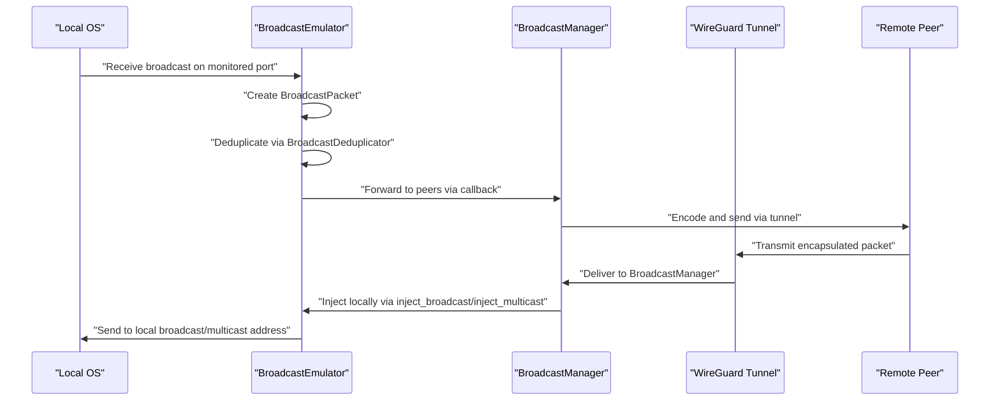
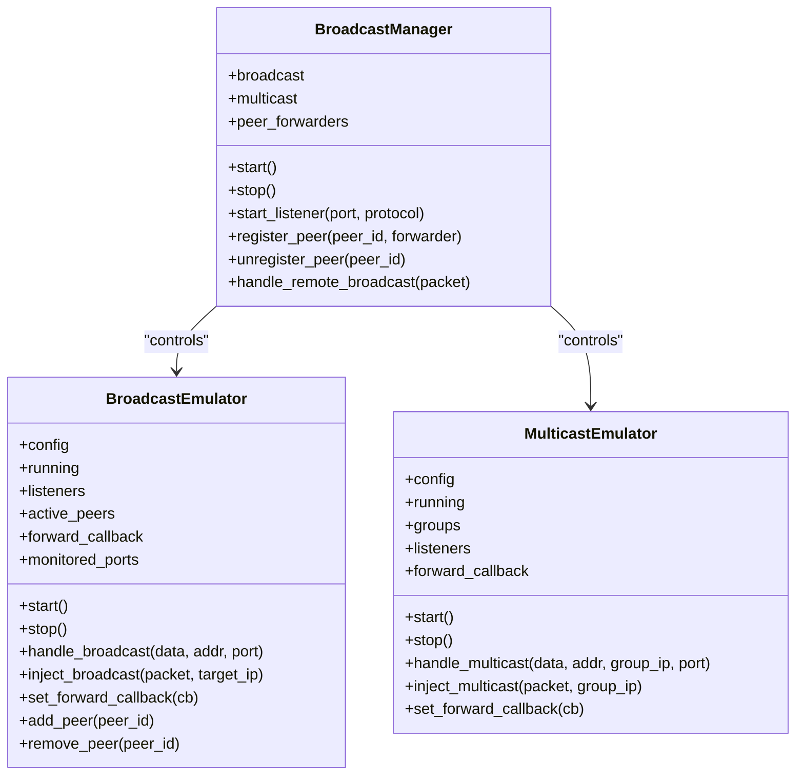
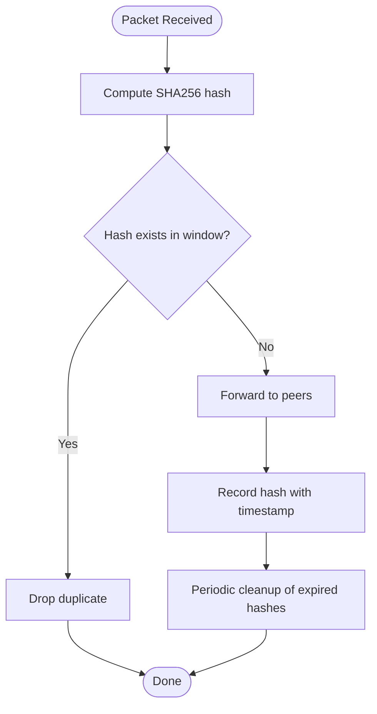
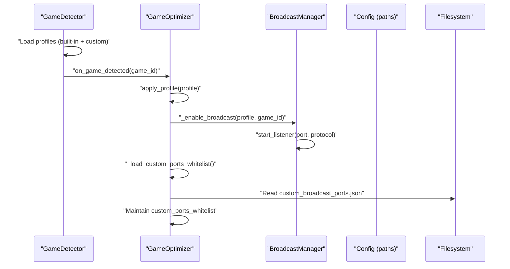
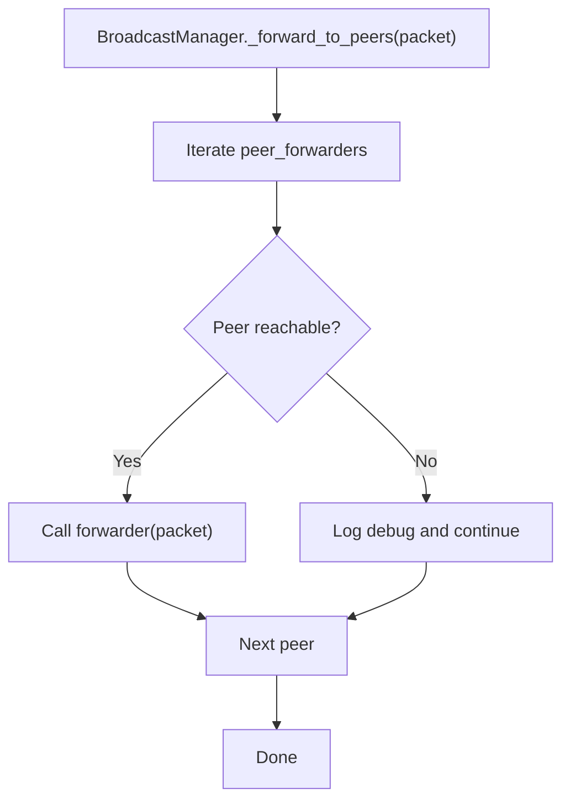
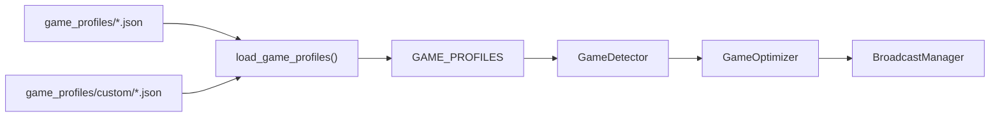
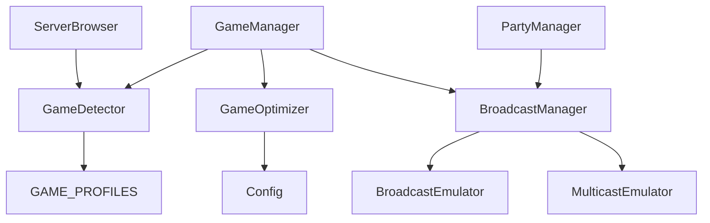

# Broadcast and Multicast Emulation

<cite>
**Referenced Files in This Document**
- [broadcast.py](file://core/broadcast.py)
- [games.py](file://core/games.py)
- [config.py](file://core/config.py)
- [BROADCAST.md](file://docs/BROADCAST.md)
- [fps.json](file://game_profiles/fps.json)
- [call_of_duty.json](file://game_profiles/custom/call_of_duty.json)
- [party.py](file://core/party.py)
- [server_browser.py](file://core/server_browser.py)
- [test_broadcast.py](file://tests/test_broadcast.py)
- [test_broadcast_dedup.py](file://tests/test_broadcast_dedup.py)
</cite>

## Table of Contents
1. [Introduction](#introduction)
2. [Project Structure](#project-structure)
3. [Core Components](#core-components)
4. [Architecture Overview](#architecture-overview)
5. [Detailed Component Analysis](#detailed-component-analysis)
6. [Dependency Analysis](#dependency-analysis)
7. [Performance Considerations](#performance-considerations)
8. [Troubleshooting Guide](#troubleshooting-guide)
9. [Conclusion](#conclusion)
10. [Appendices](#appendices)

## Introduction
This document explains the broadcast and multicast emulation system that enables legacy LAN games relying on network discovery protocols to work seamlessly over the mesh VPN. It covers:
- How broadcast and multicast traffic is captured, deduplicated, and forwarded across peers
- Dynamic port monitoring and custom port whitelisting for games not covered by standard profiles
- Integration with the game detection system and game-specific optimizations
- Packet forwarding logic, port filtering, and traffic optimization for broadcast-heavy games
- Examples for configuring custom broadcast ports and troubleshooting detection issues

## Project Structure
The broadcast and multicast emulation spans several modules:
- core/broadcast.py: Implements broadcast and multicast emulators, packet deduplication, and forwarding
- core/games.py: Provides game detection, profiles, and dynamic broadcast port monitoring
- core/config.py: Supplies configuration including the config directory used for custom broadcast port files
- docs/BROADCAST.md: Comprehensive documentation for broadcast emulation
- game_profiles/*.json: Built-in and custom game profiles with broadcast/multicast flags and ports
- core/party.py and core/server_browser.py: Party and server discovery integrations
- tests/test_broadcast*.py: Unit tests validating broadcast behavior and deduplication

**Diagram sources**
- [broadcast.py](file://core/broadcast.py#L1-L646)
- [games.py](file://core/games.py#L1-L1349)
- [config.py](file://core/config.py#L1-L114)
- [BROADCAST.md](file://docs/BROADCAST.md#L1-L595)
- [party.py](file://core/party.py#L1-L304)
- [server_browser.py](file://core/server_browser.py#L1-L552)
- [test_broadcast.py](file://tests/test_broadcast.py#L1-L118)
- [test_broadcast_dedup.py](file://tests/test_broadcast_dedup.py#L1-L291)

**Section sources**
- [broadcast.py](file://core/broadcast.py#L1-L646)
- [games.py](file://core/games.py#L1-L1349)
- [config.py](file://core/config.py#L1-L114)
- [BROADCAST.md](file://docs/BROADCAST.md#L1-L595)

## Core Components
- BroadcastEmulator: Listens on common and dynamic game ports, detects broadcast packets, deduplicates, and forwards to peers
- MulticastEmulator: Handles mDNS and SSDP discovery by joining multicast groups and forwarding packets
- BroadcastManager: Orchestrates both emulators, registers peers, and injects remote packets locally
- BroadcastDeduplicator: Prevents duplicate forwarding using time-windowed SHA256 hashing
- GameDetector and GameOptimizer: Detect running games, load profiles, and enable dynamic broadcast monitoring for broadcast-enabled games
- Custom broadcast port whitelist: User-configurable ports persisted to custom_broadcast_ports.json

Key behaviors:
- Automatic discovery of broadcast/multicast-enabled games via profiles
- Dynamic addition/removal of listeners based on active games and custom whitelist
- Efficient deduplication to avoid network loops and redundant forwarding
- Integration with party and server discovery for end-to-end LAN-like experience

**Section sources**
- [broadcast.py](file://core/broadcast.py#L201-L646)
- [games.py](file://core/games.py#L696-L1349)
- [BROADCAST.md](file://docs/BROADCAST.md#L40-L595)

## Architecture Overview
The system integrates broadcast emulation with game detection and the mesh VPN party infrastructure. When a game is detected, the optimizer enables broadcast listeners for the game’s ports and applies network optimizations. Broadcast packets are deduplicated and forwarded to peers; incoming remote broadcasts are injected locally.

**Diagram sources**
- [broadcast.py](file://core/broadcast.py#L338-L407)
- [broadcast.py](file://core/broadcast.py#L618-L646)
- [games.py](file://core/games.py#L807-L928)

**Section sources**
- [broadcast.py](file://core/broadcast.py#L201-L646)
- [games.py](file://core/games.py#L807-L928)

## Detailed Component Analysis

### BroadcastEmulator and MulticastEmulator
- BroadcastEmulator
  - Maintains listeners for monitored ports and tracks active peers
  - Detects broadcast packets and forwards them after deduplication
  - Supports injection of remote broadcasts locally
- MulticastEmulator
  - Joins standard multicast groups (mDNS, SSDP) and forwards packets
  - Supports injection of multicast packets to local network

**Diagram sources**
- [broadcast.py](file://core/broadcast.py#L201-L646)

**Section sources**
- [broadcast.py](file://core/broadcast.py#L201-L646)

### BroadcastDeduplicator
- Prevents duplicate forwarding using SHA256 hashes keyed by packet payload, source IP, and destination port
- Maintains a time-windowed set of hashes with periodic cleanup
- Tracks metrics: total, forwarded, deduplicated packets, dedupe rate, and tracked hashes

**Diagram sources**
- [broadcast.py](file://core/broadcast.py#L30-L199)

**Section sources**
- [broadcast.py](file://core/broadcast.py#L30-L199)
- [test_broadcast_dedup.py](file://tests/test_broadcast_dedup.py#L1-L291)

### Dynamic Port Monitoring and Custom Whitelist
- GameDetector loads built-in and custom game profiles and detects running games
- GameOptimizer applies profiles and dynamically starts/stops broadcast listeners for game ports
- Custom broadcast ports are loaded from custom_broadcast_ports.json in the config directory and can be added/removed at runtime

**Diagram sources**
- [games.py](file://core/games.py#L265-L448)
- [games.py](file://core/games.py#L807-L928)
- [games.py](file://core/games.py#L714-L776)
- [config.py](file://core/config.py#L46-L47)

**Section sources**
- [games.py](file://core/games.py#L265-L448)
- [games.py](file://core/games.py#L714-L776)
- [games.py](file://core/games.py#L807-L928)
- [config.py](file://core/config.py#L46-L47)

### Packet Forwarding Logic and Filtering
- Peers are registered/unregistered with BroadcastManager
- BroadcastManager forwards packets to all registered peers via registered forwarders
- Back-to-source prevention avoids forwarding packets back to the peer that originated them
- Port filtering is implicit: only ports registered by active games or the custom whitelist are monitored

**Diagram sources**
- [broadcast.py](file://core/broadcast.py#L618-L631)

**Section sources**
- [broadcast.py](file://core/broadcast.py#L618-L631)

### Integration with Game Detection and Profiles
- Built-in profiles define broadcast/multicast flags and ports for many games
- Custom profiles can be added under game_profiles/custom for games not included in standard profiles
- Example custom profiles include Call of Duty variants with broadcast discovery

**Diagram sources**
- [games.py](file://core/games.py#L94-L162)
- [fps.json](file://game_profiles/fps.json#L1-L143)
- [call_of_duty.json](file://game_profiles/custom/call_of_duty.json#L1-L87)

**Section sources**
- [games.py](file://core/games.py#L94-L162)
- [fps.json](file://game_profiles/fps.json#L1-L143)
- [call_of_duty.json](file://game_profiles/custom/call_of_duty.json#L1-L87)

### Relationship Between Broadcast Emulation and Game-Specific Optimizations
- For broadcast-enabled games, the optimizer enables dynamic broadcast monitoring and applies packet priority and MTU adjustments
- NAT-aware keepalive tuning complements broadcast emulation for stable connectivity
- When games stop, listeners are stopped if no other active game or custom whitelist requires them

**Section sources**
- [games.py](file://core/games.py#L807-L928)
- [games.py](file://core/games.py#L1192-L1287)

## Dependency Analysis
- BroadcastManager depends on BroadcastEmulator and MulticastEmulator
- GameOptimizer depends on Config and manages dynamic port monitoring and custom whitelist
- GameDetector depends on GAME_PROFILES and triggers GameOptimizer on detection
- Party and server browser modules integrate with broadcast/emulation indirectly through peer connectivity and server registration

**Diagram sources**
- [games.py](file://core/games.py#L1290-L1349)
- [party.py](file://core/party.py#L102-L304)
- [server_browser.py](file://core/server_browser.py#L75-L552)

**Section sources**
- [games.py](file://core/games.py#L1290-L1349)
- [party.py](file://core/party.py#L102-L304)
- [server_browser.py](file://core/server_browser.py#L75-L552)

## Performance Considerations
- CPU overhead: minimal (<2% per active port)
- Memory footprint: small (~5MB for all listeners)
- Network overhead: negligible (only when broadcasts/multicasts occur)
- Latency: capture <1ms, forward <5ms, inject <1ms, total <10ms end-to-end
- Deduplication reduces redundant forwarding and prevents network loops

[No sources needed since this section provides general guidance]

## Troubleshooting Guide
Common issues and resolutions:
- Port already in use: Listener startup handles conflicts gracefully; emulator continues operating
- Permission denied: Run with elevated privileges to enable raw socket operations
- Broadcasts not forwarded: Ensure peers are registered and forward callbacks are configured
- Custom broadcast port not monitored: Confirm custom_broadcast_ports.json exists in the config directory and contains the desired ports

Validation and testing:
- Unit tests cover emulator initialization, peer management, listener lifecycle, and deduplication behavior
- Manual testing scripts demonstrate starting listeners and injecting broadcast packets

**Section sources**
- [BROADCAST.md](file://docs/BROADCAST.md#L568-L595)
- [test_broadcast.py](file://tests/test_broadcast.py#L1-L118)
- [test_broadcast_dedup.py](file://tests/test_broadcast_dedup.py#L1-L291)

## Conclusion
The broadcast and multicast emulation system provides seamless LAN-like discovery for legacy games over the mesh VPN. By combining dynamic port monitoring, a robust deduplication mechanism, and tight integration with game detection and party management, it supports a wide variety of games while maintaining low overhead and predictable performance. Users can extend support to new games through custom profiles and the custom broadcast port whitelist.

[No sources needed since this section summarizes without analyzing specific files]

## Appendices

### A. Configuring Custom Broadcast Ports
- Place a custom_broadcast_ports.json file in the configuration directory (config_dir)
- Format: an object with a ports array and optional description
- Runtime operations:
  - Add/remove ports via APIs exposed by the optimizer
  - Ports are persisted to the JSON file automatically

**Section sources**
- [games.py](file://core/games.py#L714-L776)
- [config.py](file://core/config.py#L46-L47)

### B. Example: Adding a Custom Game Profile
- Create a JSON file under game_profiles/custom with a game_id and profile fields
- Include broadcast: true and the appropriate ports
- The system will auto-load custom profiles alongside built-in ones

**Section sources**
- [fps.json](file://game_profiles/fps.json#L1-L143)
- [call_of_duty.json](file://game_profiles/custom/call_of_duty.json#L1-L87)

### C. Packet Forwarding and Mesh Integration
- Peers are registered with BroadcastManager and added to BroadcastEmulator’s active peers
- Packets are forwarded via the mesh VPN tunnel and injected locally on the target port

**Section sources**
- [broadcast.py](file://core/broadcast.py#L320-L336)
- [broadcast.py](file://core/broadcast.py#L618-L631)
- [party.py](file://core/party.py#L102-L304)