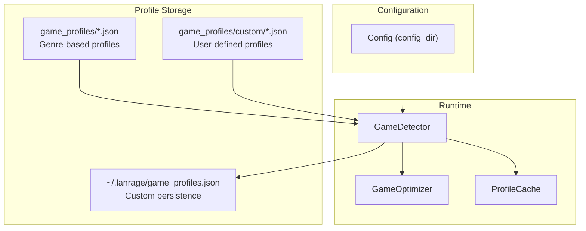
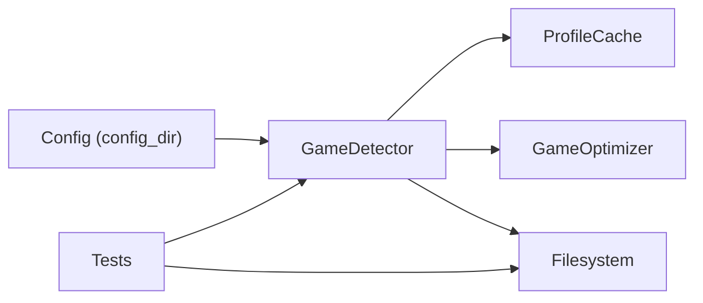

# Custom Game Profiles

<cite>
**Referenced Files in This Document**
- [game_profiles/README.md](file://game_profiles/README.md)
- [game_profiles/custom/example.json](file://game_profiles/custom/example.json)
- [core/games.py](file://core/games.py)
- [core/config.py](file://core/config.py)
- [tests/test_game_profiles.py](file://tests/test_game_profiles.py)
- [docs/GAMES.md](file://docs/GAMES.md)
- [game_profiles/custom/call_of_duty.json](file://game_profiles/custom/call_of_duty.json)
- [game_profiles/custom/far_cry.json](file://game_profiles/custom/far_cry.json)
- [game_profiles/custom/need_for_speed.json](file://game_profiles/custom/need_for_speed.json)
- [core/nat.py](file://core/nat.py)
- [core/settings.py](file://core/settings.py)
</cite>

## Table of Contents
1. [Introduction](#introduction)
2. [Project Structure](#project-structure)
3. [Core Components](#core-components)
4. [Architecture Overview](#architecture-overview)
5. [Detailed Component Analysis](#detailed-component-analysis)
6. [Dependency Analysis](#dependency-analysis)
7. [Performance Considerations](#performance-considerations)
8. [Troubleshooting Guide](#troubleshooting-guide)
9. [Conclusion](#conclusion)
10. [Appendices](#appendices)

## Introduction
This document explains how to create, manage, and integrate custom game profiles in the LANrage system. It covers the JSON configuration format, loading mechanisms, validation rules, error handling, persistence, and integration with the detection system. It also provides step-by-step examples for unsupported games, modded games, and games not yet in the official catalog, along with best practices and advanced customization tips.

## Project Structure
The custom game profile system spans several directories and modules:
- game_profiles: Official genre-based profiles and a custom folder for user-defined profiles
- core/games.py: Game detection, profile loading, and integration with the detection system
- core/config.py: Configuration model including the config_dir used for custom profile persistence
- tests/test_game_profiles.py: Validation tests for profile correctness and completeness
- docs/GAMES.md: Developer documentation for the game system
- Additional examples under game_profiles/custom/* for modded and legacy titles



**Diagram sources**
- [core/config.py](file://core/config.py#L46-L47)
- [core/games.py](file://core/games.py#L94-L162)
- [core/games.py](file://core/games.py#L275-L276)
- [core/games.py](file://core/games.py#L230-L254)

**Section sources**
- [core/config.py](file://core/config.py#L46-L47)
- [core/games.py](file://core/games.py#L94-L162)
- [docs/GAMES.md](file://docs/GAMES.md#L62-L81)

## Core Components
- GameProfile: Data model representing a game’s networking characteristics and optimization hints.
- GameDetector: Loads built-in and custom profiles, detects running games, and triggers optimizations.
- GameOptimizer: Applies profile-driven optimizations (keepalive, MTU, broadcast, packet priority).
- ProfileCache: Caches loaded profiles with TTL to reduce repeated I/O.
- Config: Provides the config_dir path used for custom profile persistence.

Key responsibilities:
- Profile loading from genre JSON files and custom JSON file
- Merging custom profiles into the global GAME_PROFILES dictionary
- Validation via tests and runtime error handling
- Persistence of custom profiles to a JSON file in the config directory

**Section sources**
- [core/games.py](file://core/games.py#L53-L71)
- [core/games.py](file://core/games.py#L265-L363)
- [core/games.py](file://core/games.py#L230-L254)
- [core/config.py](file://core/config.py#L46-L47)

## Architecture Overview
The profile system integrates with the detection pipeline and optimizer. Built-in profiles are loaded from genre JSON files, and custom profiles are merged from a single JSON file located in the configuration directory. The detector periodically scans running processes and ports to identify games and apply optimizations.

```mermaid
sequenceDiagram
participant CFG as "Config"
participant DET as "GameDetector"
participant FS as "Filesystem"
participant CACHE as "ProfileCache"
participant OPT as "GameOptimizer"
CFG->>DET : Provide config_dir
DET->>FS : Load game_profiles/*.json
DET->>FS : Load game_profiles/custom/*.json
DET->>DET : Merge into GAME_PROFILES
DET->>FS : Load ~/.lanrage/game_profiles.json (custom)
DET->>CACHE : Cache profiles (TTL)
DET->>DET : Detect running games
DET->>OPT : Apply profile optimizations
```

**Diagram sources**
- [core/games.py](file://core/games.py#L94-L162)
- [core/games.py](file://core/games.py#L275-L276)
- [core/games.py](file://core/games.py#L292-L356)
- [core/games.py](file://core/games.py#L239-L254)

## Detailed Component Analysis

### JSON Configuration Format and Required Fields
The JSON configuration supports two locations:
- Genre-based files under game_profiles/*.json
- A single custom file under ~/.lanrage/game_profiles.json

Required fields for each game profile:
- name: Human-readable game name
- executable: Process name used for detection
- ports: Array of port numbers used by the game
- protocol: "udp", "tcp", or "both"
- broadcast: Boolean indicating LAN broadcast discovery
- multicast: Boolean indicating multicast discovery
- keepalive: WireGuard keepalive interval (seconds)
- mtu: Optimal MTU size
- description: Short description
- low_latency: Boolean hint for latency-sensitive games
- high_bandwidth: Boolean hint for bandwidth-heavy games
- packet_priority: "low", "medium", or "high"

Optional fields default to:
- broadcast: false
- multicast: false
- keepalive: 25
- mtu: 1420
- description: ""
- low_latency: false
- high_bandwidth: false
- packet_priority: "medium"

Validation rules enforced by tests and runtime:
- All required fields must be present
- Types must match expectations (strings, lists, booleans, integers)
- Protocol must be one of "udp", "tcp", "both"
- Packet priority must be one of "low", "medium", "high"
- Ports must be in range 1–65535
- Keepalive must be in range 5–60
- MTU must be in range 1280–1500
- Duplicate game IDs are not allowed within or across files

Best practices:
- Use realistic port ranges and protocols observed from network captures
- Keep packet_priority aligned with game genre expectations
- Keep keepalive reasonable for NAT conditions
- Keep mtu at 1420 unless the game requires a different value

**Section sources**
- [game_profiles/README.md](file://game_profiles/README.md#L29-L66)
- [tests/test_game_profiles.py](file://tests/test_game_profiles.py#L54-L137)
- [tests/test_game_profiles.py](file://tests/test_game_profiles.py#L140-L177)
- [core/games.py](file://core/games.py#L133-L146)

### Loading Mechanism and Profile Merging
Built-in profiles:
- The loader enumerates all JSON files in the game_profiles directory and the custom subdirectory
- It skips files containing a comment field (e.g., "_comment")
- Each profile is parsed into a GameProfile and stored in GAME_PROFILES keyed by game_id

Custom profiles:
- On detector startup, it attempts to load a single JSON file at config_dir/game_profiles.json
- Each entry is parsed and merged into GAME_PROFILES, overriding any built-in profile with the same game_id

Merging behavior:
- Custom profiles take precedence over built-in ones for the same game_id
- The detector logs the number of custom profiles loaded and any parsing errors

Error handling:
- Malformed JSON raises a decode error and is logged as a warning
- Missing required fields or wrong types produce warnings and are skipped
- Exceptions during file I/O are caught and logged

**Section sources**
- [core/games.py](file://core/games.py#L94-L162)
- [core/games.py](file://core/games.py#L292-L356)
- [tests/test_game_profiles.py](file://tests/test_game_profiles.py#L44-L49)

### Detection Integration and Optimization
The detector runs a continuous loop that:
- Scans running processes and fuzzy-matches against profile executables
- Optionally checks window titles on Windows
- Probes open ports to infer game activity
- Selects the highest-confidence detection per game_id
- Notifies the optimizer to apply profile-specific settings

Optimizations applied:
- Adjust WireGuard keepalive based on NAT type and profile overrides
- Enable broadcast emulation for game ports when configured
- Set packet priority for QoS
- Adjust MTU for the WireGuard interface

Adaptive keepalive:
- The system calculates an adaptive keepalive based on NAT type, with profile overrides respected

**Section sources**
- [core/games.py](file://core/games.py#L364-L650)
- [core/games.py](file://core/games.py#L696-L800)
- [core/nat.py](file://core/nat.py#L19-L51)
- [core/games.py](file://core/games.py#L20-L51)

### Persistence and File Location
Custom profiles are persisted to a single JSON file in the configuration directory:
- Path: config_dir/game_profiles.json
- The detector writes this file when saving a custom profile
- The detector reads this file at startup to merge custom profiles

Persistence behavior:
- Existing entries are preserved when adding new ones
- The file is written atomically via aiofiles
- Parent directories are created if missing

Backup procedures:
- Back up the entire config_dir (~/.lanrage) to preserve custom profiles and other settings
- The settings database (used elsewhere) supports integrity checks and backups; while not directly used for profiles, backing up the whole config directory is recommended

**Section sources**
- [core/games.py](file://core/games.py#L275-L276)
- [core/games.py](file://core/games.py#L651-L694)
- [core/config.py](file://core/config.py#L46-L47)

### Step-by-Step Examples

#### Example 1: Creating a profile for an unsupported game
- Create a JSON file in game_profiles/custom/ with a unique game_id
- Define required fields: name, executable, ports, protocol, broadcast, multicast, keepalive, mtu, description, low_latency, high_bandwidth, packet_priority
- Place the file in the custom directory and restart the application to load it
- Alternatively, use the detector’s save method to write to the config_dir file

**Section sources**
- [game_profiles/README.md](file://game_profiles/README.md#L67-L92)
- [core/games.py](file://core/games.py#L651-L694)

#### Example 2: Creating a profile for a modded game
- Identify the modded game’s process name and ports
- Choose protocol based on network behavior (udp/tcp/both)
- Set broadcast/multicast according to whether the game uses LAN discovery
- Adjust keepalive and MTU conservatively (start with defaults)
- Save the profile to the custom file and restart

**Section sources**
- [game_profiles/README.md](file://game_profiles/README.md#L29-L66)
- [game_profiles/custom/example.json](file://game_profiles/custom/example.json#L1-L18)

#### Example 3: Creating a profile for a legacy game
- Use the example template as a starting point
- Replace the game_id and executable with the legacy game’s process name
- Map ports commonly used by the game (check community resources or network captures)
- Set packet_priority and latency/bandwidth hints based on genre guidelines

**Section sources**
- [game_profiles/custom/example.json](file://game_profiles/custom/example.json#L1-L18)
- [game_profiles/README.md](file://game_profiles/README.md#L94-L174)

### Advanced Customization Options
- NAT-aware keepalive: The system adapts keepalive based on NAT type; profile overrides are respected
- Broadcast and multicast toggles: Enable discovery features when applicable
- Packet priority: Tune QoS for different genres (e.g., high for competitive games)
- MTU tuning: Keep at 1420 unless the game requires a different value
- Port whitelisting for broadcast monitoring: Managed via a separate configuration file for broadcast ports

**Section sources**
- [core/games.py](file://core/games.py#L20-L51)
- [core/games.py](file://core/games.py#L696-L800)

## Dependency Analysis
The profile system depends on:
- Config for determining the config_dir path
- aiofiles for asynchronous JSON I/O
- psutil for process enumeration
- Optional Windows APIs for window title detection
- JSON schema validation enforced by tests



**Diagram sources**
- [core/config.py](file://core/config.py#L46-L47)
- [core/games.py](file://core/games.py#L239-L254)
- [tests/test_game_profiles.py](file://tests/test_game_profiles.py#L14-L23)

**Section sources**
- [core/config.py](file://core/config.py#L46-L47)
- [core/games.py](file://core/games.py#L239-L254)
- [tests/test_game_profiles.py](file://tests/test_game_profiles.py#L14-L23)

## Performance Considerations
- Profile loading is performed asynchronously and cached with a TTL to minimize repeated I/O
- Detection loops run every 5 seconds; keep custom profiles minimal to reduce scanning overhead
- Port probing is lightweight but still involves socket operations; avoid unnecessary broad port ranges
- NAT-based keepalive adjustments prevent excessive traffic on restrictive NATs

[No sources needed since this section provides general guidance]

## Troubleshooting Guide
Common issues and resolutions:
- Invalid JSON: Fix syntax errors or trailing commas; the loader logs warnings and skips the problematic file
- Missing required fields: Ensure all required fields are present and typed correctly
- Out-of-range values: Adjust ports, keepalive, and MTU to within accepted ranges
- Duplicate game IDs: Rename the game_id or remove duplicates across files
- Custom profile not applied: Confirm the custom file exists at config_dir/game_profiles.json and restart the application
- Windows-specific detection: Ensure pywin32 is available for window title detection; otherwise, rely on process and port detection

Validation and tests:
- The test suite validates JSON validity, required fields, types, values, and uniqueness
- Use the test runner to validate all profiles before deployment

**Section sources**
- [core/games.py](file://core/games.py#L156-L159)
- [tests/test_game_profiles.py](file://tests/test_game_profiles.py#L44-L49)
- [tests/test_game_profiles.py](file://tests/test_game_profiles.py#L86-L137)
- [tests/test_game_profiles.py](file://tests/test_game_profiles.py#L140-L177)
- [tests/test_game_profiles.py](file://tests/test_game_profiles.py#L180-L202)

## Conclusion
The custom game profile system provides a flexible, validated, and integrated way to optimize LANrage for unsupported, modded, or legacy games. By following the JSON format, validation rules, and persistence guidelines, you can reliably add profiles that improve detection accuracy and network performance. Use the examples and best practices here to create robust configurations tailored to your gaming environment.

[No sources needed since this section summarizes without analyzing specific files]

## Appendices

### Templates and Best Practices
- Use the example template as a starting point for custom profiles
- Align packet_priority with genre expectations
- Keep keepalive conservative for symmetric NATs
- Prefer UDP for real-time games; TCP for authoritative servers
- Keep MTU at 1420 unless the game requires otherwise
- Validate profiles with the test suite before deployment

**Section sources**
- [game_profiles/custom/example.json](file://game_profiles/custom/example.json#L1-L18)
- [game_profiles/README.md](file://game_profiles/README.md#L94-L174)
- [tests/test_game_profiles.py](file://tests/test_game_profiles.py#L140-L177)

### Example Profiles for Modded Games
- Call of Duty series: Multiple variants with shared ports and UDP broadcast
- Far Cry series: UDP-based with broadcast enabled for LAN play
- Need for Speed series: UDP-based with broadcast for racing lobbies

**Section sources**
- [game_profiles/custom/call_of_duty.json](file://game_profiles/custom/call_of_duty.json#L1-L87)
- [game_profiles/custom/far_cry.json](file://game_profiles/custom/far_cry.json#L1-L73)
- [game_profiles/custom/need_for_speed.json](file://game_profiles/custom/need_for_speed.json#L1-L87)