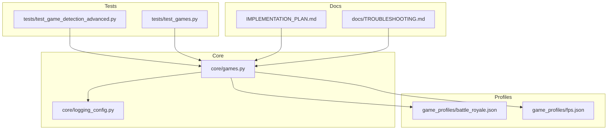
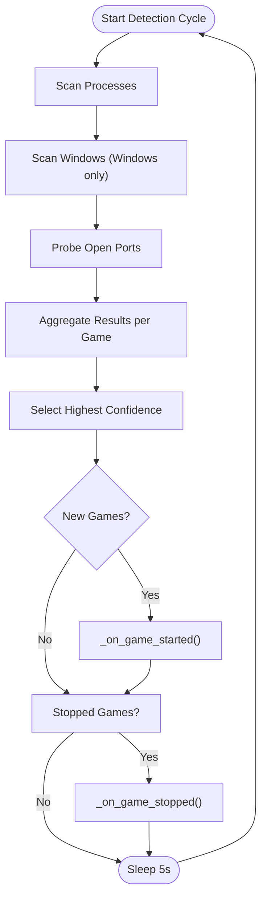
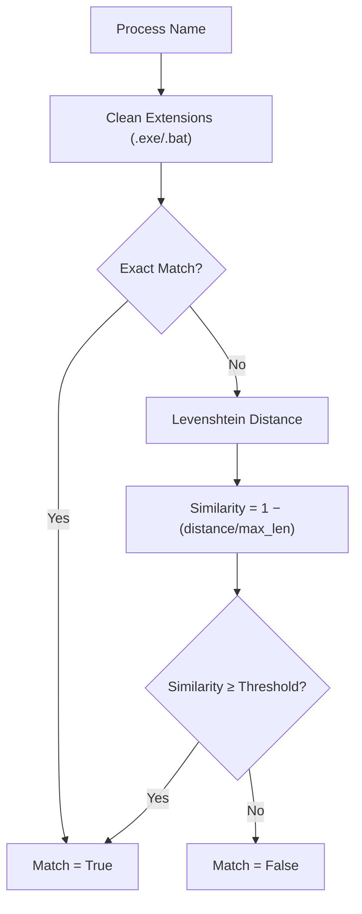
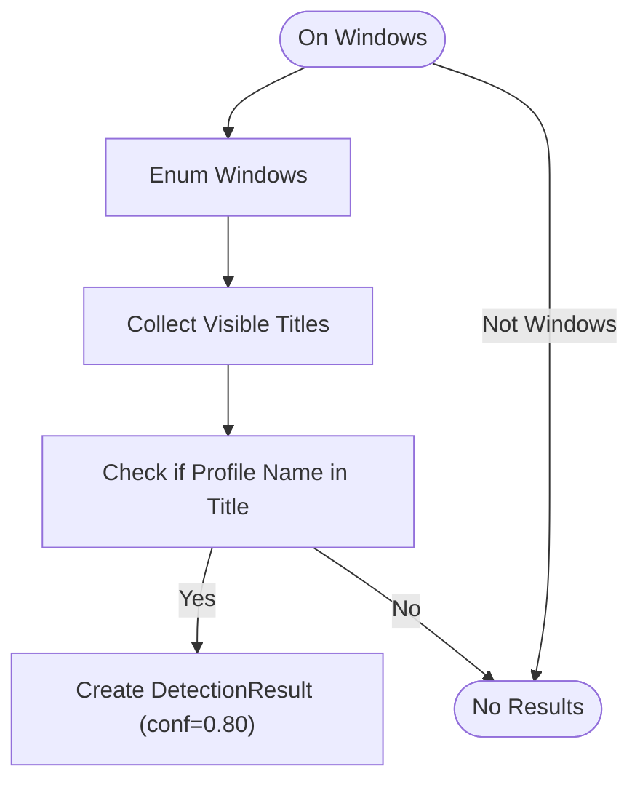
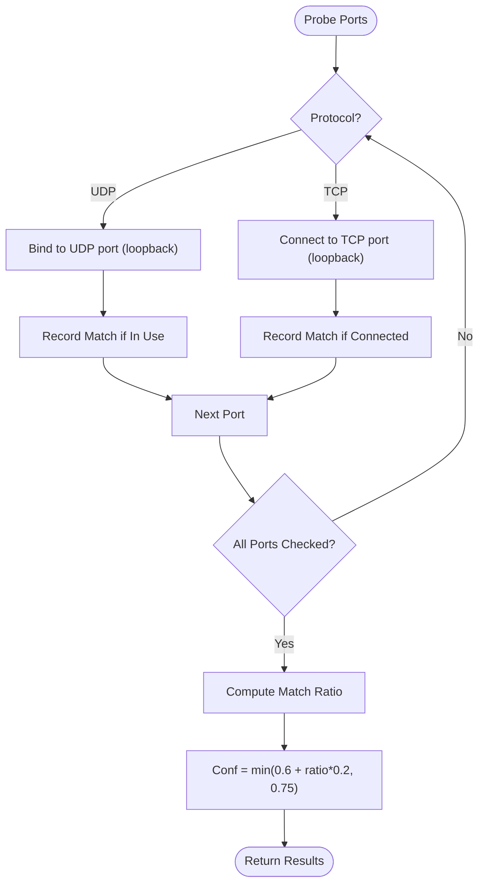
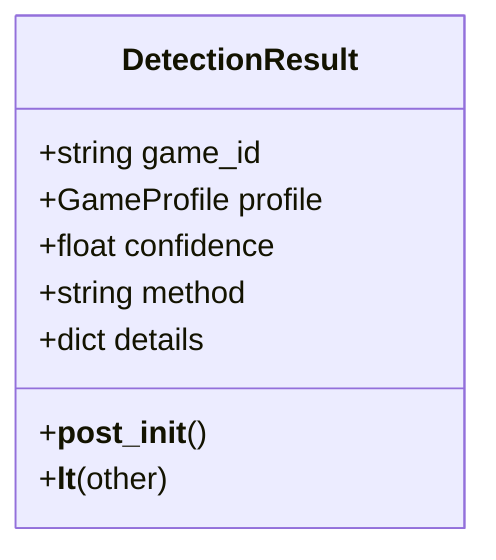
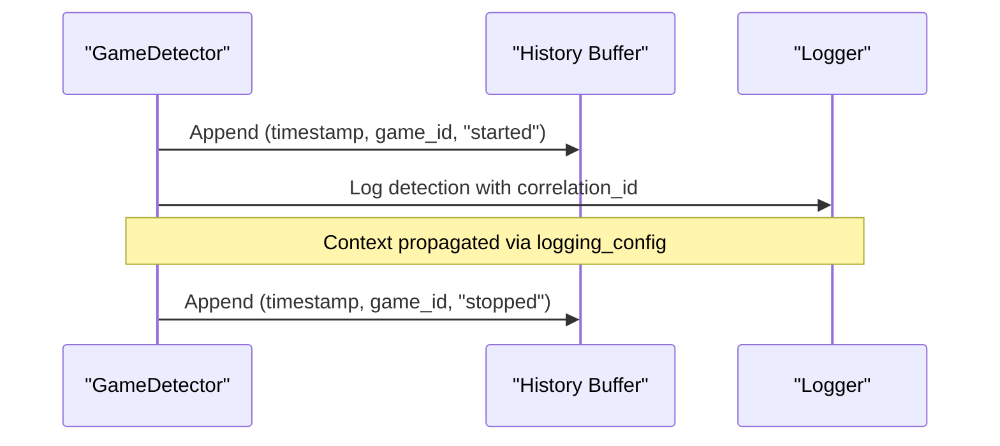
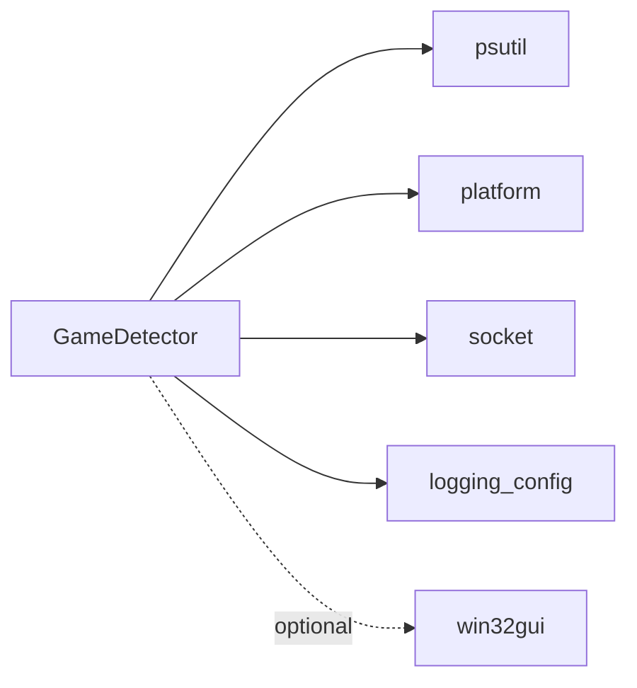
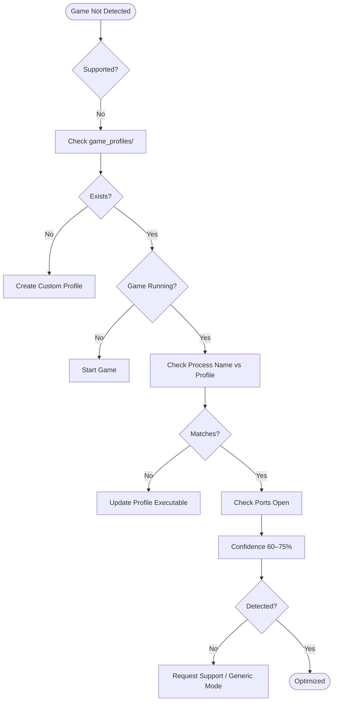

# Game Detection Mechanism

<cite>
**Referenced Files in This Document**
- [core/games.py](file://core/games.py)
- [tests/test_game_detection_advanced.py](file://tests/test_game_detection_advanced.py)
- [tests/test_games.py](file://tests/test_games.py)
- [game_profiles/battle_royale.json](file://game_profiles/battle_royale.json)
- [game_profiles/fps.json](file://game_profiles/fps.json)
- [IMPLEMENTATION_PLAN.md](file://IMPLEMENTATION_PLAN.md)
- [docs/TROUBLESHOOTING.md](file://docs/TROUBLESHOOTING.md)
- [core/logging_config.py](file://core/logging_config.py)
</cite>

## Table of Contents
1. [Introduction](#introduction)
2. [Project Structure](#project-structure)
3. [Core Components](#core-components)
4. [Architecture Overview](#architecture-overview)
5. [Detailed Component Analysis](#detailed-component-analysis)
6. [Dependency Analysis](#dependency-analysis)
7. [Performance Considerations](#performance-considerations)
8. [Troubleshooting Guide](#troubleshooting-guide)
9. [Conclusion](#conclusion)

## Introduction
This document explains the multi-method game detection mechanism used to identify running games and apply game-specific optimizations. The system employs a three-tier detection approach:
- Process name matching (primary method, 95% confidence)
- Window title detection (Windows only, 80% confidence)
- Port-based detection (fallback method, 60–75% confidence)

It also documents the fuzzy matching algorithm using Levenshtein distance, the detection loop architecture, confidence scoring, ranking, platform-specific considerations, detection history tracking, and event logging.

## Project Structure
The detection logic resides primarily in the core module and is exercised by focused tests. Game profiles are defined in JSON files under the game_profiles directory.



**Diagram sources**
- [core/games.py](file://core/games.py#L364-L448)
- [tests/test_game_detection_advanced.py](file://tests/test_game_detection_advanced.py#L1-L373)
- [tests/test_games.py](file://tests/test_games.py#L1-L149)
- [game_profiles/battle_royale.json](file://game_profiles/battle_royale.json#L1-L45)
- [game_profiles/fps.json](file://game_profiles/fps.json#L1-L143)
- [IMPLEMENTATION_PLAN.md](file://IMPLEMENTATION_PLAN.md#L332-L375)
- [docs/TROUBLESHOOTING.md](file://docs/TROUBLESHOOTING.md#L52-L85)
- [core/logging_config.py](file://core/logging_config.py#L1-L277)

**Section sources**
- [core/games.py](file://core/games.py#L364-L448)
- [tests/test_game_detection_advanced.py](file://tests/test_game_detection_advanced.py#L1-L373)
- [tests/test_games.py](file://tests/test_games.py#L1-L149)
- [game_profiles/battle_royale.json](file://game_profiles/battle_royale.json#L1-L45)
- [game_profiles/fps.json](file://game_profiles/fps.json#L1-L143)
- [IMPLEMENTATION_PLAN.md](file://IMPLEMENTATION_PLAN.md#L332-L375)
- [docs/TROUBLESHOOTING.md](file://docs/TROUBLESHOOTING.md#L52-L85)
- [core/logging_config.py](file://core/logging_config.py#L1-L277)

## Core Components
- GameDetector: Orchestrates detection across methods, manages detection history, and triggers game lifecycle events.
- DetectionResult: Encapsulates detection outcomes with confidence and method metadata.
- Fuzzy matching: Uses Levenshtein distance to match process names against profiles.
- Detection methods:
  - Process name matching (highest priority)
  - Window title detection (Windows only)
  - Port-based detection (TCP/UDP)

Key behaviors:
- Non-blocking detection using asyncio executors.
- Confidence-based ranking and selection.
- Graceful degradation for unsupported platforms.
- Structured logging and correlation context propagation.

**Section sources**
- [core/games.py](file://core/games.py#L74-L92)
- [core/games.py](file://core/games.py#L169-L228)
- [core/games.py](file://core/games.py#L364-L448)
- [core/games.py](file://core/games.py#L450-L510)
- [core/games.py](file://core/games.py#L511-L581)
- [core/logging_config.py](file://core/logging_config.py#L233-L277)

## Architecture Overview
The detection system runs continuously, periodically scanning for running games across multiple methods and selecting the highest-confidence result per game.

```mermaid
sequenceDiagram
participant Loop as "Detection Loop"
participant Proc as "Process Scanner"
participant Win as "Window Title Detector"
participant Port as "Port Detector"
participant Rank as "Ranking Engine"
participant Events as "Lifecycle Events"
Loop->>Proc : Enumerate running processes
Proc-->>Loop : Process names
Loop->>Win : Enumerate visible windows (Windows only)
Win-->>Loop : Window titles
Loop->>Port : Probe open ports per profile
Port-->>Loop : Matched ports per game
Loop->>Rank : Aggregate DetectionResult items
Rank-->>Loop : Best DetectionResult per game
Loop->>Events : _on_game_started/_on_game_stopped
Events-->>Loop : Optimizations applied
```

**Diagram sources**
- [core/games.py](file://core/games.py#L364-L448)
- [core/games.py](file://core/games.py#L450-L510)
- [core/games.py](file://core/games.py#L511-L581)
- [core/games.py](file://core/games.py#L583-L632)

## Detailed Component Analysis

### Detection Loop and Ranking
- The loop runs every five seconds and aggregates results per game across methods.
- Results are ranked by confidence; the highest wins.
- New and stopped games trigger lifecycle events and logging.



**Diagram sources**
- [core/games.py](file://core/games.py#L364-L448)
- [core/games.py](file://core/games.py#L583-L632)

**Section sources**
- [core/games.py](file://core/games.py#L364-L448)
- [tests/test_game_detection_advanced.py](file://tests/test_game_detection_advanced.py#L233-L265)

### Process Name Matching (Primary Method, 95% Confidence)
- Scans all running processes and compares names to profile executables.
- Uses fuzzy matching with Levenshtein distance and configurable threshold.
- Assigns 95% confidence when matched.

Fuzzy matching algorithm:
- Exact match (case-insensitive) and extension removal (e.g., .exe, .bat) are checked first.
- If still unmatched, computes Levenshtein distance between cleaned names.
- Similarity = 1 − (distance / max_len); match if similarity ≥ threshold.



**Diagram sources**
- [core/games.py](file://core/games.py#L194-L228)

Confidence scoring:
- Process-based detection sets confidence to 0.95 upon successful fuzzy match.

Platform considerations:
- No platform restrictions; always active.

**Section sources**
- [core/games.py](file://core/games.py#L194-L228)
- [core/games.py](file://core/games.py#L396-L411)
- [tests/test_game_detection_advanced.py](file://tests/test_game_detection_advanced.py#L119-L177)

### Window Title Detection (Windows Only, 80% Confidence)
- Enumerates visible window titles on Windows systems.
- Matches profile game names within window titles.
- Assigns 80% confidence when matched.
- Gracefully degrades on non-Windows platforms.



**Diagram sources**
- [core/games.py](file://core/games.py#L450-L510)

Platform considerations:
- Uses optional pywin32 dependency; silently skipped if unavailable.
- Non-Windows systems return empty results.

**Section sources**
- [core/games.py](file://core/games.py#L450-L510)
- [tests/test_game_detection_advanced.py](file://tests/test_game_detection_advanced.py#L209-L231)

### Port-Based Detection (Fallback, 60–75% Confidence)
- Probes local ports per profile for TCP and UDP.
- Calculates confidence based on match ratio: min(0.6 + (matched/total)*0.2, 0.75).
- Returns DetectionResult items with matched ports details.



**Diagram sources**
- [core/games.py](file://core/games.py#L511-L581)

**Section sources**
- [core/games.py](file://core/games.py#L511-L581)
- [tests/test_game_detection_advanced.py](file://tests/test_game_detection_advanced.py#L179-L207)

### DetectionResult and Ranking
- Dataclass encapsulating game_id, profile, confidence, method, and details.
- Confidence clamped to [0.0, 1.0].
- Sorting by confidence (higher is better) via __lt__.



**Diagram sources**
- [core/games.py](file://core/games.py#L74-L92)

**Section sources**
- [core/games.py](file://core/games.py#L74-L92)
- [tests/test_game_detection_advanced.py](file://tests/test_game_detection_advanced.py#L54-L117)

### Detection History Tracking and Event Logging
- Tracks detection events as (timestamp, game_id, action) tuples.
- Records "started" and "stopped" actions.
- Limits history to last 100 events.
- Sets correlation context for traceability and integrates with structured logging.



**Diagram sources**
- [core/games.py](file://core/games.py#L583-L632)
- [core/logging_config.py](file://core/logging_config.py#L233-L277)

**Section sources**
- [core/games.py](file://core/games.py#L278-L280)
- [core/games.py](file://core/games.py#L583-L632)
- [core/logging_config.py](file://core/logging_config.py#L233-L277)
- [tests/test_game_detection_advanced.py](file://tests/test_game_detection_advanced.py#L266-L297)

### Example Detection Scenarios
- Process detection with high confidence:
  - Exact or fuzzy-matched process name yields 95% confidence.
- Window title detection on Windows:
  - Visible window title containing the game name yields 80% confidence.
- Port-based detection:
  - Partial or full port match yields 60–75% confidence depending on match ratio.

Validation references:
- Process detection confidence assertions and fuzzy match tests.
- Port detection result validation and confidence range tests.
- Window title detection behavior on Windows and non-Windows.

**Section sources**
- [tests/test_game_detection_advanced.py](file://tests/test_game_detection_advanced.py#L119-L177)
- [tests/test_game_detection_advanced.py](file://tests/test_game_detection_advanced.py#L179-L207)
- [tests/test_game_detection_advanced.py](file://tests/test_game_detection_advanced.py#L209-L231)

## Dependency Analysis
The detection system depends on:
- psutil for process enumeration
- platform for OS checks
- socket for port probing
- win32gui (optional) for window title enumeration on Windows
- Structured logging for observability



**Diagram sources**
- [core/games.py](file://core/games.py#L3-L17)
- [core/games.py](file://core/games.py#L450-L510)
- [core/logging_config.py](file://core/logging_config.py#L1-L277)

**Section sources**
- [core/games.py](file://core/games.py#L3-L17)
- [core/games.py](file://core/games.py#L450-L510)
- [core/logging_config.py](file://core/logging_config.py#L1-L277)

## Performance Considerations
- Non-blocking I/O: Uses asyncio run_in_executor for process and window/port scans.
- Lightweight fuzzy matching: Levenshtein computation is bounded by typical process name lengths.
- Periodic polling: Detection runs every 5 seconds to balance responsiveness and overhead.
- Graceful degradation: Windows-only features are safely skipped when dependencies are missing.

[No sources needed since this section provides general guidance]

## Troubleshooting Guide
Common detection failures and resolutions:
- Game not detected:
  - Verify the game is supported or create a custom profile.
  - Ensure the process name matches the profile executable (fuzzy matching helps).
  - Confirm ports are open/listening for port-based detection.
- Windows-only features:
  - Window title detection requires pywin32; absence leads to graceful skipping.
- Logging and diagnostics:
  - Enable debug logging and review detection history and correlation IDs.
  - Use the troubleshooting flowcharts for step-by-step resolution.



**Diagram sources**
- [docs/TROUBLESHOOTING.md](file://docs/TROUBLESHOOTING.md#L52-L85)

**Section sources**
- [docs/TROUBLESHOOTING.md](file://docs/TROUBLESHOOTING.md#L52-L85)
- [core/games.py](file://core/games.py#L450-L510)
- [core/games.py](file://core/games.py#L511-L581)
- [tests/test_game_detection_advanced.py](file://tests/test_game_detection_advanced.py#L119-L177)

## Conclusion
The multi-method detection system provides robust, layered identification of running games with confidence-aware ranking. Process name matching offers the highest accuracy, window title detection enhances coverage on Windows, and port-based detection serves as a reliable fallback. The design emphasizes non-blocking operations, platform-aware behavior, and comprehensive observability through structured logging and detection history tracking.