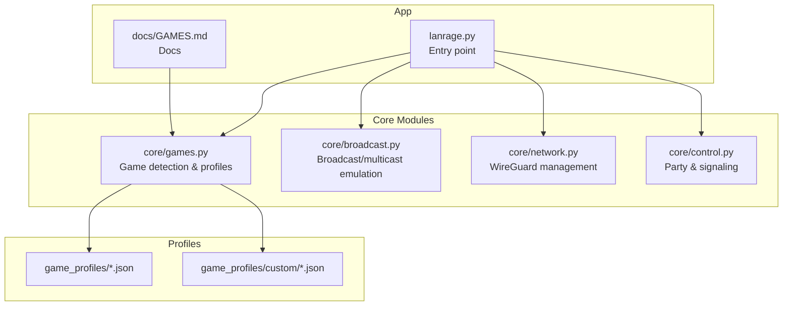
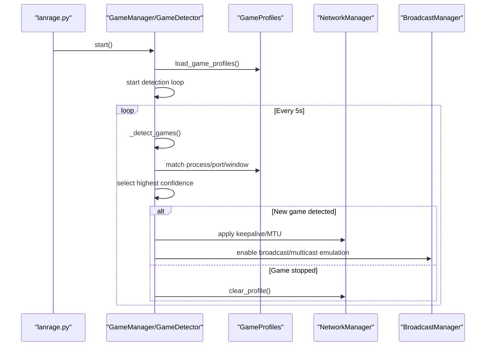
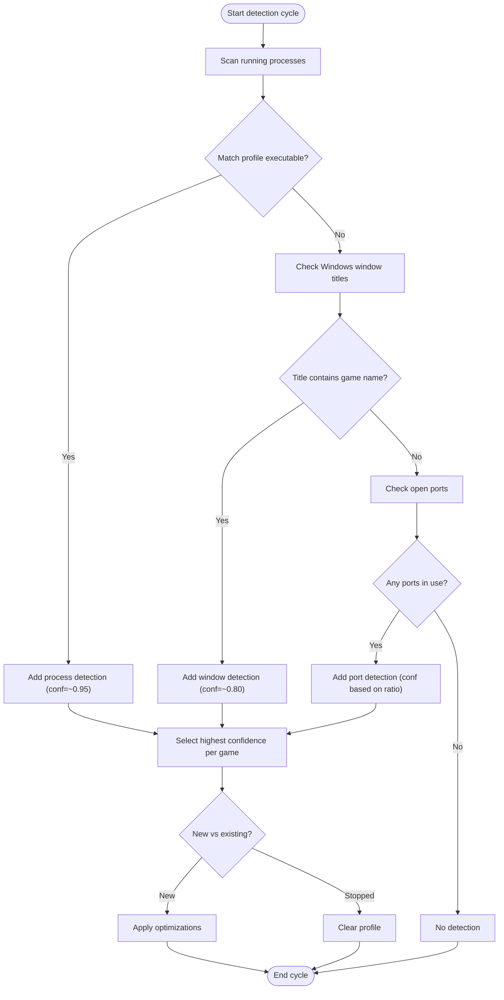
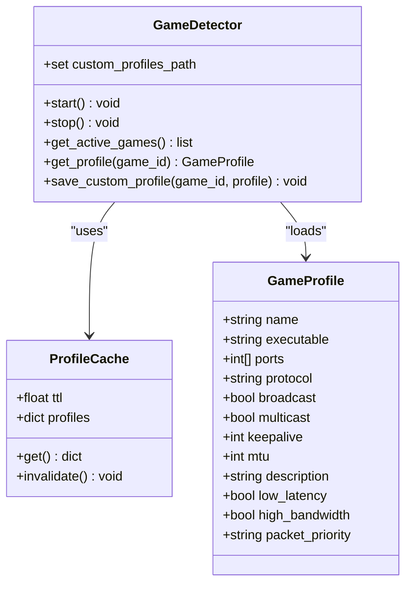
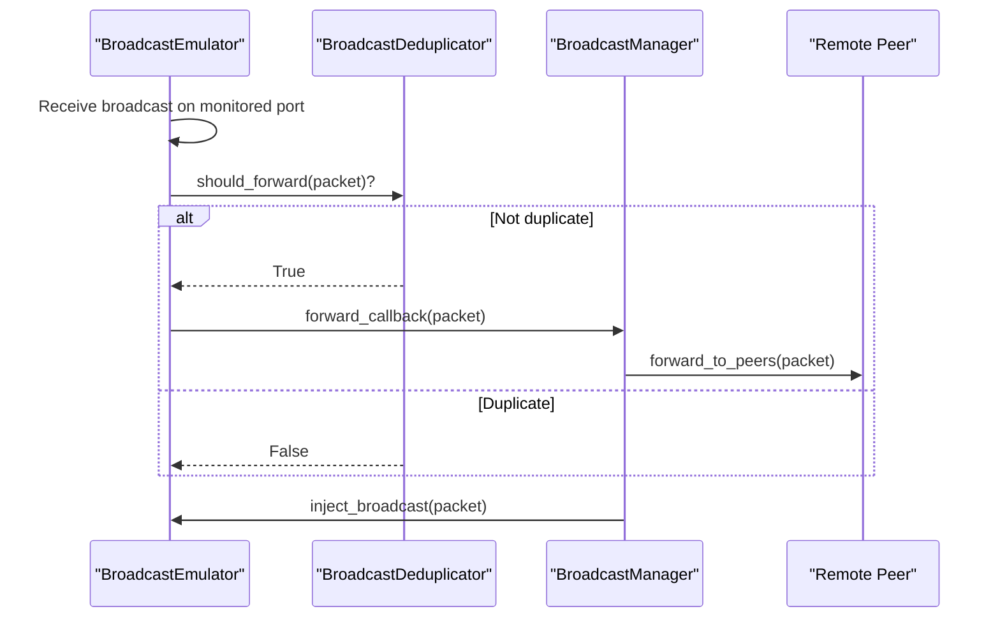
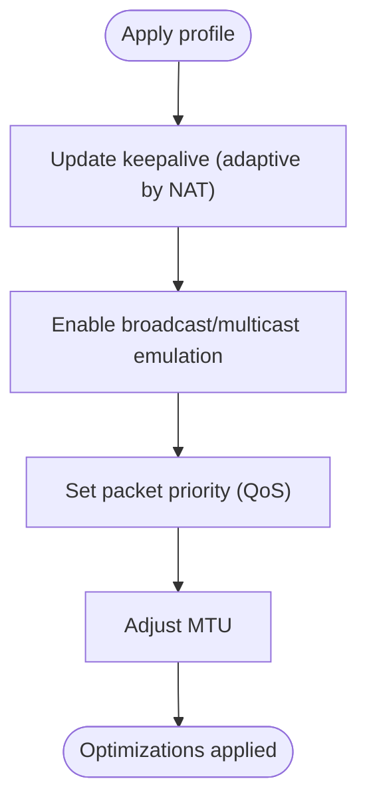
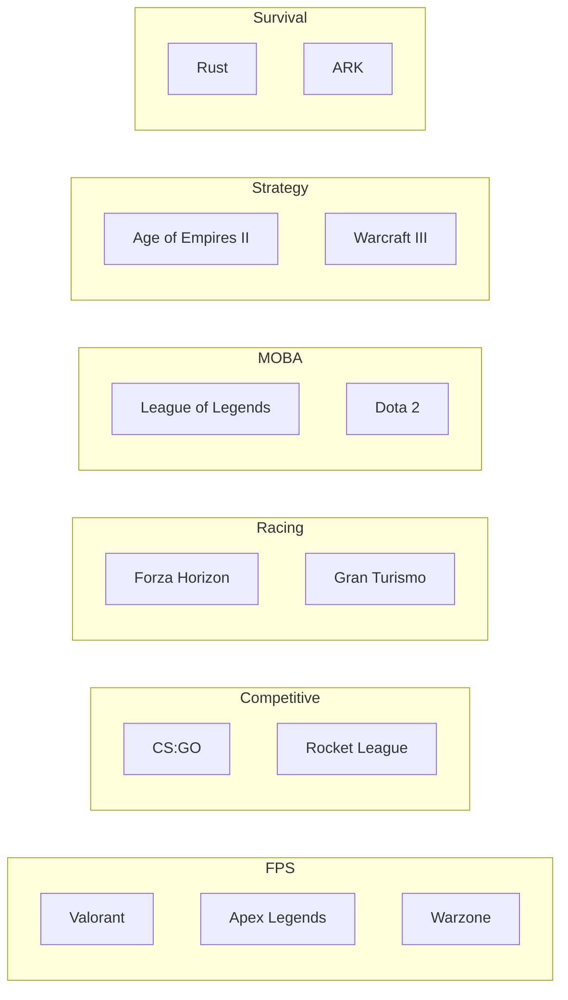
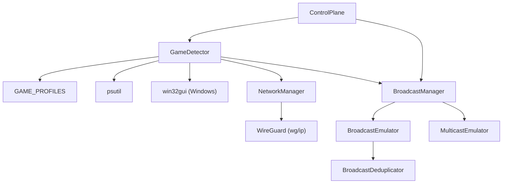

# Game Integration

<cite>
**Referenced Files in This Document**
- [games.py](file://core/games.py)
- [broadcast.py](file://core/broadcast.py)
- [network.py](file://core/network.py)
- [control.py](file://core/control.py)
- [lanrage.py](file://lanrage.py)
- [GAMES.md](file://docs/GAMES.md)
- [game_profiles/README.md](file://game_profiles/README.md)
- [game_profiles/fps.json](file://game_profiles/fps.json)
- [game_profiles/racing.json](file://game_profiles/racing.json)
- [game_profiles/moba.json](file://game_profiles/moba.json)
- [game_profiles/strategy.json](file://game_profiles/strategy.json)
- [game_profiles/survival.json](file://game_profiles/survival.json)
- [game_profiles/custom/example.json](file://game_profiles/custom/example.json)
- [test_game_detection_advanced.py](file://tests/test_game_detection_advanced.py)
- [test_games.py](file://tests/test_games.py)
</cite>

## Table of Contents
1. [Introduction](#introduction)
2. [Project Structure](#project-structure)
3. [Core Components](#core-components)
4. [Architecture Overview](#architecture-overview)
5. [Detailed Component Analysis](#detailed-component-analysis)
6. [Dependency Analysis](#dependency-analysis)
7. [Performance Considerations](#performance-considerations)
8. [Troubleshooting Guide](#troubleshooting-guide)
9. [Conclusion](#conclusion)
10. [Appendices](#appendices)

## Introduction
LANrage’s game integration system provides automatic detection of running games and applies game-specific network optimizations. It combines a multi-method detection engine with a flexible profile system to tailor network behavior for different game genres. The system supports broadcast emulation for legacy LAN discovery, QoS prioritization, and adaptive keepalive scheduling based on NAT characteristics.

## Project Structure
The game integration spans several modules:
- Detection and profiles: core/games.py
- Broadcast and multicast emulation: core/broadcast.py
- Network management (WireGuard): core/network.py
- Control plane (party/signaling): core/control.py
- Entry point and orchestration: lanrage.py
- Documentation: docs/GAMES.md
- Game profiles: game_profiles/*.json and game_profiles/custom/*.json
- Tests: tests/test_games.py and tests/test_game_detection_advanced.py

**Diagram sources**
- [games.py](file://core/games.py#L1-L1349)
- [broadcast.py](file://core/broadcast.py#L1-L646)
- [network.py](file://core/network.py#L1-L515)
- [control.py](file://core/control.py#L1-L880)
- [lanrage.py](file://lanrage.py#L1-L230)
- [GAMES.md](file://docs/GAMES.md#L1-L631)

**Section sources**
- [lanrage.py](file://lanrage.py#L40-L150)
- [GAMES.md](file://docs/GAMES.md#L1-L120)

## Core Components
- Game detection engine: Scans processes, window titles (Windows), and open ports to identify running games and ranks detections by confidence.
- Game profiles: JSON-based configuration defining ports, protocols, broadcast/multicast flags, keepalive, MTU, and QoS priorities.
- Broadcast emulation: Captures and re-emits LAN broadcasts/multicasts to peers to enable LAN discovery over the internet.
- Network manager: Creates and manages the WireGuard interface and applies keepalive/MTU settings.
- Control plane: Manages peer discovery and signaling (local or remote).

**Section sources**
- [games.py](file://core/games.py#L94-L162)
- [broadcast.py](file://core/broadcast.py#L201-L238)
- [network.py](file://core/network.py#L25-L94)
- [control.py](file://core/control.py#L187-L217)

## Architecture Overview
The system orchestrates detection, profile application, and network tuning. The entry point initializes components, and the game manager coordinates detection and optimization.

**Diagram sources**
- [lanrage.py](file://lanrage.py#L94-L125)
- [games.py](file://core/games.py#L265-L448)
- [broadcast.py](file://core/broadcast.py#L552-L646)
- [network.py](file://core/network.py#L392-L443)

## Detailed Component Analysis

### Game Detection Engine
- Detection methods:
  - Process name matching (highest confidence ~0.95) with fuzzy matching to tolerate minor differences.
  - Window title matching on Windows (confidence ~0.80).
  - Open port matching (confidence ~0.6–0.75 based on match ratio).
- Confidence scoring and selection:
  - Results per game are ranked; the highest confidence determines detection.
- Detection history:
  - Tracks timestamps and actions (“started”/“stopped”) for diagnostics.

**Diagram sources**
- [games.py](file://core/games.py#L364-L448)
- [games.py](file://core/games.py#L396-L426)
- [games.py](file://core/games.py#L450-L510)
- [games.py](file://core/games.py#L511-L581)

**Section sources**
- [games.py](file://core/games.py#L364-L448)
- [test_game_detection_advanced.py](file://tests/test_game_detection_advanced.py#L119-L177)

### Game Profile System
- Profiles are stored as JSON files grouped by genre and include a custom directory for user-defined profiles.
- Each profile defines:
  - name, executable, ports, protocol
  - broadcast and multicast flags
  - keepalive, mtu
  - description
  - optimization hints: low_latency, high_bandwidth, packet_priority
- Profiles are loaded at startup and cached with TTL.

**Diagram sources**
- [games.py](file://core/games.py#L53-L92)
- [games.py](file://core/games.py#L230-L254)
- [games.py](file://core/games.py#L257-L263)
- [games.py](file://core/games.py#L292-L356)

**Section sources**
- [game_profiles/README.md](file://game_profiles/README.md#L29-L92)
- [games.py](file://core/games.py#L94-L162)
- [games.py](file://core/games.py#L257-L263)

### Broadcast and Multicast Emulation
- BroadcastEmulator listens on common game ports and forwards discovered broadcasts to peers with deduplication.
- MulticastEmulator supports mDNS and SSDP groups.
- BroadcastManager coordinates listeners and forwards to peers, injecting packets back into the LAN.

**Diagram sources**
- [broadcast.py](file://core/broadcast.py#L201-L238)
- [broadcast.py](file://core/broadcast.py#L29-L199)
- [broadcast.py](file://core/broadcast.py#L552-L646)

**Section sources**
- [broadcast.py](file://core/broadcast.py#L201-L238)
- [broadcast.py](file://core/broadcast.py#L427-L550)
- [broadcast.py](file://core/broadcast.py#L552-L646)

### Network Management and QoS
- NetworkManager creates and configures the WireGuard interface, sets MTU, and adds peers with persistent keepalive.
- QoS is applied via platform-specific mechanisms:
  - Linux: iptables DSCP marking and tc HTB for bandwidth guarantees.
  - Windows: netsh QoS policies for DSCP marking.
- Packet priority mapping:
  - low: 0 (Best Effort)
  - medium: 18 (AF21)
  - high: 46 (EF)

**Diagram sources**
- [network.py](file://core/network.py#L392-L443)
- [GAMES.md](file://docs/GAMES.md#L351-L378)

**Section sources**
- [network.py](file://core/network.py#L25-L94)
- [GAMES.md](file://docs/GAMES.md#L351-L378)

### Supported Games and Categories
The system includes curated profiles across genres. Below are representative samples:

- First-Person Shooters (FPS)
  - Examples: Valorant, Apex Legends, Call of Duty: Warzone, Battlefield, Halo Infinite, Overwatch, CS2, Rainbow Six Siege, Titanfall 2, Destiny 2
  - Characteristics: low-latency critical, high bandwidth, high packet priority

- Competitive Games
  - Examples: CS:GO, Rocket League, Brawlhalla
  - Characteristics: low-latency critical, competitive timing

- Racing
  - Examples: Forza Horizon, Gran Turismo, Assetto Corsa, iRacing, Trackmania
  - Characteristics: low-latency critical, high bandwidth

- MOBA
  - Examples: League of Legends, Dota 2, Smite
  - Characteristics: low-latency critical, high bandwidth

- Strategy (RTS)
  - Examples: Age of Empires II, Warcraft III
  - Characteristics: latency important, lower bandwidth

- Survival
  - Examples: Rust, ARK, 7 Days to Die, The Forest, Valheim
  - Characteristics: mixed latency needs, moderate-high bandwidth

**Diagram sources**
- [game_profiles/fps.json](file://game_profiles/fps.json#L1-L143)
- [game_profiles/competitive.json](file://game_profiles/competitive.json#L1-L45)
- [game_profiles/racing.json](file://game_profiles/racing.json#L1-L73)
- [game_profiles/moba.json](file://game_profiles/moba.json#L1-L45)
- [game_profiles/strategy.json](file://game_profiles/strategy.json#L1-L31)
- [game_profiles/survival.json](file://game_profiles/survival.json#L1-L73)

**Section sources**
- [game_profiles/fps.json](file://game_profiles/fps.json#L1-L143)
- [game_profiles/racing.json](file://game_profiles/racing.json#L1-L73)
- [game_profiles/moba.json](file://game_profiles/moba.json#L1-L45)
- [game_profiles/strategy.json](file://game_profiles/strategy.json#L1-L31)
- [game_profiles/survival.json](file://game_profiles/survival.json#L1-L73)

### Custom Game Profiles
Users can add custom profiles under game_profiles/custom/ with the same JSON schema. The detector loads these dynamically and merges them with built-in profiles. The example profile demonstrates the required fields and structure.

- Creation steps:
  - Place a JSON file in game_profiles/custom/
  - Define a unique game_id and profile fields
  - Restart LANrage to load the profile

**Section sources**
- [game_profiles/README.md](file://game_profiles/README.md#L67-L92)
- [game_profiles/custom/example.json](file://game_profiles/custom/example.json#L1-L18)
- [games.py](file://core/games.py#L292-L356)

### Configuration and Parameter Guide
- keepalive: Controls WireGuard persistent keepalive; lower for fast-paced games, higher for turn-based
- mtu: Optimal MTU (default 1420); adjust only if the game requires
- broadcast/multicast: Enable discovery emulation for games relying on LAN discovery
- packet_priority: “low”, “medium”, or “high”; maps to DSCP values for QoS
- protocol: “udp”, “tcp”, or “both”; align with game documentation
- ports: List of ports used by the game; used for port-based detection and broadcast emulation

**Section sources**
- [game_profiles/README.md](file://game_profiles/README.md#L52-L66)
- [GAMES.md](file://docs/GAMES.md#L351-L378)

## Dependency Analysis
The game integration depends on:
- Detection relies on process enumeration and optional window title inspection (Windows).
- Broadcast emulation depends on OS-level sockets and multicast membership.
- Network optimizations depend on platform-specific commands (Windows: wireguard.exe, netsh; Linux: wg, ip, iptables, tc).
- Control plane integrates peer discovery and signaling.

**Diagram sources**
- [games.py](file://core/games.py#L364-L448)
- [broadcast.py](file://core/broadcast.py#L201-L238)
- [network.py](file://core/network.py#L161-L310)
- [control.py](file://core/control.py#L187-L217)

**Section sources**
- [games.py](file://core/games.py#L3-L17)
- [broadcast.py](file://core/broadcast.py#L1-L20)
- [network.py](file://core/network.py#L1-L20)
- [control.py](file://core/control.py#L1-L20)

## Performance Considerations
- Detection cadence: Runs every 5 seconds; minimal overhead via async I/O and caching.
- NAT-aware keepalive: Adapts based on NAT type to balance binding lifetime and traffic.
- QoS on Linux: Uses tc HTB with guaranteed ceilings per priority tier.
- Broadcast deduplication: Prevents redundant forwarding and reduces bandwidth waste.

[No sources needed since this section provides general guidance]

## Troubleshooting Guide
Common issues and resolutions:
- Game not detected:
  - Verify process name matches profile executable (case-insensitive and extension-agnostic).
  - Confirm ports are open and match profile; port-based detection uses a confidence threshold.
  - On Windows, ensure window title detection is available and the game title contains the profile name.
- Profile conflicts:
  - Multiple detections for the same game resolve to the highest confidence; check detection history for details.
  - If a custom profile overrides built-in behavior unexpectedly, validate JSON syntax and fields.
- Broadcast emulation not working:
  - Ensure required ports are monitored; the emulator listens on common ports by default.
  - Check OS permissions (root/admin) for raw sockets and multicast membership.
- QoS not applied:
  - Linux: confirm iptables and tc are available and LANrage has sufficient privileges.
  - Windows: ensure netsh is available and LANrage runs with administrative privileges.
- NAT and keepalive:
  - NAT type affects adaptive keepalive; verify NAT detection and adjust keepalive if needed.

**Section sources**
- [games.py](file://core/games.py#L364-L448)
- [broadcast.py](file://core/broadcast.py#L240-L286)
- [GAMES.md](file://docs/GAMES.md#L351-L378)

## Conclusion
LANrage’s game integration system automates detection and optimization for a wide variety of games. Its modular design—combining robust detection, flexible profiles, broadcast emulation, and platform-aware QoS—enables seamless LAN-like experiences for LAN-discovery games over the internet. Users can leverage curated profiles or contribute custom ones to expand support continuously.

[No sources needed since this section summarizes without analyzing specific files]

## Appendices

### API and CLI References
- Entry point initializes settings, network, control plane, metrics, Discord integration, and starts the API server.
- The API server exposes endpoints for configuration and runtime controls.

**Section sources**
- [lanrage.py](file://lanrage.py#L94-L150)

### Testing Coverage
- Unit tests validate detection confidence, multi-method detection, and profile loading.
- Advanced tests cover detection ranking, fuzzy matching, and lifecycle behaviors.

**Section sources**
- [test_games.py](file://tests/test_games.py#L28-L149)
- [test_game_detection_advanced.py](file://tests/test_game_detection_advanced.py#L1-L373)