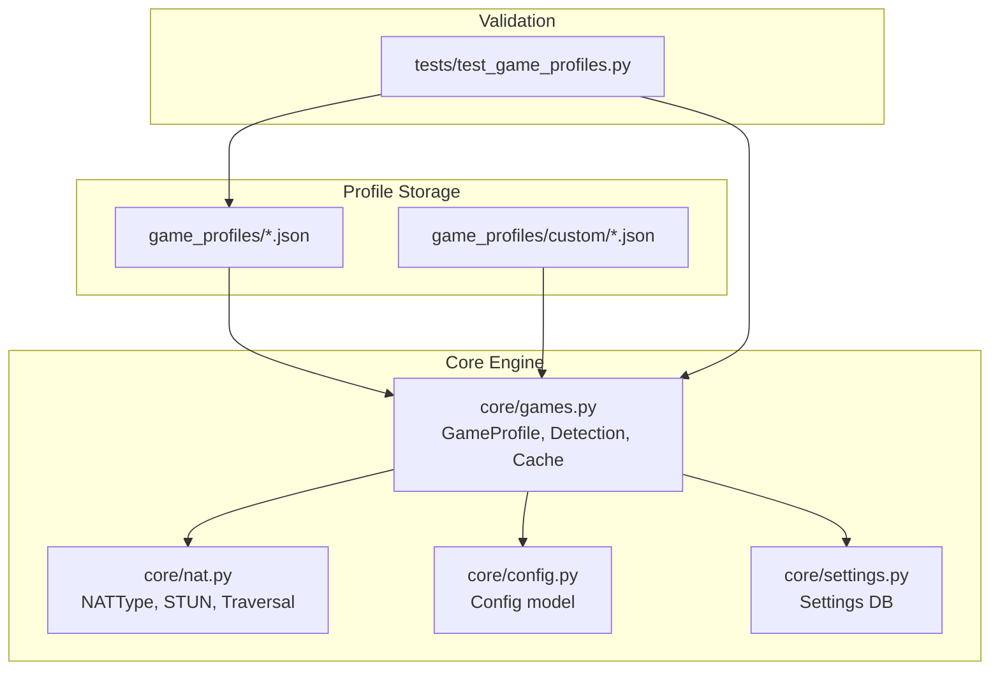
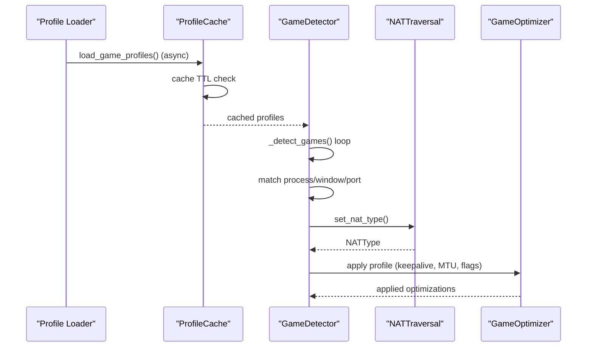
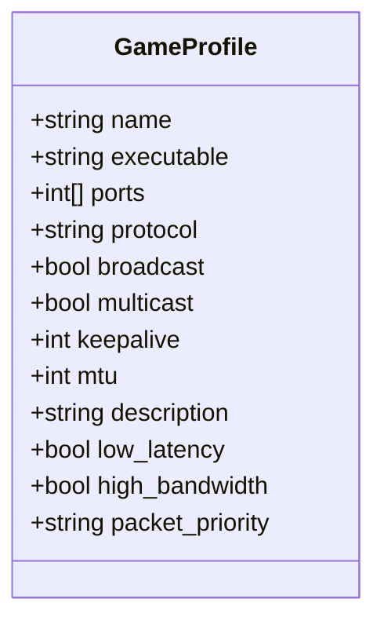
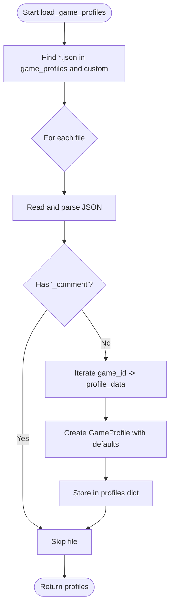
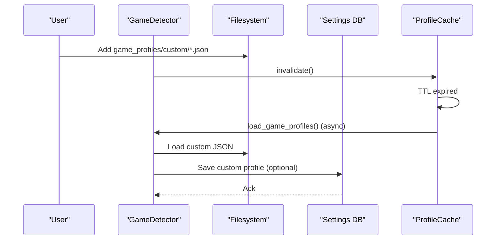
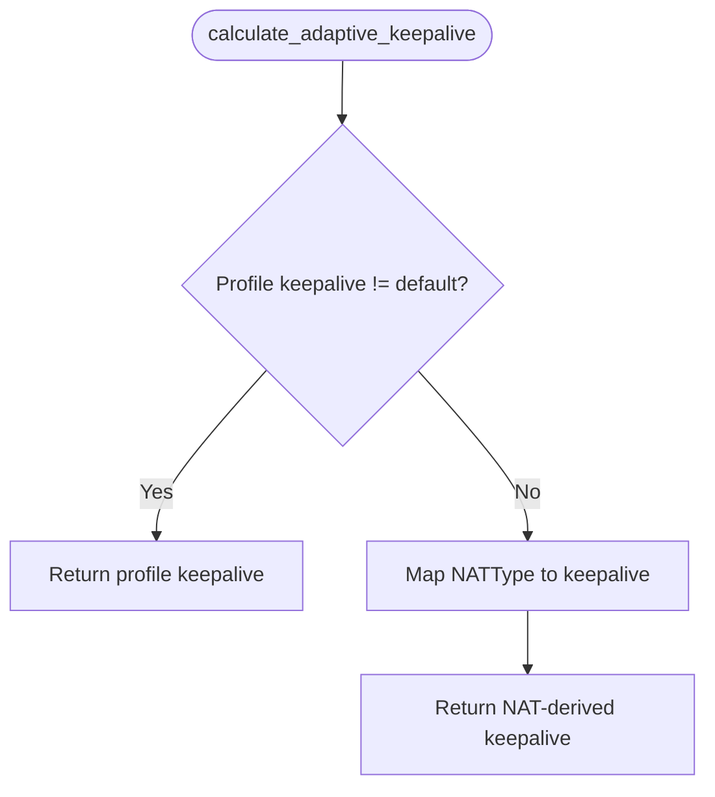
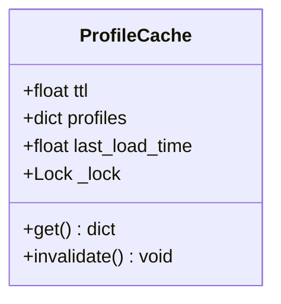
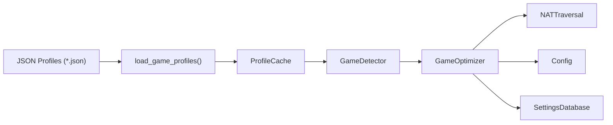

# Game Profile System

<cite>
**Referenced Files in This Document**
- [game_profiles/README.md](file://game_profiles/README.md)
- [game_profiles/custom/example.json](file://game_profiles/custom/example.json)
- [game_profiles/fps.json](file://game_profiles/fps.json)
- [game_profiles/racing.json](file://game_profiles/racing.json)
- [game_profiles/strategy.json](file://game_profiles/strategy.json)
- [game_profiles/survival.json](file://game_profiles/survival.json)
- [game_profiles/custom/call_of_duty.json](file://game_profiles/custom/call_of_duty.json)
- [game_profiles/custom/far_cry.json](file://game_profiles/custom/far_cry.json)
- [core/games.py](file://core/games.py)
- [core/nat.py](file://core/nat.py)
- [core/config.py](file://core/config.py)
- [core/settings.py](file://core/settings.py)
- [tests/test_game_profiles.py](file://tests/test_game_profiles.py)
</cite>

## Table of Contents
1. [Introduction](#introduction)
2. [Project Structure](#project-structure)
3. [Core Components](#core-components)
4. [Architecture Overview](#architecture-overview)
5. [Detailed Component Analysis](#detailed-component-analysis)
6. [Dependency Analysis](#dependency-analysis)
7. [Performance Considerations](#performance-considerations)
8. [Troubleshooting Guide](#troubleshooting-guide)
9. [Conclusion](#conclusion)
10. [Appendices](#appendices)

## Introduction
This document describes the Game Profile System that powers automatic game detection and optimization in the LANrage networking stack. It covers the GameProfile data structure, JSON-based configuration management, profile loading mechanisms, adaptive keepalive calculation based on NAT traversal, caching and dynamic reloading, validation and error handling, and practical examples for different game types.

## Project Structure
The Game Profile System spans several directories and modules:
- game_profiles: Genre-based JSON profiles and a custom directory for user-defined profiles
- core: Game detection, NAT traversal, configuration, and settings persistence
- tests: Validation tests ensuring profile correctness and completeness



**Diagram sources**
- [core/games.py](file://core/games.py#L94-L162)
- [core/nat.py](file://core/nat.py#L19-L28)
- [core/config.py](file://core/config.py#L17-L48)
- [core/settings.py](file://core/settings.py#L20-L93)
- [tests/test_game_profiles.py](file://tests/test_game_profiles.py#L14-L23)

**Section sources**
- [game_profiles/README.md](file://game_profiles/README.md#L1-L174)
- [core/games.py](file://core/games.py#L94-L162)

## Core Components
- GameProfile: Defines per-game optimization parameters and metadata
- GameDetector: Loads profiles, detects running games, and applies optimizations
- ProfileCache: TTL-based caching for dynamic profile reloading
- NATTraversal: Provides NAT type for adaptive keepalive calculation
- Config: Centralized configuration model
- SettingsDatabase: Persistent storage for settings and custom profiles

**Section sources**
- [core/games.py](file://core/games.py#L53-L71)
- [core/games.py](file://core/games.py#L230-L254)
- [core/games.py](file://core/games.py#L257-L263)
- [core/nat.py](file://core/nat.py#L19-L28)
- [core/config.py](file://core/config.py#L17-L48)
- [core/settings.py](file://core/settings.py#L20-L93)

## Architecture Overview
The system loads profiles from JSON files, caches them with TTL, adapts WireGuard keepalive based on NAT type, and applies game-specific optimizations during detection.



**Diagram sources**
- [core/games.py](file://core/games.py#L94-L162)
- [core/games.py](file://core/games.py#L239-L254)
- [core/games.py](file://core/games.py#L364-L448)
- [core/nat.py](file://core/nat.py#L64-L106)
- [core/games.py](file://core/games.py#L696-L740)

## Detailed Component Analysis

### GameProfile Data Structure
GameProfile encapsulates all per-game configuration used for detection and optimization.



Fields and semantics:
- name: Display name of the game
- executable: Process name pattern (supports wildcards)
- ports: List of ports used by the game
- protocol: "udp", "tcp", or "both"
- broadcast: Whether LAN broadcast discovery is used
- multicast: Whether multicast discovery is used
- keepalive: WireGuard keepalive interval in seconds
- mtu: Optimal MTU size
- description: Human-readable description
- low_latency: Whether the game benefits from low-latency tuning
- high_bandwidth: Whether the game uses high bandwidth
- packet_priority: "low", "medium", or "high" for QoS

**Diagram sources**
- [core/games.py](file://core/games.py#L53-L71)

**Section sources**
- [core/games.py](file://core/games.py#L53-L71)
- [game_profiles/README.md](file://game_profiles/README.md#L52-L66)

### Profile Loading Mechanism
Profiles are loaded from genre-based JSON files and custom directories. The loader supports:
- Async JSON parsing
- Custom profiles directory
- Example files with comments are skipped
- Graceful error handling for malformed JSON or missing fields



**Diagram sources**
- [core/games.py](file://core/games.py#L94-L162)

**Section sources**
- [core/games.py](file://core/games.py#L94-L162)
- [game_profiles/custom/example.json](file://game_profiles/custom/example.json#L1-L18)

### Custom Profiles and Dynamic Loading
Users can add custom profiles in the custom directory or via the settings database. The system supports:
- Custom JSON files under game_profiles/custom/
- A dedicated custom profiles file path for runtime additions
- Settings database-backed storage for custom profiles
- Cache invalidation to force reload on changes



**Diagram sources**
- [core/games.py](file://core/games.py#L286-L356)
- [core/games.py](file://core/games.py#L651-L694)
- [core/settings.py](file://core/settings.py#L307-L370)
- [core/games.py](file://core/games.py#L239-L254)

**Section sources**
- [core/games.py](file://core/games.py#L286-L356)
- [core/games.py](file://core/games.py#L651-L694)
- [core/settings.py](file://core/settings.py#L307-L370)

### Adaptive Keepalive Calculation
WireGuard keepalive is adapted based on NAT type to maintain connectivity without excessive traffic. Profiles can override the default keepalive value.



NAT mapping:
- OPEN: relaxed interval
- FULL_CONE: moderate interval
- RESTRICTED_CONE: shorter interval
- PORT_RESTRICTED_CONE: shorter interval
- SYMMETRIC: frequent keepalive
- UNKNOWN: conservative default

**Diagram sources**
- [core/games.py](file://core/games.py#L20-L51)
- [core/nat.py](file://core/nat.py#L19-L28)

**Section sources**
- [core/games.py](file://core/games.py#L20-L51)
- [core/nat.py](file://core/nat.py#L19-L28)

### Profile Cache System with TTL
ProfileCache provides time-based expiration to balance freshness and performance. It uses an async lock to prevent concurrent reloads.



Behavior:
- On access, if TTL elapsed, reload profiles
- Serialize reloads with a lock
- Invalidate forces next access to reload

**Diagram sources**
- [core/games.py](file://core/games.py#L230-L254)

**Section sources**
- [core/games.py](file://core/games.py#L230-L254)

### Game Detection and Optimization Workflow
GameDetector continuously monitors running processes, window titles, and open ports to identify games and apply optimizations.

```mermaid
sequenceDiagram
participant Loop as "Detection Loop"
participant Proc as "Process Scanner"
participant Win as "Window Title Scanner"
participant Ports as "Port Scanner"
participant Match as "Matcher"
participant Opt as "GameOptimizer"
Loop->>Proc : Enumerate running processes
Proc-->>Loop : Process names
Loop->>Match : Fuzzy match executable
alt Windows
Loop->>Win : Enumerate window titles
Win-->>Loop : Titles
Loop->>Match : Match by title
end
Loop->>Ports : Probe open ports (UDP/TCP)
Ports-->>Loop : Matches
Loop->>Match : Aggregate detections
Match-->>Loop : Best detection per game
Loop->>Opt : Apply profile (keepalive, MTU, flags)
```

**Diagram sources**
- [core/games.py](file://core/games.py#L364-L448)
- [core/games.py](file://core/games.py#L450-L510)
- [core/games.py](file://core/games.py#L511-L581)

**Section sources**
- [core/games.py](file://core/games.py#L364-L448)
- [core/games.py](file://core/games.py#L450-L510)
- [core/games.py](file://core/games.py#L511-L581)

### Examples of Profile Configurations
Below are representative configurations for different game genres and types. See the linked files for full examples.

- First-person shooters (FPS)
  - Example: [game_profiles/fps.json](file://game_profiles/fps.json#L1-L143)
  - Typical characteristics: low-latency, high-bandwidth, UDP preferred

- Racing games
  - Example: [game_profiles/racing.json](file://game_profiles/racing.json#L1-L73)
  - Typical characteristics: precision timing, high bandwidth, UDP preferred

- Strategy/RTS games
  - Example: [game_profiles/strategy.json](file://game_profiles/strategy.json#L1-L31)
  - Typical characteristics: real-time coordination, medium bandwidth, both protocols

- Survival games
  - Example: [game_profiles/survival.json](file://game_profiles/survival.json#L1-L73)
  - Typical characteristics: large worlds, high bandwidth, UDP preferred

- Custom Call of Duty profiles
  - Example: [game_profiles/custom/call_of_duty.json](file://game_profiles/custom/call_of_duty.json#L1-L87)

- Custom Far Cry profiles
  - Example: [game_profiles/custom/far_cry.json](file://game_profiles/custom/far_cry.json#L1-L73)

- Custom example profile
  - Example: [game_profiles/custom/example.json](file://game_profiles/custom/example.json#L1-L18)

**Section sources**
- [game_profiles/fps.json](file://game_profiles/fps.json#L1-L143)
- [game_profiles/racing.json](file://game_profiles/racing.json#L1-L73)
- [game_profiles/strategy.json](file://game_profiles/strategy.json#L1-L31)
- [game_profiles/survival.json](file://game_profiles/survival.json#L1-L73)
- [game_profiles/custom/call_of_duty.json](file://game_profiles/custom/call_of_duty.json#L1-L87)
- [game_profiles/custom/far_cry.json](file://game_profiles/custom/far_cry.json#L1-L73)
- [game_profiles/custom/example.json](file://game_profiles/custom/example.json#L1-L18)

### Parameter Explanations and Optimization Strategies
- name: Display name for logs and UI
- executable: Process name pattern; supports wildcards
- ports: One or more ports used by the game; used for port-based detection
- protocol: "udp", "tcp", or "both"; affects how ports are probed
- broadcast: Enables LAN broadcast discovery for supported games
- multicast: Enables multicast discovery for supported games
- keepalive: WireGuard keepalive in seconds; adapted by NAT type
- mtu: Optimal MTU size; default 1420
- description: Short description for display
- low_latency: Prioritizes latency-sensitive optimizations
- high_bandwidth: Indicates high-throughput scenarios
- packet_priority: "low", "medium", "high" for QoS

Optimization strategies:
- Fast-paced games: lower keepalive (e.g., 10–15s), high packet priority
- Turn-based or casual games: higher keepalive (e.g., 25–45s), medium priority
- Large-world or streaming games: higher MTU and high bandwidth flags
- Discovery-dependent games: enable broadcast/multicast as appropriate

**Section sources**
- [game_profiles/README.md](file://game_profiles/README.md#L52-L66)
- [core/games.py](file://core/games.py#L20-L51)

## Dependency Analysis
The Game Profile System integrates with NAT traversal, configuration, and settings persistence.



**Diagram sources**
- [core/games.py](file://core/games.py#L94-L162)
- [core/games.py](file://core/games.py#L239-L254)
- [core/games.py](file://core/games.py#L696-L740)
- [core/nat.py](file://core/nat.py#L64-L106)
- [core/config.py](file://core/config.py#L17-L48)
- [core/settings.py](file://core/settings.py#L20-L93)

**Section sources**
- [core/games.py](file://core/games.py#L94-L162)
- [core/games.py](file://core/games.py#L239-L254)
- [core/games.py](file://core/games.py#L696-L740)
- [core/nat.py](file://core/nat.py#L64-L106)
- [core/config.py](file://core/config.py#L17-L48)
- [core/settings.py](file://core/settings.py#L20-L93)

## Performance Considerations
- Profile loading is asynchronous and cached with TTL to minimize I/O overhead
- Detection loop runs periodically with controlled sleep intervals
- NAT detection and hole punching are optimized with timeouts and retries
- Validation tests ensure minimal profile parsing overhead and correctness

[No sources needed since this section provides general guidance]

## Troubleshooting Guide
Common issues and resolutions:
- Invalid JSON in profile files: The loader prints warnings and skips malformed files
- Missing required fields: Validation tests enforce required keys and types
- Out-of-range values: Tests validate port, keepalive, and MTU ranges
- Duplicate game IDs: Tests ensure uniqueness across and within profiles
- Custom profile not loading: Ensure the custom file is valid JSON and not commented; restart the service to refresh cache

Relevant validations and error handling:
- Profile parsing and field validation
- Type and value checks for all fields
- Range checks for ports, keepalive, and MTU
- Duplicate ID detection across and within files

**Section sources**
- [core/games.py](file://core/games.py#L156-L159)
- [tests/test_game_profiles.py](file://tests/test_game_profiles.py#L44-L84)
- [tests/test_game_profiles.py](file://tests/test_game_profiles.py#L87-L178)
- [tests/test_game_profiles.py](file://tests/test_game_profiles.py#L180-L220)

## Conclusion
The Game Profile System provides a robust, extensible framework for automatic game detection and optimization. It leverages JSON-based configuration, adaptive NAT-aware keepalive, caching, and comprehensive validation to deliver reliable performance across diverse gaming scenarios. Users can easily add custom profiles, and the system remains resilient to malformed inputs through defensive parsing and validation.

## Appendices

### Appendix A: Profile Field Reference
- name: string
- executable: string (supports wildcards)
- ports: array of integers (1–65535)
- protocol: "udp" | "tcp" | "both"
- broadcast: boolean
- multicast: boolean
- keepalive: integer (5–60)
- mtu: integer (1280–1500)
- description: string
- low_latency: boolean
- high_bandwidth: boolean
- packet_priority: "low" | "medium" | "high"

**Section sources**
- [game_profiles/README.md](file://game_profiles/README.md#L52-L66)
- [tests/test_game_profiles.py](file://tests/test_game_profiles.py#L149-L178)