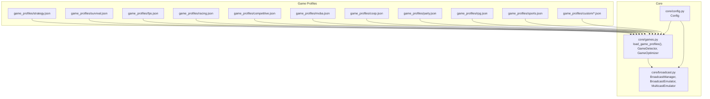
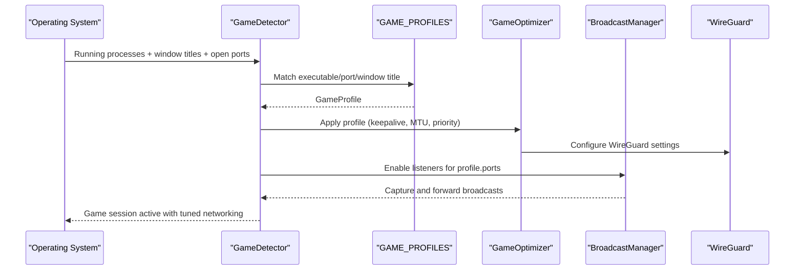
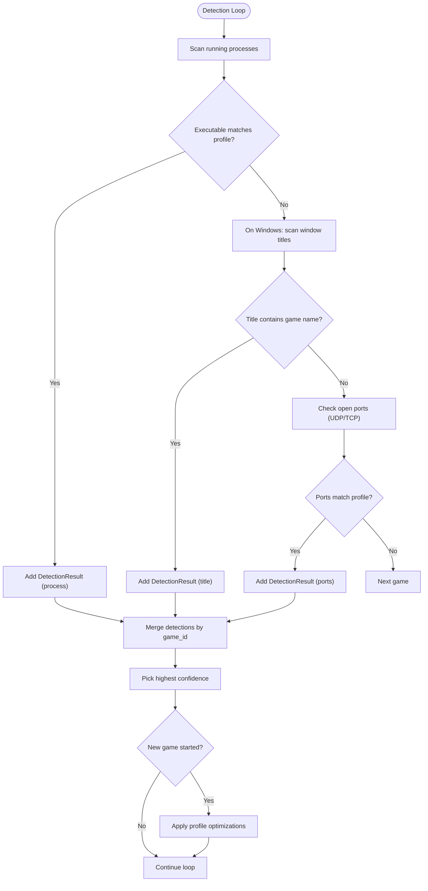
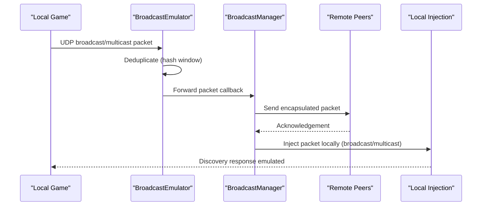
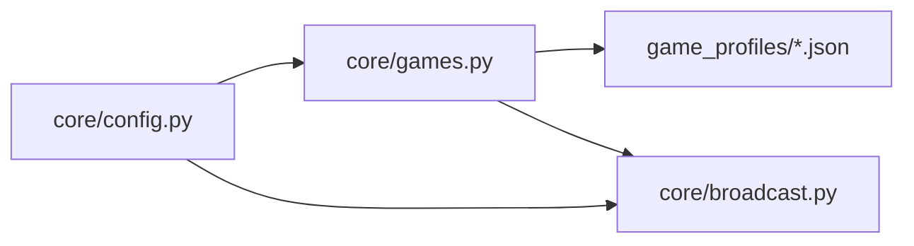

# Supported Games Catalog

<cite>
**Referenced Files in This Document**
- [README.md](file://README.md)
- [game_profiles/README.md](file://game_profiles/README.md)
- [docs/GAMES.md](file://docs/GAMES.md)
- [docs/BROADCAST.md](file://docs/BROADCAST.md)
- [core/games.py](file://core/games.py)
- [core/broadcast.py](file://core/broadcast.py)
- [core/config.py](file://core/config.py)
- [game_profiles/strategy.json](file://game_profiles/strategy.json)
- [game_profiles/survival.json](file://game_profiles/survival.json)
- [game_profiles/fps.json](file://game_profiles/fps.json)
- [game_profiles/racing.json](file://game_profiles/racing.json)
- [game_profiles/competitive.json](file://game_profiles/competitive.json)
- [game_profiles/moba.json](file://game_profiles/moba.json)
- [game_profiles/coop.json](file://game_profiles/coop.json)
- [game_profiles/party.json](file://game_profiles/party.json)
- [game_profiles/rpg.json](file://game_profiles/rpg.json)
- [game_profiles/sports.json](file://game_profiles/sports.json)
- [game_profiles/custom/example.json](file://game_profiles/custom/example.json)
</cite>

## Table of Contents
1. [Introduction](#introduction)
2. [Project Structure](#project-structure)
3. [Core Components](#core-components)
4. [Architecture Overview](#architecture-overview)
5. [Detailed Component Analysis](#detailed-component-analysis)
6. [Dependency Analysis](#dependency-analysis)
7. [Performance Considerations](#performance-considerations)
8. [Troubleshooting Guide](#troubleshooting-guide)
9. [Conclusion](#conclusion)
10. [Appendices](#appendices)

## Introduction
This document describes the comprehensive supported games catalog and the systems that power it. The catalog organizes more than 112 games across genres such as strategy, survival, first-person shooters, racing, competitive games, MOBA, RPG, sports, party games, co-op action, and more. It explains how game profiles are structured, how the detection and optimization pipeline works, and how broadcast and multicast emulation enables legacy LAN discovery protocols to function over the internet. It also provides guidance on adding new games and maintaining the catalog.

## Project Structure
The supported games are organized by genre in dedicated JSON files under the game_profiles directory. Each file contains multiple game profiles, each defining the process name, ports, protocol, discovery flags, and optimization hints. A central loader reads all genre files and custom profiles, and the game detector uses these profiles to automatically apply network optimizations when a game starts.

**Diagram sources**
- [core/games.py](file://core/games.py#L94-L162)
- [core/broadcast.py](file://core/broadcast.py#L552-L646)
- [core/config.py](file://core/config.py#L17-L114)
- [game_profiles/strategy.json](file://game_profiles/strategy.json#L1-L31)
- [game_profiles/survival.json](file://game_profiles/survival.json#L1-L73)
- [game_profiles/fps.json](file://game_profiles/fps.json#L1-L143)
- [game_profiles/racing.json](file://game_profiles/racing.json#L1-L73)
- [game_profiles/competitive.json](file://game_profiles/competitive.json#L1-L45)
- [game_profiles/moba.json](file://game_profiles/moba.json#L1-L45)
- [game_profiles/coop.json](file://game_profiles/coop.json#L1-L101)
- [game_profiles/party.json](file://game_profiles/party.json#L1-L73)
- [game_profiles/rpg.json](file://game_profiles/rpg.json#L1-L115)
- [game_profiles/sports.json](file://game_profiles/sports.json#L1-L45)
- [game_profiles/custom/example.json](file://game_profiles/custom/example.json#L1-L18)

**Section sources**
- [game_profiles/README.md](file://game_profiles/README.md#L1-L174)
- [docs/GAMES.md](file://docs/GAMES.md#L584-L593)

## Core Components
- Game profiles: Each JSON file defines one or more games with fields for name, executable, ports, protocol, broadcast/multicast flags, keepalive, MTU, description, and optimization hints (low latency, high bandwidth, packet priority).
- Loader: Asynchronously loads all genre JSON files and custom profiles into a dictionary keyed by game_id.
- Detector: Scans running processes, window titles (Windows), and open ports to detect games and trigger optimizations.
- Optimizer: Applies per-profile network adjustments including WireGuard keepalive, MTU, packet priority, and broadcast/multicast emulation.
- Broadcast/Multicast Emulation: Captures LAN discovery broadcasts/multicasts and forwards them to peers, injecting them locally to emulate LAN discovery over the internet.

**Section sources**
- [core/games.py](file://core/games.py#L53-L92)
- [core/games.py](file://core/games.py#L94-L162)
- [core/games.py](file://core/games.py#L265-L448)
- [core/games.py](file://core/games.py#L696-L741)
- [docs/GAMES.md](file://docs/GAMES.md#L16-L96)
- [docs/GAMES.md](file://docs/GAMES.md#L523-L544)

## Architecture Overview
The system integrates detection, optimization, and emulation to deliver seamless LAN-like experiences for LAN-centric games over the internet.

**Diagram sources**
- [core/games.py](file://core/games.py#L364-L448)
- [core/games.py](file://core/games.py#L696-L741)
- [core/broadcast.py](file://core/broadcast.py#L552-L646)

## Detailed Component Analysis

### Game Profile Format and Organization
- Organization: One JSON file per genre plus a custom directory for user-defined profiles.
- Fields: name, executable, ports, protocol, broadcast, multicast, keepalive, mtu, description, low_latency, high_bandwidth, packet_priority.
- Examples: Strategy (e.g., Age of Empires II, Warcraft III), Survival (e.g., Rust, ARK, 7 Days to Die), FPS (e.g., Valorant, Apex Legends, CS:GO), Racing (e.g., Forza Horizon, Assetto Corsa), Competitive (e.g., CS:GO, Rocket League), MOBA (e.g., League of Legends, Dota 2), RPG (e.g., Elden Ring, Path of Exile), Sports (e.g., FIFA, NBA 2K), Party (e.g., Among Us, Fall Guys), Co-op (e.g., Deep Rock Galactic, Left 4 Dead 2).

Representative examples by category:
- Strategy: Age of Empires II, Warcraft III
- Survival: Rust, ARK: Survival Evolved, 7 Days to Die, The Forest, Valheim
- First-Person Shooters: Valorant, Apex Legends, Call of Duty: Warzone, Battlefield series, Halo Infinite, Overwatch, Counter-Strike 2, Rainbow Six Siege, Titanfall 2, Destiny 2
- Racing: Forza Horizon series, Gran Turismo 7, Assetto Corsa, iRacing, Trackmania
- Competitive: Counter-Strike: Global Offensive, Rocket League, Brawlhalla
- MOBA: League of Legends, Dota 2, Smite
- RPG: Diablo IV, Path of Exile, Divinity: Original Sin 2, Baldur’s Gate 3, Monster Hunter World, Elden Ring, Dark Souls III, Grim Dawn
- Sports: EA Sports FC (FIFA), NBA 2K series, Madden NFL
- Party: Phasmophobia, Among Us, Fall Guys, Gang Beasts, Pummel Party
- Co-op: Deep Rock Galactic, Risk of Rain 2, PAYDAY 2, Killing Floor 2, Warhammer: Vermintide 2, Left 4 Dead 2, Don’t Starve Together

**Section sources**
- [game_profiles/README.md](file://game_profiles/README.md#L94-L174)
- [game_profiles/strategy.json](file://game_profiles/strategy.json#L1-L31)
- [game_profiles/survival.json](file://game_profiles/survival.json#L1-L73)
- [game_profiles/fps.json](file://game_profiles/fps.json#L1-L143)
- [game_profiles/racing.json](file://game_profiles/racing.json#L1-L73)
- [game_profiles/competitive.json](file://game_profiles/competitive.json#L1-L45)
- [game_profiles/moba.json](file://game_profiles/moba.json#L1-L45)
- [game_profiles/rpg.json](file://game_profiles/rpg.json#L1-L115)
- [game_profiles/sports.json](file://game_profiles/sports.json#L1-L45)
- [game_profiles/party.json](file://game_profiles/party.json#L1-L73)
- [game_profiles/coop.json](file://game_profiles/coop.json#L1-L101)

### Game Detection and Optimization Pipeline
- Detection methods: process name matching (highest confidence), window title matching (Windows), and open port scanning.
- Confidence scoring: process match ~95%, window title ~80%, port match derived from ratio of matched ports.
- Optimization application: keepalive interval (adaptive by NAT type), MTU, packet priority, and broadcast/multicast emulation.

**Diagram sources**
- [core/games.py](file://core/games.py#L364-L448)
- [core/games.py](file://core/games.py#L396-L426)
- [core/games.py](file://core/games.py#L511-L581)

**Section sources**
- [core/games.py](file://core/games.py#L20-L51)
- [core/games.py](file://core/games.py#L364-L448)
- [core/games.py](file://core/games.py#L583-L633)
- [docs/GAMES.md](file://docs/GAMES.md#L98-L201)

### Broadcast and Multicast Emulation
- Purpose: Enable LAN discovery for games that rely on UDP broadcast or multicast (e.g., mDNS, SSDP).
- Mechanism: Capture local broadcasts/multicasts, deduplicate to avoid loops, forward to peers, and inject back into local network.
- Integration: BroadcastManager coordinates emulators and registers peer forwarders; GameDetector can dynamically start listeners for a game’s ports.

**Diagram sources**
- [core/broadcast.py](file://core/broadcast.py#L201-L407)
- [core/broadcast.py](file://core/broadcast.py#L427-L550)
- [core/broadcast.py](file://core/broadcast.py#L552-L646)
- [docs/BROADCAST.md](file://docs/BROADCAST.md#L408-L422)

**Section sources**
- [docs/BROADCAST.md](file://docs/BROADCAST.md#L1-L595)
- [core/broadcast.py](file://core/broadcast.py#L201-L407)
- [core/broadcast.py](file://core/broadcast.py#L427-L550)
- [core/broadcast.py](file://core/broadcast.py#L552-L646)

### Adding New Games to the Catalog
- Option A: Add to an existing genre file (e.g., fps.json, racing.json).
- Option B: Create a custom profile in game_profiles/custom/ and restart the service.
- Guidelines: Use the documented JSON schema; set broadcast/multicast flags appropriately; choose protocol and ports based on game documentation or packet capture; set keepalive and MTU conservatively; mark low_latency/high_bandwidth and packet_priority according to genre guidance.

**Section sources**
- [game_profiles/README.md](file://game_profiles/README.md#L67-L93)
- [game_profiles/README.md](file://game_profiles/README.md#L94-L174)
- [docs/GAMES.md](file://docs/GAMES.md#L523-L544)
- [game_profiles/custom/example.json](file://game_profiles/custom/example.json#L1-L18)

## Dependency Analysis
The game detection and optimization subsystem depends on configuration, broadcast emulation, and the settings database. The broadcast manager depends on the configuration and integrates with the game detection pipeline to enable discovery across peers.

**Diagram sources**
- [core/config.py](file://core/config.py#L17-L114)
- [core/games.py](file://core/games.py#L94-L162)
- [core/broadcast.py](file://core/broadcast.py#L552-L646)

**Section sources**
- [core/config.py](file://core/config.py#L49-L114)
- [core/games.py](file://core/games.py#L94-L162)
- [core/broadcast.py](file://core/broadcast.py#L552-L646)

## Performance Considerations
- Keepalive: Lower for fast-paced games (e.g., 10s); higher for turn-based (e.g., 25s). The system adapts by NAT type when not overridden by a profile.
- MTU: Default 1420 bytes; adjust only if the game requires larger frames.
- QoS: Packet priority mapped to DSCP values; Linux uses iptables and tc; Windows uses netsh QoS policies.
- Broadcast overhead: Minimal CPU/memory; negligible network impact except during discovery bursts.

**Section sources**
- [game_profiles/README.md](file://game_profiles/README.md#L168-L174)
- [docs/GAMES.md](file://docs/GAMES.md#L351-L379)
- [docs/GAMES.md](file://docs/GAMES.md#L380-L431)
- [docs/GAMES.md](file://docs/GAMES.md#L411-L423)

## Troubleshooting Guide
Common issues and resolutions:
- Port conflicts: Listener startup handles conflicts gracefully; ensure no other process binds the same port.
- Permission denied: Raw sockets require elevated privileges; run with admin/sudo.
- Broadcasts not forwarded: Verify peers are registered and the forward callback is set; confirm active peers exist.
- Custom ports: Use BroadcastManager.start_listener to add game-specific ports dynamically.

**Section sources**
- [docs/BROADCAST.md](file://docs/BROADCAST.md#L568-L584)
- [core/broadcast.py](file://core/broadcast.py#L577-L603)

## Conclusion
The supported games catalog provides a scalable, automated way to optimize network conditions for a wide variety of games. By combining accurate game detection, per-profile optimization, and robust broadcast/multicast emulation, LANrage delivers LAN-like experiences for LAN-centric games over the internet. The modular design allows easy addition of new games and profiles, ensuring the catalog remains current and comprehensive.

## Appendices

### Representative Network Requirements by Category
- Strategy (RTS): Age of Empires II, Warcraft III — UDP/TCP, broadcast discovery, moderate latency, high priority.
- Survival: Rust, ARK, 7 Days to Die — UDP, moderate-high bandwidth, broadcast/multicast optional, high priority.
- FPS: Valorant, Apex Legends, CS:GO, Battlefield — UDP, high bandwidth, broadcast discovery, critical latency, high priority.
- Racing: Forza Horizon, Assetto Corsa, iRacing — UDP, high bandwidth, broadcast discovery, critical latency, high priority.
- Competitive: CS:GO, Rocket League, Brawlhalla — UDP, high bandwidth, broadcast discovery, critical latency, high priority.
- MOBA: League of Legends, Dota 2, Smite — UDP, high bandwidth, broadcast discovery, critical latency, high priority.
- RPG: Elden Ring, Path of Exile — UDP, high bandwidth, broadcast optional, medium priority.
- Sports: FIFA, NBA 2K, Madden — UDP, high bandwidth, broadcast optional, high priority.
- Party: Among Us, Fall Guys, Gang Beasts — UDP, low bandwidth, broadcast optional, high priority.
- Co-op: Deep Rock Galactic, Left 4 Dead 2 — UDP/TCP, broadcast discovery, high priority.
- RPG (turn-based): Baldur’s Gate 3, Divinity — UDP, broadcast discovery, medium priority.

**Section sources**
- [game_profiles/strategy.json](file://game_profiles/strategy.json#L1-L31)
- [game_profiles/survival.json](file://game_profiles/survival.json#L1-L73)
- [game_profiles/fps.json](file://game_profiles/fps.json#L1-L143)
- [game_profiles/racing.json](file://game_profiles/racing.json#L1-L73)
- [game_profiles/competitive.json](file://game_profiles/competitive.json#L1-L45)
- [game_profiles/moba.json](file://game_profiles/moba.json#L1-L45)
- [game_profiles/rpg.json](file://game_profiles/rpg.json#L1-L115)
- [game_profiles/sports.json](file://game_profiles/sports.json#L1-L45)
- [game_profiles/party.json](file://game_profiles/party.json#L1-L73)
- [game_profiles/coop.json](file://game_profiles/coop.json#L1-L101)