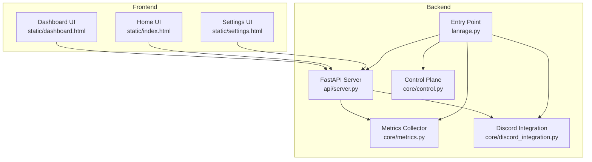
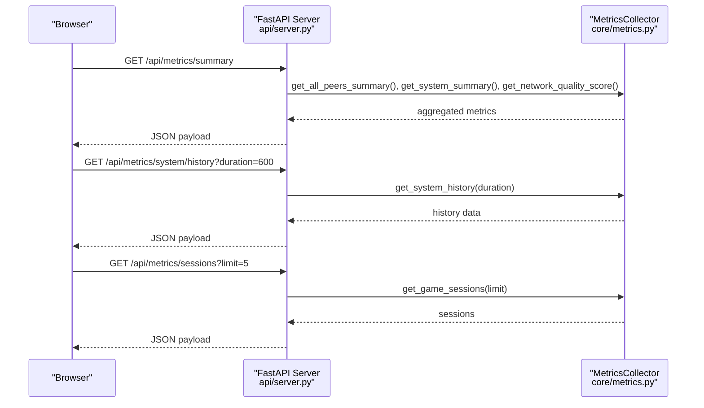
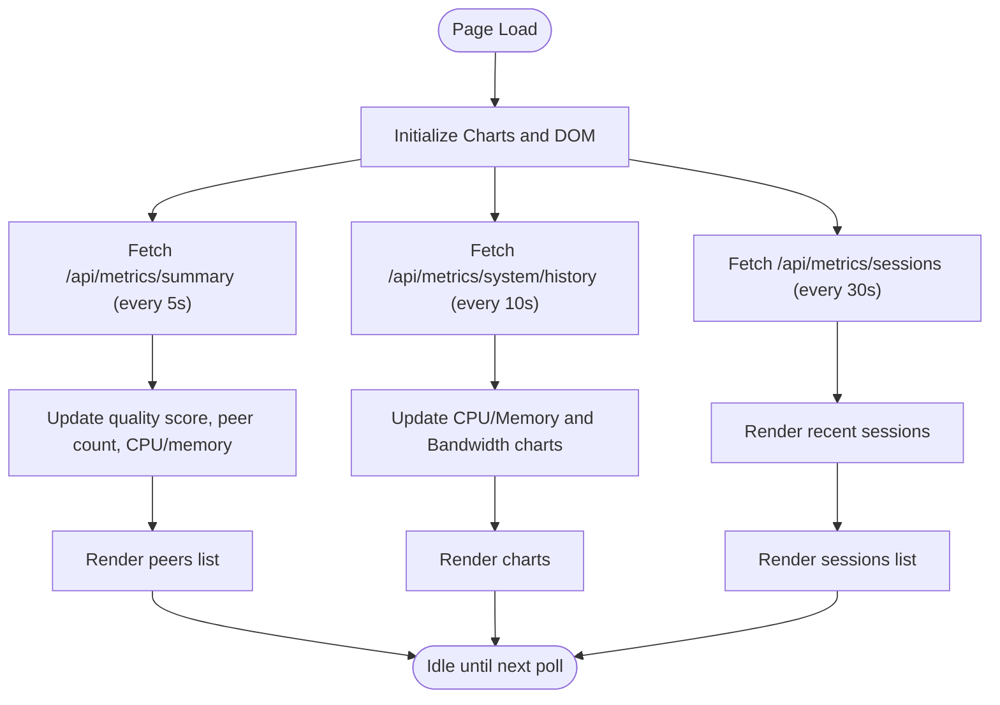
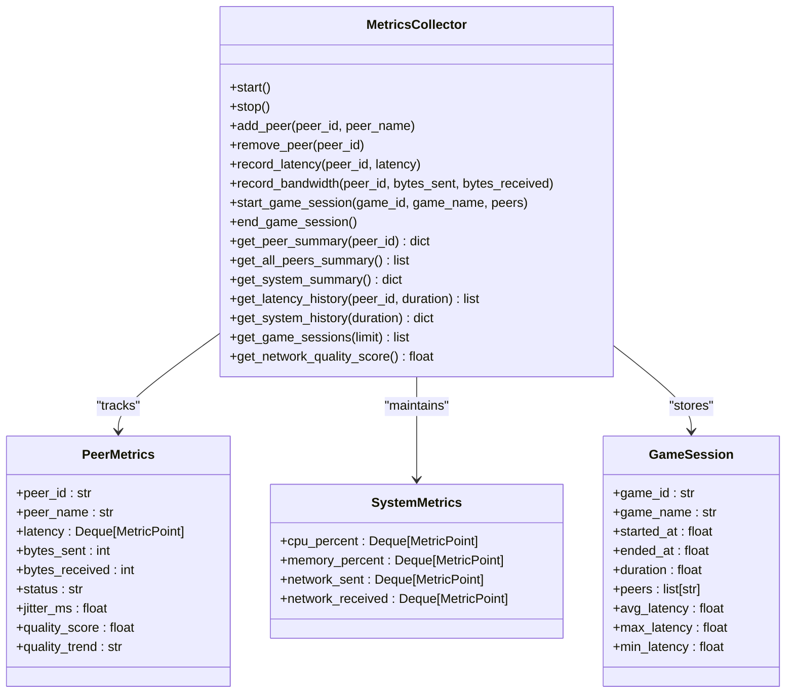
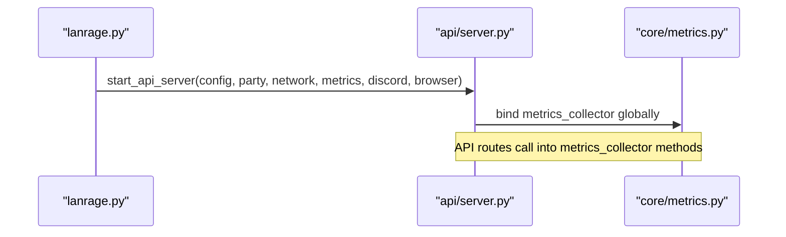
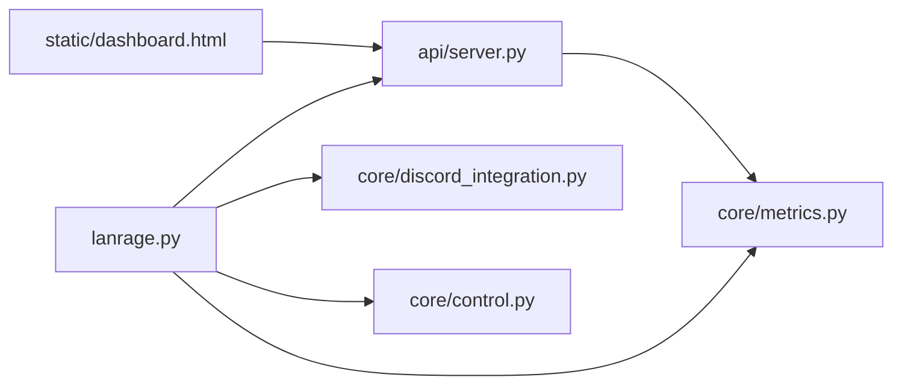

# Dashboard & Monitoring

<cite>
**Referenced Files in This Document**
- [dashboard.html](file://static/dashboard.html)
- [server.py](file://api/server.py)
- [metrics.py](file://core/metrics.py)
- [lanrage.py](file://lanrage.py)
- [METRICS.md](file://docs/METRICS.md)
- [control.py](file://core/control.py)
- [discord_integration.py](file://core/discord_integration.py)
- [index.html](file://static/index.html)
- [settings.html](file://static/settings.html)
</cite>

## Table of Contents
1. [Introduction](#introduction)
2. [Project Structure](#project-structure)
3. [Core Components](#core-components)
4. [Architecture Overview](#architecture-overview)
5. [Detailed Component Analysis](#detailed-component-analysis)
6. [Dependency Analysis](#dependency-analysis)
7. [Performance Considerations](#performance-considerations)
8. [Troubleshooting Guide](#troubleshooting-guide)
9. [Conclusion](#conclusion)
10. [Appendices](#appendices)

## Introduction
This document describes LANrage’s monitoring dashboard and real-time visualization system. It explains how the web-based dashboard presents peer connectivity status, connection quality indicators, and system resource usage. It documents the REST API endpoints that feed real-time metrics to the dashboard, including peer summaries, system metrics, and game session information. It also covers the dashboard components (latency charts, bandwidth monitors, peer status indicators, and quality score displays), the polling mechanisms for periodic data refresh, and practical guidance for customization, alerting, and extending monitoring capabilities.

## Project Structure
The monitoring system spans three primary areas:
- Frontend dashboard: a static HTML page that renders live metrics and charts
- Backend API: a FastAPI server exposing metrics and operational endpoints
- Metrics subsystem: a collector that gathers system and peer metrics and exposes them via the API

**Diagram sources**
- [dashboard.html](file://static/dashboard.html#L1-L587)
- [server.py](file://api/server.py#L1-L701)
- [metrics.py](file://core/metrics.py#L1-L705)
- [lanrage.py](file://lanrage.py#L1-L230)
- [control.py](file://core/control.py#L570-L769)
- [discord_integration.py](file://core/discord_integration.py#L1-L200)
- [index.html](file://static/index.html#L1-L800)
- [settings.html](file://static/settings.html#L1-L684)

**Section sources**
- [dashboard.html](file://static/dashboard.html#L1-L587)
- [server.py](file://api/server.py#L1-L701)
- [metrics.py](file://core/metrics.py#L1-L705)
- [lanrage.py](file://lanrage.py#L1-L230)

## Core Components
- Dashboard UI: renders peer lists, system metrics, latency and bandwidth charts, and recent game sessions. It polls the backend at fixed intervals.
- Metrics Collector: collects CPU/memory/network usage, peer latency and bandwidth, and game session statistics. It exposes summaries and histories via the API.
- API Server: FastAPI routes serving metrics, settings, Discord integration, and server browser endpoints.
- Entry Point: initializes the API server, metrics collector, Discord integration, and control plane, wiring them together.

Key responsibilities:
- Real-time updates: dashboard polls endpoints for metrics and sessions
- Quality scoring: peer and system quality computed and exposed
- Session tracking: game sessions captured with latency statistics

**Section sources**
- [dashboard.html](file://static/dashboard.html#L420-L584)
- [metrics.py](file://core/metrics.py#L193-L705)
- [server.py](file://api/server.py#L188-L276)
- [lanrage.py](file://lanrage.py#L127-L141)

## Architecture Overview
The dashboard communicates with the backend via REST endpoints. The backend delegates to the metrics collector to assemble summaries and histories. The entry point wires all components together and starts the API server.

**Diagram sources**
- [server.py](file://api/server.py#L191-L276)
- [metrics.py](file://core/metrics.py#L478-L582)
- [dashboard.html](file://static/dashboard.html#L420-L507)

## Detailed Component Analysis

### Dashboard Components and Rendering
The dashboard comprises:
- Network quality score with a progress indicator
- Active peers count and system CPU/memory usage
- Charts for system performance (CPU/memory) and network bandwidth
- Connected peers list with latency, sent/received bytes
- Recent game sessions with duration and average latency

Rendering and updates:
- Periodic polling via JavaScript fetch calls to the API
- Chart updates driven by returned histories
- Peer list and session list populated from peer/session summaries

**Diagram sources**
- [dashboard.html](file://static/dashboard.html#L340-L584)

**Section sources**
- [dashboard.html](file://static/dashboard.html#L278-L338)
- [dashboard.html](file://static/dashboard.html#L420-L584)

### API Endpoints for Metrics
The API exposes the following metrics endpoints:
- GET /api/metrics/summary: overall metrics including peers, system summary, and network quality score
- GET /api/metrics/peers: all peers’ summaries
- GET /api/metrics/peers/{peer_id}: specific peer summary
- GET /api/metrics/peers/{peer_id}/latency: latency history for a peer
- GET /api/metrics/system: system metrics summary
- GET /api/metrics/system/history: system metrics history with duration window
- GET /api/metrics/sessions: recent game sessions with limit

These endpoints delegate to the metrics collector to assemble and return structured data.

**Section sources**
- [server.py](file://api/server.py#L191-L276)
- [metrics.py](file://core/metrics.py#L478-L582)

### Metrics Collector and Data Model
The metrics collector maintains:
- Peer metrics: latency history, bytes sent/received, status, jitter, quality score, trend
- System metrics: CPU, memory, and network rates with histories
- Game sessions: start/end timestamps, duration, and latency statistics

It computes:
- Peer latency statistics (current, average, min, max)
- Overall network quality score (0–100) combining peer latency and CPU usage
- Aggregated metrics over time windows for trending

**Diagram sources**
- [metrics.py](file://core/metrics.py#L16-L705)

**Section sources**
- [metrics.py](file://core/metrics.py#L193-L705)
- [METRICS.md](file://docs/METRICS.md#L1-L593)

### Real-time Updates and Polling Mechanisms
The dashboard uses periodic polling:
- Metrics summary: every 5 seconds
- System history: every 10 seconds
- Sessions: every 30 seconds

These intervals balance responsiveness with client-server load. There is no WebSocket-based real-time push in the dashboard; updates rely on scheduled fetches.

**Section sources**
- [dashboard.html](file://static/dashboard.html#L575-L584)

### Integration Between Backend Metrics and Frontend Visualization
The API server wires the metrics collector into the dashboard:
- The metrics collector is passed into the API server startup routine
- The API routes call into the collector to produce summaries and histories
- The dashboard consumes these endpoints to render charts and lists

**Diagram sources**
- [lanrage.py](file://lanrage.py#L143-L154)
- [server.py](file://api/server.py#L680-L701)

**Section sources**
- [lanrage.py](file://lanrage.py#L127-L141)
- [server.py](file://api/server.py#L680-L701)

### Discord Integration and Notifications
The Discord integration supports:
- Webhook notifications for events (peer join/leave, game start/end)
- Batched notifications to reduce API calls
- Rich Presence and bot support (optional)

While not part of the dashboard UI, it complements monitoring by surfacing events to external channels.

**Section sources**
- [discord_integration.py](file://core/discord_integration.py#L1-L200)
- [discord_integration.py](file://core/discord_integration.py#L352-L452)

### Control Plane and Remote Discovery
The control plane can connect via WebSocket to a central server for remote party discovery and signaling. The dashboard itself does not consume control plane messages; however, the control plane informs party membership and signaling, which indirectly affects metrics and sessions.

**Section sources**
- [control.py](file://core/control.py#L570-L769)

### Dashboard Customization, Alerts, and Notifications
Customization:
- The dashboard is a static HTML page; customization involves editing the HTML/CSS/JavaScript to adjust layout, colors, and widget placement.

Alerts and notifications:
- The current dashboard does not implement client-side alerts. To add alerts, you could:
  - Extend the polling logic to compare recent values against thresholds
  - Show banner notifications or badge indicators when thresholds are crossed
  - Integrate with the Discord integration to send webhook alerts for threshold breaches

Note: The metrics collector does not currently expose explicit alert triggers; adding thresholds and alerting would require extending the API and/or dashboard logic.

[No sources needed since this section provides general guidance]

## Dependency Analysis
The dashboard depends on the API, which depends on the metrics collector. The entry point wires these together and starts the API server.

**Diagram sources**
- [dashboard.html](file://static/dashboard.html#L1-L587)
- [server.py](file://api/server.py#L1-L701)
- [metrics.py](file://core/metrics.py#L1-L705)
- [lanrage.py](file://lanrage.py#L1-L230)
- [discord_integration.py](file://core/discord_integration.py#L1-L200)
- [control.py](file://core/control.py#L570-L769)

**Section sources**
- [server.py](file://api/server.py#L680-L701)
- [lanrage.py](file://lanrage.py#L127-L141)

## Performance Considerations
- Dashboard polling intervals are tuned to balance freshness and load:
  - Summary: 5s
  - System history: 10s
  - Sessions: 30s
- Metrics collector retains up to 360 data points per metric stream (1 hour at 10s intervals) with low overhead
- Recommendations:
  - Increase polling intervals on constrained networks or devices
  - Limit chart durations to reduce payload sizes
  - Consider caching or server-side aggregation for very large deployments

[No sources needed since this section provides general guidance]

## Troubleshooting Guide
Common issues and remedies:
- Dashboard shows “No peers connected” or blank charts:
  - Verify the API is reachable and metrics collection is running
  - Confirm the metrics collector is initialized and started
- Frequent errors or timeouts:
  - Check network connectivity and firewall rules
  - Reduce polling intervals temporarily to minimize load
- Quality score stuck or incorrect:
  - Ensure latency measurements are being recorded for peers
  - Review system metrics collection intervals and baseline initialization

**Section sources**
- [dashboard.html](file://static/dashboard.html#L566-L573)
- [metrics.py](file://core/metrics.py#L216-L246)
- [METRICS.md](file://docs/METRICS.md#L542-L562)

## Conclusion
LANrage’s dashboard provides a concise, real-time view of network and peer health, powered by a robust metrics collector and a straightforward REST API. The current design relies on periodic polling, which is simple and reliable. Extending the system with client-side alerts, persistent storage, and WebSocket-based updates is feasible and can enhance observability further.

[No sources needed since this section summarizes without analyzing specific files]

## Appendices

### API Reference Summary
- GET /api/metrics/summary: overall metrics including peers, system summary, and network quality score
- GET /api/metrics/peers: all peers’ summaries
- GET /api/metrics/peers/{peer_id}: specific peer summary
- GET /api/metrics/peers/{peer_id}/latency: latency history for a peer
- GET /api/metrics/system: system metrics summary
- GET /api/metrics/system/history: system metrics history with duration window
- GET /api/metrics/sessions: recent game sessions with limit

**Section sources**
- [server.py](file://api/server.py#L191-L276)
- [METRICS.md](file://docs/METRICS.md#L565-L581)

### Settings and Modes
- The settings UI allows selecting instance modes (client/relay), configuring network and API parameters, and saving configurations
- These settings influence metrics collection and network behavior

**Section sources**
- [settings.html](file://static/settings.html#L304-L444)
- [settings.html](file://static/settings.html#L446-L464)