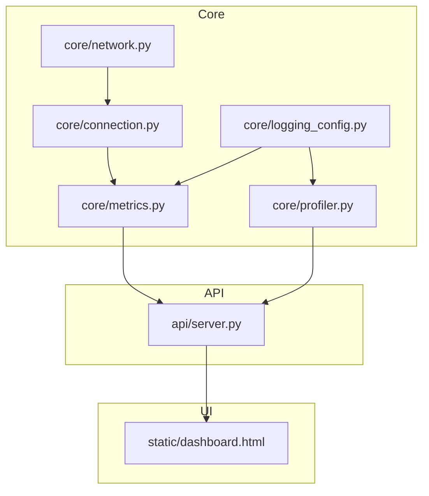
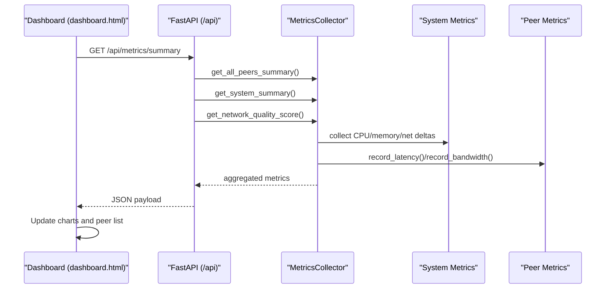
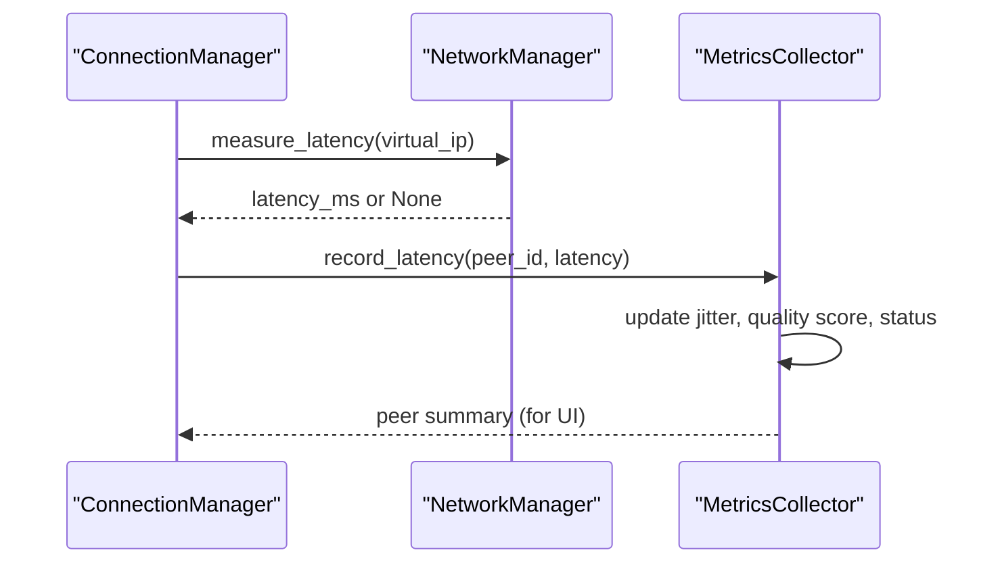
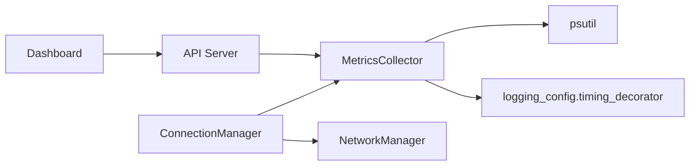

# Monitoring & Metrics

<cite>
**Referenced Files in This Document**
- [metrics.py](file://core/metrics.py)
- [profiler.py](file://core/profiler.py)
- [logging_config.py](file://core/logging_config.py)
- [server.py](file://api/server.py)
- [dashboard.html](file://static/dashboard.html)
- [connection.py](file://core/connection.py)
- [network.py](file://core/network.py)
- [METRICS.md](file://docs/METRICS.md)
- [PERFORMANCE_PROFILING.md](file://docs/PERFORMANCE_PROFILING.md)
- [TROUBLESHOOTING.md](file://docs/TROUBLESHOOTING.md)
- [test_metrics.py](file://tests/test_metrics.py)
- [test_profiling.py](file://tests/test_profiling.py)
- [performance_monitor.py](file://tools/performance_monitor.py)
</cite>

## Table of Contents
1. [Introduction](#introduction)
2. [Project Structure](#project-structure)
3. [Core Components](#core-components)
4. [Architecture Overview](#architecture-overview)
5. [Detailed Component Analysis](#detailed-component-analysis)
6. [Dependency Analysis](#dependency-analysis)
7. [Performance Considerations](#performance-considerations)
8. [Troubleshooting Guide](#troubleshooting-guide)
9. [Conclusion](#conclusion)
10. [Appendices](#appendices)

## Introduction
This document describes LANrage’s monitoring and metrics system with a focus on performance tracking and system observability. It covers how connection quality, latency, bandwidth utilization, and system resource usage are measured, aggregated, and exposed via a real-time dashboard. It also documents performance profiling tools for bottleneck identification, the metrics data model, collection intervals, storage mechanisms, and practical guidance for interpreting metrics, troubleshooting issues, and optimizing network configuration.

## Project Structure
The monitoring and metrics system spans several modules:
- Metrics collection and aggregation live in core/metrics.py
- A lightweight runtime profiler lives in core/profiler.py
- Structured logging and timing decorators are in core/logging_config.py
- An API server exposes metrics endpoints in api/server.py
- The real-time dashboard is a static HTML page in static/dashboard.html
- Connection orchestration and latency measurements are handled in core/connection.py and core/network.py
- Documentation and tests provide usage examples and validation

**Diagram sources**
- [metrics.py](file://core/metrics.py#L1-L705)
- [profiler.py](file://core/profiler.py#L1-L265)
- [logging_config.py](file://core/logging_config.py#L1-L277)
- [server.py](file://api/server.py#L1-L701)
- [dashboard.html](file://static/dashboard.html#L1-L587)
- [connection.py](file://core/connection.py#L1-L493)
- [network.py](file://core/network.py#L1-L200)

**Section sources**
- [metrics.py](file://core/metrics.py#L1-L705)
- [server.py](file://api/server.py#L1-L701)
- [dashboard.html](file://static/dashboard.html#L1-L587)
- [connection.py](file://core/connection.py#L1-L493)
- [network.py](file://core/network.py#L1-L200)

## Core Components
- MetricsCollector: Collects and aggregates system and peer metrics, computes connection quality, and manages game sessions.
- PerformanceProfiler: Provides runtime profiling of functions and code blocks, with hotspots and slow-function reporting.
- API endpoints: Expose metrics summaries, histories, and game sessions via REST.
- Dashboard: Visualizes system performance, peer connectivity, and recent game sessions in real time.
- ConnectionManager: Orchestrates peer connections and measures latency for quality scoring.

Key capabilities:
- Latency, jitter, and packet loss influence a composite connection quality score.
- System metrics include CPU, memory, and network throughput deltas.
- Aggregation functions reduce raw data to windowed statistics for trending.
- Real-time polling of the dashboard drives frequent updates.

**Section sources**
- [metrics.py](file://core/metrics.py#L193-L705)
- [profiler.py](file://core/profiler.py#L21-L265)
- [server.py](file://api/server.py#L191-L276)
- [dashboard.html](file://static/dashboard.html#L420-L584)
- [connection.py](file://core/connection.py#L18-L180)

## Architecture Overview
The metrics pipeline collects system and peer data, computes quality scores, and serves them via FastAPI endpoints. The dashboard polls these endpoints to render live charts and peer lists.

**Diagram sources**
- [server.py](file://api/server.py#L191-L201)
- [metrics.py](file://core/metrics.py#L216-L293)
- [metrics.py](file://core/metrics.py#L442-L517)
- [dashboard.html](file://static/dashboard.html#L420-L584)

## Detailed Component Analysis

### MetricsCollector
Responsibilities:
- Periodically collects CPU, memory, and network deltas using psutil.
- Tracks per-peer latency, bandwidth, and connection status.
- Computes connection quality score and trend.
- Maintains game session history with latency statistics.
- Provides aggregation helpers for time-windowed statistics.

Data model highlights:
- MetricPoint: timestamped scalar values.
- PeerMetrics: latency deque, bandwidth counters, uptime, last_seen, status, and quality fields.
- SystemMetrics: CPU, memory, and network rate deques.
- GameSession: per-session latency stats and peer list.

Collection intervals and retention:
- System metrics are collected every 10 seconds by default.
- Deque maxlen is 360, yielding approximately 1 hour of history at 10s intervals.
- Game sessions are retained in a fixed-size deque (default 100).

Aggregation:
- aggregate_metrics_by_window reduces raw MetricPoint series to count/min/max/avg/p95/sum over a window.

Quality scoring:
- predict_connection_quality combines latency, packet loss, and jitter into a 0–100 score with weights.

**Section sources**
- [metrics.py](file://core/metrics.py#L16-L705)
- [METRICS.md](file://docs/METRICS.md#L1-L593)

### PerformanceProfiler
Capabilities:
- Enables/disables profiling globally.
- Decorators and context managers wrap functions and code blocks to capture timing.
- Tracks function call counts, total/avg/min/max times, and error counts.
- Reports hotspots and slow functions, plus a system stats snapshot.

Integration:
- Timing decorators in core/logging_config.py annotate function durations in logs.
- Used by tools/performance_monitor.py for interactive profiling sessions.

**Section sources**
- [profiler.py](file://core/profiler.py#L21-L265)
- [logging_config.py](file://core/logging_config.py#L169-L230)
- [PERFORMANCE_PROFILING.md](file://docs/PERFORMANCE_PROFILING.md#L1-L507)

### API and Dashboard
Endpoints:
- Summary: peers, system, and overall network quality.
- Peer metrics: per-peer latency history and current stats.
- System history: CPU, memory, and network rates over time.
- Sessions: recent game sessions with latency stats.

Dashboard:
- Polls endpoints at intervals (metrics every 5s, charts every 10s, sessions every 30s).
- Renders charts for system and bandwidth, a peers list with status badges, and recent sessions.

**Section sources**
- [server.py](file://api/server.py#L191-L276)
- [dashboard.html](file://static/dashboard.html#L420-L584)

### Connection and Latency Measurement
ConnectionManager orchestrates peer connections and measures latency via the network layer. These latency measurements feed into MetricsCollector for quality scoring and peer status.

**Diagram sources**
- [connection.py](file://core/connection.py#L152-L179)
- [connection.py](file://core/connection.py#L213-L305)
- [metrics.py](file://core/metrics.py#L308-L371)

**Section sources**
- [connection.py](file://core/connection.py#L18-L493)
- [network.py](file://core/network.py#L1-L200)
- [metrics.py](file://core/metrics.py#L308-L371)

## Dependency Analysis
- MetricsCollector depends on psutil for system metrics and on logging_config timing decorators for performance logging.
- API server depends on MetricsCollector for data and FastAPI for routing.
- Dashboard depends on API endpoints for JSON payloads.
- ConnectionManager depends on NetworkManager for latency measurements and on MetricsCollector for recording latency.

**Diagram sources**
- [metrics.py](file://core/metrics.py#L3-L13)
- [logging_config.py](file://core/logging_config.py#L169-L230)
- [server.py](file://api/server.py#L1-L30)
- [dashboard.html](file://static/dashboard.html#L1-L264)
- [connection.py](file://core/connection.py#L1-L15)

**Section sources**
- [metrics.py](file://core/metrics.py#L1-L705)
- [server.py](file://api/server.py#L1-L701)
- [dashboard.html](file://static/dashboard.html#L1-L587)
- [connection.py](file://core/connection.py#L1-L493)

## Performance Considerations
- Collection cadence: 10 seconds for system metrics minimizes overhead while preserving responsiveness.
- Memory footprint: Typical usage (~1–2MB for 10 peers) with bounded deques and fixed-size session history.
- CPU usage: Collection loop and metric recording are lightweight; aggregation is O(n) per window.
- Network throughput: Delta-based rates derived from psutil net_io_counters reduce overhead compared to continuous sampling.
- Profiling overhead: PerformanceProfiler adds minimal overhead when disabled; enable selectively for targeted investigations.

[No sources needed since this section provides general guidance]

## Troubleshooting Guide
Use the dashboard to diagnose issues:
- High latency: Inspect per-peer latency and status; direct vs relay connection types inform next steps.
- High CPU/memory: Review system charts and consider reducing collection frequency or disabling unused features.
- Packet loss: While not currently tracked in MetricsCollector, monitor network stability and reduce load.

Operational workflows:
- Enable profiler during suspected bottlenecks and review hotspots and slow functions.
- Use tools/performance_monitor.py to run benchmarks and monitor in production.
- Follow documented flowcharts for connection, game detection, and relay selection issues.

**Section sources**
- [dashboard.html](file://static/dashboard.html#L420-L584)
- [PERFORMANCE_PROFILING.md](file://docs/PERFORMANCE_PROFILING.md#L1-L507)
- [TROUBLESHOOTING.md](file://docs/TROUBLESHOOTING.md#L1-L904)
- [test_metrics.py](file://tests/test_metrics.py#L1-L273)
- [test_profiling.py](file://tests/test_profiling.py#L1-L501)

## Conclusion
LANrage’s monitoring and metrics system provides a robust foundation for observability, combining real-time peer and system metrics with a quality scoring mechanism and a live dashboard. The performance profiler and testing suite support continuous optimization. Together, these components enable confident troubleshooting, informed tuning, and reliable operation across diverse network environments.

[No sources needed since this section summarizes without analyzing specific files]

## Appendices

### Metrics Data Model
- MetricPoint: timestamped scalar value.
- PeerMetrics: latency deque, bandwidth counters, uptime, last_seen, status, quality_score, quality_trend, jitter, packet_loss_percent.
- SystemMetrics: CPU, memory, network_sent, network_received deques.
- GameSession: game identifiers, timestamps, peer list, latency statistics.

**Section sources**
- [metrics.py](file://core/metrics.py#L16-L705)
- [METRICS.md](file://docs/METRICS.md#L1-L593)

### Collection Intervals and Retention
- System metrics: collected every 10 seconds; 360 points ≈ 1 hour history.
- Peer latency: stored in deques with the same retention.
- Game sessions: fixed-size history (default 100).

**Section sources**
- [metrics.py](file://core/metrics.py#L213-L215)
- [metrics.py](file://core/metrics.py#L30-L36)
- [METRICS.md](file://docs/METRICS.md#L557-L562)

### Storage Mechanisms
- In-memory deques and dictionaries for metrics and sessions.
- Optional persistent storage enhancements are noted in documentation for future development.

**Section sources**
- [metrics.py](file://core/metrics.py#L193-L215)
- [METRICS.md](file://docs/METRICS.md#L583-L593)

### Privacy and Data Retention
- Metrics are stored locally in-process; no external export is implemented by default.
- Consider enabling persistent storage and anonymizing identifiers if deploying in shared environments.
- Retention is time-bound by deque maxlen and fixed-size session history.

**Section sources**
- [metrics.py](file://core/metrics.py#L193-L215)
- [METRICS.md](file://docs/METRICS.md#L583-L593)

### Interpreting Metrics and Optimization Guidance
- Network quality score: higher is better; use thresholds to trigger alerts or remediation.
- Peer status: connected/degraded/disconnected informs immediate action.
- System charts: sustained high CPU/memory may indicate inefficient operations or resource contention.
- Latency trends: rising p95 suggests congestion or topology issues.

**Section sources**
- [metrics.py](file://core/metrics.py#L60-L105)
- [metrics.py](file://core/metrics.py#L583-L604)
- [dashboard.html](file://static/dashboard.html#L420-L584)

### Benchmarking Procedures
- Use tools/performance_monitor.py benchmark to assess startup, operations, and scaling.
- Run tests/test_profiling.py to validate performance targets and detect regressions.
- Compare results against documented targets to ensure compliance.

**Section sources**
- [performance_monitor.py](file://tools/performance_monitor.py#L135-L236)
- [test_profiling.py](file://tests/test_profiling.py#L1-L501)
- [PERFORMANCE_PROFILING.md](file://docs/PERFORMANCE_PROFILING.md#L1-L507)