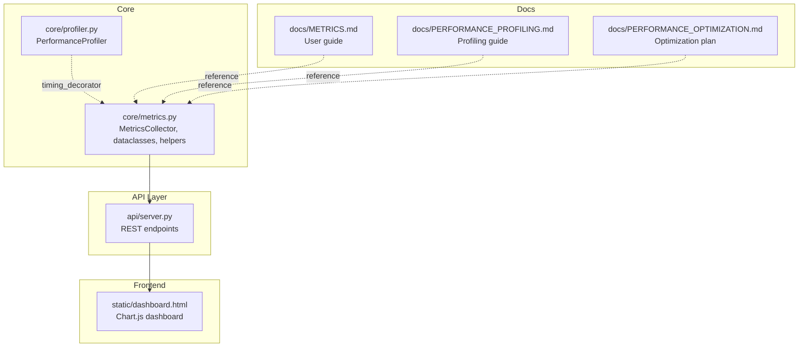
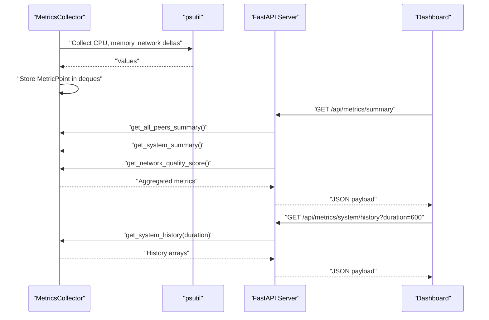
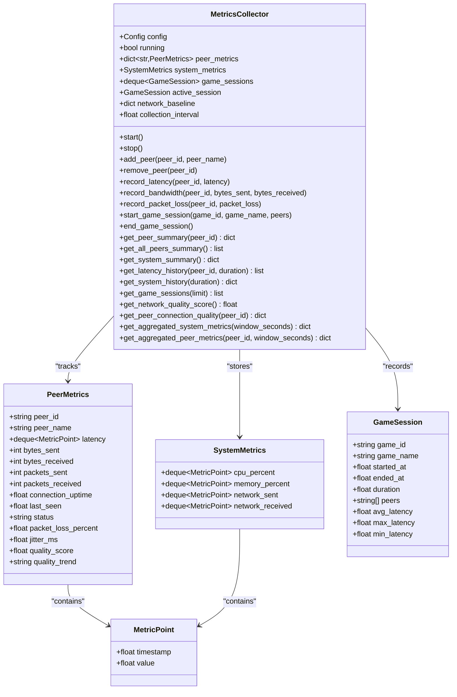
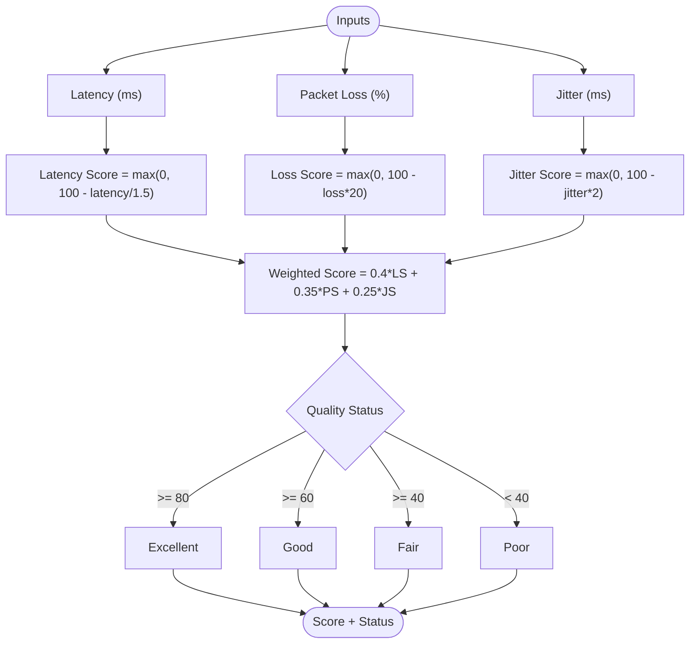
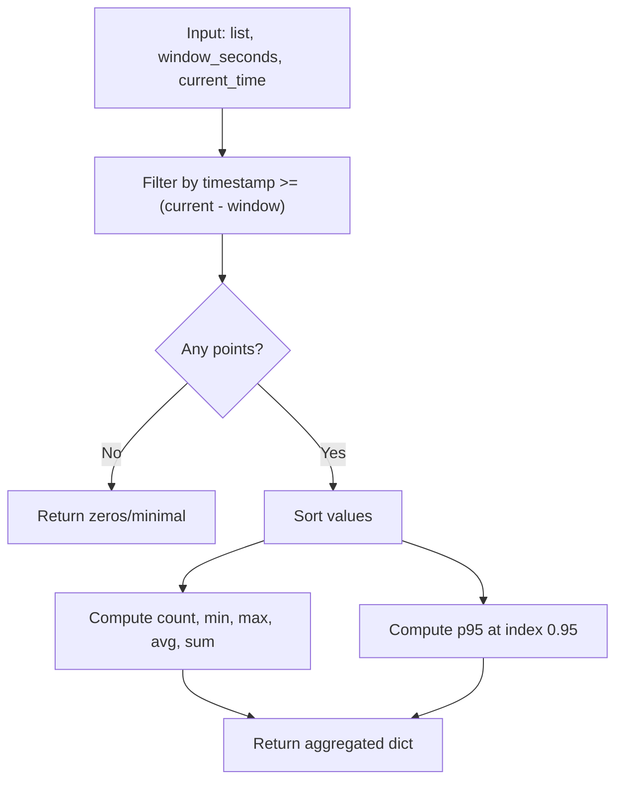
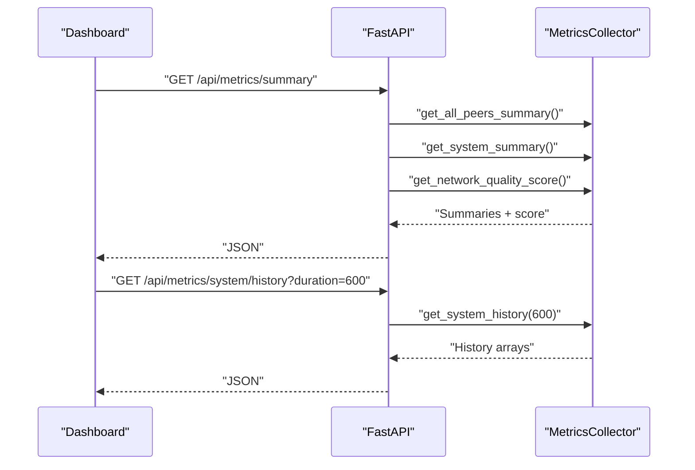
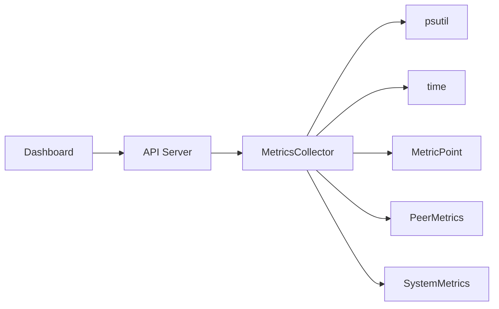

# Performance Metrics

<cite>
**Referenced Files in This Document**
- [core/metrics.py](file://core/metrics.py)
- [docs/METRICS.md](file://docs/METRICS.md)
- [tests/test_metrics.py](file://tests/test_metrics.py)
- [tests/test_metrics_logging.py](file://tests/test_metrics_logging.py)
- [api/server.py](file://api/server.py)
- [static/dashboard.html](file://static/dashboard.html)
- [core/profiler.py](file://core/profiler.py)
- [docs/PERFORMANCE_PROFILING.md](file://docs/PERFORMANCE_PROFILING.md)
- [docs/PERFORMANCE_OPTIMIZATION.md](file://docs/PERFORMANCE_OPTIMIZATION.md)
</cite>

## Table of Contents
1. [Introduction](#introduction)
2. [Project Structure](#project-structure)
3. [Core Components](#core-components)
4. [Architecture Overview](#architecture-overview)
5. [Detailed Component Analysis](#detailed-component-analysis)
6. [Dependency Analysis](#dependency-analysis)
7. [Performance Considerations](#performance-considerations)
8. [Troubleshooting Guide](#troubleshooting-guide)
9. [Conclusion](#conclusion)
10. [Appendices](#appendices)

## Introduction
This document describes LANrage’s performance metrics system with a focus on real-time network monitoring and quality assessment. It explains how MetricsCollector collects system-level metrics (CPU, memory, network throughput), tracks peer-specific metrics (latency, bandwidth utilization, packet loss, connection quality), and exposes them via REST endpoints for dashboards and operational insights. It also documents the connection quality prediction algorithm, data structures, aggregation functions, and historical data retrieval.

## Project Structure
The metrics system is centered around a single module that defines data structures, a metrics collector, and utility functions. It integrates with the FastAPI server to expose metrics over HTTP and with a web dashboard for visualization.

**Diagram sources**
- [core/metrics.py](file://core/metrics.py#L1-L705)
- [api/server.py](file://api/server.py#L188-L276)
- [static/dashboard.html](file://static/dashboard.html#L420-L584)
- [core/profiler.py](file://core/profiler.py#L38-L100)
- [docs/METRICS.md](file://docs/METRICS.md#L1-L593)
- [docs/PERFORMANCE_PROFILING.md](file://docs/PERFORMANCE_PROFILING.md#L1-L507)
- [docs/PERFORMANCE_OPTIMIZATION.md](file://docs/PERFORMANCE_OPTIMIZATION.md#L1-L151)

**Section sources**
- [core/metrics.py](file://core/metrics.py#L1-L705)
- [api/server.py](file://api/server.py#L188-L276)
- [static/dashboard.html](file://static/dashboard.html#L420-L584)
- [docs/METRICS.md](file://docs/METRICS.md#L1-L593)

## Core Components
- MetricsCollector: Background collection of system metrics and peer metrics, plus game session tracking and quality scoring.
- Data structures: MetricPoint, PeerMetrics, SystemMetrics, GameSession.
- Quality prediction: predict_connection_quality computes a weighted score from latency, packet loss, and jitter.
- Aggregation: aggregate_metrics_by_window reduces raw metrics into statistical summaries over time windows.
- API endpoints: REST endpoints expose metrics summaries, histories, and sessions.
- Dashboard: A web dashboard consumes the API to render charts and peer lists.

**Section sources**
- [core/metrics.py](file://core/metrics.py#L16-L106)
- [core/metrics.py](file://core/metrics.py#L178-L191)
- [core/metrics.py](file://core/metrics.py#L193-L705)
- [api/server.py](file://api/server.py#L191-L276)
- [static/dashboard.html](file://static/dashboard.html#L420-L584)

## Architecture Overview
The metrics system runs continuously, collecting system metrics at a fixed interval and updating peer metrics on demand. It exposes a REST API for dashboards and scripts to consume metrics. The dashboard renders live charts and peer lists.

**Diagram sources**
- [core/metrics.py](file://core/metrics.py#L241-L293)
- [api/server.py](file://api/server.py#L191-L261)
- [static/dashboard.html](file://static/dashboard.html#L447-L479)

## Detailed Component Analysis

### MetricsCollector
Responsibilities:
- Start/stop background collection loop.
- Collect system metrics (CPU, memory, network throughput).
- Track peers, latency, bandwidth, packet loss, jitter, and connection quality.
- Compute peer and overall network quality scores.
- Aggregate metrics over time windows.
- Provide summaries and historical data.

Key behaviors:
- Collection interval is 10 seconds by default.
- Network baseline is established on start to compute deltas.
- Peer status is derived from quality score thresholds.
- Quality trend is tracked by comparing consecutive scores.

**Diagram sources**
- [core/metrics.py](file://core/metrics.py#L16-L191)
- [core/metrics.py](file://core/metrics.py#L193-L705)

**Section sources**
- [core/metrics.py](file://core/metrics.py#L193-L246)
- [core/metrics.py](file://core/metrics.py#L247-L293)
- [core/metrics.py](file://core/metrics.py#L294-L371)
- [core/metrics.py](file://core/metrics.py#L372-L391)
- [core/metrics.py](file://core/metrics.py#L392-L441)
- [core/metrics.py](file://core/metrics.py#L442-L485)
- [core/metrics.py](file://core/metrics.py#L487-L517)
- [core/metrics.py](file://core/metrics.py#L519-L560)
- [core/metrics.py](file://core/metrics.py#L562-L581)
- [core/metrics.py](file://core/metrics.py#L583-L604)
- [core/metrics.py](file://core/metrics.py#L606-L643)
- [core/metrics.py](file://core/metrics.py#L645-L673)
- [core/metrics.py](file://core/metrics.py#L675-L705)

### Data Structures

- MetricPoint: A single timestamped metric value.
- PeerMetrics: Per-peer latency history, bandwidth counters, uptime, last-seen timestamp, status, and quality metrics.
- SystemMetrics: CPU, memory, and network throughput histories.
- GameSession: Session metadata and latency statistics.

Retention and sizing:
- Default retention is 360 data points at 10-second intervals, yielding approximately 1 hour of history per series.
- Typical memory footprint is modest and documented in the metrics guide.

**Section sources**
- [core/metrics.py](file://core/metrics.py#L16-L57)
- [docs/METRICS.md](file://docs/METRICS.md#L19-L72)

### Connection Quality Prediction
The algorithm computes a weighted score from latency, packet loss, and jitter, then maps to a quality status.

**Diagram sources**
- [core/metrics.py](file://core/metrics.py#L60-L105)

**Section sources**
- [core/metrics.py](file://core/metrics.py#L60-L105)

### Aggregation and Historical Retrieval
- aggregate_metrics_by_window: Computes count, min, max, average, p95, and sum over a time window.
- get_aggregated_system_metrics and get_aggregated_peer_metrics: Return aggregated views for trending.
- get_latency_history and get_system_history: Filter data by duration.

**Diagram sources**
- [core/metrics.py](file://core/metrics.py#L108-L175)

**Section sources**
- [core/metrics.py](file://core/metrics.py#L108-L175)
- [core/metrics.py](file://core/metrics.py#L519-L560)
- [core/metrics.py](file://core/metrics.py#L645-L673)
- [core/metrics.py](file://core/metrics.py#L675-L705)

### API Endpoints and Dashboard
- Summary endpoint returns peers, system metrics, and network quality.
- Peer endpoints return per-peer summaries and latency history.
- System endpoints return summaries and histories.
- Sessions endpoint returns recent game sessions with latency stats.
- The dashboard polls the API and renders charts and peer lists.

**Diagram sources**
- [api/server.py](file://api/server.py#L191-L261)
- [static/dashboard.html](file://static/dashboard.html#L447-L479)

**Section sources**
- [api/server.py](file://api/server.py#L191-L276)
- [static/dashboard.html](file://static/dashboard.html#L420-L584)

## Dependency Analysis
- MetricsCollector depends on psutil for system metrics and time for timestamps.
- It uses deque-based histories for bounded memory usage.
- The API server depends on MetricsCollector for data.
- The dashboard depends on the API for rendering visuals.

**Diagram sources**
- [core/metrics.py](file://core/metrics.py#L3-L13)
- [api/server.py](file://api/server.py#L188-L276)
- [static/dashboard.html](file://static/dashboard.html#L420-L584)

**Section sources**
- [core/metrics.py](file://core/metrics.py#L3-L13)
- [api/server.py](file://api/server.py#L188-L276)

## Performance Considerations
- Collection interval: 10 seconds by default, balancing resolution and overhead.
- Memory usage: ~50KB per peer, ~100KB for system metrics, ~5KB per session; typical usage ~1–2MB for 10 peers.
- CPU usage: Collection loop <1% CPU; metric recording <0.1ms per call; summary generation <1ms per peer.
- Data retention: 360 points at 10s intervals yields ~1 hour of history per series.
- Profiling and optimization: The system includes a profiler and documented optimization targets.

**Section sources**
- [docs/METRICS.md](file://docs/METRICS.md#L542-L562)
- [docs/PERFORMANCE_PROFILING.md](file://docs/PERFORMANCE_PROFILING.md#L33-L53)
- [docs/PERFORMANCE_OPTIMIZATION.md](file://docs/PERFORMANCE_OPTIMIZATION.md#L10-L25)

## Troubleshooting Guide
Common issues and checks:
- No latency recorded: Peer status degraded; verify latency reporting and network connectivity.
- Peer not found: Ensure add_peer was called and peer_id matches.
- Empty history: Confirm duration filter and that data points exist within the timeframe.
- Logging: MetricsCollector emits INFO/WARN/DEBUG logs for lifecycle and quality events; tests validate logging behavior.
- Profiling: Use the built-in profiler to identify hotspots and validate performance targets.

**Section sources**
- [core/metrics.py](file://core/metrics.py#L314-L371)
- [tests/test_metrics.py](file://tests/test_metrics.py#L248-L269)
- [tests/test_metrics_logging.py](file://tests/test_metrics_logging.py#L18-L102)
- [core/profiler.py](file://core/profiler.py#L177-L227)

## Conclusion
LANrage’s metrics system provides a robust foundation for real-time monitoring and quality assessment. It captures system and peer metrics efficiently, computes meaningful quality scores, and exposes them via a clean API for dashboards and automation. The included tests and documentation help ensure correctness and performance.

## Appendices

### API Reference Summary
- GET /api/metrics/summary: peers, system, network_quality
- GET /api/metrics/peers: list of peer summaries
- GET /api/metrics/peers/{peer_id}: specific peer summary
- GET /api/metrics/peers/{peer_id}/latency?duration=3600: latency history
- GET /api/metrics/system: system summary
- GET /api/metrics/system/history?duration=3600: system history
- GET /api/metrics/sessions?limit=10: recent sessions

**Section sources**
- [api/server.py](file://api/server.py#L191-L276)

### Example Workflows
- Real-time monitoring loop: Poll summary and system history endpoints at intervals.
- Peer latency trend: Fetch latency history for a peer and render a chart.
- Quality dashboard: Combine network quality score, peer statuses, and system metrics.

**Section sources**
- [static/dashboard.html](file://static/dashboard.html#L420-L584)