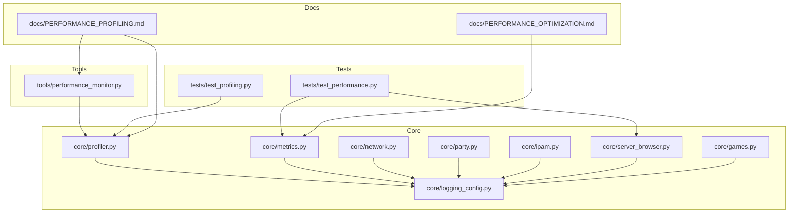
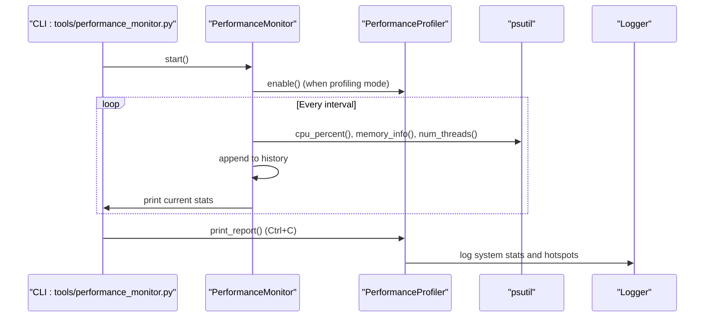
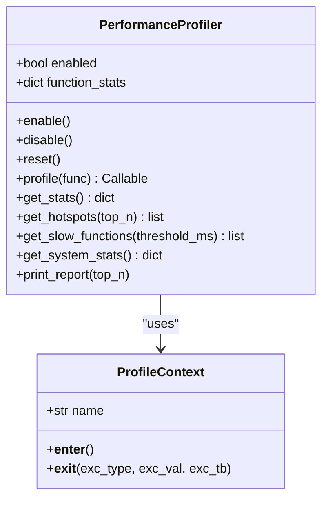
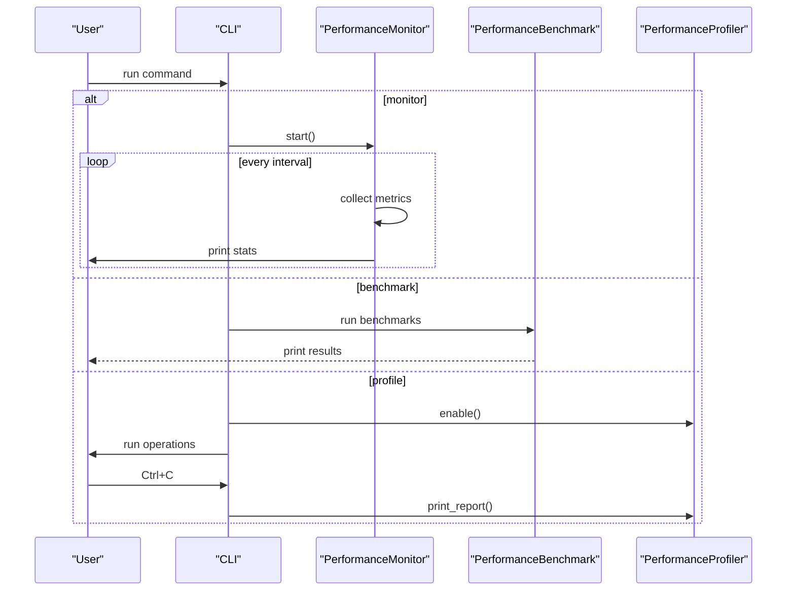
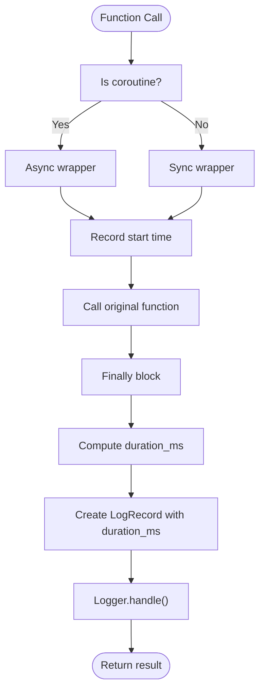
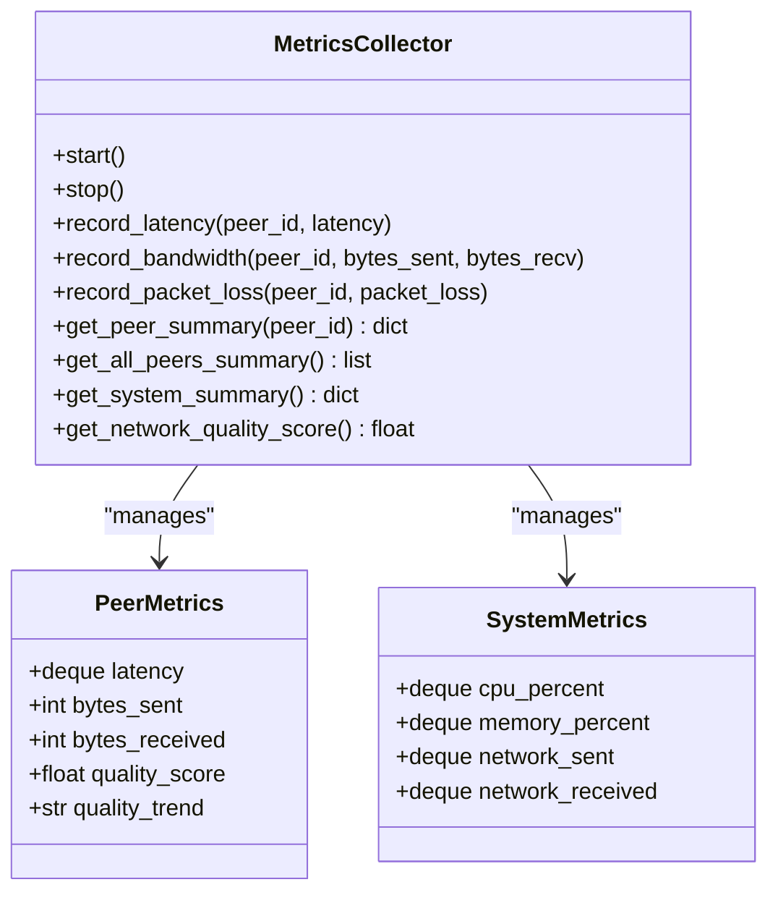
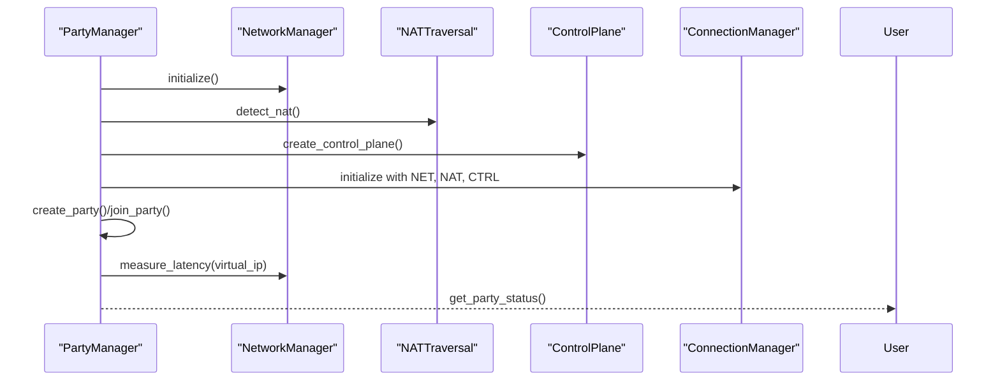
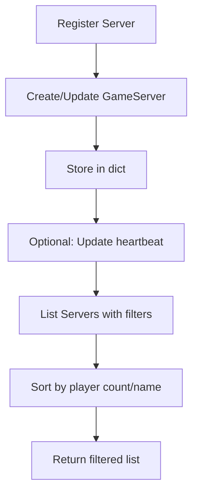
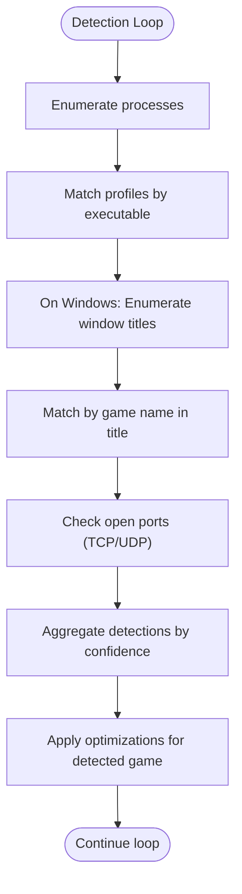
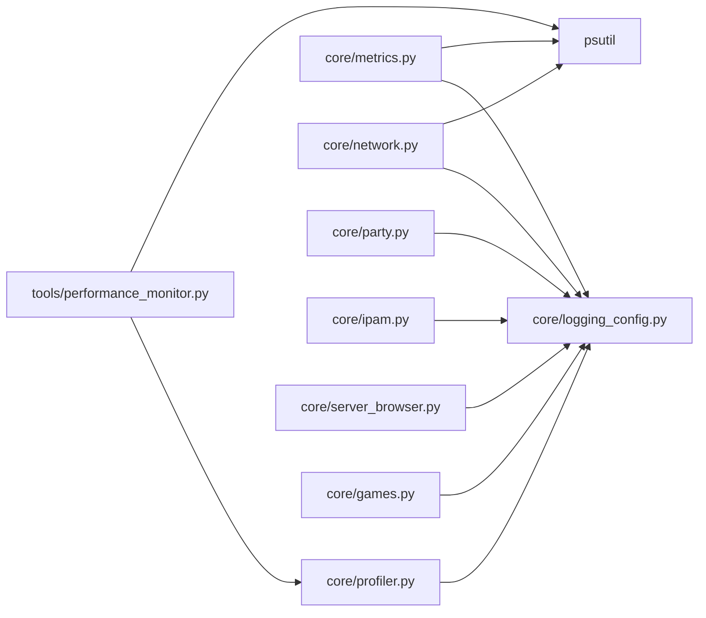

# Performance Profiling

<cite>
**Referenced Files in This Document**
- [core/profiler.py](file://core/profiler.py)
- [tools/performance_monitor.py](file://tools/performance_monitor.py)
- [docs/PERFORMANCE_PROFILING.md](file://docs/PERFORMANCE_PROFILING.md)
- [docs/PERFORMANCE_OPTIMIZATION.md](file://docs/PERFORMANCE_OPTIMIZATION.md)
- [tests/test_profiling.py](file://tests/test_profiling.py)
- [tests/test_performance.py](file://tests/test_performance.py)
- [core/logging_config.py](file://core/logging_config.py)
- [core/metrics.py](file://core/metrics.py)
- [core/network.py](file://core/network.py)
- [core/party.py](file://core/party.py)
- [core/ipam.py](file://core/ipam.py)
- [core/server_browser.py](file://core/server_browser.py)
- [core/games.py](file://core/games.py)
</cite>

## Table of Contents
1. [Introduction](#introduction)
2. [Project Structure](#project-structure)
3. [Core Components](#core-components)
4. [Architecture Overview](#architecture-overview)
5. [Detailed Component Analysis](#detailed-component-analysis)
6. [Dependency Analysis](#dependency-analysis)
7. [Performance Considerations](#performance-considerations)
8. [Troubleshooting Guide](#troubleshooting-guide)
9. [Conclusion](#conclusion)
10. [Appendices](#appendices)

## Introduction
This document describes LANrage’s performance profiling and optimization tools. It explains how the runtime profiler tracks execution times, memory usage, and resource consumption across components, and how the performance monitor enables continuous system health checks and performance regression detection. It also covers profiling methodologies, benchmarking procedures, and optimization strategies grounded in the repository’s test suites and profiling utilities.

## Project Structure
The performance tooling spans several modules:
- Runtime profiler and timing utilities in core/profiler.py
- Performance monitor CLI in tools/performance_monitor.py
- Documentation for profiling workflows in docs/PERFORMANCE_PROFILING.md and docs/PERFORMANCE_OPTIMIZATION.md
- Performance tests in tests/test_profiling.py and tests/test_performance.py
- Timing decorators and structured logging in core/logging_config.py
- Metrics collection and system stats in core/metrics.py
- Network operations and party management in core/network.py and core/party.py
- IPAM and server browser in core/ipam.py and core/server_browser.py
- Game detection and profiles in core/games.py

**Diagram sources**
- [core/profiler.py](file://core/profiler.py#L1-L265)
- [tools/performance_monitor.py](file://tools/performance_monitor.py#L1-L295)
- [docs/PERFORMANCE_PROFILING.md](file://docs/PERFORMANCE_PROFILING.md#L1-L507)
- [docs/PERFORMANCE_OPTIMIZATION.md](file://docs/PERFORMANCE_OPTIMIZATION.md#L1-L151)
- [tests/test_profiling.py](file://tests/test_profiling.py#L1-L501)
- [tests/test_performance.py](file://tests/test_performance.py#L1-L208)

**Section sources**
- [core/profiler.py](file://core/profiler.py#L1-L265)
- [tools/performance_monitor.py](file://tools/performance_monitor.py#L1-L295)
- [docs/PERFORMANCE_PROFILING.md](file://docs/PERFORMANCE_PROFILING.md#L1-L507)
- [docs/PERFORMANCE_OPTIMIZATION.md](file://docs/PERFORMANCE_OPTIMIZATION.md#L1-L151)
- [tests/test_profiling.py](file://tests/test_profiling.py#L1-L501)
- [tests/test_performance.py](file://tests/test_performance.py#L1-L208)

## Core Components
- Runtime Performance Profiler: Tracks function-level execution times, aggregates stats, and prints reports. It supports sync and async functions and exposes hotspots and slow functions.
- Performance Monitor: Real-time CLI tool for continuous system monitoring, benchmarking, and enabling the profiler for ad-hoc profiling sessions.
- Timing Decorators: Structured logging and timing decorators that log execution durations and attach context variables for correlation.
- Metrics Collector: System and peer-level metrics collection with aggregation and quality scoring, integrated with timing decorators.
- Network and Party Management: Network operations and party lifecycle with timing decorators for latency measurement and peer connection management.
- IPAM and Server Browser: IP address allocation and server discovery with timing decorators and performance tests.
- Game Detection and Profiles: Game detection with caching and fuzzy matching, plus profile-driven optimizations.

**Section sources**
- [core/profiler.py](file://core/profiler.py#L21-L265)
- [tools/performance_monitor.py](file://tools/performance_monitor.py#L21-L295)
- [core/logging_config.py](file://core/logging_config.py#L169-L231)
- [core/metrics.py](file://core/metrics.py#L193-L705)
- [core/network.py](file://core/network.py#L25-L515)
- [core/party.py](file://core/party.py#L102-L304)
- [core/ipam.py](file://core/ipam.py#L10-L183)
- [core/server_browser.py](file://core/server_browser.py#L75-L552)
- [core/games.py](file://core/games.py#L265-L800)

## Architecture Overview
The profiling architecture integrates timing decorators, a global profiler, and a CLI monitor to provide continuous and on-demand performance insights.

**Diagram sources**
- [tools/performance_monitor.py](file://tools/performance_monitor.py#L36-L133)
- [core/profiler.py](file://core/profiler.py#L38-L176)
- [core/logging_config.py](file://core/logging_config.py#L169-L231)

## Detailed Component Analysis

### Runtime Performance Profiler
- Purpose: Measure and aggregate function execution times, expose hotspots, and print performance reports.
- Key capabilities:
  - Decorator support for sync and async functions
  - Error counting per function
  - System resource stats (CPU, memory, threads)
  - Hotspot identification by total time and slow function detection by average time
  - Context manager for profiling code blocks
- Usage patterns:
  - Enable/disable/reset
  - Decorate functions with @profile
  - Profile code blocks with profile_block
  - Retrieve stats, hotspots, slow functions, and system stats
  - Print comprehensive report

**Diagram sources**
- [core/profiler.py](file://core/profiler.py#L21-L265)

**Section sources**
- [core/profiler.py](file://core/profiler.py#L21-L265)

### Performance Monitor CLI
- Purpose: Real-time system monitoring, benchmarking, and on-demand profiling sessions.
- Capabilities:
  - Monitor CPU, memory, threads with configurable intervals
  - Benchmark startup, common operations, and scaling
  - Enable profiler and print reports on demand
- Typical workflows:
  - Monitor: python tools/performance_monitor.py monitor --interval 1.0
  - Benchmark: python tools/performance_monitor.py benchmark
  - Profile: python tools/performance_monitor.py profile

**Diagram sources**
- [tools/performance_monitor.py](file://tools/performance_monitor.py#L239-L295)

**Section sources**
- [tools/performance_monitor.py](file://tools/performance_monitor.py#L21-L295)

### Timing Decorators and Structured Logging
- Purpose: Provide consistent timing instrumentation and structured logging with context variables.
- Features:
  - timing_decorator logs execution time for sync and async functions
  - StructuredFormatter and PlainFormatter output JSON or human-readable logs with context
  - Context variables (peer_id, party_id, session_id, correlation_id) for correlation tracking

**Diagram sources**
- [core/logging_config.py](file://core/logging_config.py#L169-L231)

**Section sources**
- [core/logging_config.py](file://core/logging_config.py#L1-L277)

### Metrics Collection and System Stats
- Purpose: Collect and aggregate system and peer metrics, compute quality scores, and provide performance insights.
- Key features:
  - System metrics: CPU, memory, network rates
  - Peer metrics: latency, bandwidth, packet loss, quality trends
  - Aggregation by time windows
  - Quality scoring and trend detection
  - Timing decorators around metrics operations

**Diagram sources**
- [core/metrics.py](file://core/metrics.py#L193-L705)

**Section sources**
- [core/metrics.py](file://core/metrics.py#L1-L705)

### Network Operations and Party Management
- Purpose: Manage WireGuard interface, peer connections, NAT traversal, and latency measurement with timing decorators.
- Highlights:
  - WireGuard initialization, peer management, and cleanup
  - NAT detection and connection coordination
  - Latency measurement via ping with platform-specific handling
  - Party creation, joining, leaving, and status reporting

**Diagram sources**
- [core/network.py](file://core/network.py#L25-L515)
- [core/party.py](file://core/party.py#L102-L304)

**Section sources**
- [core/network.py](file://core/network.py#L1-L515)
- [core/party.py](file://core/party.py#L1-L304)

### IPAM and Server Browser
- Purpose: IP address management and game server discovery with performance-focused operations.
- Highlights:
  - Efficient IP allocation across subnets with validation
  - Server registration, filtering, and latency measurement with adaptive intervals
  - Background cleanup of expired servers

**Diagram sources**
- [core/server_browser.py](file://core/server_browser.py#L101-L284)

**Section sources**
- [core/ipam.py](file://core/ipam.py#L1-L183)
- [core/server_browser.py](file://core/server_browser.py#L1-L552)

### Game Detection and Profiles
- Purpose: Detect running games using multiple methods and apply game-specific optimizations.
- Highlights:
  - Multi-method detection: process name, window title (Windows), open ports
  - Fuzzy matching with Levenshtein distance
  - Profile caching with TTL and async loading
  - Custom broadcast port whitelisting

**Diagram sources**
- [core/games.py](file://core/games.py#L364-L650)

**Section sources**
- [core/games.py](file://core/games.py#L1-L800)

## Dependency Analysis
- Coupling:
  - Profiler depends on timing decorators and logging for reporting.
  - Monitor depends on profiler and psutil for system metrics.
  - MetricsCollector depends on psutil and timing decorators for system metrics.
  - Network and party modules depend on timing decorators for latency and connection operations.
  - Server browser and IPAM depend on timing decorators for performance-sensitive operations.
  - Game detector depends on psutil and timing decorators for detection loops.
- Cohesion:
  - Each module encapsulates a cohesive concern (profiling, monitoring, metrics, networking, detection).
- External dependencies:
  - psutil for system metrics
  - asyncio for async operations
  - aiofiles for async file I/O in several modules

**Diagram sources**
- [core/profiler.py](file://core/profiler.py#L1-L265)
- [tools/performance_monitor.py](file://tools/performance_monitor.py#L1-L295)
- [core/metrics.py](file://core/metrics.py#L1-L705)
- [core/network.py](file://core/network.py#L1-L515)
- [core/party.py](file://core/party.py#L1-L304)
- [core/ipam.py](file://core/ipam.py#L1-L183)
- [core/server_browser.py](file://core/server_browser.py#L1-L552)
- [core/games.py](file://core/games.py#L1-L800)

**Section sources**
- [core/profiler.py](file://core/profiler.py#L1-L265)
- [tools/performance_monitor.py](file://tools/performance_monitor.py#L1-L295)
- [core/metrics.py](file://core/metrics.py#L1-L705)
- [core/network.py](file://core/network.py#L1-L515)
- [core/party.py](file://core/party.py#L1-L304)
- [core/ipam.py](file://core/ipam.py#L1-L183)
- [core/server_browser.py](file://core/server_browser.py#L1-L552)
- [core/games.py](file://core/games.py#L1-L800)

## Performance Considerations
- Use the runtime profiler to identify hotspots and slow functions, focusing on those with the highest total time and average time.
- Apply targeted optimizations such as caching, batching, connection pooling, and lazy loading as outlined in the documentation.
- Monitor memory growth over time to detect leaks; ensure resources are closed and caches are periodically cleared.
- Optimize async operations to avoid blocking; use async I/O libraries and gather operations for concurrency.
- Validate scaling behavior with increasing peer counts and data volumes to prevent O(n^2) algorithms.

[No sources needed since this section provides general guidance]

## Troubleshooting Guide
- High CPU usage:
  - Review profiler hotspots and slow functions.
  - Check for busy loops and excessive logging.
  - Verify async operations are not blocking.
- High memory usage:
  - Monitor memory growth over time.
  - Check for unclosed resources and circular references.
  - Review cache sizes and invalidation policies.
- Slow startup:
  - Profile module imports and defer initialization where possible.
  - Use lazy loading for heavy modules.
- Poor scaling:
  - Run scaling tests and review data structure efficiency.
  - Ensure proper indexing and avoid O(n^2) algorithms.

**Section sources**
- [docs/PERFORMANCE_PROFILING.md](file://docs/PERFORMANCE_PROFILING.md#L458-L487)

## Conclusion
LANrage’s profiling and monitoring tools provide comprehensive performance insights through runtime profiling, continuous system monitoring, and rigorous benchmarking. The combination of timing decorators, metrics collection, and targeted optimization strategies ensures that performance targets are met and regressions are detected early. The included tests and documentation offer practical guidance for establishing baselines, identifying bottlenecks, and validating improvements.

[No sources needed since this section summarizes without analyzing specific files]

## Appendices

### Profiling Methodologies and Workflows
- Establish baseline:
  - Run benchmarks and profiling tests to capture current performance.
- Identify bottlenecks:
  - Enable profiler during operations and analyze hotspots and slow functions.
- Optimize:
  - Focus on high-total-time and high-average-time functions; fix scaling issues.
- Validate:
  - Re-run benchmarks and tests to confirm improvements.
- Monitor:
  - Use the monitor in production with appropriate intervals.

**Section sources**
- [docs/PERFORMANCE_PROFILING.md](file://docs/PERFORMANCE_PROFILING.md#L338-L382)

### Example Profiling Scenarios
- Network operations:
  - Use timing decorators around latency measurement and peer management functions.
- Game detection:
  - Profile detection loop and fuzzy matching functions; leverage caching for profiles.
- Party management:
  - Profile party creation, joining, and status reporting; measure latency calculations.

**Section sources**
- [core/network.py](file://core/network.py#L340-L420)
- [core/party.py](file://core/party.py#L159-L304)
- [core/games.py](file://core/games.py#L364-L650)

### Performance Benchmarking Procedures
- Startup time benchmarking:
  - Import core modules and measure initialization time.
- Common operations benchmarking:
  - Measure IP allocation and metrics collection per-operation costs.
- Scaling benchmarking:
  - Increase peer counts and measure lookup times to assess scalability.

**Section sources**
- [tools/performance_monitor.py](file://tools/performance_monitor.py#L139-L236)

### Comparison Metrics and Optimization Recommendations
- Metrics:
  - CPU usage (idle and active), memory per client, latency targets, throughput, and packet loss.
- Recommendations:
  - Adaptive collection intervals, game-type indexing, debounced saves, and adaptive ping intervals.
  - Caching strategies with TTL and LRU eviction.

**Section sources**
- [docs/PERFORMANCE_OPTIMIZATION.md](file://docs/PERFORMANCE_OPTIMIZATION.md#L10-L151)

### Tool Integration and Automated Monitoring
- GitHub Actions integration:
  - Run performance tests and benchmarks on push and pull requests.
- Production monitoring:
  - Enable profiler with sampling and periodic reporting to monitoring services.

**Section sources**
- [docs/PERFORMANCE_PROFILING.md](file://docs/PERFORMANCE_PROFILING.md#L404-L455)