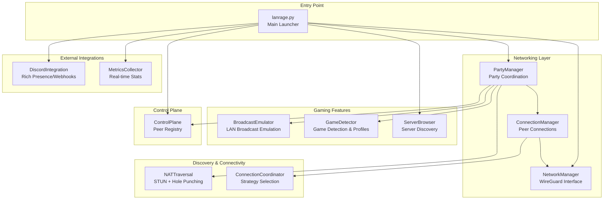
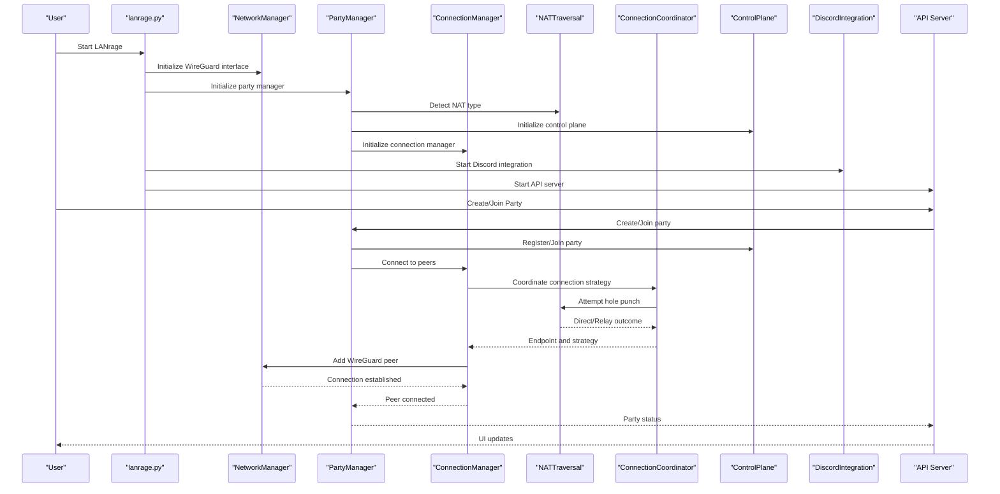
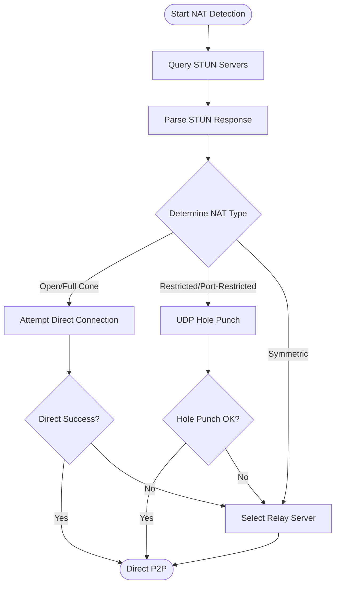
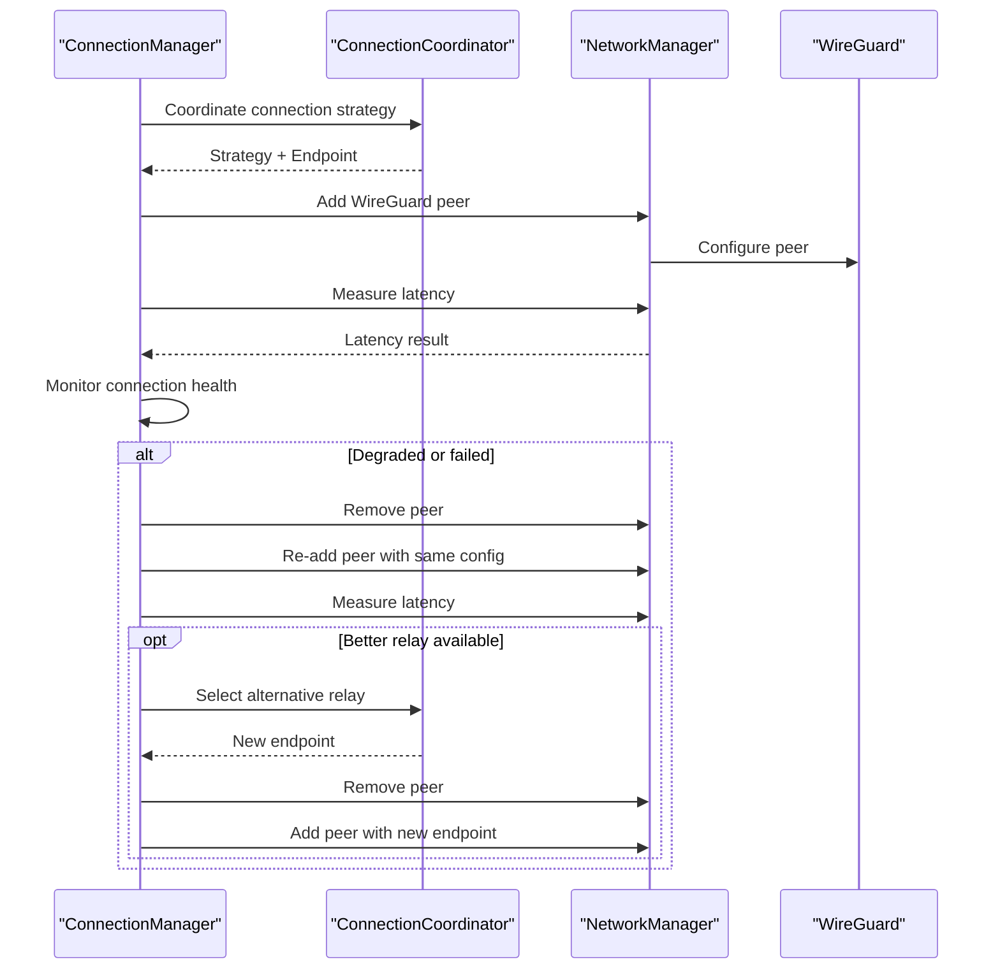
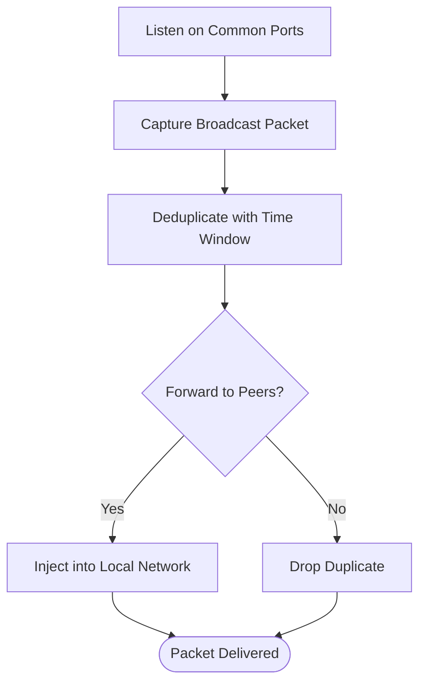
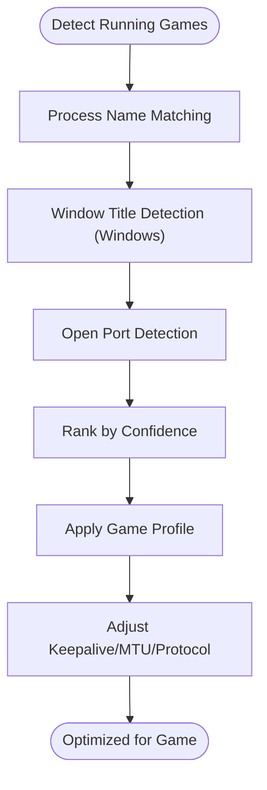
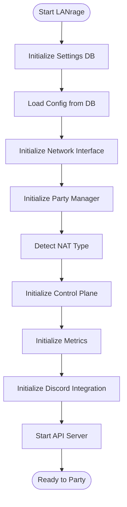
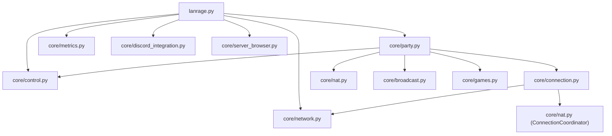

# Introduction and Philosophy

<cite>
**Referenced Files in This Document**
- [README.md](file://README.md)
- [IMPLEMENTATION_PLAN.md](file://IMPLEMENTATION_PLAN.md)
- [docs/NAT_TRAVERSAL.md](file://docs/NAT_TRAVERSAL.md)
- [docs/PERFORMANCE_OPTIMIZATION.md](file://docs/PERFORMANCE_OPTIMIZATION.md)
- [docs/ROADMAP.md](file://docs/ROADMAP.md)
- [core/nat.py](file://core/nat.py)
- [core/connection.py](file://core/connection.py)
- [core/broadcast.py](file://core/broadcast.py)
- [core/games.py](file://core/games.py)
- [core/party.py](file://core/party.py)
- [core/network.py](file://core/network.py)
- [lanrage.py](file://lanrage.py)
</cite>

## Table of Contents
1. [Introduction](#introduction)
2. [Project Structure](#project-structure)
3. [Core Components](#core-components)
4. [Architecture Overview](#architecture-overview)
5. [Detailed Component Analysis](#detailed-component-analysis)
6. [Dependency Analysis](#dependency-analysis)
7. [Performance Considerations](#performance-considerations)
8. [Troubleshooting Guide](#troubleshooting-guide)
9. [Conclusion](#conclusion)
10. [Appendices](#appendices)

## Introduction
LANrage is a gaming-focused VPN designed to eliminate the friction of online gaming while preserving the seamless experience of LAN parties. Its mission is simple: put gamers first. This means prioritizing latency above all else, delivering zero-configuration setup, and optimizing for the unique demands of competitive and cooperative gameplay. The project’s philosophy is grounded in practical engineering choices that directly benefit the gaming community—direct P2P connections when possible, smart relay fallbacks when NATs complicate things, broadcast emulation for legacy LAN games, and game-aware profiles that auto-optimize network behavior.

LANrage recognizes that traditional gaming VPN solutions often prioritize enterprise features over gaming performance, adding latency and complexity. Instead, LANrage focuses on what matters most to gamers: low-latency, reliable connections with minimal setup. The result is a system that feels like LAN over the internet, with predictable performance and straightforward operation.

**Section sources**
- [README.md](file://README.md#L28-L56)
- [README.md](file://README.md#L326-L333)

## Project Structure
At a high level, LANrage is organized around a modular architecture that separates concerns into distinct layers:
- Entry point and orchestration: the main launcher initializes configuration, network, party management, NAT traversal, metrics, Discord integration, and the API server.
- Networking: WireGuard interface management, peer connection orchestration, and latency measurement.
- Discovery and connectivity: NAT traversal, connection coordination, and relay selection.
- Gaming features: broadcast/multicast emulation, game detection and optimization, and server browser.
- Control plane: peer discovery, party coordination, and relay registry.
- Web UI and API: user-facing controls and programmatic access.

**Diagram sources**
- [lanrage.py](file://lanrage.py#L40-L170)
- [core/network.py](file://core/network.py#L25-L170)
- [core/party.py](file://core/party.py#L102-L158)
- [core/connection.py](file://core/connection.py#L18-L120)
- [core/nat.py](file://core/nat.py#L41-L138)
- [core/broadcast.py](file://core/broadcast.py#L201-L230)
- [core/games.py](file://core/games.py#L265-L363)

**Section sources**
- [lanrage.py](file://lanrage.py#L40-L170)
- [core/party.py](file://core/party.py#L102-L158)
- [core/network.py](file://core/network.py#L25-L170)

## Core Components
LANrage’s core components reflect its philosophy of putting gamers first:

- Latency obsession: Every aspect of the system is tuned to minimize latency. Direct P2P connections are prioritized, with relay fallbacks optimized to keep overhead under 15ms. Performance targets consistently exceed expectations, with direct connections achieving less than 5ms overhead and relayed connections under 15ms.
- Zero configuration: The system boots with sensible defaults, detects NAT automatically, and optimizes network settings without user intervention. The web UI and API provide a simple path to create or join parties.
- Gaming-first design: Broadcast emulation enables legacy LAN games to discover each other seamlessly. Game detection and profiles auto-apply optimizations tailored to each title, including keepalive timers, MTU, and protocol preferences.
- Robust NAT traversal: LANrage implements STUN-based NAT detection, UDP hole punching, and intelligent relay selection. It gracefully falls back to relays when direct connections are not possible, ensuring consistent connectivity.

These characteristics are implemented through carefully designed modules that collaborate to deliver a cohesive gaming experience.

**Section sources**
- [README.md](file://README.md#L28-L56)
- [docs/PERFORMANCE_OPTIMIZATION.md](file://docs/PERFORMANCE_OPTIMIZATION.md#L10-L25)
- [docs/NAT_TRAVERSAL.md](file://docs/NAT_TRAVERSAL.md#L1-L50)
- [core/broadcast.py](file://core/broadcast.py#L201-L230)
- [core/games.py](file://core/games.py#L265-L363)

## Architecture Overview
LANrage’s architecture balances simplicity with performance. The main launcher coordinates subsystems, each responsible for a specific aspect of the gaming experience. The networking layer manages WireGuard interfaces and peer connections, while the discovery layer handles NAT traversal and relay selection. Gaming features like broadcast emulation and game detection integrate with the networking layer to optimize traffic for specific titles. The control plane provides peer discovery and party coordination, and external integrations like Discord and metrics reporting enhance usability and observability.

**Diagram sources**
- [lanrage.py](file://lanrage.py#L140-L155)
- [core/party.py](file://core/party.py#L159-L247)
- [core/connection.py](file://core/connection.py#L38-L120)
- [core/nat.py](file://core/nat.py#L337-L369)
- [core/network.py](file://core/network.py#L392-L420)

**Section sources**
- [lanrage.py](file://lanrage.py#L140-L155)
- [core/party.py](file://core/party.py#L159-L247)
- [core/connection.py](file://core/connection.py#L38-L120)
- [core/nat.py](file://core/nat.py#L337-L369)
- [core/network.py](file://core/network.py#L392-L420)

## Detailed Component Analysis

### NAT Traversal and Connection Strategy
LANrage’s NAT traversal system is central to its mission of seamless connectivity. It performs STUN-based NAT detection, determines NAT types, and attempts UDP hole punching to establish direct P2P connections. When direct connections are not possible, it selects the best relay server based on latency and availability.

**Diagram sources**
- [core/nat.py](file://core/nat.py#L64-L106)
- [core/nat.py](file://core/nat.py#L244-L294)
- [core/nat.py](file://core/nat.py#L337-L369)

**Section sources**
- [docs/NAT_TRAVERSAL.md](file://docs/NAT_TRAVERSAL.md#L1-L50)
- [core/nat.py](file://core/nat.py#L64-L106)
- [core/nat.py](file://core/nat.py#L244-L294)
- [core/nat.py](file://core/nat.py#L337-L369)

### Connection Orchestration and Relay Switching
The connection manager coordinates peer connections, applies adaptive strategies, and monitors connection health. It measures latency, triggers reconnections when necessary, and switches relays proactively to maintain low-latency paths.

**Diagram sources**
- [core/connection.py](file://core/connection.py#L38-L120)
- [core/connection.py](file://core/connection.py#L213-L305)
- [core/connection.py](file://core/connection.py#L334-L437)
- [core/network.py](file://core/network.py#L392-L420)

**Section sources**
- [core/connection.py](file://core/connection.py#L38-L120)
- [core/connection.py](file://core/connection.py#L213-L305)
- [core/connection.py](file://core/connection.py#L334-L437)
- [core/network.py](file://core/network.py#L392-L420)

### Broadcast Emulation for Legacy LAN Games
LANrage emulates LAN broadcast and multicast traffic for games that rely on discovery mechanisms. It captures broadcast packets, deduplicates them to prevent loops, and forwards them to peers, enabling seamless LAN-like gameplay over the internet.

**Diagram sources**
- [core/broadcast.py](file://core/broadcast.py#L240-L287)
- [core/broadcast.py](file://core/broadcast.py#L338-L381)
- [core/broadcast.py](file://core/broadcast.py#L409-L425)

**Section sources**
- [core/broadcast.py](file://core/broadcast.py#L201-L230)
- [core/broadcast.py](file://core/broadcast.py#L240-L287)
- [core/broadcast.py](file://core/broadcast.py#L338-L381)

### Game Detection and Optimization Profiles
LANrage detects running games using multiple methods (process name, window title on Windows, and open ports), ranks detections by confidence, and applies game-specific optimization profiles. These profiles adjust keepalive timers, MTU, and other parameters to suit each game’s networking characteristics.

**Diagram sources**
- [core/games.py](file://core/games.py#L370-L449)
- [core/games.py](file://core/games.py#L450-L510)
- [core/games.py](file://core/games.py#L511-L581)
- [core/games.py](file://core/games.py#L696-L745)

**Section sources**
- [core/games.py](file://core/games.py#L370-L449)
- [core/games.py](file://core/games.py#L450-L510)
- [core/games.py](file://core/games.py#L511-L581)
- [core/games.py](file://core/games.py#L696-L745)

### Zero-Configuration Setup and Operational Simplicity
LANrage emphasizes simplicity from the user’s perspective. The launcher initializes settings, validates configuration, sets up the network interface, detects NAT, initializes the control plane, and starts the API server. Users simply open the web UI, create or join a party, and start gaming.

**Diagram sources**
- [lanrage.py](file://lanrage.py#L53-L155)

**Section sources**
- [lanrage.py](file://lanrage.py#L53-L155)

## Dependency Analysis
LANrage’s modules depend on each other in a layered fashion. The entry point depends on networking, party management, control plane, metrics, Discord integration, and the API server. Party management depends on NAT traversal and the control plane. Connection management depends on networking and NAT coordination. Gaming features integrate with networking for broadcast emulation and with the control plane for discovery.

**Diagram sources**
- [lanrage.py](file://lanrage.py#L14-L22)
- [core/party.py](file://core/party.py#L102-L158)
- [core/connection.py](file://core/connection.py#L18-L37)
- [core/nat.py](file://core/nat.py#L330-L338)
- [core/broadcast.py](file://core/broadcast.py#L552-L566)
- [core/games.py](file://core/games.py#L265-L274)

**Section sources**
- [lanrage.py](file://lanrage.py#L14-L22)
- [core/party.py](file://core/party.py#L102-L158)
- [core/connection.py](file://core/connection.py#L18-L37)
- [core/nat.py](file://core/nat.py#L330-L338)
- [core/broadcast.py](file://core/broadcast.py#L552-L566)
- [core/games.py](file://core/games.py#L265-L274)

## Performance Considerations
LANrage’s performance targets are aggressive and measurable:
- Direct P2P latency under 5ms overhead
- Relayed connections under 15ms overhead
- Connection establishment under 2 seconds
- CPU idle below 5%
- Memory usage under 100MB per client
- Throughput above 90% of baseline network

These targets are achieved through careful optimization, including adaptive measurement intervals, caching, and targeted improvements to disk I/O, broadcast traffic, and metrics collection. The implementation plan documents specific optimizations that reduce disk I/O by orders of magnitude, cut broadcast duplication, and bound memory growth.

**Section sources**
- [docs/PERFORMANCE_OPTIMIZATION.md](file://docs/PERFORMANCE_OPTIMIZATION.md#L10-L25)
- [docs/PERFORMANCE_OPTIMIZATION.md](file://docs/PERFORMANCE_OPTIMIZATION.md#L47-L68)
- [IMPLEMENTATION_PLAN.md](file://IMPLEMENTATION_PLAN.md#L14-L21)
- [IMPLEMENTATION_PLAN.md](file://IMPLEMENTATION_PLAN.md#L25-L95)
- [IMPLEMENTATION_PLAN.md](file://IMPLEMENTATION_PLAN.md#L98-L173)
- [IMPLEMENTATION_PLAN.md](file://IMPLEMENTATION_PLAN.md#L176-L282)

## Troubleshooting Guide
LANrage’s documentation includes troubleshooting guidance for common NAT traversal issues, relay selection problems, and performance bottlenecks. The NAT traversal guide provides actionable steps for diagnosing STUN server reachability, hole punching failures, and relay latency concerns. The implementation plan documents ongoing improvements to reduce disk I/O, bandwidth, and memory growth, which indirectly address stability and performance issues.

Common scenarios:
- NAT detection failures: Check firewall settings, test STUN servers manually, and try a different network.
- Hole punching failures: Use relay fallback (automatic), try a different network, or check router settings.
- Relay connection slowness: Choose a closer relay, deploy more relays, or check network quality.

**Section sources**
- [docs/NAT_TRAVERSAL.md](file://docs/NAT_TRAVERSAL.md#L486-L523)
- [IMPLEMENTATION_PLAN.md](file://IMPLEMENTATION_PLAN.md#L14-L21)
- [IMPLEMENTATION_PLAN.md](file://IMPLEMENTATION_PLAN.md#L25-L95)
- [IMPLEMENTATION_PLAN.md](file://IMPLEMENTATION_PLAN.md#L98-L173)

## Conclusion
LANrage’s philosophy is clear: gamers come first. By obsessing over latency, eliminating configuration complexity, and optimizing for gaming-specific needs, LANrage delivers a seamless LAN-like experience over the internet. Its architecture and implementation reflect this philosophy—from NAT traversal and relay selection to broadcast emulation and game-aware profiles. The project’s commitment to simplicity, performance, and continuous improvement ensures that LANrage remains a practical, high-performance solution for modern gaming.

[No sources needed since this section summarizes without analyzing specific files]

## Appendices

### Why Existing Solutions Fell Short
Traditional gaming VPN solutions often prioritize enterprise features over gaming performance, resulting in:
- Higher-than-necessary latency due to unnecessary features
- Complex setup requirements that increase barrier to entry
- Limited or absent optimizations for LAN-like broadcast discovery
- Reliance on centralized infrastructure that can introduce additional latency

LANrage addresses these gaps by focusing exclusively on gaming needs, minimizing latency, and providing zero-configuration operation.

**Section sources**
- [README.md](file://README.md#L28-L35)
- [README.md](file://README.md#L334-L344)

### Vision for Seamless LAN-like Gaming
LANrage envisions a future where LAN parties and private game servers feel natural over the internet. The roadmap outlines phases toward enhanced scalability, mobile support, and advanced features, while maintaining the core mission of putting gamers first.

**Section sources**
- [docs/ROADMAP.md](file://docs/ROADMAP.md#L236-L243)