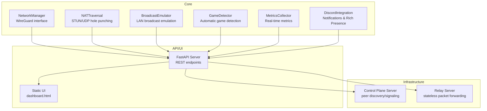
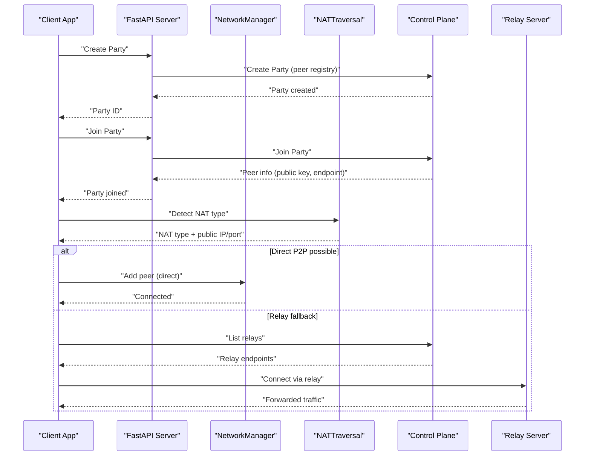
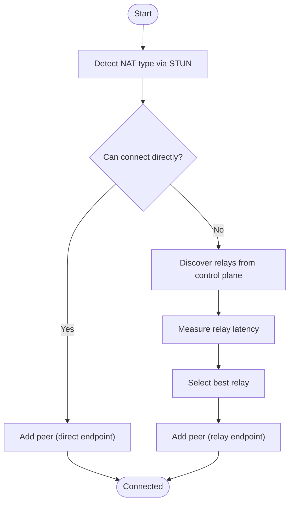
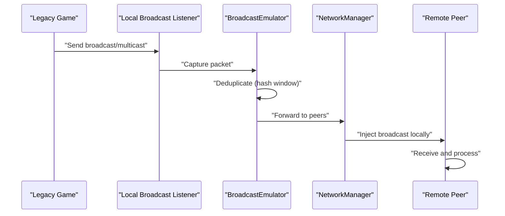
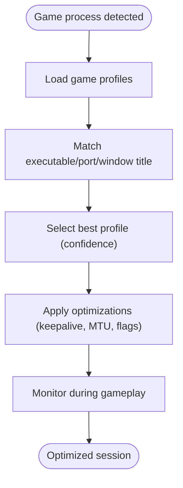
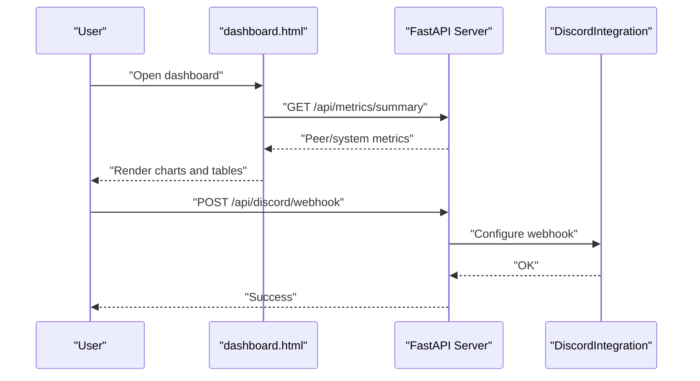
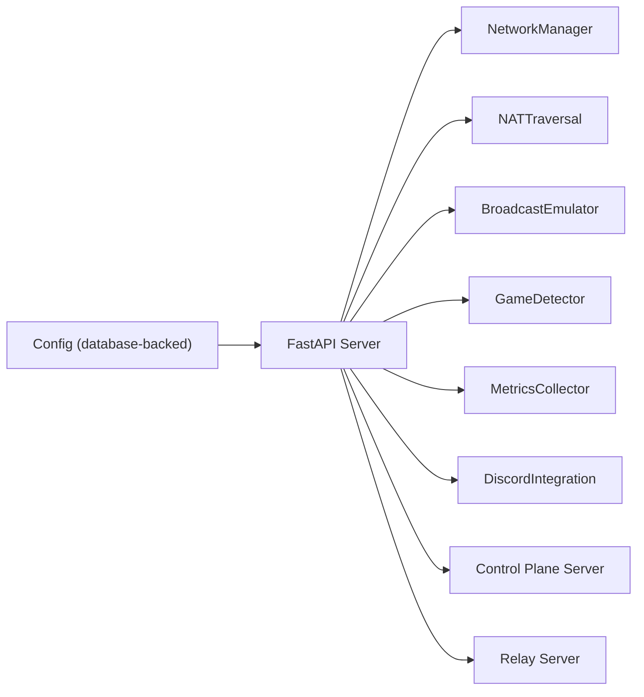

# Key Features and Benefits

<cite>
**Referenced Files in This Document**
- [README.md](file://README.md)
- [network.py](file://core/network.py)
- [broadcast.py](file://core/broadcast.py)
- [nat.py](file://core/nat.py)
- [games.py](file://core/games.py)
- [metrics.py](file://core/metrics.py)
- [discord_integration.py](file://core/discord_integration.py)
- [config.py](file://core/config.py)
- [server.py](file://api/server.py)
- [dashboard.html](file://static/dashboard.html)
- [control_server.py](file://servers/control_server.py)
- [relay_server.py](file://servers/relay_server.py)
</cite>

## Table of Contents
1. [Introduction](#introduction)
2. [Project Structure](#project-structure)
3. [Core Components](#core-components)
4. [Architecture Overview](#architecture-overview)
5. [Detailed Component Analysis](#detailed-component-analysis)
6. [Dependency Analysis](#dependency-analysis)
7. [Performance Considerations](#performance-considerations)
8. [Troubleshooting Guide](#troubleshooting-guide)
9. [Conclusion](#conclusion)

## Introduction
LANrage is a gaming-focused VPN designed to eliminate the friction of playing LAN-style games over the internet. It delivers:
- Zero-config mesh networking
- Direct P2P connections with smart relay fallback
- Broadcast and multicast emulation for legacy games
- Game-aware optimizations and automatic detection
- A web-based configuration and monitoring interface
- Real-time metrics and Discord integration

Compared to existing solutions, LANrage prioritizes gaming latency and simplicity, offering a streamlined experience without sacrificing reliability.

## Project Structure
At a high level, LANrage consists of:
- Core networking and game logic (WireGuard, NAT traversal, broadcast/multicast emulation, game detection, metrics)
- Web API and UI (FastAPI backend, static HTML/CSS/JS dashboard)
- Control plane and relay servers (peer discovery, relay registration, signaling)
- Configuration and settings management (database-backed)

**Diagram sources**
- [network.py](file://core/network.py#L25-L515)
- [nat.py](file://core/nat.py#L41-L525)
- [broadcast.py](file://core/broadcast.py#L201-L646)
- [games.py](file://core/games.py#L265-L800)
- [metrics.py](file://core/metrics.py#L193-L705)
- [discord_integration.py](file://core/discord_integration.py#L81-L633)
- [server.py](file://api/server.py#L1-L701)
- [dashboard.html](file://static/dashboard.html#L1-L587)
- [control_server.py](file://servers/control_server.py#L1-L729)
- [relay_server.py](file://servers/relay_server.py#L1-L297)

**Section sources**
- [README.md](file://README.md#L22-L108)
- [server.py](file://api/server.py#L1-L701)
- [dashboard.html](file://static/dashboard.html#L1-L587)

## Core Components
- Zero-config mesh VPN with WireGuard interface management and automatic key generation
- NAT traversal using STUN and UDP hole punching, with relay fallback for symmetric NAT
- Broadcast and multicast emulation for legacy LAN discovery protocols
- Automatic game detection and profile-based optimizations
- Real-time metrics and a statistics dashboard
- Discord integration for notifications, voice chat links, and Rich Presence
- Web-based configuration and control via a FastAPI server and static UI

**Section sources**
- [network.py](file://core/network.py#L25-L515)
- [nat.py](file://core/nat.py#L41-L525)
- [broadcast.py](file://core/broadcast.py#L201-L646)
- [games.py](file://core/games.py#L265-L800)
- [metrics.py](file://core/metrics.py#L193-L705)
- [discord_integration.py](file://core/discord_integration.py#L81-L633)
- [server.py](file://api/server.py#L1-L701)
- [dashboard.html](file://static/dashboard.html#L1-L587)

## Architecture Overview
LANrage’s runtime architecture integrates a data plane (WireGuard) with a control plane (peer discovery and relay registry) and a user plane (web UI and metrics).

**Diagram sources**
- [server.py](file://api/server.py#L155-L186)
- [nat.py](file://core/nat.py#L330-L525)
- [control_server.py](file://servers/control_server.py#L291-L595)
- [relay_server.py](file://servers/relay_server.py#L30-L297)

## Detailed Component Analysis

### Zero-config Mesh VPN and Direct P2P with Relay Fallback
LANrage provisions a WireGuard interface automatically, manages keys, and establishes direct P2P connections when feasible. When NAT traversal fails, it falls back to a relay server.

**Diagram sources**
- [nat.py](file://core/nat.py#L64-L327)
- [nat.py](file://core/nat.py#L330-L525)
- [network.py](file://core/network.py#L392-L444)
- [control_server.py](file://servers/control_server.py#L630-L683)

**Section sources**
- [network.py](file://core/network.py#L25-L515)
- [nat.py](file://core/nat.py#L41-L525)
- [control_server.py](file://servers/control_server.py#L597-L683)
- [relay_server.py](file://servers/relay_server.py#L30-L297)

### Broadcast Emulation for Legacy Games
Many classic LAN games rely on UDP or multicast broadcasts for discovery. LANrage intercepts and re-emits these packets across the mesh, preventing loops with deduplication and ensuring compatibility.

**Diagram sources**
- [broadcast.py](file://core/broadcast.py#L201-L646)
- [network.py](file://core/network.py#L382-L406)

**Section sources**
- [broadcast.py](file://core/broadcast.py#L18-L646)
- [network.py](file://core/network.py#L382-L406)

### Gaming-Specific Optimizations and Automatic Detection
LANrage detects running games and applies profile-based optimizations (e.g., keepalive intervals, MTU, packet priority) tailored to NAT type and game characteristics.

**Diagram sources**
- [games.py](file://core/games.py#L265-L800)
- [metrics.py](file://core/metrics.py#L193-L705)

**Section sources**
- [games.py](file://core/games.py#L20-L800)
- [metrics.py](file://core/metrics.py#L193-L705)

### Web-based Configuration, Real-time Metrics, and Discord Integration
LANrage exposes a web UI and REST API for configuration, party management, server browser, and metrics. Real-time dashboards visualize system and peer metrics. Discord integration sends notifications, voice chat invites, and Rich Presence updates.

**Diagram sources**
- [dashboard.html](file://static/dashboard.html#L420-L584)
- [server.py](file://api/server.py#L191-L359)
- [discord_integration.py](file://core/discord_integration.py#L81-L633)

**Section sources**
- [server.py](file://api/server.py#L1-L701)
- [dashboard.html](file://static/dashboard.html#L1-L587)
- [discord_integration.py](file://core/discord_integration.py#L81-L633)

### Practical Gaming Scenarios
- LAN parties over the internet: Create a party, share the ID, and play without port forwarding or complex setups.
- Competitive FPS with minimal latency: Automatic detection optimizes keepalive and MTU; direct P2P preferred, relay fallback available.
- Classic RTS/strategy games: Broadcast emulation enables LAN discovery protocols to work seamlessly.
- Team coordination: Discord integration posts party events, voice chat invites, and Rich Presence updates.

[No sources needed since this section provides scenario descriptions without quoting specific files]

## Dependency Analysis
LANrage’s components are loosely coupled around shared abstractions and the configuration model. The API server orchestrates core services and exposes endpoints for UI and external integrations.

**Diagram sources**
- [config.py](file://core/config.py#L17-L114)
- [server.py](file://api/server.py#L1-L701)
- [control_server.py](file://servers/control_server.py#L1-L729)
- [relay_server.py](file://servers/relay_server.py#L1-L297)

**Section sources**
- [config.py](file://core/config.py#L17-L114)
- [server.py](file://api/server.py#L1-L701)

## Performance Considerations
- Latency-first routing: Direct P2P with persistent keepalive tuned per NAT type; relay fallback with latency-based selection.
- Bandwidth efficiency: Broadcast deduplication prevents redundant forwarding; metrics enable visibility into throughput and utilization.
- Resource awareness: System metrics (CPU/memory) and peer quality scoring help diagnose bottlenecks.
- Scalability: Stateless relay servers and database-backed control plane support growth.

[No sources needed since this section provides general guidance]

## Troubleshooting Guide
- WireGuard interface issues: Ensure the platform-specific interface is created and keys are generated; check logs for errors.
- NAT traversal failures: Verify STUN connectivity and firewall rules; confirm UDP hole punching attempts and relay availability.
- Broadcast/multicast not working: Confirm monitored ports and deduplication settings; verify injection paths.
- Metrics not updating: Check metrics collector initialization and collection intervals; validate API endpoints.
- Discord integration: Confirm webhook/invite URLs, bot token/channel configuration, and Rich Presence prerequisites.

**Section sources**
- [network.py](file://core/network.py#L70-L122)
- [nat.py](file://core/nat.py#L64-L106)
- [broadcast.py](file://core/broadcast.py#L240-L287)
- [metrics.py](file://core/metrics.py#L216-L246)
- [discord_integration.py](file://core/discord_integration.py#L104-L133)

## Conclusion
LANrage delivers a gaming-first VPN solution that removes the complexity of LAN-style multiplayer over the internet. Its combination of zero-config mesh networking, robust NAT traversal, broadcast emulation, game-aware optimizations, and a friendly web interface sets it apart for players who prioritize latency and ease of use.

[No sources needed since this section summarizes without analyzing specific files]