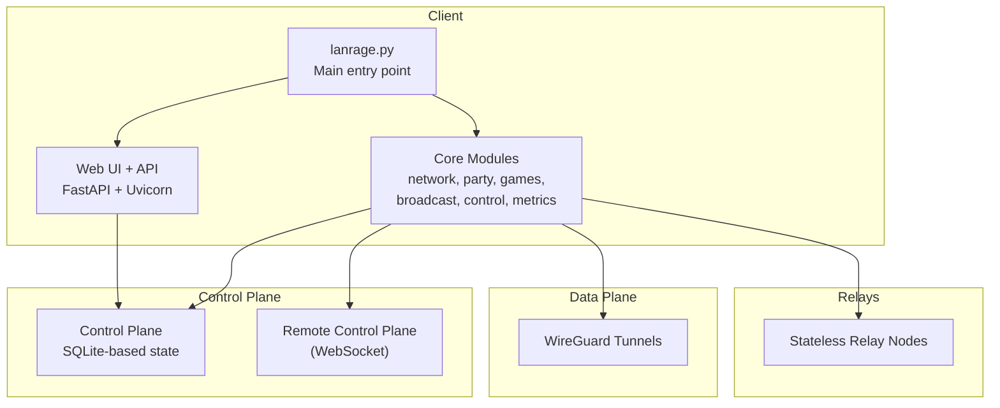
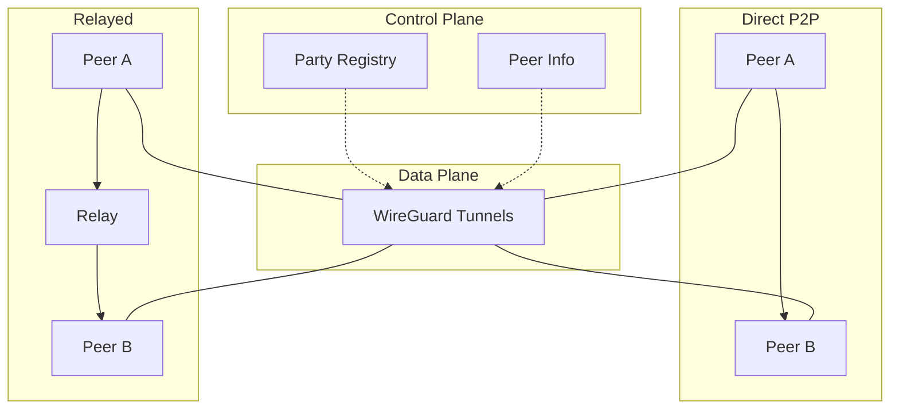
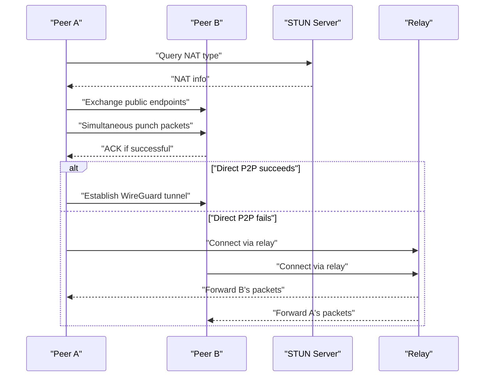
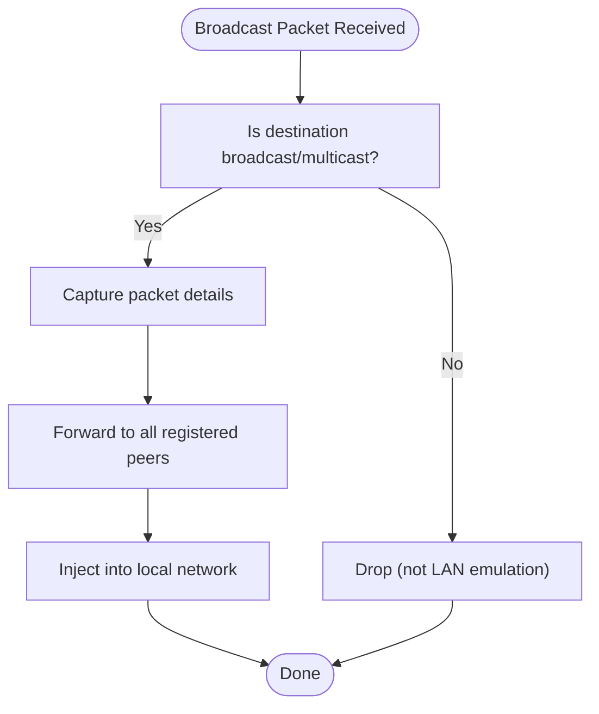
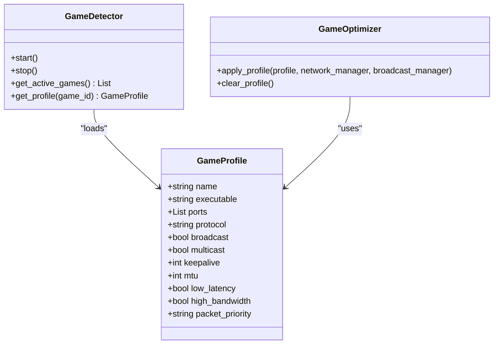
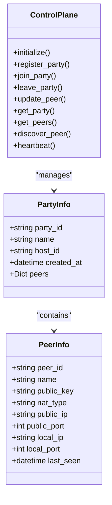
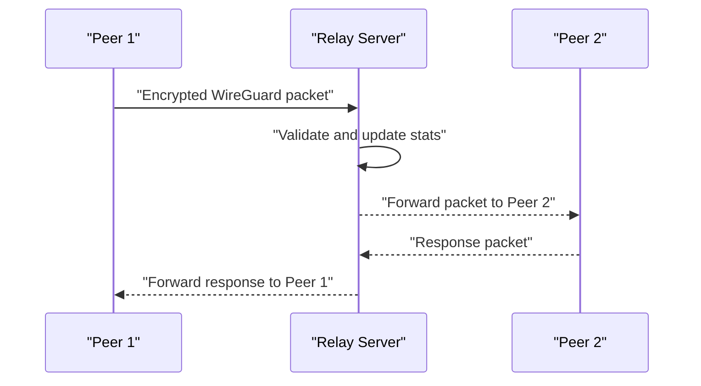
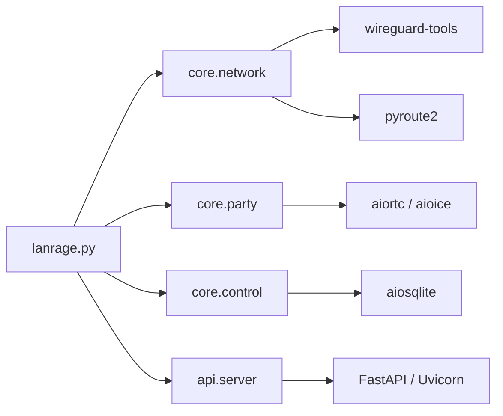

# Project Overview

<cite>
**Referenced Files in This Document**
- [README.md](file://README.md)
- [lanrage.py](file://lanrage.py)
- [docs/ARCHITECTURE.md](file://docs/ARCHITECTURE.md)
- [docs/NAT_TRAVERSAL.md](file://docs/NAT_TRAVERSAL.md)
- [docs/BROADCAST.md](file://docs/BROADCAST.md)
- [docs/GAMES.md](file://docs/GAMES.md)
- [docs/CONTROL_PLANE.md](file://docs/CONTROL_PLANE.md)
- [docs/RELAY_SERVER.md](file://docs/RELAY_SERVER.md)
- [docs/PERFORMANCE_OPTIMIZATION.md](file://docs/PERFORMANCE_OPTIMIZATION.md)
- [docs/TESTING.md](file://docs/TESTING.md)
- [requirements.txt](file://requirements.txt)
- [setup.py](file://setup.py)
- [pyproject.toml](file://pyproject.toml)
- [game_profiles/competitive.json](file://game_profiles/competitive.json)
- [game_profiles/custom/example.json](file://game_profiles/custom/example.json)
</cite>

## Table of Contents
1. [Introduction](#introduction)
2. [Project Structure](#project-structure)
3. [Core Components](#core-components)
4. [Architecture Overview](#architecture-overview)
5. [Detailed Component Analysis](#detailed-component-analysis)
6. [Dependency Analysis](#dependency-analysis)
7. [Performance Considerations](#performance-considerations)
8. [Troubleshooting Guide](#troubleshooting-guide)
9. [Conclusion](#conclusion)
10. [Appendices](#appendices)

## Introduction
LANrage is a zero-config mesh VPN designed specifically for gamers who want LAN-like connectivity over the internet without the hassle of NAT traversal, port forwarding, or complex networking setups. Its core philosophy is gamers-first: latency obsession, zero configuration, open-source transparency, and honest simplicity. The solution delivers near-LAN performance by combining direct peer-to-peer connections when possible, with smart relay fallback for challenging NAT environments, plus broadcast/multicast emulation for legacy LAN games.

Key differentiators:
- Zero-config mesh VPN with automatic peer discovery and connection orchestration
- Direct P2P with UDP hole punching and STUN-based NAT detection
- Smart relay fallback with low-latency, stateless forwarding
- Broadcast and multicast emulation for LAN discovery protocols
- Game-aware profiles with automatic optimization and QoS
- Web UI and REST API for simple management
- Production-ready performance targets and comprehensive testing

**Section sources**
- [README.md](file://README.md#L22-L56)
- [README.md](file://README.md#L326-L333)

## Project Structure
At a high level, LANrage consists of:
- A client application that manages the local WireGuard interface, peer connections, and local services
- A control plane for peer discovery, party management, and state persistence
- A data plane built on WireGuard for encrypted, high-performance tunnels
- Optional relay servers for NAT traversal fallback
- Game detection and optimization subsystems with per-game profiles
- Broadcast/multicast emulation for legacy LAN discovery
- A web UI and REST API for configuration and monitoring

**Diagram sources**
- [lanrage.py](file://lanrage.py#L40-L154)
- [docs/ARCHITECTURE.md](file://docs/ARCHITECTURE.md#L7-L38)

**Section sources**
- [lanrage.py](file://lanrage.py#L14-L22)
- [docs/ARCHITECTURE.md](file://docs/ARCHITECTURE.md#L3-L38)

## Core Components
- Mesh VPN and WireGuard integration: Creates and manages the virtual LAN interface, establishes encrypted tunnels, and supports direct P2P and relayed paths.
- NAT traversal: Detects NAT type, performs STUN queries, coordinates UDP hole punching, and falls back to relays when needed.
- Control plane: Manages party registration, peer discovery, heartbeats, and local/remote state persistence.
- Broadcast and multicast emulation: Captures and forwards LAN discovery broadcasts and multicast groups to emulate LAN-like behavior for legacy games.
- Game detection and optimization: Automatically detects running games, applies per-game profiles, and sets QoS priorities.
- Relay servers: Stateless packet forwarders that enable connectivity when direct P2P is not possible.
- Web UI and API: Provides a simple browser-based interface for configuration, party management, and monitoring.

**Section sources**
- [docs/ARCHITECTURE.md](file://docs/ARCHITECTURE.md#L9-L38)
- [docs/NAT_TRAVERSAL.md](file://docs/NAT_TRAVERSAL.md#L7-L15)
- [docs/CONTROL_PLANE.md](file://docs/CONTROL_PLANE.md#L7-L15)
- [docs/BROADCAST.md](file://docs/BROADCAST.md#L7-L15)
- [docs/GAMES.md](file://docs/GAMES.md#L7-L15)
- [docs/RELAY_SERVER.md](file://docs/RELAY_SERVER.md#L7-L14)

## Architecture Overview
LANrage’s architecture balances simplicity and performance for gaming:
- Control plane: Peer discovery and party management with SQLite persistence; optional remote WebSocket-based control plane for future scaling.
- Data plane: WireGuard tunnels for encrypted, high-throughput, low-latency communication.
- Connection strategies: Prefer direct P2P with UDP hole punching; fall back to relays when NAT traversal fails; TCP tunnels as a last resort.
- Virtual network: A managed subnet and interface for seamless LAN-like routing.
- Security model: End-to-end encryption with public-key cryptography; relays are stateless and cannot decrypt traffic.

**Diagram sources**
- [docs/ARCHITECTURE.md](file://docs/ARCHITECTURE.md#L41-L49)
- [docs/ARCHITECTURE.md](file://docs/ARCHITECTURE.md#L79-L91)

**Section sources**
- [docs/ARCHITECTURE.md](file://docs/ARCHITECTURE.md#L3-L91)

## Detailed Component Analysis

### NAT Traversal and Connection Strategy
LANrage detects NAT types using STUN, coordinates UDP hole punching, and selects the best connection strategy. When direct P2P is not possible, it discovers and measures relay servers to choose the optimal fallback.

**Diagram sources**
- [docs/NAT_TRAVERSAL.md](file://docs/NAT_TRAVERSAL.md#L53-L101)
- [docs/NAT_TRAVERSAL.md](file://docs/NAT_TRAVERSAL.md#L219-L252)
- [docs/NAT_TRAVERSAL.md](file://docs/NAT_TRAVERSAL.md#L263-L275)

**Section sources**
- [docs/NAT_TRAVERSAL.md](file://docs/NAT_TRAVERSAL.md#L16-L122)
- [docs/NAT_TRAVERSAL.md](file://docs/NAT_TRAVERSAL.md#L417-L462)

### Broadcast and Multicast Emulation
Legacy LAN games rely on UDP broadcasts and multicast for discovery. LANrage captures these packets locally, forwards them to peers, and injects them back onto the local network to emulate LAN behavior.

**Diagram sources**
- [docs/BROADCAST.md](file://docs/BROADCAST.md#L143-L173)
- [docs/BROADCAST.md](file://docs/BROADCAST.md#L407-L422)

**Section sources**
- [docs/BROADCAST.md](file://docs/BROADCAST.md#L7-L15)
- [docs/BROADCAST.md](file://docs/BROADCAST.md#L438-L478)

### Game Detection and Optimization
LANrage detects running games and applies per-game profiles that adjust WireGuard keepalive, MTU, and packet priority, while enabling broadcast/multicast listeners as needed.

**Diagram sources**
- [docs/GAMES.md](file://docs/GAMES.md#L18-L52)
- [docs/GAMES.md](file://docs/GAMES.md#L98-L174)
- [docs/GAMES.md](file://docs/GAMES.md#L261-L321)

**Section sources**
- [docs/GAMES.md](file://docs/GAMES.md#L7-L15)
- [docs/GAMES.md](file://docs/GAMES.md#L54-L97)
- [game_profiles/competitive.json](file://game_profiles/competitive.json#L1-L45)
- [game_profiles/custom/example.json](file://game_profiles/custom/example.json#L1-L18)

### Control Plane and Party Management
The control plane maintains party state, peer information, and heartbeats. It supports local-only mode for LAN scenarios and a remote WebSocket-based mode for distributed deployments.

**Diagram sources**
- [docs/CONTROL_PLANE.md](file://docs/CONTROL_PLANE.md#L18-L52)
- [docs/CONTROL_PLANE.md](file://docs/CONTROL_PLANE.md#L54-L80)
- [docs/CONTROL_PLANE.md](file://docs/CONTROL_PLANE.md#L81-L194)

**Section sources**
- [docs/CONTROL_PLANE.md](file://docs/CONTROL_PLANE.md#L7-L15)
- [docs/CONTROL_PLANE.md](file://docs/CONTROL_PLANE.md#L296-L336)
- [docs/CONTROL_PLANE.md](file://docs/CONTROL_PLANE.md#L337-L429)

### Relay Server Operation
Relay servers are stateless, packet-forwarding nodes that transparently forward encrypted WireGuard packets between peers, ensuring connectivity when direct P2P is not possible.

**Diagram sources**
- [docs/RELAY_SERVER.md](file://docs/RELAY_SERVER.md#L131-L151)
- [docs/RELAY_SERVER.md](file://docs/RELAY_SERVER.md#L183-L200)

**Section sources**
- [docs/RELAY_SERVER.md](file://docs/RELAY_SERVER.md#L1-L14)
- [docs/RELAY_SERVER.md](file://docs/RELAY_SERVER.md#L334-L361)

## Dependency Analysis
LANrage uses a modern Python stack optimized for networking and real-time systems:
- Core networking: wireguard-tools, pyroute2, scapy
- NAT traversal: aiortc, aioice
- Web framework: FastAPI, Uvicorn, websockets
- HTTP client: httpx
- Utilities: pydantic, cryptography, python-dotenv, psutil, aiohttp, aiosqlite, aiofiles
- Optional Discord integrations: pypresence, discord.py
- Code quality and testing: pytest, pytest-asyncio, pytest-cov, black, isort, ruff, pylint

**Diagram sources**
- [requirements.txt](file://requirements.txt#L15-L56)
- [pyproject.toml](file://pyproject.toml#L26-L50)
- [lanrage.py](file://lanrage.py#L14-L22)

**Section sources**
- [requirements.txt](file://requirements.txt#L1-L56)
- [pyproject.toml](file://pyproject.toml#L26-L50)

## Performance Considerations
LANrage targets strict performance criteria for gaming:
- Latency overhead: <5ms for direct P2P, <15ms for relayed paths
- Connection establishment: <2 seconds
- CPU usage: <5% idle, <15% active
- Memory: <100MB per client
- Throughput: >90% of baseline network throughput with negligible packet loss

These targets were validated through comprehensive testing across local, NAT, geographic, and scale scenarios, with continuous profiling and caching strategies reducing overhead.

**Section sources**
- [docs/PERFORMANCE_OPTIMIZATION.md](file://docs/PERFORMANCE_OPTIMIZATION.md#L10-L25)
- [docs/TESTING.md](file://docs/TESTING.md#L1-L27)
- [docs/TESTING.md](file://docs/TESTING.md#L127-L200)

## Troubleshooting Guide
Common issues and resolutions:
- NAT detection failures: Check firewall settings, test STUN reachability, and try a different network.
- Hole punching failures: Expected for symmetric NAT; rely on automatic relay fallback.
- Relay latency concerns: Choose geographically closer relays, monitor network quality, and consider deploying additional relays.
- Permission errors for broadcast/multicast: Run with elevated privileges to access raw sockets.
- Game discovery not working: Ensure broadcast/multicast listeners are enabled for the game’s ports and protocols.

**Section sources**
- [docs/NAT_TRAVERSAL.md](file://docs/NAT_TRAVERSAL.md#L486-L523)
- [docs/BROADCAST.md](file://docs/BROADCAST.md#L568-L584)
- [docs/RELAY_SERVER.md](file://docs/RELAY_SERVER.md#L479-L518)

## Conclusion
LANrage delivers a gamer-centric VPN solution that eliminates the complexity of NAT traversal and port forwarding while maintaining LAN-like performance. Its zero-config design, combined with direct P2P prioritization, smart relay fallback, and broadcast emulation, ensures that most LAN games run seamlessly over the internet. The project’s emphasis on latency, open-source transparency, and honest simplicity positions it as a strong alternative for home and small-group gaming networking.

[No sources needed since this section summarizes without analyzing specific files]

## Appendices

### Supported Platforms and System Requirements
- Current (Phase 1): Windows 10/11, Linux (Ubuntu/Debian)
- Future (Phase 2): macOS, Android, iOS (planned)
- Consoles and smart TVs: Not supported

**Section sources**
- [docs/ARCHITECTURE.md](file://docs/ARCHITECTURE.md#L127-L141)

### Practical Scenarios and Use Cases
- LAN party over the internet: Create a party, invite friends, and play LAN games without port forwarding.
- Cross-NAT connectivity: When peers are behind restrictive NATs, rely on automatic relay fallback.
- Legacy game support: Enable broadcast/multicast emulation for LAN discovery protocols.
- Competitive gaming: Apply game-specific profiles with low-latency and high-priority QoS.

**Section sources**
- [README.md](file://README.md#L57-L89)
- [docs/GAMES.md](file://docs/GAMES.md#L584-L631)

### Comparison with Existing Solutions
- Gaming focus: LANrage prioritizes gaming use cases over enterprise features.
- Latency: Designed for sub-15ms overhead; some competitors introduce noticeable latency.
- Zero configuration: One-click setup and WebUI minimize friction.
- Maintenance and openness: Actively maintained and open source; some alternatives lack active maintenance or are partially closed source.

**Section sources**
- [README.md](file://README.md#L334-L344)

### Setup and Installation
- Initial setup: Use the provided setup script to create a virtual environment, install dependencies, and initialize the configuration database.
- Running LANrage: Activate the environment and launch the main entry point; configure via the Web UI.

**Section sources**
- [setup.py](file://setup.py#L46-L100)
- [README.md](file://README.md#L57-L89)