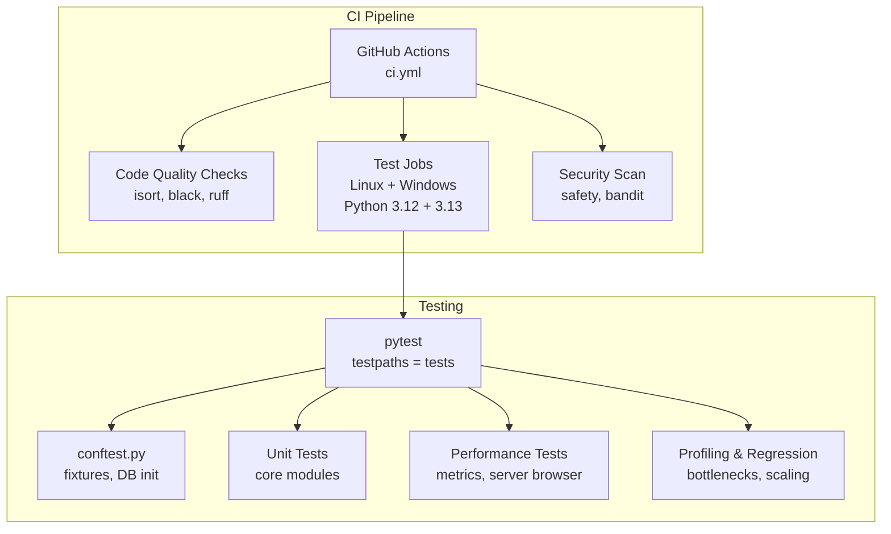
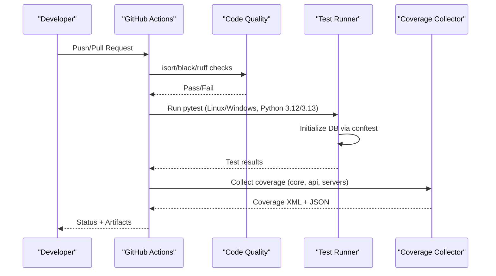
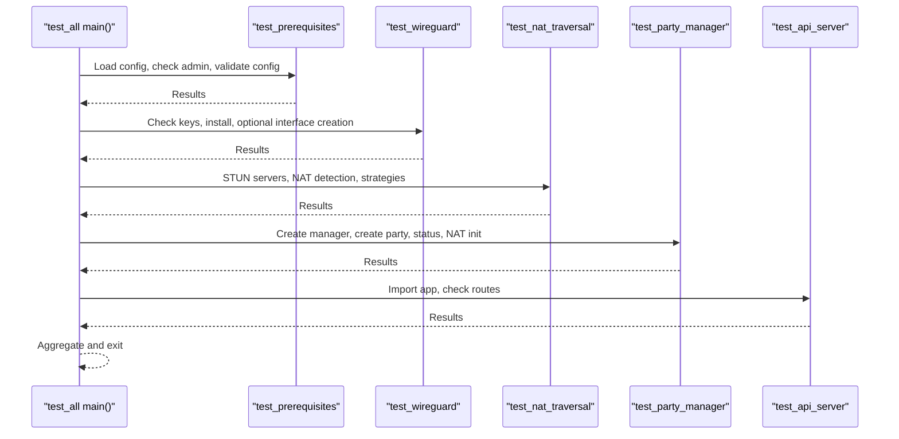
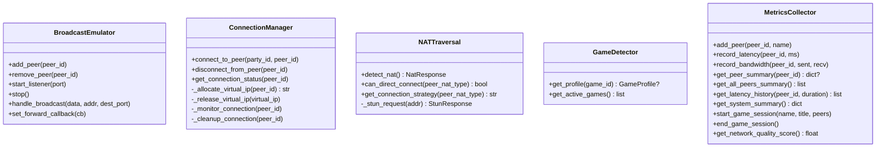
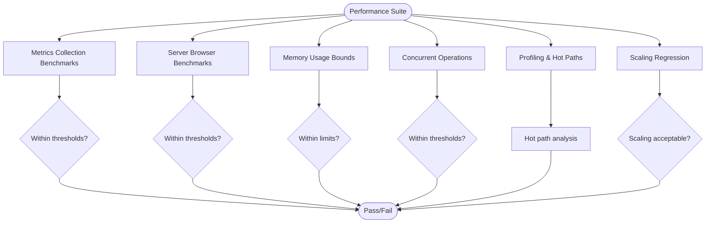
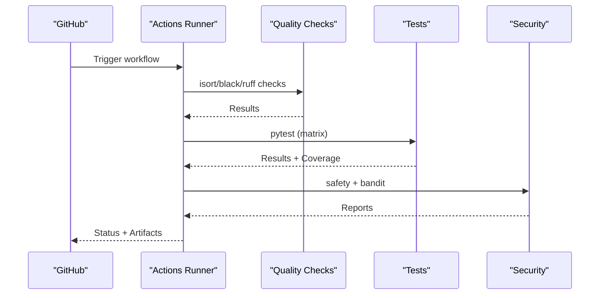
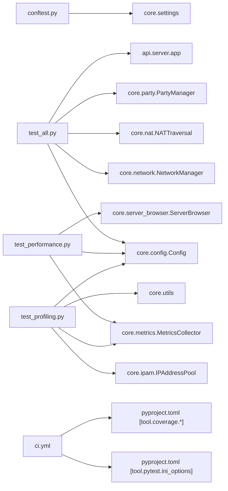

# Testing & Quality Assurance

<cite>
**Referenced Files in This Document**
- [.github/workflows/ci.yml](file://.github/workflows/ci.yml)
- [pyproject.toml](file://pyproject.toml)
- [.pylintrc](file://.pylintrc)
- [coverage.json](file://coverage.json)
- [tests/conftest.py](file://tests/conftest.py)
- [tests/test_all.py](file://tests/test_all.py)
- [tests/test_performance.py](file://tests/test_performance.py)
- [tests/test_profiling.py](file://tests/test_profiling.py)
- [tests/test_broadcast.py](file://tests/test_broadcast.py)
- [tests/test_connection.py](file://tests/test_connection.py)
- [tests/test_nat.py](file://tests/test_nat.py)
- [tests/test_games.py](file://tests/test_games.py)
- [tests/test_metrics.py](file://tests/test_metrics.py)
</cite>

## Table of Contents
1. [Introduction](#introduction)
2. [Project Structure](#project-structure)
3. [Core Components](#core-components)
4. [Architecture Overview](#architecture-overview)
5. [Detailed Component Analysis](#detailed-component-analysis)
6. [Dependency Analysis](#dependency-analysis)
7. [Performance Considerations](#performance-considerations)
8. [Troubleshooting Guide](#troubleshooting-guide)
9. [Conclusion](#conclusion)
10. [Appendices](#appendices)

## Introduction
This document describes LANrage’s testing and quality assurance processes with a focus on reliability and performance. It covers the testing framework (unit, integration, and performance benchmarks), continuous integration pipeline, code quality standards, and testing strategies for networking components, game integration, and external service connectivity. It also provides test execution procedures, coverage analysis, and quality metrics, along with contributor guidance for writing effective tests and maintaining code quality.

## Project Structure
LANrage organizes tests under the tests/ directory with targeted suites for core modules, networking, performance, and integration. The CI pipeline automates code quality checks, cross-platform testing, and coverage reporting. Configuration for testing and linting is centralized in pyproject.toml and .pylintrc.

**Diagram sources**
- [.github/workflows/ci.yml](file://.github/workflows/ci.yml#L1-L184)
- [pyproject.toml](file://pyproject.toml#L121-L137)
- [tests/conftest.py](file://tests/conftest.py#L18-L41)

**Section sources**
- [.github/workflows/ci.yml](file://.github/workflows/ci.yml#L1-L184)
- [pyproject.toml](file://pyproject.toml#L121-L137)

## Core Components
- Test fixtures and bootstrap: A session-scoped fixture initializes the settings database and validates readiness before running tests. An event loop fixture ensures async compatibility across platforms.
- Test orchestration: A comprehensive test suite validates prerequisites, WireGuard, NAT traversal, party management, and API server routes.
- Performance and profiling: Dedicated suites measure metrics collection, server browser operations, memory usage, concurrency, and latency calculations, plus profiling for hotspots and scaling.
- Code quality: Centralized configuration enforces formatting (Black), import ordering (isort), linting (Ruff), and static analysis (Pylint) via CI and local tooling.

**Section sources**
- [tests/conftest.py](file://tests/conftest.py#L18-L41)
- [tests/test_all.py](file://tests/test_all.py#L23-L70)
- [tests/test_performance.py](file://tests/test_performance.py#L14-L208)
- [tests/test_profiling.py](file://tests/test_profiling.py#L19-L501)
- [pyproject.toml](file://pyproject.toml#L75-L179)
- [.pylintrc](file://.pylintrc#L1-L216)

## Architecture Overview
The testing architecture integrates pytest fixtures, module-specific tests, and CI-driven quality gates. The CI workflow runs code quality checks, cross-platform tests, and security scans, while capturing coverage for core and API modules.

**Diagram sources**
- [.github/workflows/ci.yml](file://.github/workflows/ci.yml#L10-L61)
- [.github/workflows/ci.yml](file://.github/workflows/ci.yml#L62-L141)
- [.github/workflows/ci.yml](file://.github/workflows/ci.yml#L142-L184)
- [tests/conftest.py](file://tests/conftest.py#L18-L41)
- [pyproject.toml](file://pyproject.toml#L121-L137)

## Detailed Component Analysis

### Test Orchestration and Prerequisites
- Purpose: Validates environment prerequisites, WireGuard availability, NAT traversal, party management, and API server routes.
- Execution: Asynchronous fixtures and assertions provide structured results with pass/warn/fail tracking.
- Key validations:
  - Python version and admin/root privileges
  - Config loading and settings database initialization
  - WireGuard key generation, installation detection, and interface lifecycle
  - STUN connectivity and NAT type detection
  - Party manager creation, NAT initialization, and status reporting
  - API server import and route presence

**Diagram sources**
- [tests/test_all.py](file://tests/test_all.py#L73-L359)

**Section sources**
- [tests/test_all.py](file://tests/test_all.py#L23-L359)

### Unit Tests: Broadcasting, Connections, NAT, Games, Metrics
- Broadcasting: Emulator initialization, peer lifecycle, listener management, packet forwarding, and callback registration.
- Connections: Connection manager initialization, peer discovery failures, virtual IP allocation, network/NAT/control integrations, and coordinator/IP pool references.
- NAT traversal: NAT detection, STUN server responsiveness, and connection strategy evaluation.
- Games: Game detector initialization, profile loading, port/process-based detection, and supported games enumeration.
- Metrics: Latency/bandwidth recording, peer summaries, latency history, system metrics, game sessions, and network quality scoring.

**Diagram sources**
- [tests/test_broadcast.py](file://tests/test_broadcast.py#L17-L118)
- [tests/test_connection.py](file://tests/test_connection.py#L45-L233)
- [tests/test_nat.py](file://tests/test_nat.py#L20-L121)
- [tests/test_games.py](file://tests/test_games.py#L22-L149)
- [tests/test_metrics.py](file://tests/test_metrics.py#L14-L273)

**Section sources**
- [tests/test_broadcast.py](file://tests/test_broadcast.py#L17-L118)
- [tests/test_connection.py](file://tests/test_connection.py#L45-L233)
- [tests/test_nat.py](file://tests/test_nat.py#L20-L121)
- [tests/test_games.py](file://tests/test_games.py#L22-L149)
- [tests/test_metrics.py](file://tests/test_metrics.py#L14-L273)

### Performance and Profiling Tests
- Metrics collection throughput and latency calculation performance.
- Server browser registration and filtering/search performance.
- Memory usage bounds and concurrent operation handling.
- Profiling for configuration load, IPAM allocation/lookup, utility functions, and game profile loading.
- Bottleneck identification via hot-path analysis and async bottleneck profiling.
- Regression testing for scaling (IPAM and metrics).

**Diagram sources**
- [tests/test_performance.py](file://tests/test_performance.py#L20-L208)
- [tests/test_profiling.py](file://tests/test_profiling.py#L104-L501)

**Section sources**
- [tests/test_performance.py](file://tests/test_performance.py#L20-L208)
- [tests/test_profiling.py](file://tests/test_profiling.py#L104-L501)

### Continuous Integration Pipeline
- Code quality: isort, black, ruff checks with strict enforcement; zero-tolerance policy for Ruff warnings.
- Testing: Cross-platform matrix (Linux/Windows) and Python versions (3.12/3.13); coverage collected for core, api, servers.
- Security: Vulnerability scanning with safety and security linting with bandit.
- Artifacts: Coverage XML and JSON uploaded for analysis.

**Diagram sources**
- [.github/workflows/ci.yml](file://.github/workflows/ci.yml#L10-L61)
- [.github/workflows/ci.yml](file://.github/workflows/ci.yml#L62-L141)
- [.github/workflows/ci.yml](file://.github/workflows/ci.yml#L142-L184)

**Section sources**
- [.github/workflows/ci.yml](file://.github/workflows/ci.yml#L10-L184)

### Code Quality Standards
- Formatting: Black with target Python 3.12 and line length 88.
- Imports: isort with black profile and line length 88.
- Linting: Ruff with selected rules, target version 3.12, and exclusions for caches and test paths.
- Static analysis: Pylint configuration tuned for project pragmatism with disabled categories aligned to other tools’ responsibilities.

**Section sources**
- [pyproject.toml](file://pyproject.toml#L75-L120)
- [pyproject.toml](file://pyproject.toml#L164-L179)
- [.pylintrc](file://.pylintrc#L11-L82)

## Dependency Analysis
- Test fixtures depend on core settings initialization to ensure Config.load() succeeds during tests.
- Performance and profiling tests depend on core modules (Config, MetricsCollector, ServerBrowser, IPAM) and external libraries (psutil, pytest-asyncio).
- CI depends on pytest configuration for coverage and test discovery.

**Diagram sources**
- [tests/conftest.py](file://tests/conftest.py#L26-L34)
- [tests/test_all.py](file://tests/test_all.py#L16-L21)
- [tests/test_performance.py](file://tests/test_performance.py#L9-L11)
- [tests/test_profiling.py](file://tests/test_profiling.py#L13-L16)
- [.github/workflows/ci.yml](file://.github/workflows/ci.yml#L121-L127)
- [pyproject.toml](file://pyproject.toml#L121-L147)

**Section sources**
- [tests/conftest.py](file://tests/conftest.py#L26-L34)
- [tests/test_all.py](file://tests/test_all.py#L16-L21)
- [tests/test_performance.py](file://tests/test_performance.py#L9-L11)
- [tests/test_profiling.py](file://tests/test_profiling.py#L13-L16)
- [.github/workflows/ci.yml](file://.github/workflows/ci.yml#L121-L127)
- [pyproject.toml](file://pyproject.toml#L121-L147)

## Performance Considerations
- Performance tests enforce strict time budgets for metrics collection, server registration/filtering/search, memory usage, and concurrent operations.
- Profiling tests identify hot paths and validate scaling behavior for IPAM and metrics under load.
- Recommendations:
  - Keep latency history deques bounded to control memory growth.
  - Use batching for metrics updates and leverage async I/O to minimize blocking.
  - Monitor memory growth during long-running sessions and apply cleanup policies.

[No sources needed since this section provides general guidance]

## Troubleshooting Guide
- Test database initialization failure: Ensure the settings database fixture runs and validates readiness before tests.
- WireGuard prerequisites: Admin/root privileges are required for interface creation; tests skip interface creation when not available.
- NAT traversal timeouts: STUN server responses may timeout; tests log warnings and continue.
- Coverage discrepancies: Verify coverage configuration targets core, api, and servers packages and excludes tests and caches.

**Section sources**
- [tests/conftest.py](file://tests/conftest.py#L18-L41)
- [tests/test_all.py](file://tests/test_all.py#L135-L170)
- [tests/test_nat.py](file://tests/test_nat.py#L47-L59)
- [pyproject.toml](file://pyproject.toml#L139-L147)

## Conclusion
LANrage’s testing and QA processes combine comprehensive unit/integration tests, rigorous performance and profiling suites, and a robust CI pipeline enforcing code quality and security. The documented procedures and configurations enable contributors to write reliable, performant tests and maintain consistent code quality across platforms and Python versions.

[No sources needed since this section summarizes without analyzing specific files]

## Appendices

### Test Execution Procedures
- Run all tests locally:
  - Linux/macOS: python -m pytest tests/ -v --tb=short
  - Windows: python -m pytest tests/ -v --tb=short
- Run with coverage (Linux Python 3.12):
  - python -m pytest tests/ -v --tb=short --cov=core --cov=api --cov-report=xml --cov-report=term
- Run performance and profiling suites:
  - python -m pytest tests/test_performance.py -v
  - python -m pytest tests/test_profiling.py -v

**Section sources**
- [.github/workflows/ci.yml](file://.github/workflows/ci.yml#L121-L133)
- [pyproject.toml](file://pyproject.toml#L128-L137)

### Coverage Analysis
- Coverage targets core, api, and servers packages and is configured to exclude tests and caches.
- CI uploads coverage.xml and coverage JSON artifacts for downstream analysis.

**Section sources**
- [pyproject.toml](file://pyproject.toml#L139-L147)
- [.github/workflows/ci.yml](file://.github/workflows/ci.yml#L135-L140)

### Quality Metrics
- Code quality checks: isort, black, ruff (zero warnings enforced).
- Static analysis: Pylint with project-tuned rules.
- Security: safety and bandit reports generated and uploaded as artifacts.

**Section sources**
- [.github/workflows/ci.yml](file://.github/workflows/ci.yml#L35-L60)
- [.github/workflows/ci.yml](file://.github/workflows/ci.yml#L168-L176)
- [.pylintrc](file://.pylintrc#L11-L82)

### Contributor Guidance
- Write focused unit tests for core modules with appropriate fixtures.
- Use async fixtures for modules requiring async initialization.
- Add performance and profiling tests for hot paths and scaling scenarios.
- Keep tests deterministic; mock external integrations (network, NAT, control plane) when feasible.
- Maintain formatting and linting standards with isort, black, and ruff before submitting PRs.

**Section sources**
- [tests/conftest.py](file://tests/conftest.py#L18-L41)
- [tests/test_connection.py](file://tests/test_connection.py#L18-L47)
- [pyproject.toml](file://pyproject.toml#L75-L120)
- [.pylintrc](file://.pylintrc#L11-L82)