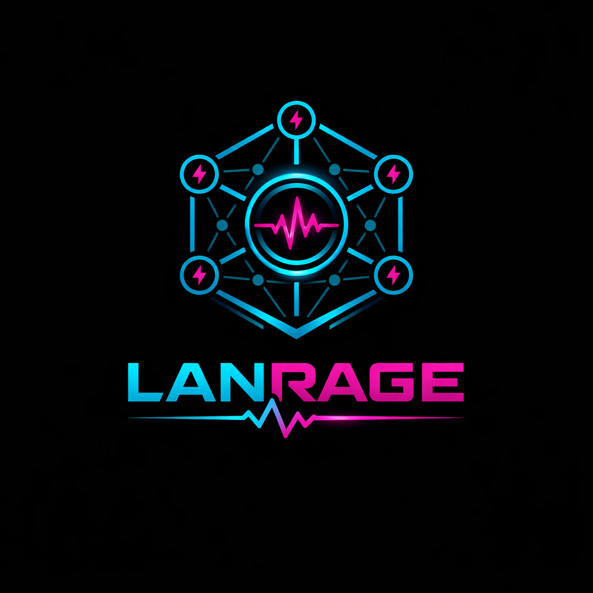

<div align="center">
  
  
  # LANrage - Gaming VPN for the People
  
  **Tagline**: *If it runs on LAN, it runs on LANrage.*
  
  [](https://www.python.org/downloads/)
  [](LICENSE)
  [](CHANGELOG.md)
  [](https://github.com/coff33ninja/LANRage/actions/workflows/ci.yml)
  [](https://github.com/coff33ninja/LANRage/actions/workflows/ci.yml)
  [](https://github.com/psf/black)
  [](https://github.com/astral-sh/ruff)
  [](https://www.wireguard.com/)
  
  [](https://github.com/coff33ninja/LANRage/stargazers)
  [](https://github.com/coff33ninja/LANRage/network/members)
  [](https://github.com/coff33ninja/LANRage/issues)
  [](https://github.com/coff33ninja/LANRage/pulls)
</div>

## What is this?

A zero-config mesh VPN that makes online gaming feel like a LAN party. No port forwarding, no NAT hell, no PhD required.

Think Tailscale, but for gamers who care about ping more than enterprise features.

## The Problem

- LAN games don't work over internet
- Port forwarding is a nightmare
- Hamachi is dead
- ZeroTier is too enterprise
- Tailscale adds latency

## The Solution

LANrage creates a virtual LAN over the internet with:
- **Direct P2P** when possible (0ms overhead)
- **Smart relays** when NAT is evil (<15ms overhead)
- **Broadcast emulation** for old games
- **Game detection** for auto-optimization
- **One-click setup** because life's too short

## Features

- 🎮 **One-click party creation** - No config files, no terminal commands
- ⚡ **Latency-first routing** - Ping is king, always
- 📡 **LAN broadcast emulation** - Old games just work
- 🎯 **Game-aware profiles** - Auto-tuning per game
- 🔒 **WireGuard security** - Military-grade encryption (but you don't need to know that)
- 🌐 **Web UI** - Clean, simple, gamer-friendly
- 💬 **Discord integration** - Party notifications and voice chat
- 📊 **Statistics dashboard** - Real-time metrics and performance tracking
- 🚀 **Oracle VPS ready** - Your free 1GB VPS makes a perfect relay

## Quick Start

### 1. Setup (One-time)

```bash
# Clone the repo
git clone https://github.com/coff33ninja/LANRage.git
cd lanrage

# Run setup
python setup.py
```

### 2. Run

```bash
# Activate environment
.venv\Scripts\activate.bat  # Windows
source .venv/bin/activate   # Linux/Mac

# Start LANrage
python lanrage.py
```

### 3. Use

1. Open browser: `http://localhost:8666`
2. Click "CREATE PARTY"
3. Share Party ID with friends
4. Friends click "JOIN PARTY"
5. Play games like it's 2006

**Need help?** See the [User Guide](docs/USER_GUIDE.md) for detailed instructions.

**Having issues?** Check the [Troubleshooting Guide](docs/TROUBLESHOOTING.md).

## Architecture

```
┌─────────────┐         ┌─────────────┐
│   Client A  │◄───────►│   Client B  │  Direct P2P (best case)
└─────────────┘         └─────────────┘

┌─────────────┐         ┌─────────────┐         ┌─────────────┐
│   Client A  │◄───────►│    Relay    │◄───────►│   Client B  │  Relayed (NAT hell)
└─────────────┘         └─────────────┘         └─────────────┘
```

- **Control plane**: Peer discovery, party coordination, and auth-aware remote integration
- **Data plane**: WireGuard tunnels (direct or relayed)
- **Relay nodes**: Stateless packet forwarders

## Documentation

Use the docs hub for a clean, maintained map:
- **[Docs Index](docs/README.md)** - canonical navigation for users, operators, and developers

Recommended entry points:
- **[Quick Start](docs/QUICKSTART.md)**
- **[User Guide](docs/USER_GUIDE.md)**
- **[Architecture](docs/ARCHITECTURE.md)**
- **[API Reference](docs/API.md)**
- **[Deep Dive](docs/DEEP_DIVE.md)** (expanded architecture, control/data plane flow, and operational behavior)
- **[Project Planning Docs](docs/project/README.md)** (roadmap, progress, implementation/parity tracking)

## Repository Layout

- `core/` - runtime logic grouped by subsystem packages and modules
  - `core/networking/` - canonical networking stack (`network.py`, `nat.py`, `ipam.py`, `connection.py`)
- `api/` - FastAPI server and web-facing endpoints
- `servers/` - control-plane and relay server implementations
- `static/` - web UI
- `game_profiles/` - built-in and custom game profile definitions
- `docs/` - authoritative documentation
- `tests/` - automated test suite
- `tools/docs/` - documentation and changelog helper scripts
- `tools/dev/` - local quality/performance/dev utilities
- `scripts/windows/` - Windows bootstrap and install launchers
- `.kiro/` - local Kiro hooks/steering configuration

## Roadmap

### ✅ Phase 1 (v1.0): Production Ready - COMPLETE

**Status**: Released January 29, 2026

All core features implemented, tested, and documented:
- WireGuard interface management (Windows/Linux)
- NAT traversal (STUN + hole punching)
- Direct P2P and relay fallback
- Control plane with SQLite persistence
- Game detection and optimization (21 built-in profiles + custom profiles)
- Broadcast/multicast emulation
- Game server browser
- Discord integration
- QoS implementation
- Web UI and REST API
- Comprehensive testing (see [Testing docs](docs/TESTING.md) and CI artifacts for latest results)
- Production-grade error handling

### Phase 2 (v1.1): Scale & Polish - Q1 2026

**Focus**: Remote infrastructure and enhanced UX

**Features**:
- Remote control plane (WebSocket-based peer discovery)
- IPv6 support (dual-stack networking)
- Enhanced web UI (React/Vue rewrite)
- Additional game profiles (50+ games)
- Performance optimizations
- Advanced metrics and analytics
- Improved relay selection algorithms

**Timeline**: 2-3 months  
**Priority**: High

### Phase 3 (v2.0): Mobile & Social - Q2-Q3 2026

**Focus**: Mobile apps and social features

**Features**:
- Mobile apps (iOS/Android)
- Voice chat integration
- Screen sharing
- Tournament mode with brackets
- Game library integration
- Friend lists and profiles
- Achievement system

**Timeline**: 4-6 months  
**Priority**: Medium

### Phase 4 (v3.0+): Advanced & Enterprise - Q4 2026+

**Focus**: Extensibility and enterprise features

**Features**:
- Plugin system for extensibility
- Clan servers (persistent parties)
- Advanced analytics and insights
- Enterprise features (teams, organizations)
- Custom domains and branding
- API for third-party integrations
- Marketplace for plugins

**Timeline**: 6+ months  
**Priority**: Low

## Status

✅ **v2.0.0 - PRODUCTION READY** (February 27, 2026)

**Release Notes**: [CHANGELOG.md](CHANGELOG.md) is the source of truth for version history and detailed changes.  
**Quality Metrics**: See [docs/TESTING.md](docs/TESTING.md) and the latest [CI run](https://github.com/coff33ninja/LANRage/actions/workflows/ci.yml).  

<!-- SUPPORTED_GAMES:START -->
### Supported Games

- Total profiles detected from `game_profiles/`: **137**
- Many entries in `game_profiles/custom/` are **community-seeded and untested**.
- Custom/community entries may be based on publicly available documentation and **Google search results**; validate ports/process names in your environment.

Sample supported games:
- 7 Days to Die
- A Way Out
- ARK: Survival Evolved
- ASTRONEER
- Age of Empires II
- Age of Empires IV
- American Truck Simulator
- Among Us
- Apex Legends
- Arma 3
- Assetto Corsa
- Baldur's Gate 3
- BattleBit Remastered
- Battlefield Series
- BeamNG.drive
- Bloons TD 6
- Brawlhalla
- Call of Duty 4: Modern Warfare
- Call of Duty: Black Ops
- Call of Duty: Black Ops II
- Call of Duty: Modern Warfare 2
- Call of Duty: Modern Warfare 3
- Call of Duty: Warzone
- Call of Duty: World at War

If a game fails detection, create or adjust a custom profile in `game_profiles/custom/`.
Full generated list: [`docs/SUPPORTED_GAMES.md`](docs/SUPPORTED_GAMES.md).
<!-- SUPPORTED_GAMES:END -->

See [docs/TESTING.md](docs/TESTING.md) for test results.

## Contributing

This is a solo project for now, but:
- Bug reports welcome
- Feature ideas appreciated
- PRs considered
- Memes encouraged

## Philosophy

1. **Gamers first** - Not enterprises, not developers
2. **Latency obsessed** - Every millisecond matters
3. **Zero config** - If it takes >90 seconds, it's broken
4. **Open source** - No vendor lock-in
5. **Honest** - No marketing BS

## Comparison

| Feature | LANrage | Hamachi | ZeroTier | Tailscale |
|---------|---------|---------|----------|-----------|
| Gaming focus | ✅ | ✅ | ❌ | ❌ |
| Low latency | ✅ | ⚠️ | ⚠️ | ⚠️ |
| Zero config | ✅ | ✅ | ❌ | ⚠️ |
| Still maintained | ✅ | ❌ | ✅ | ✅ |
| Free tier | ✅ | ⚠️ | ✅ | ✅ |
| Open source | ✅ | ❌ | ⚠️ | ❌ |

## License

MIT - Do whatever you want

## Support

### Getting Help
- **[User Guide](docs/USER_GUIDE.md)** - Complete documentation
- **[Troubleshooting](docs/TROUBLESHOOTING.md)** - Common issues and solutions
- **GitHub Issues** - Bug reports and feature requests
- **GitHub Discussions** - Questions and community help

### Community
- Discord: (Coming soon)
- Reddit: r/lanrage (Coming soon)
- Email: support@lanrage.dev

## Acknowledgments

- WireGuard - For being awesome
- Tailscale - For the inspiration
- Hamachi - For the nostalgia
- Oracle - For the free VPS

## Disclaimer

This is a hobby project. Use at your own risk. May cause:
- Reduced ping
- Increased fun
- Nostalgia for LAN parties
- Addiction to retro games
