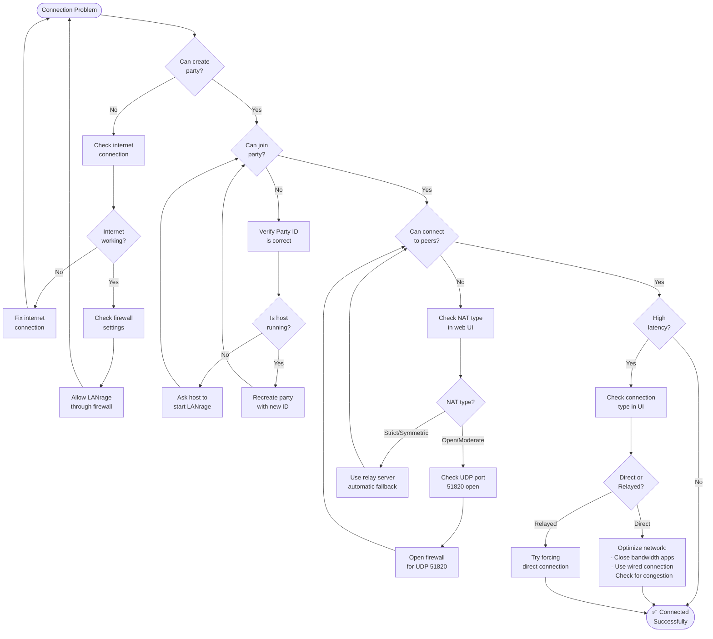
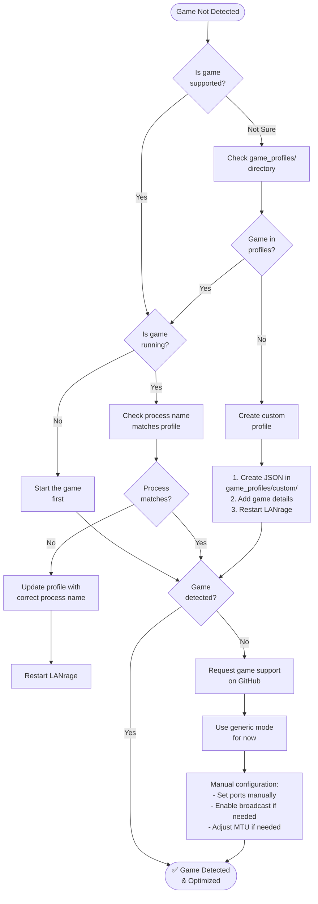
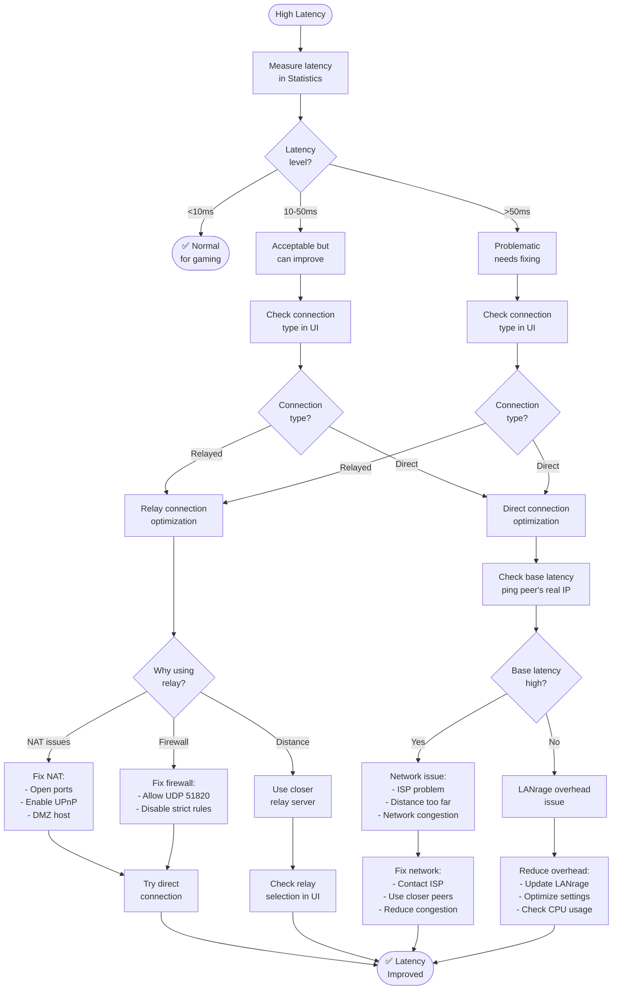
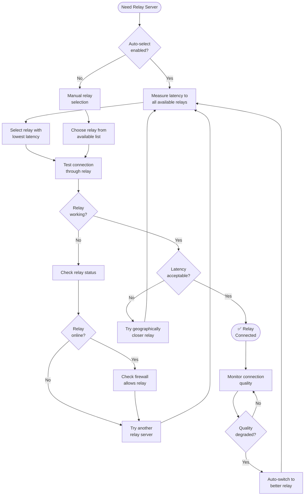
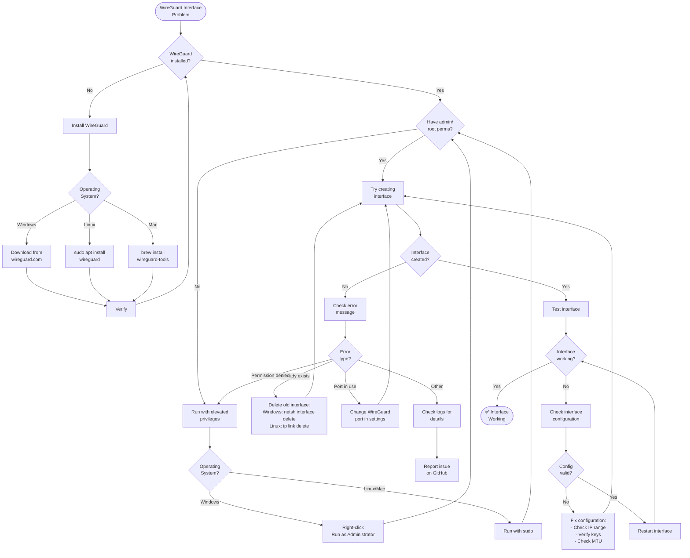

# Troubleshooting Guide

Common issues and solutions for LANrage.

## Troubleshooting Flowcharts

Visual guides for diagnosing common issues. Follow the flowchart paths to quickly identify and resolve problems.

### Connection Issues Flowchart



### Game Detection Flowchart



### High Latency Troubleshooting



### Relay Server Selection



### WireGuard Interface Issues



## Quick Diagnostics

Run these checks before diving into specific issues:

```bash
# 1. Check LANrage status
curl http://localhost:8666/api/status

# 2. Check WireGuard interface (Windows)
netsh interface show interface name="lanrage0"

# 3. Check WireGuard interface (Linux/Mac)
ip addr show lanrage0

# 4. Check logs
type %USERPROFILE%\.lanrage\network.log  # Windows
cat ~/.lanrage/network.log               # Linux/Mac
```

---

## Installation Issues

### WireGuard Not Found

**Symptoms:**
```
❌ WireGuard not found
Please install WireGuard first
```

**Solutions:**

**Windows:**
1. Download from https://www.wireguard.com/install/
2. Run installer
3. Restart LANrage

**Linux (Ubuntu/Debian):**
```bash
sudo apt update
sudo apt install wireguard
```

**Linux (Fedora/RHEL):**
```bash
sudo dnf install wireguard-tools
```

**Verify:**
```bash
wg --version
```

---

### Permission Denied

**Symptoms:**
```
❌ Permission denied
Failed to create interface
```

**Cause:** LANrage needs admin/root privileges for network interfaces

**Solutions:**

**Windows:**
- Right-click `lanrage.py` → "Run as Administrator"
- Or run from elevated PowerShell

**Linux/Mac:**
```bash
sudo python lanrage.py
```

**Alternative (Linux):**
```bash
sudo setcap cap_net_admin+ep $(which python3)
```

---

### Python Version Error

**Symptoms:**
```
❌ Python 3.12+ required
Current version: 3.10.x
```

**Solutions:**

**Windows:**
1. Download Python 3.12+ from python.org
2. Install with "Add to PATH" checked
3. Verify: `python --version`

**Linux:**
```bash
sudo add-apt-repository ppa:deadsnakes/ppa
sudo apt update
sudo apt install python3.12
python3.12 lanrage.py
```

**Mac:**
```bash
brew install python@3.12
```

---

### Dependencies Installation Failed

**Solutions:**

1. **Update uv:**
   ```bash
   pip install --upgrade uv
   ```

2. **Install with verbose output:**
   ```bash
   uv pip install -r requirements.txt -v
   ```

3. **Check internet connection:**
   ```bash
   ping pypi.org
   ```

4. **Install build tools (if needed):**
   
   **Windows:** Install Visual Studio Build Tools
   
   **Linux:**
   ```bash
   sudo apt install build-essential python3-dev
   ```

---

## Connection Issues

### Cannot Create Party

**Symptoms:**
```
⚠️ Failed to create party
Connection to control server failed
```

**Solutions:**

1. **Check internet:**
   ```bash
   ping 8.8.8.8
   ```

2. **Check firewall:**
   - Windows: Allow LANrage through Windows Firewall
   - Linux: Check iptables/ufw rules

3. **Use local mode (temporary):**
   Edit `.env`:
   ```bash
   LANRAGE_CONTROL_MODE=local
   ```

---

### Cannot Join Party

**Symptoms:**
```
⚠️ Failed to join party
Party not found: abc123xyz
```

**Solutions:**

1. **Verify Party ID:**
   - Double-check with host
   - Party IDs are case-sensitive
   - No spaces or special characters

2. **Check host status:**
   - Ask host if LANrage is still running
   - Host should see party in web UI

3. **Try recreating party:**
   - Host creates new party
   - Use new Party ID

---

### Peer Connection Failed

**Symptoms:**
```
⚠️ Failed to connect to peer
Connection timeout
```

**Solutions:**

1. **Check NAT type:**
   LANrage shows NAT type in web UI
   - Open NAT: Should work
   - Moderate NAT: Usually works
   - Strict/Symmetric NAT: May need relay

2. **Check firewall:**
   Allow UDP port 51820:
   
   **Windows:**
   ```powershell
   New-NetFirewallRule -DisplayName "LANrage" -Direction Inbound -Protocol UDP -LocalPort 51820 -Action Allow
   ```

   **Linux:**
   ```bash
   sudo ufw allow 51820/udp
   ```

3. **Try different network:**
   - Mobile hotspot
   - Different WiFi
   - Wired connection

---

### High Latency

**Symptoms:**
- Ping >50ms to nearby peers
- Laggy gameplay
- Delayed responses

**Diagnosis:**

1. **Check connection type:**
   Web UI → Statistics → Connection Type
   - Direct: Should be <5ms overhead
   - Relayed: Should be <15ms overhead

2. **Check base latency:**
   ```bash
   ping <peer-real-ip>
   ```

3. **Calculate overhead:**
   ```
   Total Latency = Base Latency + LANrage Overhead
   ```

**Solutions:**

1. **If using relay:**
   - Try forcing direct connection
   - Check if both NATs allow P2P
   - Use closer relay server

2. **If direct connection:**
   - Check for network congestion
   - Close bandwidth-heavy apps
   - Use wired connection

3. **Optimize game settings:**
   - Lower graphics settings
   - Disable background downloads
   - Close streaming apps

---

### Packet Loss

**Symptoms:**
- Stuttering gameplay
- Disconnections
- "Connection lost" messages

**Diagnosis:**

Check packet loss in Statistics dashboard:
- <1%: Normal
- 1-5%: Noticeable
- >5%: Problematic

**Solutions:**

1. **Check network quality:**
   ```bash
   ping -t <peer-ip>  # Windows (continuous)
   ping <peer-ip>     # Linux/Mac
   ```

2. **Check WiFi signal:**
   - Move closer to router
   - Use 5GHz band if available
   - Switch to wired connection

3. **Reduce network load:**
   - Pause downloads
   - Close streaming services
   - Limit other devices on network

---

## Game-Specific Issues

### Game Not Detected

**Symptoms:**
```
ℹ️ No game detected
Running in generic mode
```

**Solutions:**

1. **Check supported games:**
   See `game_profiles/` directory

2. **Create custom profile:**
   Create `game_profiles/custom/mygame.json`:
   ```json
   {
     "name": "My Game",
     "process_names": ["mygame.exe", "mygame"],
     "broadcast_ports": [7777],
     "multicast_groups": [],
     "keepalive": 25,
     "mtu": 1420
   }
   ```

3. **Request game support:**
   Open GitHub issue with game details

---

### Minecraft: Cannot See LAN World

**Solutions:**

1. **Check broadcast emulation:**
   Web UI → Settings → Broadcast should be "Enabled"

2. **Verify virtual IPs:**
   All players should have 10.66.0.x addresses

3. **Check Minecraft version:**
   All players must use same version

4. **Manual connection:**
   - Get host's virtual IP from LANrage
   - In Minecraft: Direct Connect
   - Enter: `10.66.0.2:25565` (host's virtual IP)

---

### Terraria: Connection Failed

**Solutions:**

1. **Use virtual IP:**
   Connect to host's virtual IP (10.66.0.x), not real IP

2. **Check port:**
   Default Terraria port is 7777

3. **Verify server is running:**
   Host should see "Server started" in Terraria

---

### Stardew Valley: Cabin Not Available

**Solutions:**

1. **Build cabins first:**
   Host must build cabins on farm before friends can join

2. **Check cabin limit:**
   Max 3 friends (4 players total)

3. **Use invite code:**
   - Host: Get invite code from game
   - Friends: Use invite code to join

---

## Performance Issues

### High CPU Usage

**Symptoms:**
- LANrage using >20% CPU
- System slowdown
- Fan noise

**Solutions:**

1. **Check metrics collection:**
   Reduce collection frequency in settings

2. **Disable unused features:**
   - Discord integration (if not used)
   - Server browser (if not hosting)
   - Metrics collection (if not needed)

3. **Update LANrage:**
   Newer versions have performance improvements

4. **Restart LANrage:**
   Fresh start clears accumulated data

---

### High Memory Usage

**Symptoms:**
- LANrage using >200MB RAM
- System running out of memory

**Solutions:**

1. **Check metrics history:**
   Metrics are stored in memory
   - Reduce history size in settings
   - Clear old metrics

2. **Check server browser:**
   Large server lists use memory
   - Clear old servers
   - Reduce refresh rate

3. **Restart LANrage:**
   Fresh start clears accumulated data

---

### Slow Web UI

**Solutions:**

1. **Check browser:**
   - Use modern browser (Chrome, Firefox, Edge)
   - Clear browser cache
   - Disable extensions

2. **Check API response:**
   ```bash
   curl http://localhost:8666/api/status
   ```
   Should respond in <100ms

3. **Reduce update frequency:**
   Web UI polls API every 2 seconds
   - Increase interval in settings
   - Or disable auto-refresh

---

## Discord Integration Issues

### Rich Presence Not Working

**Solutions:**

1. **Check Discord is running:**
   Discord must be running before starting LANrage

2. **Check pypresence installed:**
   ```bash
   uv pip list | grep pypresence
   ```

3. **Restart both:**
   - Close Discord
   - Stop LANrage
   - Start Discord
   - Start LANrage

4. **Check Discord settings:**
   Settings → Activity Status → "Display current activity" enabled

---

### Webhook Not Sending

**Solutions:**

1. **Verify webhook URL:**
   - Should start with `https://discord.com/api/webhooks/`
   - Copy entire URL including token

2. **Check webhook permissions:**
   - Webhook must have "Send Messages" permission
   - Channel must allow webhooks

3. **Test webhook:**
   ```bash
   curl -X POST <webhook-url> \
     -H "Content-Type: application/json" \
     -d '{"content": "Test message"}'
   ```

---

## Advanced Troubleshooting

### Enable Debug Logging

Add to `.env`:
```bash
LANRAGE_LOG_LEVEL=DEBUG
```

Restart LANrage. Check logs:
```bash
tail -f ~/.lanrage/network.log  # Linux/Mac
type %USERPROFILE%\.lanrage\network.log  # Windows
```

---

### Check WireGuard Status

```bash
wg show lanrage0
```

Should show:
- Interface public key
- Listening port
- Peers (if connected)
- Latest handshake times

---

### Reset LANrage

Complete reset (loses all data):

```bash
# Stop LANrage
# Delete config directory
rm -rf ~/.lanrage  # Linux/Mac
rmdir /s %USERPROFILE%\.lanrage  # Windows

# Restart LANrage
python lanrage.py
```

---

### Collect Diagnostic Info

For bug reports:

```bash
# 1. LANrage version
python lanrage.py --version

# 2. System info
python -c "import platform; print(platform.platform())"

# 3. WireGuard version
wg --version

# 4. Network interfaces
ip addr  # Linux/Mac
ipconfig  # Windows

# 5. Recent logs
tail -100 ~/.lanrage/network.log

# 6. Current status
curl http://localhost:8666/api/status
```

---

## Common Error Messages

### "Interface already exists"

**Solution:**
```bash
# Windows
netsh interface delete interface name="lanrage0"

# Linux
sudo ip link delete lanrage0
```

---

### "Address already in use"

**Solution:**
```bash
# Find what's using port 8666
# Windows
netstat -ano | findstr :8666

# Linux/Mac
lsof -i :8666

# Use different port
python lanrage.py --port 9000
```

---

### "Handshake timeout"

**Solutions:**
1. Check firewall allows UDP 51820
2. Verify peer's public key is correct
3. Check network connectivity
4. Try different endpoint

---

### "Invalid party ID"

**Solutions:**
- Party IDs are alphanumeric
- No spaces or special characters
- Case-sensitive
- Get fresh ID from host

---

## Getting Help

### Before Asking

1. Check this troubleshooting guide
2. Search GitHub issues
3. Check documentation
4. Try basic solutions (restart, update, etc.)

### When Asking

Include:
- LANrage version
- Operating system
- Error messages (exact text)
- Steps to reproduce
- What you've already tried
- Diagnostic info (see above)

### Where to Get Help

- **GitHub Issues**: Bug reports and feature requests
- **GitHub Discussions**: Questions and community help
- **Discord**: Real-time community support (coming soon)

---

## Still Having Issues?

If you've tried everything:

1. **Create GitHub Issue**: https://github.com/yourusername/lanrage/issues
2. **Include diagnostic info**
3. **Be patient**: Community volunteers will help
4. **Consider workarounds**: Local mode, different network, etc.

Remember: LANrage is open source and community-supported. Your detailed bug reports help make it better for everyone!
