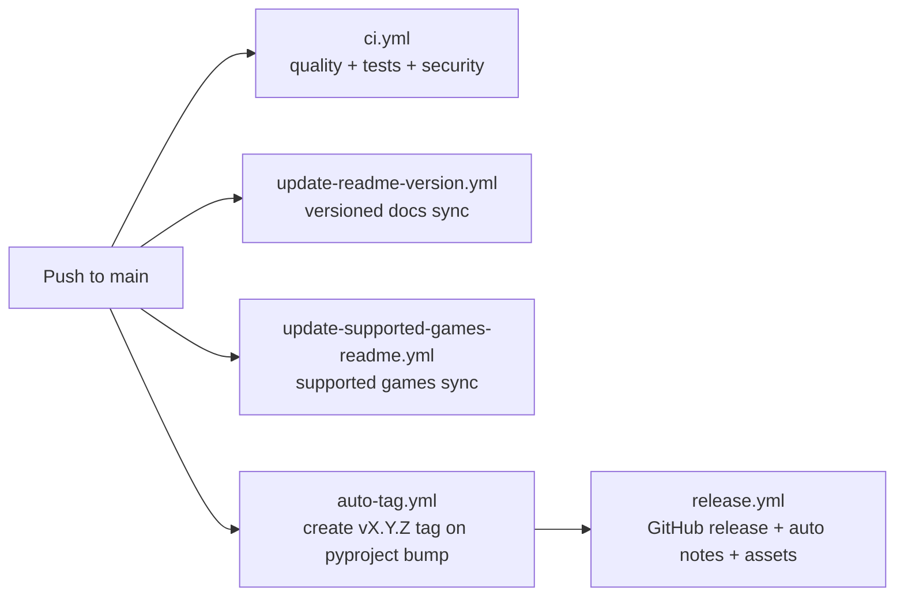

# CI/CD and Release Automation

```mermaid
flowchart LR
    COMMIT["Push to main"] --> CI["ci.yml\nquality + tests + security"]
    COMMIT --> VER["update-readme-version.yml\nversioned docs sync"]
    COMMIT --> GAMESDOC["update-supported-games-readme.yml\nsupported games sync"]

    COMMIT --> AUTOTAG["auto-tag.yml\ncreate vX.Y.Z tag on pyproject bump"]
    AUTOTAG --> RELEASE["release.yml\nGitHub release + auto notes + assets"]
```
