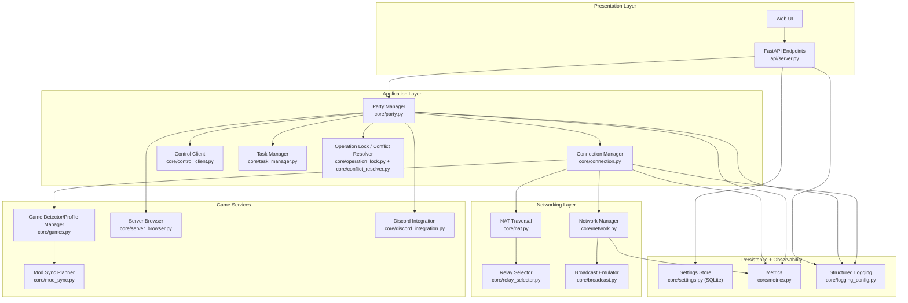

# Client Components

```mermaid
flowchart TB
    subgraph UI["Presentation Layer"]
        WEB["Web UI"]
        API["FastAPI Endpoints\napi/server.py"]
    end

    subgraph APP["Application Layer"]
        PARTY["Party Manager\ncore/party.py"]
        CONN["Connection Manager\ncore/connection.py"]
        CONTROL_CLIENT["Control Client\ncore/control_client.py"]
        TASKS["Task Manager\ncore/task_manager.py"]
        LOCKS["Operation Lock / Conflict Resolver\ncore/operation_lock.py + core/conflict_resolver.py"]
    end

    subgraph NET["Networking Layer"]
        NETMGR["Network Manager\ncore/network.py"]
        NAT["NAT Traversal\ncore/nat.py"]
        RELSEL["Relay Selector\ncore/relay_selector.py"]
        BCAST["Broadcast Emulator\ncore/broadcast.py"]
    end

    subgraph GAMEFEAT["Game Services"]
        GAMES["Game Detector/Profile Manager\ncore/games.py"]
        MODSYNC["Mod Sync Planner\ncore/mod_sync.py"]
        BROWSER["Server Browser\ncore/server_browser.py"]
        DISCORD_INT["Discord Integration\ncore/discord_integration.py"]
    end

    subgraph DATA["Persistence + Observability"]
        SETTINGS["Settings Store\ncore/settings.py (SQLite)"]
        METRICS["Metrics\ncore/metrics.py"]
        LOGS["Structured Logging\ncore/logging_config.py"]
    end

    WEB --> API
    API --> PARTY
    API --> SETTINGS

    PARTY --> CONN
    PARTY --> CONTROL_CLIENT
    PARTY --> TASKS
    PARTY --> LOCKS

    CONN --> NETMGR
    CONN --> NAT
    NAT --> RELSEL

    NETMGR --> BCAST
    CONN --> GAMES
    GAMES --> MODSYNC
    PARTY --> BROWSER
    PARTY --> DISCORD_INT

    CONN --> METRICS
    NETMGR --> METRICS
    PARTY --> METRICS

    API --> LOGS
    PARTY --> LOGS
    CONN --> LOGS
```
