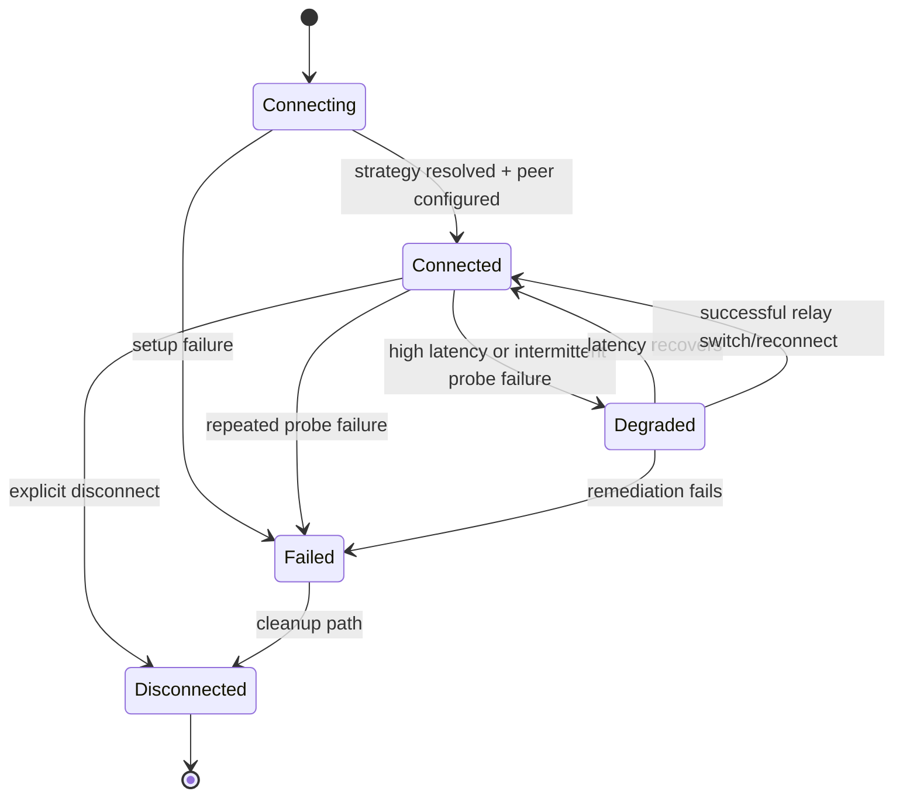

# Connection State Machine

Lifecycle transitions for a peer connection record.

Related docs:
- [Connection Management](/docs/core/networking/CONNECTION.md)
- [NAT Traversal](/docs/core/networking/NAT_TRAVERSAL.md)
