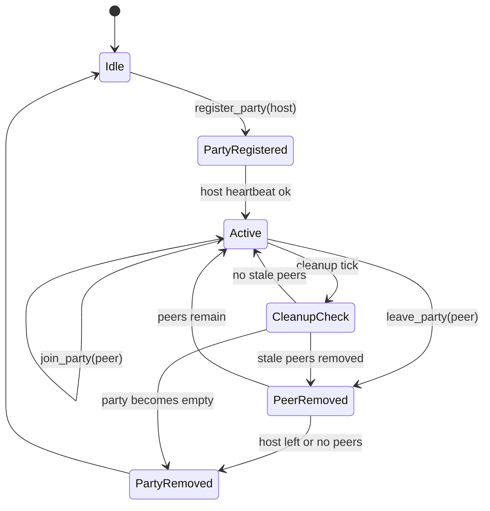

# Control Plane State Machine

Party and peer lifecycle transitions in the control plane.

Related docs:
- [Control Plane](/docs/core/control_plane/CONTROL_PLANE.md)
- [Party](/docs/core/control_plane/PARTY.md)
