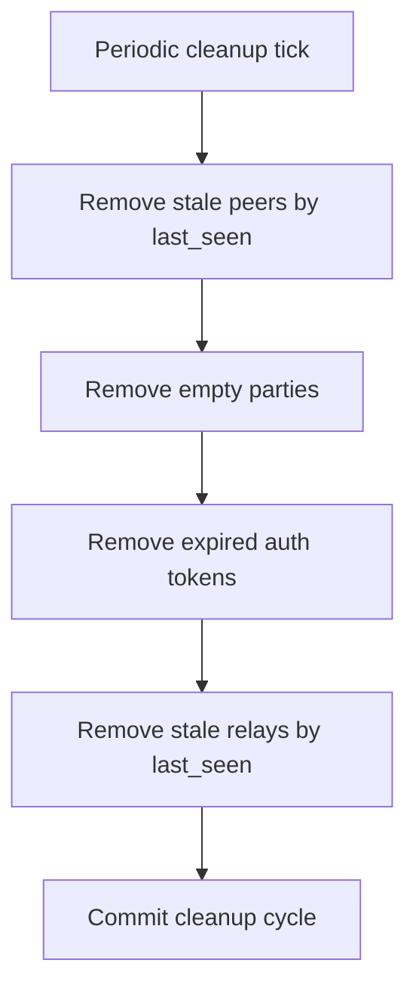

# Control Server Cleanup Loop

Background maintenance loop for stale-state pruning.

```mermaid
flowchart TD
T[Periodic cleanup tick] --> P[Remove stale peers by last_seen]
P --> E[Remove empty parties]
E --> X[Remove expired auth tokens]
X --> R[Remove stale relays by last_seen]
R --> D[Commit cleanup cycle]
```

Related docs:
- [Control Plane Server](/docs/servers/CONTROL_PLANE_SERVER.md)
