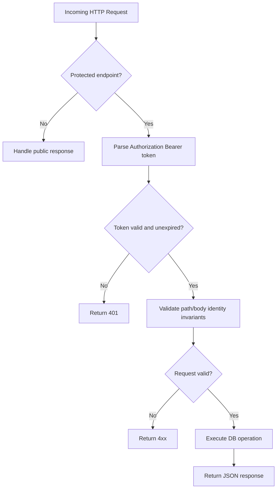

# Control Server Request Flow

Request/authorization/persistence flow for protected control-plane endpoints.

Related docs:
- [Control Plane Server](/docs/servers/CONTROL_PLANE_SERVER.md)
- [Control Plane](/docs/core/control_plane/CONTROL_PLANE.md)
