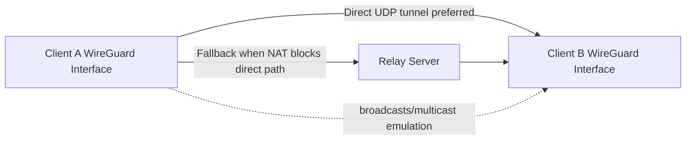

# Data Plane Paths

```mermaid
flowchart LR
    A["Client A WireGuard Interface"] -->|Direct UDP tunnel preferred| B["Client B WireGuard Interface"]
    A -->|Fallback when NAT blocks direct path| R["Relay Server"] --> B

    A -. broadcasts/multicast emulation .-> B
```
