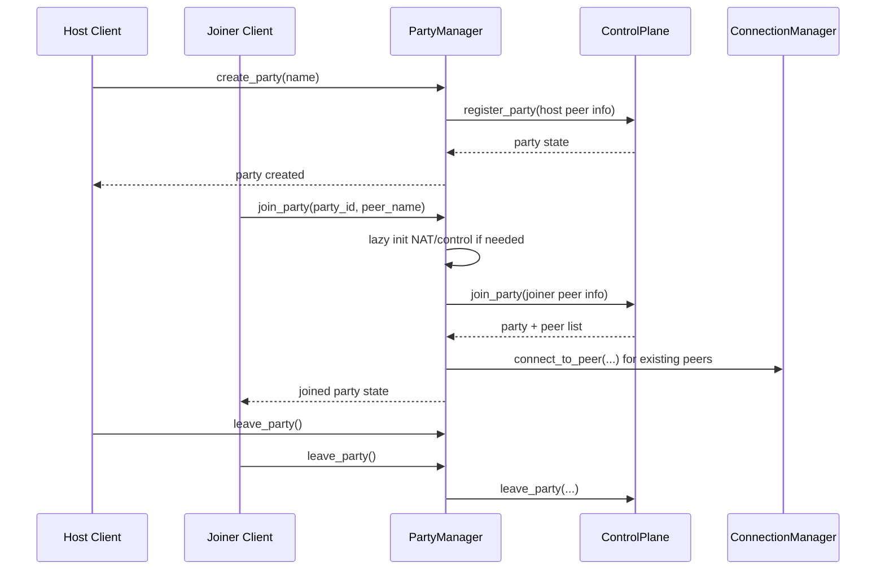

# Party Host/Join Lifecycle

Host and joiner orchestration flow at party manager layer.

Related docs:
- [Party Management](/docs/core/control_plane/PARTY.md)
- [Control Plane](/docs/core/control_plane/CONTROL_PLANE.md)
