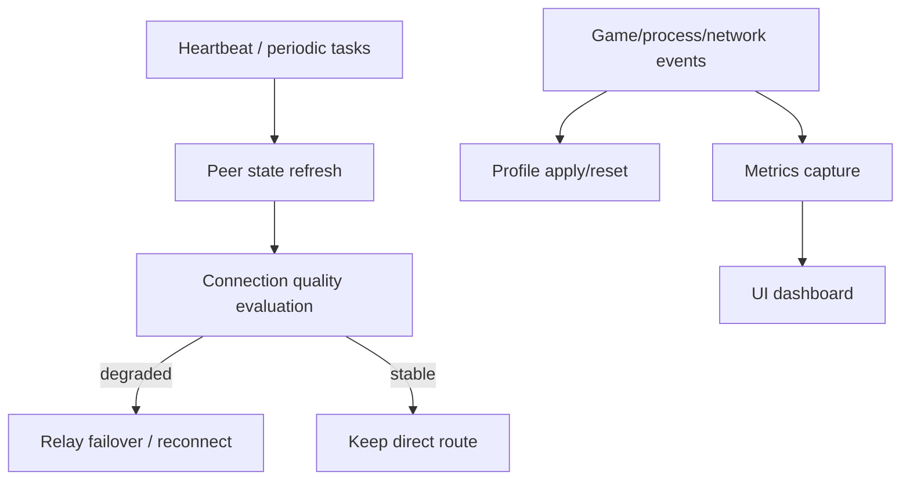

# Runtime Control Loops

```mermaid
flowchart TB
    TICK["Heartbeat / periodic tasks"] --> HEALTH["Peer state refresh"]
    HEALTH --> ROUTE["Connection quality evaluation"]
    ROUTE -->|degraded| SWITCH["Relay failover / reconnect"]
    ROUTE -->|stable| KEEP["Keep direct route"]

    EVENTS["Game/process/network events"] --> PROFILE["Profile apply/reset"]
    EVENTS --> METRICS["Metrics capture"]
    METRICS --> DASH["UI dashboard"]
```
