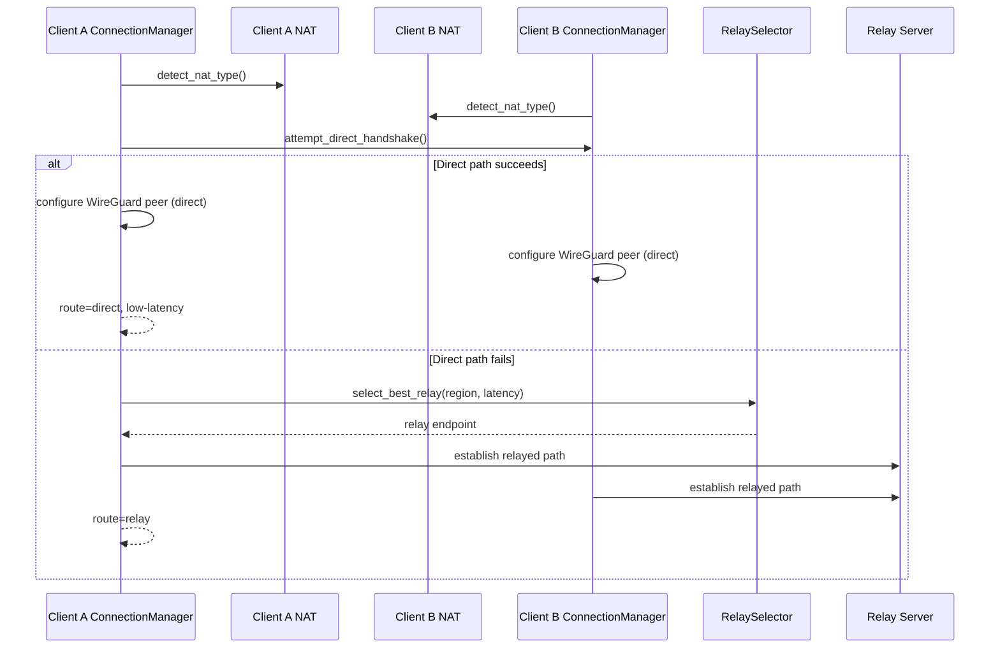

# Connection Fallback Sequence

```mermaid
sequenceDiagram
    participant A as Client A ConnectionManager
    participant NATa as Client A NAT
    participant NATb as Client B NAT
    participant B as Client B ConnectionManager
    participant RelaySel as RelaySelector
    participant Relay as Relay Server

    A->>NATa: detect_nat_type()
    B->>NATb: detect_nat_type()

    A->>B: attempt_direct_handshake()
    alt Direct path succeeds
        A->>A: configure WireGuard peer (direct)
        B->>B: configure WireGuard peer (direct)
        A-->>A: route=direct, low-latency
    else Direct path fails
        A->>RelaySel: select_best_relay(region, latency)
        RelaySel-->>A: relay endpoint
        A->>Relay: establish relayed path
        B->>Relay: establish relayed path
        A-->>A: route=relay
    end
```
