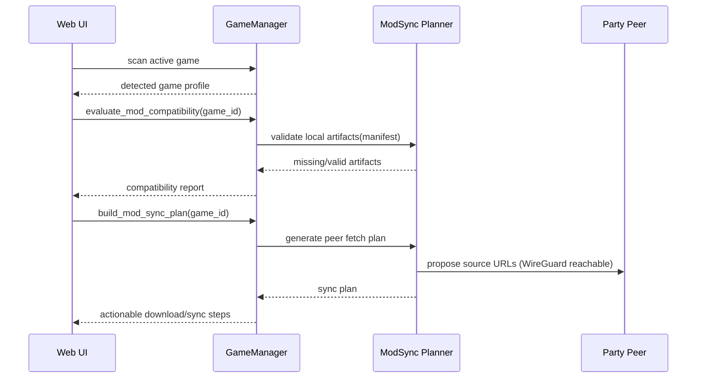

# Game + Mod Sync Sequence

```mermaid
sequenceDiagram
    participant UI as Web UI
    participant GM as GameManager
    participant MS as ModSync Planner
    participant Peer as Party Peer

    UI->>GM: scan active game
    GM-->>UI: detected game profile

    UI->>GM: evaluate_mod_compatibility(game_id)
    GM->>MS: validate local artifacts(manifest)
    MS-->>GM: missing/valid artifacts
    GM-->>UI: compatibility report

    UI->>GM: build_mod_sync_plan(game_id)
    GM->>MS: generate peer fetch plan
    MS->>Peer: propose source URLs (WireGuard reachable)
    MS-->>GM: sync plan
    GM-->>UI: actionable download/sync steps
```
