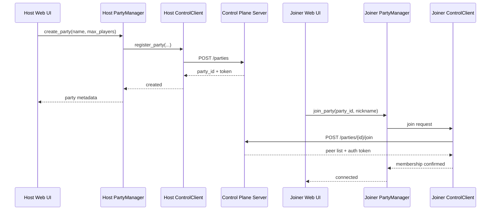

# Party Lifecycle Sequence

```mermaid
sequenceDiagram
    participant HostUI as Host Web UI
    participant HostParty as Host PartyManager
    participant HostControl as Host ControlClient
    participant CPS as Control Plane Server
    participant JoinUI as Joiner Web UI
    participant JoinParty as Joiner PartyManager
    participant JoinControl as Joiner ControlClient

    HostUI->>HostParty: create_party(name, max_players)
    HostParty->>HostControl: register_party(...)
    HostControl->>CPS: POST /parties
    CPS-->>HostControl: party_id + token
    HostControl-->>HostParty: created
    HostParty-->>HostUI: party metadata

    JoinUI->>JoinParty: join_party(party_id, nickname)
    JoinParty->>JoinControl: join request
    JoinControl->>CPS: POST /parties/{id}/join
    CPS-->>JoinControl: peer list + auth token
    JoinControl-->>JoinParty: membership confirmed
    JoinParty-->>JoinUI: connected
```
